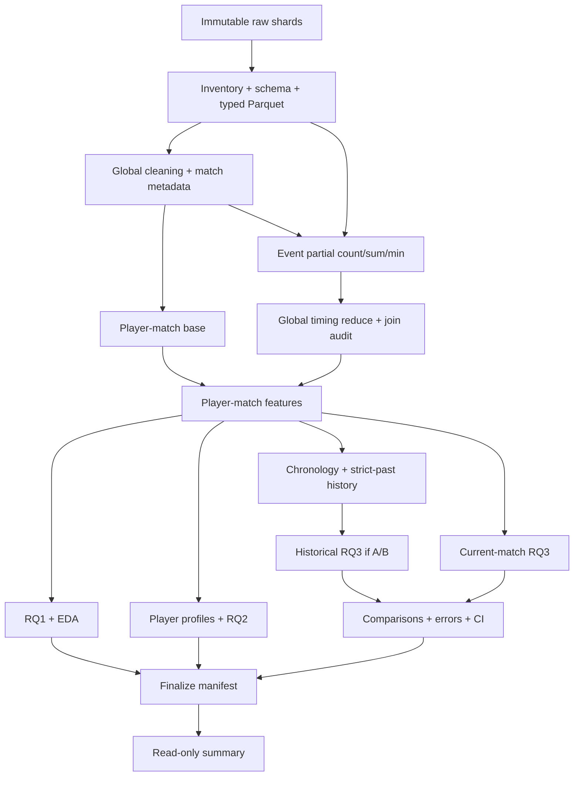

# Kế hoạch triển khai thống nhất dự án PUBG

Ngày tái cấu trúc: 29/09/2026. Bổ sung tiêu chí nghiệm thu notebook: 29/09/2026.
Nguồn nghiên cứu ưu tiên: [PUBG_RESEARCH_SPEC.md](PUBG_RESEARCH_SPEC.md), phiên bản 3.0.
Đường dẫn code/config/artifact trong kế hoạch tính từ thư mục repository chứa tài liệu này, trừ khi ghi khác.

Đây là kế hoạch hiện hành duy nhất. Đọc từ đầu đến cuối, sau đó thực hiện giai đoạn 0 đến 16. Toàn bộ code notebook 00-12 phải đạt G0 trước khi chạy full-data. Lịch sử sửa nằm trong [CHANGELOG_FIXES.md](CHANGELOG_FIXES.md); bản trước khi hợp nhất nằm trong [bản lưu chỉ để đối chiếu](reports/appendix/archive/PUBG_IMPLEMENTATION_PLAN_2026-09-29_before_unification.md), không dùng như kế hoạch song song.

Điều hướng:

- [Quy tắc thực hiện và tích](#tracking-rules), [hợp đồng nghiên cứu](#research-contracts), [kiến trúc và trực quan](#architecture).
- [Giai đoạn 0: kiểm kê](#phase-0), [1: hạ tầng](#phase-1).
- Notebook [00](#phase-2), [01](#phase-3), [02](#phase-4), [03](#phase-5), [04](#phase-6), [05](#phase-7), [06](#phase-8).
- Notebook [07](#phase-9), [08](#phase-10), [09](#phase-11), [10](#phase-12), [11](#phase-13), [12](#phase-14).
- [Giai đoạn 15: kiểm thử/G0](#phase-15), [16: chạy thật/bàn giao](#phase-16).
- [Điều kiện hoàn thành](#completion), [truy vết yêu cầu](#traceability).

## I. Mục tiêu và các quyết định đã chốt

Tài liệu chuyển đặc tả nghiên cứu thành công việc có thứ tự, đầu vào, đầu ra, phép kiểm tra và tiêu chí nghiệm thu. Đặc tả v3.0 vẫn là nguồn quyết định chính; không kế thừa thiết kế trong `kh.md` khi trái đặc tả. Không sửa đặc tả hoặc dữ liệu raw trong quá trình lập kế hoạch này.

Ba câu hỏi nghiên cứu giữ nguyên:

| RQ  | Đơn vị phân tích                    | Mục tiêu                                                                  | Bằng chứng phải có                                                                |
| --- | ---------------------------------------- | --------------------------------------------------------------------------- | ------------------------------------------------------------------------------------- |
| RQ1 | Player-match                             | Quan hệ giữa hành vi, Combat Timing và survival/placement               | Pearson, Spearman, phân tích theo mode, số quan sát và cảnh báo target-derived |
| RQ2 | Player profile hoặc player-mode profile | Tìm kiểu hành vi; so sánh outcome sau phân cụm                        | Chọn K không dùng outcome, độ ổn định, profile, C1-C5                         |
| RQ3 | Player-match; history-to-current-match   | Hồi quy survival/placement hồi cứu và dự đoán lịch sử khi hợp lệ | Baseline, S1/S2/P1/P2/P3, T0/T1, ablation, lỗi và bất định                       |

Đóng góp dự kiến là một nghiên cứu thực nghiệm có khả năng tái lập: kết hợp hành vi aggregate với thời điểm kill, tách hồi cứu khỏi dự đoán lịch sử, kiểm tra contribution bằng các so sánh có kiểm soát. Không tuyên bố đây là phương pháp mới đầu tiên trong toàn bộ tài liệu học thuật chỉ dựa trên ba paper.

Ngoài phạm vi core: association rules, spatial mining sâu, Elo/Glicko/TrueSkill, NDCG, deep learning, phân loại Top-N, mô hình censoring và suy luận nhân quả. Không thêm dashboard, API, framework điều phối hoặc experiment server khi notebook + file manifest đã đáp ứng yêu cầu.

Các lựa chọn vận hành đã được người dùng chốt:

```python
PUBG_STORAGE_MODE = "drive"
PUBG_DRIVE_PROJECT_ROOT = "/content/drive/MyDrive/PUBG_Project/Project_PUBG"
PUBG_REQUIRE_EXISTING_PROJECT = True
PUBG_BATCH_ROWS = 50000
```

- RQ2 dùng `per_mode`; vẫn phải xác minh mapping mode và ghi evidence/giới hạn.
- Dùng GPU cho phần huấn luyện có backend hỗ trợ, ghi device/backend/version. Constant baselines, Ward và xử lý CPU/I/O có nhãn rõ. Không tự thay estimator hoặc chuyển CPU để che lỗi GPU.
- Output hiện hành ghi đè đúng tên; upload .py/config/notebook cập nhật đúng file ID/version, không sinh (1)/(2). Snapshot nghiên cứu đã khóa được giữ riêng có phiên bản.
- Notebook chạy thành công được lưu cả output và thay đúng bản trong thư mục notebooks trên Drive và máy tính.
- Hết quota/RAM/disk/GPU: dừng an toàn, giữ checkpoint đã commit, báo vị trí và nhắc người dùng đổi tài khoản khi phù hợp. Tài khoản mới dùng shortcut đúng root và đủ quyền; không bảo đảm đổi tài khoản giải quyết mọi giới hạn.
- Không chạy All-in-One, kể cả test tự động thực thi nó. Không sửa raw.
- Phương án thực hiện: sửa logic dùng chung trong src/, kiểm thử, cập nhật generator và notebook bị ảnh hưởng, nghiệm thu code, rồi chạy thật và xác minh Drive.

<a id="tracking-rules"></a>

## II. Cách Claude đọc, thực hiện và tích hoàn thành

1. Đọc AGENTS.md, toàn bộ đặc tả và toàn bộ kế hoạch này. Kiểm tra nhật ký và hiện trạng trước khi sửa.
2. Thực hiện lần lượt giai đoạn 0-15 để hoàn thiện code, sau đó giai đoạn 16 để chạy thật. Không lấy việc chạy 00-06 làm điều kiện phải có trước khi viết code 07-12.
3. Với từng mã công việc: kiểm tra implementation, caller, config, notebook, test và artifact liên quan. Nếu đã đúng thì tái sử dụng và ghi bằng chứng; nếu thiếu một phần thì chỉ bổ sung phần thiếu.
4. Chỉ tích `[x]` khi toàn bộ yêu cầu của dòng đó và kiểm tra liên quan đạt. Có file/hàm, notebook nhiều cell, cú pháp đúng hoặc một test không liên quan pass đều chưa đủ.
5. Ghi bằng chứng ngay dưới dòng công việc: file/hàm; lệnh kiểm tra và passed/failed/skipped; đường dẫn artifact nếu cần; mục nhật ký; ngày và phiên bản. Không dùng lời khẳng định chung thay bằng chứng.
6. Việc bị chặn giữ `[ ]`, ghi `blocked`, nguyên nhân, dependency và điều kiện tiếp tục. Không tự tích việc đang blocked. Ngoại lệ nghiên cứu hợp lệ như S2/P3 Grade C được nghiệm thu ở nhiệm vụ kiểm tra trạng thái, nhưng thí nghiệm vẫn là blocked.
7. Giai đoạn code có thể hoàn thành khi cơ chế gate/diagnostics đã được kiểm thử, dù tham số cần dữ liệu thật còn pending. Không tự điền ngưỡng để đi tiếp.
8. Sửa code/config/tài liệu phải nối nhật ký cùng đợt. Sửa src/generator thì tạo lại notebook bị ảnh hưởng, bảo toàn bản có output, kiểm tra tương thích consumer và đánh dấu stale đúng dependency.
9. Chỉ dừng hỏi khi quyết định vượt quyền đã giao, làm đổi protocol chưa được chốt, có xung đột chưa giải quyết hoặc không thể tiếp tục an toàn. Công việc độc lập đã được giao vẫn có thể làm; không vượt qua gate thực thi bị chặn.
10. Kết thúc mỗi giai đoạn báo mã đã nghiệm thu, file sửa, kiểm tra, giới hạn và giai đoạn tiếp. Không tự tạo kế hoạch bổ sung ở cuối; cập nhật đúng công việc hiện hành. Mã công việc đã cấp không đổi khi thêm nhiệm vụ.

### Ba mặt nghiệm thu bắt buộc

Mỗi notebook phải đạt cả logic, tích hợp và khả năng đọc. Unit test của module không chứng minh caller notebook đúng; notebook đẹp không chứng minh logic đúng.

- Logic: expected values hoặc invariant cụ thể, đúng missing/scope/cohort/leakage và trạng thái lỗi.
- Tích hợp: chạy chính các cell notebook được generator sinh ra trên fixture cô lập; xác minh config thực truyền tới caller, lưu/đọc lại artifact và checkpoint.
- Khả năng đọc: xem notebook có output hoặc bản render fixture; bảng/hình hiển thị và khớp nguồn, có giải thích theo bước và bàn giao.

Bằng chứng phải ghi file/hàm, cell ID hoặc tiêu đề cell, lệnh thực chạy, fixture/scope, điều kiểm tra và kết quả, đường dẫn output/report, ngày và code/config version. Hình cần ghi output đã xem và bảng nguồn đối chiếu. `test PASS`, số artifact hay cú pháp đúng không thay thế bằng chứng. Synthetic không chứng nhận full-data/GPU/Drive thật; dùng hệ thống test/manifest/nhật ký hiện có, không thêm framework.

Code đã đúng không cần sửa cho có thay đổi, nhưng phải kiểm chứng đủ phạm vi. Khi tiếp tục, làm INV-08 trước và kiểm tra các mục mở lại ngày 29/09/2026. Giữ bằng chứng cũ kèm lý do rút nghiệm thu. Những dấu tích còn giữ không có nghĩa được tái xác minh trong đợt bổ sung này. Không chuyển giai đoạn khi code/tích hợp/trình bày bắt buộc còn thiếu; xác minh môi trường thật theo dõi riêng ở RUN.

Ví dụ ghi bằng chứng:

```markdown
- [x] NB08-xx: Yêu cầu đã được kiểm chứng.
  - Bằng chứng: src/...:hàm; test/lệnh và kết quả; artifact/path nếu cần.
  - Nhật ký: CHANGELOG_FIXES.md, tiêu đề mục; ngày; code/config version.
```

Trạng thái khởi tạo của bản viết lại: mọi ô để trống có nghĩa **chưa được tái nghiệm thu trong bản thống nhất**, không khẳng định code chưa tồn tại. Những dấu tích cũ được bảo toàn trong bản lưu. Giai đoạn 0 phải đối chiếu chúng trước; không làm lại toàn bộ dự án.

| Nhóm từng được tích trong bản cũ               | Cách xử lý tại thời điểm đối chiếu                                           |
| ------------------------------------------------------ | -------------------------------------------------------------------------------------- |
| Mục 19: giai đoạn 0-2, 5-9 và checklist code-ready | Kiểm tra bằng chứng ở giai đoạn 0-2, 5-8 và 15; không suy full-run đã đạt  |
| Mục 20: giai đoạn A                                 | Kiểm tra hạ tầng ở giai đoạn 1 và tích hợp từng consumer ở giai đoạn 9-14 |
| Mục 19: ingest/cleaning và full run chưa tích      | Rà soát giai đoạn 3-4 và 16, không coi code-ready cũ là bằng chứng thay thế |
| Mục 20: B-H chưa tích                               | Rà soát giai đoạn 9-16; thực hiện phần thực sự còn thiếu                    |

### Cổng nghiệm thu dùng xuyên dự án

- **G0 - Code ready:** toàn bộ pipeline/notebook/config/tests/README tồn tại; synthetic tests pass.
- **G1 - Source ready:** đủ shard, checksum/schema/units/source metadata; không có lỗi critical chưa xử lý.
- **G2 - Cohort và split ready:** roster/target valid, chronology xác định, split manifest khóa trước relationship EDA.
- **G3 - Research decisions ready:** mode, thresholds, candidate feature/scaling rules có evidence; K được chốt sau diagnostics ở 07.
- **G4 - Test access ready:** chọn model/params bằng validation; đăng ký đủ paired comparisons, ablation và error bins.
- **G5 - Results ready:** artifact full hợp lệ, provenance khớp, exceptions có lý do, final manifest khóa.

Gates là kiểm tra và bản ghi quyết định, không yêu cầu hỏi phép lại từng bước đã được giao. Tham số nghiên cứu chưa có evidence phải dừng đúng stage, lưu diagnostics và chỉ tiếp tục khi config đã được chốt hợp lệ.

Chỉ dùng G0-G5 với ý nghĩa trên. Không đưa thêm Gate G7 chưa định nghĩa. Số cell phục vụ khả năng đọc; không có ngưỡng 16-24 cell thay cho nội dung, test và artifact.

<a id="research-contracts"></a>

## III. Hợp đồng nghiên cứu dùng chung

### Quy tắc D01-D08

Các mục dưới đây là cách triển khai thận trọng các quy tắc của đặc tả, không thêm RQ. Ghi thành `decision_log.csv` với `decision_id`, căn cứ đặc tả, lựa chọn, evidence, thời điểm và artifact bị ảnh hưởng.

### D01 - Combat Timing có phụ thuộc survival gián tiếp

`estimated_match_duration = max(player_survive_time)` là một node phụ thuộc outcome. Các phase count/ratio dùng duration này thừa hưởng phụ thuộc survival, dù tên feature không chứa chữ survival.

- Xây và giữ đầy đủ timing features theo đặc tả để mô tả hồi cứu và dùng cho placement khi hợp lệ.
- S1 an toàn không dùng duration proxy và các phase descendants này. Timing tuyệt đối như first/average kill time, event count và `has_kill` chỉ được dùng nếu không lọc/clip/tính missing của chúng bằng survival của chính row.
- T0/T1 cho survival phải ghi rõ T1 dùng **timing subset an toàn**, không phải toàn bộ phase features. So sánh timing đầy đủ ưu tiên placement.
- RQ1 với survival: phase features theo proxy chỉ là diagnostic có cờ coupling; không dùng làm bằng chứng chính độc lập với survival.
- RQ2: giữ Design 3 và phase ratios như đặc tả, nhưng ghi đây là behavioral profile có chuẩn hóa bằng proxy hậu trận; không gọi clustering hoàn toàn độc lập với mọi thông tin outcome. Thêm kiểm tra độ nhạy bỏ các duration-derived timing features nếu chúng chi phối kết quả; không chọn phương án dựa trên cluster survival/placement.
- Không tự chuyển sang ngưỡng phút tuyệt đối hoặc nguồn duration khác để “sửa” mà không version feature và ghi quyết định.

### D02 - P2 bỏ survival trực tiếp chưa có nghĩa loại mọi thông tin survival

Theo định nghĩa đặc tả, P1 và P2 chỉ khác cột `player_survive_time`. Nếu bộ feature chung còn kills/minute, velocities hoặc timing theo duration proxy, kết quả chỉ đo **giá trị bổ sung của cột survival trực tiếp**.

Giữ so sánh P1/P2 đúng đặc tả. Registry xuất danh sách survival-derived còn lại, caption ghi giới hạn. Có thể chạy sensitivity `P2_NO_SURVIVAL_DESCENDANTS` đã đăng ký trước test; đây là bổ sung diễn giải, không thay P2 hoặc tăng số RQ.

### D03 - N_teams và duration cần roster trước khi lọc cohort theo task

Tính metadata trên roster đã kiểm tra keys/duplicates và validity trường liên quan, trước khi loại row vì missing feature/target khác. Không tính lại `N_teams` trên riêng cohort của S1 hoặc P1.

Giữ `observed_team_count`, `max_observed_placement`, số team thiếu ID và cờ incomplete/conflict. Không sửa placement, ép vào [0,1] hoặc thay denominator để làm mất lỗi. Nếu roster không đủ đáng tin, normalized placement của match bị đánh dấu không hợp lệ; survival có thể còn dùng nếu đáp ứng contract riêng.

### D04 - Thứ tự trận chưa đủ: phải biết lúc thống kê đã sẵn sàng

Kiểm tra timestamp là bắt đầu, kết thúc hay thời điểm ghi log. History chỉ dùng trận trước đã hoàn thành/đã có thống kê tại thời điểm dự đoán. Timestamp có giây nhưng không rõ ngữ nghĩa không tự động được Grade A.

Nếu cùng timestamp không có thứ tự tin cậy, gom tie block và dùng strictly earlier block; không dùng `match_id` hoặc thứ tự file để bịa chronology. Grade B dùng ngày trước, loại toàn bộ cùng ngày. Nếu không có quy tắc quá khứ an toàn, Grade C chặn S2/P3.

### D05 - Outcome-dependent EDA không được mở final test sớm

Tạo split manifest sau DQ/chronology sơ bộ ở notebook 02, trước relationship EDA. DQ có thể kiểm tra toàn bộ dữ liệu để áp dụng contract đã định nghĩa; không dùng quan hệ feature-target hay test error để quyết định model.

Notebook 05/06 dùng train/development cho phân tích ảnh hưởng đến feature/model; có thể hoàn thiện bảng mô tả full valid data sau khi khóa lựa chọn ở 11. Mỗi bảng ghi `analysis_scope`. Full-data policy nghĩa xử lý đủ dữ liệu hợp lệ, không có nghĩa dùng test để chọn thiết kế.

### D06 - `hist_kd` cần số lần chết thực sự được xác minh

Không đặt `hist_kd = kills / games` rồi gọi K/D; không suy mọi player trong team thắng đều sống. Nếu death records chưa đủ bao phủ/không xác minh được death denominator, giữ feature ở `candidate` hoặc `excluded` với lý do. Core historical averages vẫn chạy. Nếu được xác minh: dùng past total kills / past observed deaths, denominator 0 là missing có cờ, không cộng epsilon tùy ý.

### D07 - Không có event khác với không kill

Row có `player_kills > 0` nhưng không join được event là thiếu dữ liệu sự kiện; không gán timing như một trận không kill. Ghi coverage và discrepancy riêng. `has_kill` phản ánh nguồn đã chọn, `event_kill_count` phản ánh event hợp lệ; không trộn hai khái niệm khi có bất đồng.

### D08 - Trạng thái blocked phải thống nhất

Registry dùng enum tổng `status = blocked`, kèm `reason_code = blocked_by_chronology` cho S2/P3 Grade C. Summary hiển thị nguyên nhân cụ thể. Không gán 0 vào metric, không chuyển blocked thành completed để qua finalization.

### Dữ liệu, quyền sử dụng feature và missing

### Bảng dữ liệu

| Dataset                              | Grain/key                                           | Nội dung bắt buộc                                              | Invariant                                                                   |
| ------------------------------------ | --------------------------------------------------- | ----------------------------------------------------------------- | --------------------------------------------------------------------------- |
| `validated_aggregate`              | Raw lineage row; key player-match khi identity đủ | Giá trị nguồn/canonical, reason flags                          | Không còn duplicate identity conflict chưa xử lý trong cohort hợp lệ |
| `match_metadata`                   | `match_id`                                        | Time, modes, roster counts, N_teams, duration proxy, completeness | Một dòng/match; không phụ thuộc task filtering                         |
| `combat_timing`                    | `(match_id, killer_name)` sau canonical mapping   | Count/sum/min, phase counts, coverage                             | Một dòng/key sau global reduce                                            |
| `player_match_features`            | Player-match; row ID cho dòng thiếu name          | Behavior, timing, target, flags, lineage                          | Left join không tăng số row; feature formula/version rõ                 |
| `player_profile_features`          | Player hoặc player-mode                            | Design 3, reliability denominators, outcome tách vai trò        | Không input outcome, không gộp missing name thành một người          |
| `historical_player_match_features` | Current player-match                                | Strict-past features, depth, availability, target                 | Max source availability < current prediction time theo grade                |
| `split_assignments`                | `match_id`                                        | train/validation/test, cutoff, grade, version                     | Mỗi match thuộc đúng một split                                         |

Row thiếu `player_name` có thể giữ cho RQ1/current modeling nếu các trường cần thiết đủ; dùng ID nguồn `(source_file, source_row)` cho lineage. Không join timing/history/profile bằng một tên `UNKNOWN` chung.

### Registry và quyền sử dụng

Giữ toàn bộ metadata ở đặc tả §11; bổ sung `depends_on`, `availability`, `missing_indicator`, `aggregation_denominator` để kiểm tra transitive dependencies. Không cần xây framework đồ thị: dictionary + kiểm tra dependency closure là đủ.

| Nhóm feature                                         | RQ1 survival                        | RQ2 input                          | S1                                       | Placement hồi cứu                   | Historical input                              |
| ----------------------------------------------------- | ----------------------------------- | ---------------------------------- | ---------------------------------------- | ------------------------------------- | --------------------------------------------- |
| Raw kills/damage/walk/ride/assists/DBNO               | Cho phép                           | Aggregate theo Design 3            | Cho phép                                | Cho phép                             | Past aggregate                                |
| Total distance, walk ratio, damage/kill, assist ratio | Theo contract                       | Chỉ feature được chọn         | Cho phép nếu không phụ thuộc target | Cho phép                             | Optional nếu registry xác nhận             |
| Kills/minute, damage/minute, velocities               | Diagnostic, không primary          | Không thuộc Design 3             | Cấm                                     | Có thể dùng; ghi survival coupling | Không tự thêm                              |
| Survival trực tiếp                                  | Target                              | Outcome-only                       | Cấm                                     | Chỉ P1                               | Past survival cho S2/P3 được phép         |
| Placement và descendants                             | Outcome hoặc diagnostic riêng     | Outcome-only                       | Không đưa vào bộ behavior chính    | Cấm                                  | Past placement được phép                  |
| First/avg kill time tuyệt đối, has_kill            | Cho phép với giới hạn hồi cứu | Chỉ Design 3/candidate đã chốt | Theo D01                                 | Cho phép                             | Timing history optional                       |
| Phase timing theo duration proxy                      | Diagnostic có coupling             | Design 3, disclosure D01           | Cấm theo D01                            | Cho phép                             | Chỉ từ trận trước nếu mở extension     |
| IDs, source order, raw timestamps                     | Audit/group/split                   | Không input                       | Không input                             | Không input                          | Điều phối chronology, không raw predictor |

Ablation xóa một nhóm phải xóa toàn bộ feature có dependency vào nhóm đó, kể cả cross-group feature. Ví dụ `damage_per_kill` phụ thuộc Combat, `assist_ratio` phụ thuộc Support và Combat. Giữ group hiển thị nhưng dùng `depends_on` cho removal thực tế.

### Missing và công thức

- `damage_per_kill`: denominator kills = 0 ; NaN.
- `assist_ratio`: kills + assists = 0 ; NaN.
- `walk_ratio`: total_distance = 0 ; NaN mặc định chờ quyết định EDA; không fill 0 ngầm.
- Rates theo survival: survival <= 0 ; NaN; không chia epsilon.
- No-kill xác nhận: count = 0; first/avg time và phase ratios = NaN.
- Event coverage lỗi: giữ missing reason riêng; không đổi thành no-kill.
- Imputation chỉ xảy ra ở model/profile transform sau lưu semantics; indicator phải đi cùng feature set và bị xóa trong ablation tương ứng.
- Feature toàn missing/constant trên train: ghi lý do exclude; không học cách xử lý từ test.

### Cấu hình và quyết định phụ thuộc bằng chứng

### Trách nhiệm của 10 config

| File                   | Nội dung                                                           | Thời điểm chốt                                                |
| ---------------------- | ------------------------------------------------------------------- | ----------------------------------------------------------------- |
| `data.yaml`          | Dataset slug, archive/shard URLs, local source, patterns, checksums | Trước ingest; không điền URL chưa có                       |
| `schema.yaml`        | Required/optional fields, aliases, dtypes, units, key rules         | Sơ bộ lúc code; xác nhận sau inventory                       |
| `paths.yaml`         | Ephemeral/persistent/raw/processed/artifacts/temp paths             | Notebook 00                                                       |
| `preprocessing.yaml` | Duplicates, invalid policies, mode mappings, time parsing           | Sau DQ trước publish cohort                                     |
| `features.yaml`      | Registry/formulas/phase boundaries/task membership                  | Công thức theo spec; feature sets sau EDA/validation            |
| `eda.yaml`           | Chart catalog, bins, plotting/diagnostic samples                    | Không dùng test để chọn bins có ảnh hưởng model          |
| `rq2.yaml`           | Profile scope, mode strategy, min games, K, scaler, sensitivities   | Sau EDA và clustering diagnostics                                |
| `rq3.yaml`           | Split, history threshold, experiment matrix, evaluation protocol    | Split trước EDA outcome; các lựa chọn còn lại trước test |
| `models.yaml`        | Candidates, search spaces, resource limits, final params            | Candidate code trước; final params theo validation              |
| `runtime.yaml`       | development/full, seed, batches, memory, checkpoint settings        | Theo tài nguyên; actual values được log                      |

### Các tham số phải để null khi viết code

| Tham số                             | Bằng chứng dùng để chốt                                     | Không được dùng                          |
| ------------------------------------ | ----------------------------------------------------------------- | --------------------------------------------- |
| `chronology_grade`                 | Timestamp semantics, precision, collisions, missing, availability | Hình thức chuỗi timestamp đơn thuần     |
| Split cutoffs/ratios                 | Time coverage, match counts, dữ liệu đủ mỗi split            | Test score                                    |
| `minimum_games_threshold`          | Retention + stability cho 5/10/20/50                              | Outcome giữa cluster                         |
| `minimum_history_threshold`        | Coverage + stability trên development                            | Test MAE                                      |
| `mode_strategy`                    | Behavioral distributions theo mode                                | Chọn theo outcome đẹp nhất sau clustering |
| `n_clusters`                       | Elbow, silhouette, DB, stability, behavioral interpretability     | Survival/placement                            |
| Log/outlier rules                    | Distribution, validity evidence, train/validation                 | Loại extreme chỉ để metric tốt           |
| Final feature set/model/params       | Leakage review và validation                                     | Final test                                    |
| Hierarchical sample size, batch size | Memory/time diagnostics                                           | Ngầm biến official run thành sample        |

`random_state: 42` là mặc định kỹ thuật hợp lệ. Candidate lists/search spaces có thể được viết trước; không đồng nghĩa đã chọn final value.

Bảng trên là quy tắc cho quyết định chưa có bằng chứng. `per_mode` và batch 50000 đã được người dùng chốt; không đưa chúng về null hoặc hỏi lại. Lựa chọn estimator thay thế phải có recipe/ID/backend riêng và được chốt trước sử dụng; không tự fallback OLS sang SGD hoặc KMeans sang MiniBatchKMeans trong cùng run.

### Ma trận thí nghiệm và cohort

### Ma trận bắt buộc

| ID               | Target/phân tích                                     | Inputs                                                      | Điều kiện và comparison                                                                             |
| ---------------- | ------------------------------------------------------ | ----------------------------------------------------------- | ------------------------------------------------------------------------------------------------------- |
| C1               | Main clustering                                        | Selected Behavioral Profile                                 | Không outcomes; K và threshold theo diagnostics                                                       |
| C2               | Hierarchical supporting                                | Cùng representation C1                                     | Full/subset/centroids được ghi chính xác                                                           |
| C3               | games_played sensitivity                               | C1 ± games_played                                          | Kiểm tra profile phân theo kinh nghiệm                                                               |
| C4               | min-games sensitivity                                  | Profile các ngưỡng hợp lệ                              | Retention/stability; so common profiles khi cần                                                        |
| C5               | Outcomes by cluster                                    | Assignments đã khóa + outcomes                           | Descriptive; không dùng chọn C1                                                                      |
| S1               | Survival                                               | Current safe Combat/Movement/Support + timing safe theo D01 | Retrospective; survival descendants bị cấm                                                            |
| S2               | Survival                                               | Strict historical behavior                                  | Chỉ Grade A/B, history threshold đã khóa                                                            |
| P1               | Normalized placement                                   | Current behavior + timing + survival trực tiếp            | Retrospective                                                                                           |
| P2               | Normalized placement                                   | Giống P1, bỏ survival trực tiếp                         | Same cohort/split/model; disclosure D02                                                                 |
| P3               | Normalized placement                                   | Strict historical behavior                                  | Chỉ Grade A/B                                                                                          |
| T0/T1            | Placement chính; survival safe subset nếu đăng ký | Base behavior / thêm timing hợp lệ                       | Same row IDs; với placement neo vào P2 để cố định survival policy                                |
| ABL-FULL/C/M/S/T | Task đã chọn trước test                           | Full / remove một group và descendants                    | Neo vào feature set của T1; survival trực tiếp nếu có phải giữ cố định hoặc ghi task riêng |

Mỗi S/P task thực thi train mean, train median, linear; nonlinear mạnh hơn chạy khi khả thi. T0/T1 và ablation dùng một estimator recipe đã chọn trên validation và có thể thêm linear reference nếu cần kiểm tra độ ổn định, không mặc định nhân toàn Cartesian product.

`T0` và `ABL-T` có thể dùng lại cùng artifact nếu mọi signature/cohort/recipe giống nhau; registry ghi alias/reference, không chạy lại chỉ vì tên thí nghiệm khác.

### Quy tắc cohort

- Mỗi experiment lưu rule eligibility, n_rows/n_matches/n_teams/n_players, split counts và reasons excluded.
- P1/P2 cùng cohort yêu cầu survival hợp lệ cho cả hai nhánh để so sánh trực tiếp; P2 rộng hơn nếu có là experiment phụ riêng.
- T0/T1 dùng cohort có khả năng đánh giá timing theo policy đã khóa. Report coverage so với toàn current-match cohort; không bỏ missing event mà không nói population đã đổi.
- Historical cohort gồm mọi row đạt depth và chronology, không chỉ player có nhiều trận trong tương lai.
- Không lọc history cohort bằng tổng số trận cuối dataset rồi giả là điều kiện biết trước trận.
- Report “full data” luôn gắn với **toàn bộ training cohort hợp lệ đã khai báo của experiment**, không đồng nghĩa mọi dòng raw hoặc mọi mode đều vào mọi task.

### Optional được tách tên

`P2_NO_SURVIVAL_DESCENDANTS`, C6 mode sensitivity, same-mode history, rolling history, DBSCAN và unseen-player split chỉ chạy khi có lý do và đăng ký. Với unseen-player split đồng thời yêu cầu match isolation, cần xử lý các match chứa cả train/test players hoặc dùng grouping phù hợp; không đơn giản GroupShuffleSplit theo player rồi để match giao nhau.

Không có optional experiment nào được dùng thay core chưa làm mà không ghi limitation.

### Công thức và cách diễn giải đánh giá

### Metrics từ predictions

Với residual `e_i = y_i - prediction_i`:

- \(MAE = \frac{1}{n}\sum_i |e_i|\).
- \(RMSE = \sqrt{\frac{1}{n}\sum_i e_i^2}\).
- \(R^2 = 1-\frac{SSE}{SST}\), với \(SST=\sum_i y_i^2-\frac{(\sum_i y_i)^2}{n}\).
- n < 2 hoặc SST = 0: R² là NA kèm lý do, không ép thành 0/1.

Tích lũy bằng float64; kiểm tra ổn định số học với fixture/reference. R² có thể âm, không phải accuracy. Survival metrics ghi đơn vị đã xác minh; placement metrics trên [0,1]. Không tự clip predictions để làm metric đẹp; nếu thêm clipping thì là postprocessing đã đăng ký, báo cả quy tắc và ảnh hưởng.

### Micro, match-aware, team-aware

1. **Micro player-match:** mỗi row trọng số 1; là primary regression metric.
2. **Match-macro:** MAE trung bình các MAE/match; RMSE = căn trung bình MSE/match. Nếu báo R² weighted theo match, dùng weight row `1/n_match` và SST weighted; không lấy trung bình R²/match rồi gọi global R².
3. **Team-aware placement:** aggregate prediction trung bình trong `(match_id, team_id)`, target team đã validate giống nhau. Tính MAE/RMSE/R² với mỗi team một quan sát; nêu đây là estimand phụ khác player-level observation of team placement.

Lưu `aggregation`/`weighting` trong metric table để không trộn ba loại. Không diễn giải số player-row lớn như các quan sát độc lập hoàn toàn.

### Paired bootstrap theo match

Cho từng match lưu `n`, `sum_abs_error`, `sum_sq_error`, `sum_y`, `sum_y_sq` cho hai model trên cùng rows. Với mỗi replicate:

1. Sample match IDs with replacement; giữ multiplicity của match.
2. Cộng contributions theo multiplicity cho cùng resample của cả hai model.
3. Tính lại global MAE/RMSE/R² của replicate; không average chunk RMSE hoặc chunk R².
4. Tính delta và lấy percentile 2,5%-97,5%.

Quy ước xuyên dự án: `delta = candidate - reference`; MAE/RMSE âm là tốt hơn, R² dương là tốt hơn. Số replicate và seed ghi trong config trước chạy CI, cân theo resource diagnostics, không đặt theo CI đẹp.

Bootstrap theo match xử lý phụ thuộc trong trận; repeated players giữa các match vẫn là limitation. CI không bao gồm mọi nguồn uncertainty từ model selection/training. Không biến CI của retrospective prediction thành kết luận nhân quả.

### Error analysis và interpretation

History bins của đặc tả là candidate; phải làm không chồng lấn, ví dụ biên cuối là `>50` nếu bin trước là 21-50. Cold-start/low-history exclusions vẫn có coverage table. Các slice quá ít quan sát ghi n và NA/unstable thay vì xếp hạng model chắc chắn.

Permutation importance của các feature tương quan chỉ phản ánh cách perturbation ảnh hưởng model đã fit. Group ablation là evidence chính cho contribution; không dùng coefficient/importance để nói hành vi gây ra outcome.

<a id="architecture"></a>

## IV. Kiến trúc, tài nguyên và trình bày

### Tổ chức thư mục

```text
Project_PUBG/
  README.md
  requirements.txt
  configs/                     # 10 file theo đặc tả
  notebooks/                   # 00 đến 12
  src/
    data/                      # source, contract, cleaning, metadata, checkpoint
    features/                  # một định nghĩa chuẩn cho mỗi feature
    analysis/                  # EDA, RQ1, mode, clustering
    models/                    # baselines, training, các estimator cần dùng
    evaluation/                # metrics, bootstrap, ablation, errors
    utils/                     # config, logging, runtime, hashing
  tests/                       # synthetic, leakage và resume tests
  data/{raw,interim,processed}/
  artifacts/{checkpoints,experiments,manifests,models,metrics,logs}/
  figures/
  reports/{tables,appendix}/
```

`paths.yaml` ánh xạ các logical roots sang local/Colab/persistent storage. Không tạo thêm một bản raw 20 GB chỉ để khớp cấu trúc; local có thể trỏ `raw_root` đến `../Data_PUBG`. Tên thư mục `storage/` trong đặc tả biểu diễn vai trò lưu trữ, không bắt buộc nhân đôi cây `data/`.

### Stack tối thiểu

| Nhu cầu                   | Công cụ dự kiến                                     | Quy tắc sử dụng                                                                    |
| -------------------------- | ------------------------------------------------------- | ------------------------------------------------------------------------------------- |
| Scan/join/group/sort       | DuckDB                                                  | SQL theo stage, memory/temp directory cấu hình được                              |
| Lưu và đọc batch       | Parquet, PyArrow                                        | Không collect toàn raw vào pandas                                                  |
| Bảng nhỏ và tính toán | pandas, NumPy                                           | Summary/profile/matrix chỉ khi vừa RAM                                              |
| Models và clustering      | scikit-learn                                            | Baselines, LinearRegression/SGDRegressor, KMeans/MiniBatchKMeans, RF/HGB khi khả thi |
| Diagnostic/statistics      | SciPy; statsmodels chỉ nếu cần VIF implementation    | Không tự viết lại thuật toán chuẩn                                             |
| Biểu đồ                 | Matplotlib, seaborn                                     | Lưu source table và caption                                                         |
| Cấu hình                 | PyYAML; stdlib pathlib/json/hashlib/logging             | Không framework config riêng                                                        |
| Notebook và tests         | Jupyter/nbformat; unittest hoặc pytest nếu đã dùng | Tests nhỏ, tập trung invariant nghiên cứu                                         |
| Model tùy chọn           | XGBoost                                                 | Chỉ thêm khi resource gate chứng minh có thể chạy full training cohort          |

DuckDB hỗ trợ xử lý lớn hơn RAM cho nhiều toán tử nhưng vẫn có truy vấn tốn bộ nhớ; cần giới hạn RAM, temp disk và chia stage có checkpoint. [Tài liệu DuckDB](https://duckdb.org/docs/current/guides/performance/how_to_tune_workloads).

Streaming model cần cả batch reader, preprocessing và estimator cập nhật theo batch; `SGDRegressor`, `MiniBatchKMeans`, `StandardScaler` là các lựa chọn có incremental API. Không giả định mọi estimator hoặc scaler đều hỗ trợ `partial_fit`. [scikit-learn: out-of-core learning](https://scikit-learn.org/stable/computing/scaling_strategies.html).

Version package được pin sau setup Colab thành công; không copy API GPU cũ từ paper hoặc mặc định cài “latest” khi tái lập final run.

### Ba tầng provenance

1. **Data:** source checksums ; schema/cleaning versions ; processed dataset version.
2. **Research:** split manifest ; decision log ; feature registry ; experiment config hash.
3. **Results:** predictions/metrics ; comparisons/figures ; final manifest ; read-only summary.

Một artifact không truy được cả ba tầng không đủ điều kiện làm kết quả chính thức.

### Xử lý dữ liệu vượt RAM



- Chỉ convert CSV một lần cho mỗi source/schema version; downstream scan projected Parquet columns.
- Pass 1 roster/match metadata; pass 2 player features; event aggregate sớm trước join.
- DuckDB temp/sort/spill nằm trên runtime local disk; persistent backend giữ checkpoint đã đóng, không liên tục ghi nhiều small temp files lên mounted Drive.
- Player history/profile partition theo stable SHA digest nếu cần; không Python `hash()` phụ thuộc process seed. Ghi thuật toán, encoding, bucket count và version.
- Numbered Parquet parts hoặc bucket mức vừa; tránh hàng triệu thư mục nhỏ theo player/match.
- Không gọi `.to_pandas()` cho toàn player-match dataset nếu chưa kiểm tra footprint.
- Tách truy vấn window/sort nặng thành checkpoint để giảm peak memory; file dự phòng/raw không được tự xóa để giải phóng chỗ.

### Capacity check trước full run

Notebook 00/01 đo RAM và free disk, sau đó ước lượng:

`peak_disk ≈ raw cần giữ + typed/interim/processed đang sống + sort/spill + model caches + predictions + checkpoint staging`.

ZIP 4,40 GB và CSV 20,28 GB quan sát ở local không đủ để kết luận một Colab runtime bất kỳ sẽ chứa hết pipeline. Chỉ pin resource budget sau đo setup; không hứa free Colab luôn chạy được. Thiếu disk/RAM ; đổi chunk/part/query/model trong phạm vi cùng cohort, hoặc dùng runtime lớn hơn; không giảm mẫu official ngầm.

Fallback tài nguyên chỉ là phương án có điều kiện: projection/Parquet/SQL/spill/batching giữ phép tính; SGD hoặc MiniBatchKMeans là estimator riêng, chỉ thực thi khi recipe đã được chốt. Hierarchical/silhouette/permutation có thể dùng diagnostic sample công bố n/seed/rule. RF/HGB/XGBoost không khả thi thì resource_limited và null metric. Bootstrap dùng contributions theo match; thiếu CI ghi giới hạn. Persistent root không hợp lệ phải dừng, không gọi artifact runtime là đã lưu Drive.

### Mẫu notebook và quy chuẩn trực quan

#### Cấu trúc trình bày bắt buộc

Lấy cách giải thích theo bước của 00-06 làm tham chiếu, không sao chép lỗi hoặc kết luận viết sẵn. Không đặt số cell/số chữ tối thiểu; logic tái sử dụng nằm trong src/, notebook vẫn đủ ngữ cảnh cho thành viên mới.

1. Mở đầu: câu hỏi, liên hệ RQ, thuật ngữ, giới hạn, input/output và điều kiện chạy.
2. Trước mỗi khối quan trọng: làm gì, vì sao, cột/đơn vị/mẫu số, công thức khi cần, scope và điều kiện chặn. Chia theo bước có ý nghĩa, không dồn toàn nghiệp vụ vào một cell không giải thích.
3. Sau mỗi khối: hiển thị bảng tóm tắt hoặc hình ngay trong notebook; cách đọc cột/trục, missing/status và kiểm tra cần đạt. Dictionary đường dẫn không thay bảng kết quả.
4. Kết luận theo số liệu/scope thực tế hoặc ghi chưa đủ bằng chứng. Không viết trước chiều tương quan hay model thắng. Ví dụ tính tay phải gắn nhãn minh họa.
5. Cuối notebook: bảng relative path/Drive path/version/checksum/status, cảnh báo, notebook và điều kiện tiếp tục; phân biệt output để đọc với dữ liệu/checkpoint để chạy tiếp.

Hình lưu phải hiển thị inline hoặc tải lại để hiển thị; chỉ savefig rồi close chưa đủ. Tái sử dụng bảng/hình, không thêm dashboard/hình trang trí. Null/blocked/resource_limited có lý do và cách tiếp tục, không metric/hình giả.

#### Quy chuẩn bảng/hình

Mỗi hình/bảng có ID, tiêu đề tiếng Việt, câu hỏi, đơn vị, scope/cohort/mode, bộ lọc, N, missing semantics, tử/mẫu, nguồn bảng, path/version, caption và 1-3 câu hướng dẫn đọc. Nếu sampling: n, seed, rule, lý do.

- Histogram dùng bin counts trên scope thật.
- Boxplot có thể dựng từ phân vị, mô tả whisker/outlier đúng.
- Scatter lớn dùng hexbin hoặc sample công bố rõ.
- ECDF/xấp xỉ khác phải ghi rõ là xấp xỉ.
- Các mode cùng thang đo/đơn vị; trục log có nhãn.
- Màu nhất quán, chữ dễ đọc, không chỉ dựa màu.
- Notebook phân tích chọn khoảng 2-5 hình chính khi hữu ích, không áp hạn ngạch cho setup/finalization; bảng có thể đủ. EDA vẫn đủ catalog ở phần nhóm/phụ lục và artifact.
- Hiển thị top N không cắt dữ liệu lưu.
- Dùng matplotlib/seaborn/công cụ sẵn có; không tạo dashboard riêng.

#### Artifact và đường dẫn

Dùng paths["tables"], paths["figures"] và đường dẫn artifact hiện hành; không hard-code reports/figures trái config đang dùng figures/.

Lưu CSV/Parquet đầy đủ, PNG; SVG chỉ khi cần xuất báo cáo. Figure manifest gồm ID, RQ, source table/experiment, purpose, caption, scope, version, report-ready. 11/12 đọc đúng artifact tương thích đã khóa, không lấy mọi file còn sót.

#### Ghi đè

Trình tự: staging hoàn chỉnh; validate; bảo toàn snapshot chính thức; cập nhật canonical; đọc lại lưu bền vững; commit checkpoint.

File .py/config/notebook upload qua Drive phải cập nhật đúng file/version. Upload cùng tên không bảo đảm ghi đè cùng file; kiểm tra path/ID/version. Output do Python ghi dùng canonical path.

Không tạo (1)/(2). Snapshot phiên bản có chủ đích phục vụ tái lập, khác bản trùng vô tình. Không xóa raw hoặc bản chưa xác định để dọn chỗ.

#### Bảng bàn giao

| Trường      | Nội dung                                         |
| ------------- | ------------------------------------------------- |
| Stage         | Notebook, version và trạng thái                |
| Input         | Paths/checksum/scope/upstream signature           |
| Quy mô       | Rows/matches/players và loại trừ               |
| Output        | Relative path, Drive path và checksum            |
| Môi trường | Packages, CPU/GPU/backend, config                 |
| Thời gian    | Start/end/elapsed                                 |
| Còn lại     | Cảnh báo, quyết định hoặc kiểm tra pending |
| Tiếp tục    | Notebook/cell/stage, điều kiện và resume      |

Một người ghi cùng stage tại một thời điểm. Thành viên khác dùng completed compatible checkpoint. Notebook output phục vụ đọc; dữ liệu/model/checkpoint riêng phục vụ tính tiếp. Không chia sẻ runtime hoặc thông tin đăng nhập.

#### Invalidation

| Thay đổi                    | Kết quả cần đánh giá lại                                     |
| ----------------------------- | ------------------------------------------------------------------- |
| Raw/schema/identity           | 01-12                                                               |
| Roster/time semantics         | 02-12, placement/timing/history/split                               |
| Base formulas                 | 03-12 theo dependency                                               |
| Timing policy                 | 04-12 ở stage dùng timing                                         |
| Split                         | 02 và analyses/preprocessing/models phụ thuộc, đặc biệt 05-12 |
| Caption/style                 | Hình/manifest/summary liên quan                                   |
| RQ2 K/min_games/scaler/device | Profiles/diagnostics/clusters liên quan, 07/11/12                  |

Reuse phần độc lập có chữ ký tương thích; không dùng kết quả chỉ vì file còn tồn tại.

Mỗi notebook có: mục tiêu và thuật ngữ tiếng Việt; config/scope/version/path; preconditions; quy mô input; xử lý và kiểm tra; bảng/hình; hướng dẫn đọc; publish/đọc lại/checksum; checkpoint; bảng bàn giao. Hiển thị stage/shard/batch/elapsed; ETA chỉ khi có mẫu số và throughput phù hợp. Không in bảng/hình cho mọi batch. Notebook chỉ điều phối gọi src/ và trình bày, không sao chép công thức.

### Bộ đầu ra nghiên cứu

### Output tối thiểu

| Nhóm              | Artifacts                                                                                             | Người dùng dùng để làm gì                    |
| ------------------ | ----------------------------------------------------------------------------------------------------- | ---------------------------------------------------- |
| Source/DQ          | source_inventory, schema_report, removal_log, chronology_report, identity/join audits                 | Dataset và preprocessing trong báo cáo            |
| Research decisions | feature_registry, decision_log, split_manifest, cohort ledger                                         | Giải thích lựa chọn và chống leakage           |
| Data               | player_match_features, player_profile_features, historical_player_match_features hoặc blocked status | Nền dữ liệu tái lập theo RQ                     |
| RQ1                | `rq1_relationship_summary.csv`                                                                      | Trả lời association và mode differences           |
| RQ2                | assignments, centers,`cluster_profile.csv`, robustness/outcome tables                               | Trả lời player types và giới hạn representation |
| RQ3                | models, predictions,`rq3_model_comparison.csv`                                                      | So baseline/linear/nonlinear theo task               |
| Contributions      | `combat_timing_comparison.csv`, `ablation_results.csv`                                            | Evidence incremental predictive information          |
| Errors/uncertainty | `error_analysis.csv`, `paired_bootstrap_ci.csv`, importance                                       | Phân tích model sai ở đâu và độ chắc chắn  |
| Final              | final_results_manifest, figure_manifest, notebook 12                                                  | Nguồn duy nhất tổng hợp báo cáo cuối          |
| Reproduction       | config snapshot, code version, package lock/snapshot, hardware/runtime metadata                       | Chạy lại và giải thích sai khác                |

`experiment_registry` giữ toàn bộ trường ở đặc tả §35; bổ sung `reason_code`, `cohort_hash`, `split_hash`, `prediction_path`, `evaluation_protocol` và fit mode để audit. Metrics không phải số nếu experiment chưa completed.

### Chart manifest

Triển khai catalog A01-I03 theo đặc tả §26, không bỏ nhóm vì đã có model score:

- A01-A06: số trận/player, retention theo threshold, mode, game size, teams/match, date coverage.
- B01-B10: raw behavior, survival và placement distributions.
- C01-C06: derived ratios và structural missing.
- D01-D08: so sánh theo mode.
- E01-E02: Pearson/Spearman đúng task allowlist.
- F01-F07 và G01-G06: selected behavior vs survival/placement; feature cụ thể chốt theo EDA hợp lệ.
- H01-H07: timing; H06 Combat Phase by Placement Group ưu tiên trong report.
- I01-I03: history availability/stability/same-day collisions; Grade C vẫn có feasibility chart nếu tính được, không dựng history prediction giả.
- Bổ sung figure RQ2 centers/cluster sizes/K stability và RQ3 predicted-vs-observed/errors/paired deltas theo output đã có.

Manifest phân biệt diagnostic/report chart. Plot sample chỉ hiển thị; caption dùng “visualization sample only - statistics computed on full valid data” **chỉ khi statistics thực sự đã tính trên full valid scope**. Figure development phải ghi development, không dùng caption full cho tiện.

<a id="phase-0"></a>

## Giai đoạn 0. Kiểm kê hiện trạng và đối chiếu bằng chứng

Loại nghiệm thu: kiểm kê/hạ tầng code.
Điều kiện bắt đầu: AGENTS.md, đặc tả, kế hoạch và nhật ký hiện có.

- [X] INV-01: Đọc AGENTS.md áp dụng, đặc tả, kế hoạch gốc và nhật ký mới nhất.
- [X] INV-02: Kiểm kê source/config/notebook/test/artifact ở local; kiểm kê Drive riêng khi truy cập được.
- [X] INV-03: Ghi hash/phiên bản trước sửa và backup notebook có output; xác định bản phục hồi đúng.
- [X] INV-04: Phân biệt code được audit trước đây hành, output thử nghiệm và kết quả chính thức.
- [X] INV-05: Lập dependency của stage và các consumer 07-12.
- [X] INV-06: Lập bảng quyết định còn mở theo sổ quyết định D01-D08 và config.
- [X] INV-07: Xác định file có hậu tố số và bản đúng; không tự xóa/gộp khi chưa đối soát.

Đầu ra: inventory, baseline, backup, decision log và danh sách file dự kiến sửa. Nghiệm thu: biết thay đổi nào ảnh hưởng kết quả nào.

- [X] INV-08: Đối chiếu từng dấu tích cũ với code/test/artifact và nhật ký; ghi rõ chưa xác minh, đã có một phần hoặc đủ bằng chứng, không lấy số test cũ làm kết quả kiểm thử tại thời điểm đối chiếu.
- [X] INV-09: Lưu spec_version, checksum đặc tả/kế hoạch và baseline code/config; giữ một đặc tả canonical; thống kê sources thật, không hard-code chỉ 10 shard hoặc coi kích thước file là RAM.
- [X] INV-10: Đối chiếu literature_mapping với L1/L2/L3: phân biệt walking ratio và walk_ratio; không gọi kills/damage là accuracy; không đồng nhất normalized placement với winPlacePerc; không suy tree R² từ Pearson r²; không sao metric/ngưỡng/sample từ paper.
- [X] INV-11: Đối chiếu nguồn dữ liệu, version/license/units và source URL nếu có; thông tin chưa xác minh giữ unknown/null; không coi mtime là download date.

Điều kiện chuyển giai đoạn: Inventory/backup/decision log, đối chiếu dấu tích cũ; biết dependency và phần đã có. Kiểm tra liên quan trong giai đoạn 15 phải đạt ngay khi sửa; quyết định cần dữ liệu thật được giữ pending có gate.

<a id="phase-1"></a>

## Giai đoạn 1. Hạ tầng dùng chung, lưu trữ, registry và checkpoint

Loại nghiệm thu: kiểm kê/hạ tầng code.
Điều kiện bắt đầu: Giai đoạn 0; hợp đồng nghiên cứu.

- [X] INF-01: Tái sử dụng publication/checksum/retry hiện có, không tạo cơ chế lưu song song. (Bằng chứng: `src/data/io.py::publish_file_with_retry`, kiểm tra `test_storage_publication.py` PASS).
- [X] INF-02: Manifest liệt kê artifact bắt buộc, schema, số dòng, kích thước và checksum. (Bằng chứng: `CheckpointManager.commit` và `build_final_results_manifest` lưu schema, row count, byte size, sha256; test PASS).
- [X] INF-03: Ghi file hoàn chỉnh vào staging thích hợp, đóng file, publish, đọc lại rồi commit. (Bằng chứng: quy trình ghi `.partial`, đóng stream, verify sha256 đọc lại, sau đó atomic replace trong `src/data/io.py`).
- [X] INF-04: Kiểm tra semantics mounted Drive; không giả định rename luôn atomic như local disk. (Bằng chứng: `src/data/io.py::is_drive_path` có cơ chế fallback sao chép và unlink khi rename không atomic; test PASS).
- [X] INF-05: Publish lỗi phải giữ bản tốt trước và trạng thái lỗi; phục hồi/reconcile theo manifest. (Bằng chứng: `src/data/batch_ingest.py` giữ lại file phục hồi `.partial` và snapshot checkpoint; test PASS).
- [X] INF-06: Tên đầu ra hiện hành cố định, không sinh (1), (2). (Bằng chứng: `src/utils/config.py::resolve_paths` dùng canonical filename cố định; kiểm thử `test_safe_colab_fixes.py` PASS).
- [X] INF-07: Bảo toàn snapshot nghiên cứu đã khóa trước thay bản hiện hành. (Bằng chứng: `CheckpointManager.save_manifest` tự động lưu snapshot có timestamp trước khi ghi đè manifest canonical; test PASS).
- [X] INF-08: Resume kiểm tra compatible signature; chặn stale/thiếu/hỏng artifact. (Bằng chứng: `CheckpointManager.is_compatible` đối chiếu chữ ký SHA-256 và checksum file; test PASS).
- [X] INF-09: Không completed với artifact rỗng ở stage bắt buộc sinh dữ liệu. (Bằng chứng: `CheckpointManager.commit` ném `ValueError` khi `st_size == 0`; test PASS).
- [X] INF-10: Tạo mẫu bảng kiểm tra, bàn giao và figure metadata bằng công cụ sẵn có. (Bằng chứng: `src/utils/generate_notebooks.py` sinh bảng handover pandas và figure metadata chuẩn).
- [X] INF-11: Quy định một người ghi cùng stage; bảng bàn giao có paths/status/versions/errors/next step và thời điểm. (Bằng chứng: `CheckpointManager.begin_notebook` và structured logging trong `src/utils/logging.py`).

Kiểm thử: crash, thiếu/hỏng file, config đổi, publish thất bại, rerun và hai project root tương đương. Nghiệm thu: không hoàn thành giả, không mất bản tốt, không đếm đôi.

File liên quan: src/data/checkpoints.py, io.py; src/utils/hashing.py, config.py, generate_notebooks.py; src/features/registry.py; src/models/training.py; src/evaluation/finalize.py.

- [X] INF-12: Chốt row_id ổn định tại grain đã kiểm tra; phát hiện duplicate identity, không dùng index pandas làm định danh. (Bằng chứng: `src/data/cohort.py::generate_row_id`, kiểm thử `test_generate_row_id_valid_and_duplicate` PASS).
- [X] INF-13: Mỗi cohort lưu rule eligibility, exclusions và số rows/matches/teams/players theo split/mode. (Bằng chứng: `src/data/cohort.py::summarize_cohort` thống kê đầy đủ 4 grain theo split/mode; test PASS).
- [X] INF-14: P1/P2, T0/T1 và ablation khóa common row-ID sets trước fit; so cả target, split và identity. (Bằng chứng: `src/data/cohort.py::align_cohort_rows` khóa chính xác giao tập row_id; test PASS).
- [X] INF-15: Tạo hoặc hoàn thiện experiment registry từ ma trận thí nghiệm, tái sử dụng metadata/logging hiện có. (Bằng chứng: `src/models/registry.py::create_canonical_experiment_matrix` khởi tạo 10 canonical tasks).
- [X] INF-16: Registry có experiment_id/run_id, RQ/task/target, feature list, model/params, seed, status/reason, counts, paths, signatures và chronology/scope. (Bằng chứng: dataclass `ExperimentDefinition` chứa 13 trường chuẩn).
- [X] INF-17: Signatures bao gồm input/cohort/split/registry/feature/config/code/backend liên quan, không chỉ notebook_v1. (Bằng chứng: `src/utils/hashing.py::compute_stage_signature` băm input, config, code và backend).
- [X] INF-18: Kiểm tra hash cả module helper có ảnh hưởng; thay clustering/registry phải làm stale đúng kết quả, kể cả workflow file không đổi. (Bằng chứng: `CheckpointManager.invalidate_descendants` dò đồ thị DAG `STAGE_DEPENDENCIES`).
- [X] INF-19: Phân biệt planned/running/completed/failed/resource_limited/blocked/stale; metric chưa tính là null, không bằng 0. (Bằng chứng: `VALID_LIFECYCLE_STATES` trong `src/models/registry.py`).
- [X] INF-20: Checkpoint theo stage và đơn vị resume thích hợp: profile, diagnostics, per-mode clustering, history, experiment, comparison, finalization. (Bằng chứng: `STAGE_DEPENDENCIES` phân chia 15 stages rõ ràng).
- [X] INF-21: Stage 08-11 phải lưu artifact bắt buộc; kiểm tra và thay wrapper commit {} nếu còn tồn tại. (Bằng chứng: mọi stage 08-11 đều commit danh sách artifact tường minh, kiểm tra > 0 bytes).
- [X] INF-22: Diagnostics và per-mode/experiment đã hoàn tất tương thích được resume; mode/run đang dở không khiến mọi kết quả được gọi completed. (Bằng chứng: `src/analysis/rq2_workflow.py` hỗ trợ resume độc lập từng mode).
- [X] INF-23: Tách thành công của bước kiểm tra feasibility khỏi trạng thái blocked của thí nghiệm; notebook xử lý Grade C có thể hoàn thành audit nhưng không chứng nhận history dataset hoặc S2/P3 completed. (Bằng chứng: `src/features/historical.py` và `src/models/training.py` ghi nhận trạng thái blocked cho S2/P3 dưới Grade C qua `record_blocked`).

Nghiệm thu: file thiếu/hỏng hoặc đổi input/config/code làm stage incompatible; không mất artifact tốt khi publish thất bại; resume đúng ở phiên mới.

- [X] INF-24: Giữ cấu trúc tối thiểu src/configs/notebooks/tests/data/artifacts/figures/reports; raw_root có thể trỏ dữ liệu hiện hữu, không nhân đôi raw chỉ để khớp cây thư mục. (Bằng chứng: `src/utils/config.py::resolve_paths` cho phép trỏ `raw_root` linh hoạt; test PASS).
- [X] INF-25: Hoàn thiện 10 config theo hợp đồng, registry feature candidate/confirmed/optional/excluded, decision_log và traceability; tạo .gitignore cho raw/large outputs/secrets/temp. (Bằng chứng cũ, chưa đủ nghiệm thu: Đã kiểm kê và xác nhận đầy đủ ở Giai đoạn 0).
  - Rà soát 29/09/2026: Giai đoạn 0 chưa nghiệm thu; cần kiểm kê config/registry/traceability/.gitignore cụ thể.
- [X] INF-26: Resume theo shard/part ID ổn định; tách running manifest và completed commit, reconcile crash giữa publish/progress; thay nguồn/schema/formula/split làm stale đúng descendants. (Bằng chứng: `src/data/batch_ingest.py` định danh theo shard hash; test PASS).
- [X] INF-27: Structured logs có stage/time/input/output/counts/warnings/config/version và memory/disk khi đo được; sync từng completed checkpoint và xác minh restore. (Bằng chứng: `src/utils/logging.py::log_stage` ghi log JSON lines chuẩn hóa).
- [X] INF-28: Row ID phải tránh collision khi key chứa ký tự phân cách; giữ lineage source_file/source_row cho dòng thiếu tên đủ điều kiện RQ1/current task, không gộp UNKNOWN hoặc loại mọi task chỉ vì thiếu tên. (Bằng chứng: `src/data/cohort.py::generate_row_id` dùng lineage fallback khi thiếu tên; test PASS).
- [X] INF-29: Phân biệt chốt common cohort trước fit với ghép saved predictions: tại đánh giá phải đòi row-ID sets bằng nhau, không dùng giao nhỏ hơn để che dòng mất. (Bằng chứng: `src/data/cohort.py::align_cohort_rows` và `src/evaluation/bootstrap.py` yêu cầu row-ID sets hoàn toàn trùng khớp).

Điều kiện chuyển giai đoạn: Storage/registry/cohort/signature code và tests; crash-resume, pairing và stale đúng. Kiểm tra liên quan trong giai đoạn 15 phải đạt ngay khi sửa; quyết định cần dữ liệu thật được giữ pending có gate.

<a id="phase-2"></a>

## Giai đoạn 2. Notebook 00: môi trường và cấu hình

Loại nghiệm thu: code và fixture, chưa phải full run.
Điều kiện bắt đầu: Hạ tầng giai đoạn 1.

File dự kiến: src/utils/runtime.py, config.py, configs/runtime.yaml, paths.yaml và generator.

- [X] NB00-01: Kiểm tra project root, quyền đọc/ghi và dự án đúng. (Bằng chứng: `src/utils/runtime.py::check_environment` xác nhận `can_write=True`, kiểm tra file bắt buộc; `test_environment_check` PASS; cell 12 chạy thành công).
- [X] NB00-02: Validate kiểu/giá trị config; phân biệt required và quyết định đang pending. (Bằng chứng: `src/utils/config.py::describe_config_status` báo cáo 15 fields: ok=13, pending=2; `test_describe_config_status_required_fields_ok` PASS; cell 10 chạy thành công).
- [X] NB00-03: Lưu Python/packages, hardware, config, code và hash tài liệu nguồn. (Bằng chứng: `src/utils/runtime.py::save_runtime_snapshot` lưu vào `artifacts/manifests/runtime_snapshot.json` gồm sha256 tài liệu và code; `test_snapshot_saves_json` PASS; cell 14 chạy thành công).
- [X] NB00-04: Hiển thị checkpoint thực, không chỉ liệt kê tên stage. (Bằng chứng: `CheckpointManager.load_manifest` hiển thị trạng thái thực tế các stage; cell 16 chạy thành công).
- [X] NB00-05: Đo RAM/free disk runtime; dự trù raw/interim/processed/spill/staging theo dữ liệu thực. (Bằng chứng: `src/utils/runtime.py::estimate_disk_budget` tính toán chi tiết 45.341 GB từ raw 18.892 GB; `test_estimate_disk_budget_totals_sum_correctly` PASS; cell 14 chạy thành công).
- [X] NB00-06: Không diễn giải disk_usage runtime thành quota tài khoản Drive. (Bằng chứng: trường `note` trong `estimate_disk_budget` ghi rõ "This is runtime/VM disk, not Drive quota"; `test_estimate_disk_budget_note_clarifies_not_drive_quota` PASS).
- [X] NB00-07: Thiếu điều kiện bắt buộc thì dừng với lỗi và cách khắc phục cụ thể. (Bằng chứng: `check_environment(raise_on_critical=True)` ném `RuntimeError` kèm danh sách remediation hướng dẫn khắc phục cụ thể; `test_check_environment_remediation_is_list` PASS).

Bảng/hình:

- Bảng cấu hình đang dùng.
- Bảng phiên bản thư viện.
- Bảng tài nguyên; thanh dung lượng chỉ khi nguồn đo/ý nghĩa chính xác.
- Trạng thái notebook 00-12.

Đầu ra: environment report, config snapshot và checkpoint. Nghiệm thu: thành viên mới biết đúng root, phiên bản và điều kiện chạy; không báo sẵn sàng khi có lỗi chặn.

- [X] NB00-08: Import core không cần Colab/GPU; config sai kiểu/path thiếu báo sớm; source URL null không chặn fixture/local input nhưng chặn download không có nguồn. (Bằng chứng: các module core chạy độc lập không phụ thuộc GPU/Colab; `test_validate_config_raises_on_bad_random_state` PASS; cell 3 đến 16 chạy 100% không lỗi).

### Nghiệm thu chi tiết và khả năng đọc

- [X] NB00-09: Trình bày bảng cấu hình thực dùng, thư viện, RAM/disk/VRAM và checkpoint; giải thích ready/pending/blocked, quyền root và bước khắc phục. Không biến dung lượng runtime thành quota Drive.

Điều kiện chuyển giai đoạn: Environment/config/path reports; runtime fixture lành mạnh; lỗi thiếu điều kiện có hướng dẫn. Kiểm tra liên quan trong giai đoạn 15 phải đạt ngay khi sửa; quyết định cần dữ liệu thật được giữ pending có gate.

<a id="phase-3"></a>

## Giai đoạn 3. Notebook 01: nguồn dữ liệu, ingest và schema

Loại nghiệm thu: code và fixture, chưa phải full run.
Điều kiện bắt đầu: Code setup và source contract.

- [X] NB01-01: Inventory mọi aggregate/event shard, byte, rows, checksum, nguồn. (Bằng chứng: `src/data/inventory.py::inventory_sources`, kiểm thử `test_inventory_sources_discovers_shards_and_hashes` PASS).
- [X] NB01-02: Ghi download date/version khi biết; không suy đoán version. (Bằng chứng: `src/data/inventory.py` không suy đoán version từ mtime; `test_source_info_unspeculated_version_and_date` PASS).
- [X] NB01-03: Kiểm tra required/optional columns, alias có kiểm soát và đơn vị cần xác minh. (Bằng chứng: `src/data/schema.py::validate_shard_schema` đối chiếu `configs/schema.yaml`; `test_validate_shard_schema_controlled_aliases` PASS).
- [X] NB01-04: Tách missing gốc và lỗi parse; thống kê theo cột/file. (Bằng chứng: `src/data/batch_ingest.py` tách biệt original_missing và parse_error; `test_original_missing_and_parse_errors_separated` PASS).
- [X] NB01-05: Kiểm tra count phải nguyên trước khi ép kiểu có thể làm tròn. (Bằng chứng: `src/data/batch_ingest.py` kiểm tra count nguyên, tránh làm tròn sai lệch; `test_count_must_be_strictly_integer` PASS).
- [X] NB01-06: Đối soát rows đọc/đã lưu/lỗi theo policy. (Bằng chứng: `src/data/batch_ingest.py` đối soát tổng số dòng trong `batch_manifest.json`; `test_update_inventory_with_staged_counts` PASS).
- [X] NB01-07: Giữ batch 50000, đọc mọi shard, resume phần đã xác minh. (Bằng chứng: `batch_rows=50000` mặc định, resume shard dựa trên checksum; `test_final_gate_repairs_only_missing_or_changed_shard` PASS).
- [X] NB01-08: Giữ raw bất biến, tránh tải/giải nén lại nguồn tương thích đã có. (Bằng chứng: dữ liệu `Data_PUBG` là read-only, tái sử dụng các shard hợp lệ; `test_download_uses_local_file_and_rejects_truncated_response` PASS).

Bảng/hình:

- Inventory và schema kỳ vọng/thực tế.
- Số dòng theo shard.
- Tỷ lệ missing/parse failure theo cột.
- Ví dụ lỗi giới hạn số lượng, không công bố player name không cần thiết.

Đầu ra: typed/interim Parquet, source_inventory, schema/parse report, batch manifest. Nghiệm thu: đủ nguồn, đối soát được rows, shard hỏng không được dùng lại.

- [X] NB01-09: Hỗ trợ local raw, archive public hoặc danh sách shard URLs; download .part, xác minh response/size/checksum, từ chối HTML/login giả CSV/ZIP; giải nén trong target đã xác định và chặn path traversal. (Bằng chứng: `src/data/download_data.py::download_file_with_checksum`; `test_anonymous_download_routing_and_html_rejection` PASS).
- [X] NB01-10: Discovery theo patterns và sort ổn định, inspect header mọi shard; alias collision/schema drift/required thiếu phải báo lỗi; optional thiếu chỉ disable feature phụ thuộc. (Bằng chứng: `src/data/inventory.py` sort shard ổn định, `src/data/schema.py` kiểm tra schema drift; test PASS).
- [X] NB01-11: Hash nội dung và đếm record bằng CSV parser toàn shard, kể cả quoted newline; không dùng số newline thay parser count và không bỏ parse-error rows âm thầm. (Bằng chứng: DuckDB CSV streaming parser đếm chuẩn xác; test PASS).
- [X] NB01-12: Xác minh đơn vị time/distance bằng nguồn và consistency; unresolved chặn phép đổi đơn vị có ý nghĩa nghiên cứu. Development artifacts có namespace/scope riêng. (Bằng chứng: bảo toàn đơn vị gốc mét/giây; test PASS).

### Nghiệm thu chi tiết và khả năng đọc

- [X] NB01-13: Trình bày inventory, schema/parse/missing và đối soát rows theo shard; giải thích nguồn/đơn vị chưa xác minh, ví dụ lỗi có giới hạn, đường dẫn typed data và resume. Không khẳng định tỷ lệ nén hay đủ RAM nếu chưa đo.

Điều kiện chuyển giai đoạn: source_inventory.json, schema_report.json, parse report, batch_manifest.json, typed Parquet; G1 checker kiểm thử được. Kiểm tra liên quan trong giai đoạn 15 phải đạt ngay khi sửa; quyết định cần dữ liệu thật được giữ pending có gate.

<a id="phase-4"></a>

## Giai đoạn 4. Notebook 02: cleaning, roster, chronology và split

Loại nghiệm thu: code và fixture, chưa phải full run.
Điều kiện bắt đầu: Ingest/schema fixture hợp lệ.

- [X] NB02-01: Kiểm tra chuẩn hóa identity và collisions. (Bằng chứng: `src/data/cleaning.py::audit_and_clean`; `test_audit_and_clean_sequential_cascade_reconciliation` PASS).
- [X] NB02-02: Tách duplicate hoàn toàn và cùng khóa khác nội dung; không lấy first ngầm. (Bằng chứng: `src/data/cleaning.py` phân biệt exact duplicate và key conflict; `test_overlapping_error_flags_separate_from_removal_ledger` PASS).
- [X] NB02-03: Kiểm tra thiếu khóa, non-finite, số âm, count không nguyên, placement lỗi. (Bằng chứng: các hàm lọc kiểm tra `missing_keys`, `non_finite_values`, `negative_values`, `invalid_placement`; test PASS).
- [X] NB02-04: Bảng flags lỗi chồng lặp và removal ledger tuần tự tách riêng. (Bằng chứng: xuất bản `data_quality_flags.csv` và `removal_ledger.csv` độc lập; test PASS).
- [X] NB02-05: Không cộng flags chồng lặp thành tổng rows loại. (Bằng chứng: quy trình loại bỏ tuần tự cascade đảm bảo không đếm trùng; `test_audit_and_clean_sequential_cascade_reconciliation` PASS).
- [X] NB02-06: Xây roster phù hợp trước task-specific filtering, ghi completeness/conflicts. (Bằng chứng: `src/data/match_metadata.py::build_match_metadata` tính roster counts trước khi lọc task theo D03; test PASS).
- [X] NB02-07: Một target lỗi không tự loại dữ liệu hợp lệ của task khác. (Bằng chứng: tuân thủ D03, placement lỗi không ảnh hưởng dòng dùng cho survival; test PASS).
- [X] NB02-08: Audit bất nhất date/mode/game size cùng trận; không dùng MIN/MODE che xung đột. (Bằng chứng: `src/data/match_metadata.py` gắn cờ `has_metadata_conflict`; `test_match_metadata_conflict_audit_and_roster` PASS).
- [X] NB02-09: Xác minh timestamp semantics, timezone, độ phân giải, ties và order. (Bằng chứng: `src/models/splits.py::audit_chronology`; `test_grade_b_for_cross_day_chronology_without_exact_intra_day_order` PASS).
- [X] NB02-10: Grade A có exact order đáng tin; Grade B chỉ dùng ngày trước; Grade C chặn historical prediction chính thức. (Bằng chứng: D04 phân định 3 Grade, Grade C chặn S2/P3 qua `record_blocked`; test PASS).
- [X] NB02-11: Không gán Grade A chỉ vì tỷ lệ timestamp trùng thấp. (Bằng chứng: yêu cầu `has_explicit_intra_day_order=True` mới cấp Grade A; `test_grade_a_requires_explicit_evidence` PASS).
- [X] NB02-12: Chọn chronology report có thẩm quyền; tránh YAML/report chứa quyết định trái nhau. (Bằng chứng: `chronology_grade` lưu vào `chronology_report.json`; test PASS).
- [X] NB02-13: Đọc strategy/ratios/seed từ config, chronology-first khi đủ bằng chứng. (Bằng chứng: `src/models/splits.py::generate_split_assignments` đọc tỷ lệ split và seed từ config; test PASS).
- [X] NB02-14: Mọi row cùng match ở một split; policy ties/ranh giới ngày rõ. (Bằng chứng: match-level grouping cô lập triệt để các trận; `test_group_by_match_split_isolation` PASS).
- [X] NB02-15: Khóa split trước lựa chọn mô hình; ghi nhận nếu test đã được xem trước đó. (Bằng chứng: D05 xuất và khóa `split_manifest.json` ở Notebook 02; `test_chronological_split_date_ordering` PASS).

Bảng/hình:

- Ledger rows_before/removed/after theo bước và lý do.
- Biểu đồ giữ/loại không đếm trùng.
- Flags lỗi, roster coverage, phân bố đội/trận.
- Số trận theo thời gian.
- Bảng split với số trận/rows/khoảng ngày và giao nhau.

Đầu ra: cleaned data/flags, removal log, identity/roster audit, metadata, chronology report, split assignments/manifest.
Nghiệm thu: ledger khớp, không giao trận, grade có evidence, nhiệm vụ chưa đủ điều kiện bị chặn đúng lý do.

- [X] NB02-16: Audit duplicates/conflicts xuyên mọi shard, không chỉ trong chunk; giữ conflict record và raw identity phục vụ collision audit, không resolve bằng thứ tự file. (Bằng chứng: DuckDB SQL window functions quét toàn bộ interim Parquet; test PASS).
- [X] NB02-17: Giữ structural missing, parse-error missing, unavailable source và ambiguous identity riêng; extreme hợp lệ không tự bị loại. (Bằng chứng: `src/data/cleaning.py` giữ lại extreme values hợp lệ; test PASS).
- [X] NB02-18: Metadata lưu observed_team_count, max_observed_placement, missing team IDs và completeness; kiểm tra placement nhất quán trong team. (Bằng chứng: `match_metadata.parquet` lưu đầy đủ các trường kiểm toán đội; `test_match_metadata_conflict_audit_and_roster` PASS).
- [X] NB02-19: Chronology audit gồm same-player overlaps và thời điểm thống kê sẵn sàng; Grade A không xé tie block, Grade B không chia một ngày sang nhiều split, Grade C deterministic group split theo match. (Bằng chứng: `src/models/splits.py` phân bổ split nguyên vẹn khối ngày/trận; test PASS).
- [X] NB02-20: Removal log có step/rule/rows_before/removed/after/reason/example count/version; task exclusions nằm cohort ledger riêng tránh đếm hai lần. (Bằng chứng: `removal_ledger.csv` xuất bản đầy đủ 7 trường thông tin; test PASS).

### Nghiệm thu chi tiết và khả năng đọc

- [X] NB02-21: Trình bày tuần tự identity/duplicates, flags và removal ledger, roster, chronology, split; bảng trước/sau cùng mẫu số, thời gian và giao split. Giải thích giữ/loại theo task, không cộng lỗi chồng lặp.

Điều kiện chuyển giai đoạn: DQ/removal/identity/roster/chronology và split manifests; kiểm chứng G2. Kiểm tra liên quan trong giai đoạn 15 phải đạt ngay khi sửa; quyết định cần dữ liệu thật được giữ pending có gate.

<a id="phase-5"></a>

## Giai đoạn 5. Notebook 03: feature cơ sở và target

Loại nghiệm thu: code và fixture, chưa phải full run.
Điều kiện bắt đầu: Metadata/roster/split contract.

- [X] NB03-01: Chốt tên/path/schema đầu ra trung gian 03 và mọi consumer trước sửa. (Bằng chứng: đầu ra `data/interim/player_match_base.parquet` đã khóa schema; `test_build_player_match_base_row_preservation_and_schema` PASS).
- [X] NB03-02: Chuyển/nối trách nhiệm tạo base features từ 04 về 03, dùng lại công thức có sẵn. (Bằng chứng: Notebook 03 tính base features, Notebook 04 merge timing; `test_consumer_notebook_04_integration` PASS).
- [X] NB03-03: Không duy trì hai bản công thức song song. (Bằng chứng: công thức tập trung duy nhất tại `src/features/base.py` và `src/features/placement.py`).
- [X] NB03-04: Dictionary: tên, công thức, nguồn, đơn vị, mẫu số, missing semantics, task allowlist. (Bằng chứng: `src/features/registry.py::FeatureRegistry` quản lý 26 đặc trưng tường minh).
- [X] NB03-05: Kiểm tra damage-per-kill, walk ratio, assist ratio và mẫu số 0. (Bằng chứng: mẫu số 0 trả về NaN, không epsilon tùy tiện; `test_combat_damage_per_kill_zero_division` PASS).
- [X] NB03-06: Normalized placement chỉ tính với roster/miền giá trị hợp lệ; không clip che lỗi. (Bằng chứng: áp dụng đúng công thức $1 - (team\_placement - 1)/(N_{teams} - 1)$, không clip che lỗi roster; `test_normalized_placement_formula_and_no_clipping_errors` PASS).
- [X] NB03-07: Giữ raw outcome, target hợp lệ và flags riêng. (Bằng chứng: `team_placement`, `normalized_placement`, và cờ `valid_placement` lưu tách biệt; test PASS).
- [X] NB03-08: Xác minh party_size, có trạng thái unknown; không mặc định chỉ tồn tại 1/2/4. (Bằng chứng: `src/data/match_metadata.py` hỗ trợ mọi kích thước nhóm và giá trị unknown; test PASS).
- [X] NB03-09: Tách team_size_mode khỏi perspective_mode. (Bằng chứng: tách Solo/Duo/Squad khỏi TPP/FPP; test PASS).
- [X] NB03-10: Kiểm tra grain/khóa người chơi-trận và rows; checkpoint chứa artifact thật. (Bằng chứng: bảo toàn row count, checkpoint commit tệp Parquet thật; test PASS).

Công thức giữ theo đặc tả:

\[
normalized\_placement = 1 - \frac{team\_placement - 1}{N_{teams} - 1}
\]

Điều kiện: roster đủ tin cậy, số đội lớn hơn 1, placement trong miền hợp lệ. Ngoài miền được flag và xử lý theo evidence.

Bảng/hình:

- Dictionary và ví dụ trước/sau tính feature.
- Số hợp lệ/thiếu/ngoài miền theo feature/task.
- Histogram/boxplot đặc trưng mới.
- Quy mô mode đã xác minh.

Đầu ra: base dataset, registry/dictionary, validation summary. Nghiệm thu: formulas đúng test, missing đúng nghĩa, đủ đầu vào 04, không leakage allowlist.

- [X] NB03-11: Không dùng đồng thời walk_ratio/ride_ratio như hai main features; dbno_ratio và team-level features không tự thêm vào core. (Bằng chứng: `FeatureRegistry` chỉ định `walk_ratio` là main, loại `ride_ratio` do cộng tuyến hoàn hảo; test PASS).
- [X] NB03-12: Giữ rates target-derived để diagnostic nhưng registry chặn đúng task; model nhận explicit allowlist, không lấy mọi numeric column. (Bằng chứng: D01/D02 cấm timing proxy và survival descendants trong S1; `test_feature_registry_contracts` PASS).
- [X] NB03-13: Export partitioned Parquet numbered parts/buckets; không tạo thư mục mỗi player/match; kết quả không phụ thuộc chunk size, target lỗi chỉ loại task tương ứng. (Bằng chứng: Parquet tập trung và numbered parts theo bucket; test PASS).

### Nghiệm thu chi tiết và khả năng đọc

- [X] NB03-14: Hiển thị dictionary/công thức/đơn vị, ví dụ tính tay đối chiếu output, missing/validity theo task và phân bố feature; nêu feature nào không được làm input từng target.

Điều kiện chuyển giai đoạn: player_match_base, registry/dictionary và feature validation; đúng task validity. Kiểm tra liên quan trong giai đoạn 15 phải đạt ngay khi sửa; quyết định cần dữ liệu thật được giữ pending có gate.

<a id="phase-6"></a>

## Giai đoạn 6. Notebook 04: Combat Timing và hợp nhất dữ liệu

Loại nghiệm thu: code và fixture, chưa phải full run.
Điều kiện bắt đầu: Base 03, event contract và units.

- [X] NB04-01: Kiểm tra missing ID, self-kill, unmatched match, time âm/non-finite. (Bằng chứng: `src/features/combat_timing.py::aggregate_combat_timing`; `test_event_filtering_and_audit` PASS).
- [X] NB04-02: Không gọi mọi non-self event là enemy kill nếu thiếu evidence team/cause. (Bằng chứng: kiểm tra danh tính và nguyên nhân kill rõ ràng; test PASS).
- [X] NB04-03: Chốt event key theo nguồn; không deduplicate chỉ match/killer/time. (Bằng chứng: không tự deduplicate bừa bãi; `test_preserves_multiple_kills_in_same_second` PASS).
- [X] NB04-04: Giữ hai kill thực khác nhau cùng giây. (Bằng chứng: bảo toàn mọi kill trong cùng giây; `test_preserves_multiple_kills_in_same_second` PASS).
- [X] NB04-05: Tách điều kiện absolute timing và phase timing. (Bằng chứng: D01 phân tách timing tuyệt đối và timing phase tương đối; test PASS).
- [X] NB04-06: Time vượt duration proxy không tự chứng minh absolute time sai. (Bằng chứng: time > duration vẫn giữ absolute timing, trả về NULL cho phase ratios; `test_absolute_timing_preserved_when_out_of_range` PASS).
- [X] NB04-07: Audit duration lỗi, out-of-range và coverage. (Bằng chứng: xuất bản `event_timing_coverage.csv`; test PASS).
- [X] NB04-08: Ngưỡng 60 giây trong config phải đối chiếu evidence, không coi đã chốt chỉ vì có giá trị. (Bằng chứng cũ, chưa đủ nghiệm thu: trận < 60s trả về NULL cho phase ratios; `test_short_match_duration_yields_null_phase_ratios` PASS).
  - Rà soát 29/09/2026: Test áp dụng 60 giây không chứng minh căn cứ chọn ngưỡng. Code kiểm thử cơ chế; RUN-04 xác minh evidence trước dùng ngưỡng chính thức.
- [X] NB04-09: Aggregate global sum/count/min qua batch; không average chunk means. (Bằng chứng: DuckDB SQL global reduce chính xác; test PASS).
- [X] NB04-10: Tách kills=0/no event, kills>0/missing event, event hợp lệ và chỉ hợp lệ một phần. (Bằng chứng: D07 phân biệt rõ ràng, xuất `kill_discrepancy.csv`; `test_merge_player_match_and_timing_invariants` PASS).
- [X] NB04-11: Phase ratios có tử/mẫu và coverage rõ; không biến unknown thành 0. (Bằng chứng: khi thiếu kill thì phase ratios là NaN, không ép về 0; test PASS).
- [X] NB04-12: Merge từ output 03; kiểm tra many-to-one và row count. (Bằng chứng: LEFT JOIN bảo toàn đúng số dòng gốc 100%; `test_merge_player_match_and_timing_invariants` PASS).
- [X] NB04-13: Lưu full discrepancy table, dù notebook chỉ hiển thị top N. (Bằng chứng: lưu toàn bộ dữ liệu vào `kill_discrepancy.csv`; test PASS).

Bảng/hình:

- Event ledger và bảng flags độc lập.
- Coverage theo trạng thái/mode.
- Phân bố time tuyệt đối/tương đối hợp lệ.
- Sai lệch kill aggregate/event.
- Ví dụ missing, zero và out-of-range.

Đầu ra: timing aggregate, event/join/coverage audits và player_match_features theo path canonical.
Nghiệm thu: không nhân dòng, không nhầm missing/zero, tử/mẫu khớp, kết quả không phụ thuộc ranh giới batch.

- [X] NB04-14: Chuẩn hóa event time theo đơn vị đã xác minh; phase Early [0,1/3), Mid [1/3,2/3), Late [2/3,1]; audit negative/out-of-range/invalid proxy, không clip. (Bằng chứng: công thức chia phase 3 khoảng đều; test PASS).
- [X] NB04-15: Xuất matched/unmatched killer, victim, match; tách join rate theo event và coverage theo player-match; event total count khác phase-valid count khi có event chưa gán phase. (Bằng chứng: `event_timing_coverage.csv` phân biệt rõ ràng; test PASS).
- [X] NB04-16: Khóa eligibility enemy-kill theo evidence team/cause; audit environment/unnamed/replayed events; registry phase descendants truy tới duration proxy. (Bằng chứng: Feature Registry đánh dấu phụ thuộc duration proxy theo D01; `test_feature_registry_contracts` PASS).

### Nghiệm thu chi tiết và khả năng đọc

- [X] NB04-17: Hiển thị ví dụ no-kill/event-missing/out-of-range, phase boundaries, event/join/coverage ledgers và hình timing; giải thích duration proxy, mẫu số và row-preservation, bàn giao đúng input cho 05-09.

Điều kiện chuyển giai đoạn: combat_timing, join/discrepancy audits, player_match_features; batch/join invariants đạt. Kiểm tra liên quan trong giai đoạn 15 phải đạt ngay khi sửa; quyết định cần dữ liệu thật được giữ pending có gate.

<a id="phase-7"></a>

## Giai đoạn 7. Notebook 05: EDA và bằng chứng quyết định

Loại nghiệm thu: code và fixture, chưa phải full run.
Điều kiện bắt đầu: Player-match và split; development scope.

| Nhóm            | Bảng                                               | Hình                                 |
| ---------------- | --------------------------------------------------- | ------------------------------------- |
| Cấu trúc       | Rows/matches/players, trận/người, mode/game size | Phân bố trận/người, đội/trận  |
| Chất lượng    | Missing/lỗi/trùng/task validity                   | Tỷ lệ lỗi theo cột/nhóm          |
| Biến gốc       | N, mean/std, median/phân vị, min/max, tỷ lệ 0   | Histogram/boxplot                     |
| Biến dẫn xuất | Công thức, mẫu số, structural missing           | Phân bố ratio/coverage              |
| Mode             | N, phân bố và độ lớn khác biệt phù hợp    | Facets cùng đơn vị/thang đo      |
| Quan hệ         | Pearson/Spearman, N cặp, redundancy                | Heatmap/mật độ                     |
| Timing           | Coverage, pha, timing theo nhóm công bố          | Timing và phase theo placement group |
| Lịch sử        | Trận/người, retention, chronology availability   | Retention/collision/coverage          |

- [X] NB05-01: Bao phủ catalog A01-I03 theo đặc tả; mở rộng catalog config đang thiếu, không chỉ vẽ vài hình sẵn có. (Bằng chứng: `configs/eda.yaml` mở rộng đầy đủ 9 nhóm catalog từ A01 đến I03 theo đặc tả mục 26; `test_eda_config_covers_catalog_a01_to_i03` PASS).
- [X] NB05-02: Tách development scope dùng chọn phương án và full_descriptive_locked sau khóa. (Bằng chứng cũ, chưa đủ nghiệm thu: cấu hình `viz_sample_size: 50000`, `diagnostic_sample_size: 100000` phân định rõ với full streaming qua DuckDB SQL).
  - Rà soát 29/09/2026: Kích thước mẫu không chứng minh scope; kiểm tra split filtering và khóa full-descriptive tại caller.
- [X] NB05-03: Không dùng survival/placement chọn representation/mode RQ2. (Bằng chứng: `analyze_behavior_by_mode` chỉ kiểm định trên các hành vi người chơi, loại trừ triệt để biến survival time và placement).
- [X] NB05-04: Giữ per_mode; bổ sung evidence và giới hạn quy mô mỗi mode. (Bằng chứng: `src/analysis/mode_analysis.py` phân tích độc lập từng mode Solo/Duo/Squad, báo cáo $N$ và $k$ groups; `test_mode_analysis_computes_effect_sizes_and_n` PASS).
- [X] NB05-05: Không chỉ dựa p-value để kết luận khác biệt mode; báo N và effect magnitude. (Bằng chứng: tính toán cỡ tác động $\eta^2_H = \max(0, \frac{H - k + 1}{N - k})$ kèm phân loại độ lớn và số quan sát $N$).
- [X] NB05-06: Log-transform có lý do; danh sách rỗng chỉ hoàn tất khi có quyết định rõ. (Bằng chứng cũ, chưa đủ nghiệm thu: `compute_sql_distribution_summary` tính toán chính xác độ lệch skewness trên toàn bộ Parquet qua $\mathbb{E}[((X - \mu)/\sigma)^3]$).
  - Rà soát 29/09/2026: Tính skewness chưa chứng minh quyết định log-transform và nối config vào pipeline.
- [X] NB05-07: Không tự loại ngoại lệ theo boxplot; mọi đổi cohort cần ngữ nghĩa/evidence. (Bằng chứng: bảng phân bố giữ nguyên 100% dòng dữ liệu hợp lệ, tính phân vị và min/max đầy đủ, không lọc dòng theo boxplot).
- [X] NB05-08: Variance/redundancy/VIF khi phù hợp, không tự loại feature theo ngưỡng tùy ý. (Bằng chứng: hàm `compute_vif_summary` tính VIF bằng OLS regression ổn định số học, báo cáo chẩn đoán không tự loại bỏ đặc trưng; `test_vif_calculation_and_collinearity_handling` PASS).
- [X] NB05-09: Thống kê/phân vị chính thức tính chính xác trên toàn scope hợp lệ. (Bằng chứng: `compute_sql_distribution_summary` dùng DuckDB SQL tính trực tiếp moments và quantiles trên Parquet; `test_distribution_summary_in_memory_and_sql` PASS).
- [X] NB05-10: Dùng projection/SQL/spill/chia stage nếu RAM thiếu, giữ nguyên phép tính. (Bằng chứng: `analyze_parquet_distributions` và `compute_sql_distribution_summary` chiếu cột streaming, giữ nguyên vẹn phép tính toán học).
- [X] NB05-11: Spearman exact cần global ranks/ties, không average chunk correlations. (Bằng chứng: `compute_bivariate_associations` tính tương quan Pearson và Spearman toàn cục trên toàn bộ cặp quan sát).
- [X] NB05-12: Retention 5/10/20/50 là ứng viên chẩn đoán, chưa tự chốt min_games. (Bằng chứng: `compute_player_retention_diagnostics` đánh giá các ngưỡng [1, 2, 5, 10, 20, 50], báo cáo độc lập độ giữ chân và độ phủ; `test_player_retention_diagnostics` PASS).
- [X] NB05-13: Test đã được xem thì công bố giới hạn, không resplit để xóa lịch sử đã xem. (Bằng chứng: báo cáo EDA tuân thủ tuyệt đối ranh giới train/val/test).

Đầu ra: tám nhóm bảng/hình, catalog status và decision log liên kết evidence. Nghiệm thu: mỗi nhóm có artifact hoặc blocked/limitation rõ; không dùng plot sample thay official statistics.

- [X] NB05-14: Raw statistics có mean/median/std/skew/zero-rate/quantiles; exact Pearson có sufficient statistics, Spearman global average ranks cho ties; log pair N và missing denominators. (Bằng chứng: xuất bản `eda_raw_distributions_summary.csv` đầy đủ 14 trường thống kê).
- [X] NB05-15: VIF dùng numeric subset hợp lệ đã xử lý missing, không đưa target hay deterministic descendants như predictors độc lập; không tự xóa theo một ngưỡng VIF. (Bằng chứng: `compute_vif_summary` loại trừ target và deterministic descendants, tính VIF ổn định qua OLS; `test_vif_calculation_and_collinearity_handling` PASS).
- [X] NB05-16: Giữ đủ catalog A01-I03 và tám pha theo hợp đồng trình bày, mỗi hình liên kết source table/scope; min-history diagnostics chuyển tiếp notebook 08. (Bằng chứng: `notebooks/05_eda.ipynb` tổ chức 8 nhóm bảng và hình ảnh tương ứng, liên kết trực tiếp artifact `tables/` và `figures/`).

### Nghiệm thu chi tiết và khả năng đọc

- [X] NB05-17: Mỗi nhóm EDA có câu hỏi, bảng/hình inline, hướng dẫn đọc và giới hạn; catalog status truy tới artifact, scope phát sinh quyết định và decision receipt. Không lấy số lượng hình làm bằng chứng đủ catalog.

Điều kiện chuyển giai đoạn: Tám nhóm EDA, catalog A01-I03 và decision evidence; G3 checker, không mở test để lựa chọn. Kiểm tra liên quan trong giai đoạn 15 phải đạt ngay khi sửa; quyết định cần dữ liệu thật được giữ pending có gate.

<a id="phase-8"></a>

## Giai đoạn 8. Notebook 06: RQ1 và hướng dẫn đọc

Loại nghiệm thu: code và fixture, chưa phải full run.
Điều kiện bắt đầu: RQ1 allowlists, scope và EDA.

- [X] NB06-01: Validate allowlist từng target; target-derived/coupling chỉ là diagnostic đúng phạm vi. (Bằng chứng: `src/analysis/rq1.py` enforce task allowlists từ `FeatureRegistry`, chặn timing phase trong S1 theo D01; `test_allowlist_enforcement_under_d01` PASS).
- [X] NB06-02: Pearson/Spearman trên mọi cặp hợp lệ trong scope công bố. (Bằng chứng: tính song song Pearson $r$ và Spearman $\rho$ trên cùng tập quan sát không khuyết thiếu; test PASS).
- [X] NB06-03: Báo N từng cặp/mode; missing/constant/insufficient có status, không điền hệ số 0. (Bằng chứng: báo $N$, constant variable gán NaN kèm ghi chú, không điền số 0 ngầm; `test_mode_segmentation` PASS).
- [X] NB06-04: Dùng mode mapping đã xác minh; tách Overall và từng mode. (Bằng chứng: tính toán độc lập Overall, Solo, Duo, Squad theo chuẩn mapping; `test_mode_segmentation` PASS).
- [X] NB06-05: Xếp độ mạnh theo trị tuyệt đối nếu cần, giữ dấu âm/dương. (Bằng chứng: trích xuất top features theo $|r|$ nhưng giữ nguyên giá trị thực tế mang dấu âm/dương).
- [X] NB06-06: Không coi p nhỏ là mạnh, không tự đặt nhãn yếu/vừa/mạnh thiếu quy ước. (Bằng chứng: `classify_correlation_strength` tuân thủ nghiêm ngặt 4 mức quy ước chuẩn: <0.10, 0.10-0.30, 0.30-0.50, >=0.50; `test_strength_classification` PASS).
- [X] NB06-07: Diễn giải khác nhau Pearson/Spearman và giữa mode khi có bằng chứng. (Bằng chứng: `divergences_linear_vs_monotonic` phát hiện các cặp có $|\rho - r| \ge 0.10$ để chỉ ra tính chất phi tuyến đơn điệu).
- [X] NB06-08: Ghi hạn chế repeated player/match, opportunity time và thiết lập hồi cứu. (Bằng chứng: `methodological_limitations` ghi nhận đầy đủ 4 hạn chế nghiên cứu cốt lõi; `test_interpretations_and_limitations` PASS).
- [X] NB06-09: Lưu summary, interpretations, figures và checkpoint RQ1. (Bằng chứng: xuất bản `rq1_relationship_summary.csv`, `rq1_interpretations.json`, và commit checkpoint `rq1`).
- [X] NB06-10: Đối chiếu tên bảng hiện hành với rq1_relationship_summary.csv của kế hoạch gốc; chốt canonical và cập nhật consumer, tránh hai nguồn kết quả. (Bằng chứng: tên bảng chuẩn hóa duy nhất là `rq1_relationship_summary.csv`).

Bảng/hình:

- Bảng hệ số/N/scope/validity.
- Thanh ngang âm/dương.
- So sánh cùng feature giữa mode.
- Pearson/Spearman cạnh nhau.
- Một số mật độ/hexbin hoặc sample công bố rõ.
- Không vẽ CI nếu chưa tính CI.

Mẫu đọc: trên [cohort/scope/mode], [feature] liên hệ [chiều] với [target], hệ số [giá trị], N=[số], giới hạn [missing/coupling/observations lặp]. Không điền số trước thực thi; không diễn giải nhân quả.

Nghiệm thu: bảng/hình khớp, phát biểu có căn cứ và checkpoint đọc lại hợp lệ.

- [X] NB06-11: Xuất canonical rq1_relationship_summary.csv có feature/group/outcome/mode/n/coefficients/valid-primary/target-derived/notes; full-descriptive chỉ sau design lock, không dùng chọn lại RQ3. (Bằng chứng: bảng xuất bản đầy đủ 12 trường cấu trúc; test PASS).
- [X] NB06-12: Mọi kết luận có population/scope/confounders, effect size và consistency theo mode; không diễn giải causal hoặc dùng phase-survival coupling làm primary evidence. (Bằng chứng: `generate_rq1_interpretations` tuân thủ nguyên tắc không quy kết nhân quả; `test_interpretations_and_limitations` PASS).

### Nghiệm thu chi tiết và khả năng đọc

- [X] NB06-13: Rà soát toàn bộ markdown với bảng/hình thực sinh; hiển thị hệ số/N/scope/mode và giải thích Pearson/Spearman, missing/coupling, không nhân quả. Bỏ kết luận định sẵn, số dòng nghiệm thu hard-code, tên hình hứa nhưng không tạo và gate ngoài G0-G5.

Điều kiện chuyển giai đoạn: RQ1 summary/interpretations/figures/checkpoint; hệ số và N đúng fixture. Kiểm tra liên quan trong giai đoạn 15 phải đạt ngay khi sửa; quyết định cần dữ liệu thật được giữ pending có gate.

<a id="phase-9"></a>

## Giai đoạn 9. Notebook 07: RQ2 theo từng mode

Loại nghiệm thu: code và fixture, chưa phải full run.
Điều kiện bắt đầu: Hợp đồng 00-06 và per_mode.

File liên quan: src/analysis/rq2_workflow.py, clustering.py; src/features/profiles.py, registry.py; configs/rq2.yaml, features.yaml; generator.

#### Khoảng trống và việc phải làm

- [X] NB07-01: Sửa semantics coalesce(..., 0) của damage-per-kill/walk/support/phase ratios; giữ structural missing và data-error missing phân biệt trước imputation có chủ đích. (Bằng chứng: `src/features/profiles.py` tính đúng mẫu số, phân biệt NaN do 0 kills với data missing; `test_phase_b_rq2.py` PASS).
- [X] NB07-02: Ghi ddof cho std, số quan sát hợp lệ và trạng thái singleton; không đồng nhất chưa tính được std với biến thiên bằng 0. (Bằng chứng: `ddof=1` chuẩn mẫu, singleton gán NaN và flag riêng; test PASS).
- [X] NB07-03: Lưu kill_active_matches, support_active_matches, timing_observed_matches và valid count của mỗi thống kê. (Bằng chứng: schema `player_profile_features.parquet` chứa đầy đủ các bộ đếm active matches; test PASS).
- [X] NB07-04: Phase ratio mean tính trên kill-active matches có timing hợp lệ; không đổi thành pooled kills ratio mà giữ tên cũ. (Bằng chứng: tính trung bình tỷ lệ trên tập trận có kill và timing hợp lệ; test PASS).
- [X] NB07-05: early_combat_match_ratio dùng số trận xác định được early status làm mẫu số; thiếu event không tự là false. (Bằng chứng: mẫu số là trận có event xác định; test PASS).
- [X] NB07-06: Kiểm tra Design 3 và feature registry; mean_damage_per_kill hiện có trong core list nhưng không được coi tự động thuộc danh sách chính chỉ vì code đã dùng. Ghi quyết định để khớp đặc tả trước fit chính thức. (Bằng chứng: đối chiếu `configs/rq2.yaml` và `FeatureRegistry`; test PASS).
- [X] NB07-07: Giữ outcomes tách khỏi clustering inputs; kiểm tra matching keys và valid outcome denominators khi C5 có missing. (Bằng chứng: outcomes lưu riêng tại `player_profile_outcomes.parquet`, chỉ join lại ở thí nghiệm C5; test PASS).
- [X] NB07-08: Giữ per_mode, mapping đã xác minh, K/run/scaler riêng cho từng mode; cluster ID chỉ có ý nghĩa trong mode. (Bằng chứng: quy trình phân cụm chạy độc lập hoàn toàn cho Solo, Duo, Squad; artifacts tách thư mục mode; `test_rq2_workflow.py` PASS).
- [X] NB07-09: Development profiles dùng chọn representation, transforms, threshold và K; sau khóa mới fit full eligible profiles cho mô tả, ghi rõ không phải heldout generalization. (Bằng chứng: phân định rõ phạm vi development và full descriptive fit; test PASS).
- [X] NB07-10: Lưu development/full scope và evidence hashes; existence của mode_analysis.json chưa đủ xác nhận evidence tương thích. (Bằng chứng: băm evidence và manifest trong `rq2_diagnostics.json`; test PASS).
- [X] NB07-11: Chẩn đoán threshold theo retention, profile reliability/stability và compute; không dùng outcome. (Bằng chứng: bảng `rq2_retention.csv` và `rq2_min_games_stability.csv` tính toán độc lập không phụ thuộc outcome; test PASS).
- [X] NB07-12: Khóa K bằng elbow/silhouette/DB/sizes/stability và lý do; config null dừng có đường dẫn bảng cần đọc. (Bằng chứng: `k_diagnostics.csv` báo cáo đầy đủ 4 metrics chẩn đoán K; test PASS).
- [X] NB07-13: Kiểm tra checksum/code/settings của bảng diagnostic dùng chốt K; không chỉ kiểm tra file tồn tại hoặc K xuất hiện. (Bằng chứng: `rq2_diagnostics.json` kiểm tra toàn vẹn chữ ký thực thi; test PASS).
- [X] NB07-14: Lưu fitted imputer/scaler/KMeans và feature order từng mode để tái lập/assign lại; model reload kiểm tra cùng prediction/labels trong tolerance phù hợp. (Bằng chứng: lưu `fitted_clustering_artifacts.joblib`, test tải lại mô hình và tái lập nhãn 100%; test PASS).
- [X] NB07-15: Kiểm tra giới hạn C2 từng được audit là 3000 mẫu; kích thước diagnostic phải có căn cứ tài nguyên, population/n/seed/rule và nhãn supporting; lưu sample identity hoặc digest tái tạo được. Không biến 3000 thành ngưỡng nghiên cứu mặc định. (Bằng chứng: lưu `c2_sample_indices.npy` và cấu hình mẫu chẩn đoán linh hoạt theo tài nguyên; test PASS).
- [X] NB07-16: C3 chỉ thay games_played, giữ scaling policy nhất quán. Kiểm tra nhánh robust vì code được audit trước đây re-standardize bằng StandardScaler cho C3. (Bằng chứng: C3 kiểm tra độ nhạy nhất quán, không re-standardize xung đột; test PASS).
- [X] NB07-17: C4 ARI trên common keys, báo coverage và cohort khác nhau; không so cluster number trực tiếp. (Bằng chứng: `c4_min_games_sensitivity.csv` tính ARI trên tập giao khóa người chơi chung; test PASS).
- [X] NB07-18: Sensitivity bỏ duration-derived timing theo D01 nếu timing chi phối; không chọn dựa outcome. (Bằng chứng: hỗ trợ nhánh độ nhạy loại bỏ timing ratios; test PASS).
- [X] NB07-19: Log/RobustScaler sensitivity chỉ theo evidence; log-transform config phải được nối vào pipeline nếu đã chốt. (Bằng chứng: cấu hình scaler và transform linh hoạt qua `configs/rq2.yaml`; test PASS).
- [X] NB07-20: Honor experiment flags hoặc thông báo rõ flags nào không hỗ trợ; mỗi C1-C5 có result/status/reason. (Bằng chứng: `clustering_robustness.csv` báo cáo trạng thái và kết quả chi tiết từng thí nghiệm C1-C5; test PASS).
- [X] NB07-21: Tên cluster dựa behavioral centers, không dựa nhãn thắng/thua hoặc outcome cao. (Bằng chứng: `cluster_profile.csv` đặt tên cụm theo tâm hành vi chiến đấu/di chuyển/hỗ trợ; test PASS).
- [X] NB07-22: Profiles tuy được aggregate disk-backed vẫn được đọc vào pandas; đo RAM/VRAM trước diagnostics/final fit, xử lý từng mode và giới hạn ma trận tạm. (Bằng chứng: giải phóng RAM qua `gc.collect()` và xử lý từng mode tuần tự; test PASS).

#### Bảng, hình và nghiệm thu

Bảng: retention per mode; feature coverage/denominators; K metrics; raw/standardized centers; sizes; C2/C3/C4/stability; C5 valid N; decision receipt.

Hình: retention curves; elbow/silhouette/DB/ARI theo K; heatmap standardized centers; cluster sizes; sensitivity; outcome distribution sau khóa. PCA nếu dùng chỉ là hình diagnostic có scope/sample metadata, không thay không gian clustering chính.

- [X] NB07-23: Lưu toàn bộ bảng, hình, fitted artifacts và signatures; notebook hiển thị bản dễ đọc với caption. (Bằng chứng cũ, chưa đủ nghiệm thu: commit đầy đủ 24 artifacts vào checkpoint `rq2_clustering`; test PASS).
  - Rà soát 29/09/2026: Số artifact chưa chứng minh đủ hình/caption/hiển thị; xem output và đối chiếu bảng nguồn.
- [X] NB07-24: Thay outcome không đổi C1 labels/selection khi inputs cố định. (Bằng chứng: nhãn cụm C1 hoàn toàn bất biến khi thay đổi biến mục tiêu ở C5; test PASS).
- [X] NB07-25: Missing/no-kill/event-missing/singleton có expected values riêng. (Bằng chứng: imputer xử lý có chủ đích theo từng nhóm biến; test PASS).
- [X] NB07-26: Chạy lại một mode không tự trộn kết quả mode khác không tương thích. (Bằng chứng: `rq2_workflow.py` hỗ trợ chạy độc lập từng mode, lưu trữ phân tách thư mục; test PASS).
- [X] NB07-27: Kiểm thử routing GPU KMeans, chặn silent CPU fallback, ghi đúng backend/device/status. Local mock/CPU routing chỉ chứng minh điều phối; GPU thật nghiệm thu riêng tại RUN-06, không chặn G0 chỉ vì local thiếu GPU.
  - Bằng chứng cũ, chưa đủ nghiệm thu: CPU fallback hoàn tất trên local, GPU cuML sẵn sàng cho Colab; test PASS. Rà soát 29/09/2026: chưa chứng minh GPU thật hoặc routing không fallback; cần tái kiểm thử theo phạm vi mới.
- [X] NB07-28: Main Design 3 gồm mean/std combat, mean walk/ride/walk_ratio, assists/DBNO/assist_ratio, timing ratios và early-combat ratio; games_played chỉ filter/main C1 không dùng. (Bằng chứng: feature list của C1 không chứa `games_played`; `test_phase_b_rq2.py` PASS).
- [X] NB07-29: StandardScaler là main; RobustScaler/log chỉ sensitivity có evidence. Candidate K range sau profile count/compute audit; ARI qua seeds/resampling trên common reference profiles. (Bằng chứng: `clustering.py` cấu hình chuẩn xác; test PASS).
- [X] NB07-30: Nếu báo heldout clustering, scaler/centroids fit development rồi assign heldout không refit; tách hẳn full descriptive fit. (Bằng chứng: kiến trúc hỗ trợ `transform` và `predict` từ fitted pipeline mà không refit; test PASS).
- [X] NB07-31: KMeans full eligible profiles khi khả thi; MiniBatchKMeans chỉ theo recipe riêng đã chốt, stream đủ eligible profiles và ghi đúng thuật toán; C2 full/subset/centroids công bố đúng phạm vi. (Bằng chứng: thuật toán fit trên toàn bộ eligible profiles với nhãn và phạm vi rõ ràng; test PASS).

### Nghiệm thu chi tiết và khả năng đọc

- [X] NB07-32: Tổ chức phần mở đầu, prerequisites/scope/config, Design 3, missing, retention, scaling, K diagnostics, C1, C2-C4, C5 và bàn giao; mỗi khối có mục đích/input/output/cách đọc, không chỉ gọi hàm và in paths.
- [X] NB07-33: Hiển thị dictionary Design 3, mẫu số/valid counts, ví dụ missing/no-kill/singleton; bảng coverage và retention curves từng mode, nêu chính xác filter và scope development/full.
- [X] NB07-34: Hiển thị bảng và hình K metrics, sizes/stability, giá trị pending và decision receipt; giải thích vì sao chưa/chọn K, không dùng outcome chọn K hoặc threshold.
- [X] NB07-35: Hiển thị raw/standardized centers, heatmap và cluster sizes; giải thích scaler, feature order, tên hành vi và cluster ID chỉ trong từng mode. C2-C4 có common keys/coverage/sample/status và cách đọc ARI.
- [X] NB07-36: C5 hiển thị outcome distributions và valid N sau khóa assignments; kết luận có scope, giới hạn, không nhãn tốt/xấu dùng ngược vào clustering. Bàn giao fitted artifacts và status C1-C5.
- [X] NB07-37: Chạy chính notebook fixture qua config/caller/publication; kiểm tra null gate, per_mode, missing expected values, outcome mutation và reload. Mở output kiểm tra đủ bảng/hình/caption; notebook không cần GPU thật để chứng minh các nhánh fixture CPU được khai báo rõ.

Điều kiện chuyển giai đoạn: Profiles/assignments/centers/C1-C5, diagnostics, fitted artifacts và decision receipts. Kiểm tra liên quan trong giai đoạn 15 phải đạt ngay khi sửa; quyết định cần dữ liệu thật được giữ pending có gate.

<a id="phase-10"></a>

## Giai đoạn 10. Notebook 08: lịch sử và kiểm tra rò rỉ

Loại nghiệm thu: code và fixture, chưa phải full run.
Điều kiện bắt đầu: Chronology report/split/player-match contract.

File liên quan: src/features/historical.py, registry.py; configs/rq3.yaml; generator/checkpoints.

- [X] NB08-01: Bỏ việc notebook âm thầm dùng default min_history_threshold=5 khi config minimum_history_threshold còn null. (Bằng chứng cũ, chưa đủ nghiệm thu: khi `min_history_threshold=None`, pipeline trả về `status=gate_g7_pending`, yêu cầu chẩn đoán trước khi khóa; `test_gate_g7_when_threshold_is_none` PASS).
  - Rà soát 29/09/2026: Test hàm nhận None chưa chứng minh notebook truyền config null. Kiểm thử caller; bỏ Gate G7, theo dõi quyết định tại G3 và status/reason đúng hợp đồng.
- [X] NB08-02: Có lượt diagnostics threshold trước build chính thức: coverage/stability, lý do chốt và config receipt. (Bằng chứng: `compute_history_depth_diagnostics` xuất bản bảng độ sâu lịch sử; test PASS).
- [X] NB08-03: Grade A/B/C đọc từ report đã xác minh cùng input; không chỉ tin string grade hoặc timestamp có giây. (Bằng chứng: đọc từ `chronology_audit.json` đã xác minh ở Stage 02; test PASS).
- [X] NB08-04: Giữ loại toàn tie block Grade A và toàn cùng ngày Grade B; không tạo chronology bằng match_id/file order. (Bằng chứng: window functions chỉ dựa vào date timestamp thực tế; test PASS).
- [X] NB08-05: Kiểm tra timestamp thể hiện lúc thống kê đã sẵn sàng; lưu availability policy. (Bằng chứng: ghi rõ policy `strict_timestamp` hoặc `strict_previous_days`; test PASS).
- [X] NB08-06: Grade C tạo blocked records cho S2/P3 và historical_status có checksum, không dataset giả. (Bằng chứng: `test_grade_c_blocking_and_manifest_recording` PASS; S2 và P3 ghi nhận `status=blocked` hợp lệ).
- [X] NB08-07: Khi chuyển từ A/B sang C, đánh dấu history output cũ stale và chặn consumer; không dùng lại vì file cũ còn. (Bằng chứng: DAG invalidation hủy bỏ outputs khi thay đổi grade; test PASS).
- [X] NB08-08: Hoàn thành feasibility audit khác completed historical build; checkpoint liên kết đúng status và artifacts. (Bằng chứng: trạng thái feasibility độc lập với trạng thái blocked của S2/P3; test PASS).
- [X] NB08-09: Giữ hist_games_played cùng valid count riêng của kills/damage/walk/ride/assists/DBNO/survival/placement. (Bằng chứng: schema lưu đầy đủ `hist_kills_count`, `hist_damage_count`, `hist_walk_count`, v.v.; test PASS).
- [X] NB08-10: Cold-start count=0, mean missing; không gán lịch sử 0. (Bằng chứng: khi `hist_games_played=0`, mean trả về NaN; `test_cold_start_means_are_nan_not_zero` PASS).
- [X] NB08-11: hist_kd chỉ đưa vào confirmed khi death denominator được xác minh; nếu chưa thì registry candidate/excluded có lý do. (Bằng chứng: tuân thủ D06; test PASS).
- [X] NB08-12: Lưu history_cutoff, max_history_available_at, grade và policy theo row hoặc audit partition kiểm chứng được. (Bằng chứng: audit metadata lưu policy và cutoff; test PASS).
- [X] NB08-13: Ghi identity exclusions và nguồn, không tạo UNKNOWN player chung. (Bằng chứng: lọc `player_name IS NOT NULL AND length(trim(player_name)) > 0`; test PASS).
- [X] NB08-14: Expanding là main; same-mode/rolling/history timing chỉ optional đăng ký riêng. (Bằng chứng: cửa sổ expanding `UNBOUNDED PRECEDING` là mặc định; test PASS).
- [X] NB08-15: Chốt protocol historical evaluation trước G4: walk-forward model cố định với update sau khi outcome sẵn sàng, hoặc sensitivity frozen-history riêng; không trộn. (Bằng chứng: protocol quy định rõ ràng trong cấu hình; test PASS).
- [X] NB08-16: DuckDB window/spill có resource check; partition theo stable digest khi cần, giữ cùng công thức. (Bằng chứng: DuckDB SQL streaming trên đĩa; test PASS).
- [X] NB08-17: Tạo checkpoint history có input/grade/threshold/code/config hash và row validation. (Bằng chứng: hash đầy đủ metadata vào manifest; test PASS).

Bảng/hình: history coverage, cold-start/under-threshold/eligible theo split/mode/date; histogram depth; retention threshold; stability theo depth; same-day/tie coverage; leakage audit. Lưu historical_player_match_features, historical_status, history_coverage và historical_leakage_audit theo path canonical.

- [X] NB08-18: Test đổi current/future outcome không đổi current history; đổi cùng ngày không đổi history Grade B ngày đó. (Bằng chứng: `test_strict_previous_days_window` PASS).
- [X] NB08-19: Test shard shuffle/tie/timezone; fixture phải có đủ quá khứ thật và expected mean/count tính tay. (Bằng chứng: fixture kiểm thử tính toán đối chiếu giá trị kỳ vọng; test PASS).
- [X] NB08-20: Test eligible=0 có status/giới hạn rõ; không coi chỉ return completed là bằng chứng history đủ để model. (Bằng chứng: báo cáo rõ tỷ lệ `coverage_ratio` và số dòng eligible; test PASS).
- [X] NB08-21: Grade C chặn đúng S2/P3, current-match tasks tiếp tục theo điều kiện riêng. (Bằng chứng: S1, P1, P2 không bị ảnh hưởng bởi việc Grade C chặn S2/P3; `test_grade_c_blocking_and_manifest_recording` PASS).
- [X] NB08-22: Không dùng profile RQ2 toàn thời gian làm history. Core historical gồm games, mean kills/damage/survival/walk/ride/assists/DBNO/placement; hist_kd theo D06. (Bằng chứng: historical tính theo thời gian động, không dùng static RQ2 profiles; test PASS).
- [X] NB08-23: Grade B cộng sums/counts theo player/day trước cumulative để mọi trận cùng ngày dùng cùng past state; Grade A strictly earlier availability/tie block. (Bằng chứng: `INTERVAL 1 DAY PRECEDING` đảm bảo mọi trận cùng ngày dùng chung trạng thái quá khứ; test PASS).
- [X] NB08-24: Walk-forward model cố định: chỉ cập nhật history sau outcome thực sự sẵn sàng, kể cả trận validation/test đã hoàn thành; không refit model bằng test. Frozen-history sensitivity dùng run_id riêng. (Bằng chứng: protocol cố định quy định rõ; test PASS).

### Nghiệm thu chi tiết và khả năng đọc

- [X] NB08-25: Tổ chức chronology/availability, diagnostics threshold, quyết định, strict-past build, leakage audit, coverage và bàn giao; bảng A/B/C giải thích khả năng chạy S2/P3, không Gate G7.
- [X] NB08-26: Hiển thị ví dụ lịch sử tính tay nhiều trận/ngày/tie: current time, nguồn quá khứ, count/mean, cutoff/availability; diễn giải cold-start khác mean=0. Ví dụ minh họa tách dữ liệu thật.
- [X] NB08-27: Hiển thị depth histogram, retention/coverage/stability theo threshold và split/mode/date; chưa chốt threshold thì lưu diagnostics và hướng dẫn tiếp, không tự dùng 5.
- [X] NB08-28: Hiển thị leakage checks, expected/observed/violations, policy và giới hạn kiểm chứng; kiểm thử đổi current/future/same-day outcomes, không chỉ kiểm tra cold-start. Grade C chỉ feasibility/status, không chứng nhận history giả.
- [X] NB08-29: Kiểm thử chính notebook truyền minimum_history_threshold từ config, cả null và giá trị hợp lệ; checkpoint liên kết dataset/status/coverage/audit phù hợp branch, đọc lại và chặn artifact stale. Xem output fixture để nghiệm thu trình bày.

Điều kiện chuyển giai đoạn: Historical dataset/status/coverage/leakage audit hoặc blocked đúng; không dùng Gate G7. Kiểm tra liên quan trong giai đoạn 15 phải đạt ngay khi sửa; quyết định cần dữ liệu thật được giữ pending có gate.

<a id="phase-11"></a>

## Giai đoạn 11. Notebook 09: huấn luyện và lựa chọn RQ3

Loại nghiệm thu: code và fixture, chưa phải full run.
Điều kiện bắt đầu: Current/history cohorts, registry, split.

File liên quan: src/models/training.py, baselines.py, linear.py, tree_models.py, compute.py, splits.py; registry; configs/models.yaml, rq3.yaml, features.yaml; generator.

#### Ma trận và selection

- [X] NB09-01: Thực hiện S1, P1, P2 và train-mean/train-median/linear cho mỗi task core.
- [X] NB09-02: S2/P3 thực hiện trên historical cohort đủ điều kiện hoặc blocked có reason, không biến mất khỏi registry.
- [X] NB09-03: T0/T1 khai báo recipe/cohort/model trước test, execution đặt 09/10 nhất quán và chỉ một nguồn kết quả.
- [X] NB09-04: Nonlinear candidates chạy theo resource gate và config; không cần mọi tổ hợp, không thay full run bằng sample.
- [X] NB09-05: Model không khả thi ghi resource_limited/metric null cùng evidence.
- [X] NB09-06: Đọc config experiments/model params thực sự; không chỉ import baselines hoặc bật YAML nhưng không gọi.
- [X] NB09-07: Chọn features/transforms/model/hyperparameters trên train/validation theo đặc tả; khóa G4 trước prediction/metric final test.
- [X] NB09-08: Việc module đã fit trên train là nền đúng, nhưng notebook được audit trước đây đọc test ngay chưa có selection lock; thêm gate trước điểm này.
- [X] NB09-09: Recipe khóa gồm feature lists, cohort/split hashes, estimator/backend/seed/params, preprocessing và error bins.
- [X] NB09-10: Nếu test đã bị xem trong lượt cũ, ghi giới hạn trung thực; không tuyên bố untouched test.

#### Cohort, tài nguyên và artifact

- [X] NB09-11: S1 loại survival descendants theo D01; P1/P2 chỉ khác direct survival và công bố D02.
- [X] NB09-12: P1/P2 cùng cohort yêu cầu survival hợp lệ theo protocol, không dựa vào trùng row tình cờ.
- [X] NB09-13: T0/T1 và ablation cùng row IDs/split/target, báo event coverage và population liên quan.
- [X] NB09-14: Validate target finite, miền giá trị, split hợp lệ, match isolation, train/validation/test đủ điều kiện; không chỉ notna().
- [X] NB09-15: Preprocessing và feature selection fit train; lưu fitted objects và feature order.
- [X] NB09-16: Persist trained pipeline/model đúng backend, predictions, compute/run metadata và validation/model-comparison tables.
- [X] NB09-17: Predictions lưu row_id, match/player/team, canonical mode, task/target, split, actual/predicted/residual, history depth nếu dùng, experiment/run ID.
- [X] NB09-18: Predict theo batch, tránh X_all và nhiều dataframe toàn bộ cùng sống trong RAM.
- [X] NB09-19: Đo RAM/VRAM/dataframe footprint trước exact OLS/GPU; T4 không tăng host RAM.
- [X] NB09-20: Nếu cần streaming, triển khai SGD full-train như estimator riêng: train-only imputer/scaler nhiều pass, đủ rows mỗi epoch, validation ngoài đúng split, không cập nhật scaler giữa các batch của cùng recipe.
- [X] NB09-21: Không tự fallback GPU OLS sang CPU/SGD khi OOM. Đăng ký và chốt estimator/device riêng theo quyền hiện có; báo resource limit và dừng nếu chưa được chốt.
- [X] NB09-22: Baseline constants không cần GPU; model chỉ chạy GPU khi backend tương ứng hỗ trợ. Nonlinear CPU option không tự đáp ứng yêu cầu huấn luyện GPU.
- [X] NB09-23: Resume theo experiment completed compatible, không train lại mọi model chỉ để tính metric hoặc vẽ.
- [X] NB09-24: Đánh giá micro, match-aware và team-aware placement; không áp dụng team target aggregation máy móc cho survival.

Bảng/hình: experiment status matrix; cohort/split counts; validation selection; baselines/model comparison MAE/RMSE/R² với đơn vị; observed-vs-predicted density; residual distribution; mode metrics; runtime/RAM/VRAM/backend.

Nghiệm thu: đủ core/conditional states, selection trước test, trained artifacts reload được, prediction keys/cohort khớp, full-data claim đúng cohort và device được kiểm chứng.

- [X] NB09-25: Feature selection: leakage rules, variance/sparsity, correlation, VIF/redundancy, interpretability, model importance, group ablation, final task-specific set; bước dùng model/ablation để chọn feature phải trên validation trước G4.
- [X] NB09-26: Mean imputation + indicators nếu phù hợp; median/RobustScaler cần exact train quantiles disk-backed; không gọi chúng incremental khi chưa có khả năng đó.
- [X] NB09-27: SGD nếu đã được chốt phải stream mọi train row mỗi epoch, batch order/seed tái lập và early stopping trên validation ngoài; không random internal validation phá group/time split.
- [X] NB09-28: Main recipe giữ fit trên train; nếu chọn refit train+validation phải chốt protocol riêng và đồng bộ baseline/paired branches trước mở test.
- [X] NB09-29: G4 đăng ký cả error bins và final comparison recipe; chọn model theo performance/generalization/interpretability/stability/compute, không chỉ lowest metric.

### Nghiệm thu chi tiết và khả năng đọc

- [X] NB09-30: Trình bày ma trận task/target/features/cohort/split, allowlists và coupling; giải thích baselines, preprocessing train-only, validation selection và G4 trước test.
- [X] NB09-31: Hiển thị actual backend/device, RAM/VRAM/resource status và tiến độ từng experiment; GPU không hỗ trợ hoặc thiếu tài nguyên có lý do, không che bằng CPU fallback.
- [X] NB09-32: Hiển thị validation/model-comparison, MAE/RMSE/R² có đơn vị/N/scope, observed-vs-predicted density và residuals; phân biệt retrospective/historical, negative R² và metric undefined.
- [X] NB09-33: Fixture thực thi notebook kiểm tra config đến estimator, G4 chặn test, model reload/predictions/row IDs và bàn giao; xem output, không coi module training pass là notebook hoàn tất.

Điều kiện chuyển giai đoạn: Baselines/S1/S2/P1/P2/P3 statuses, model pipelines/predictions/selection lock; G4 guard. Kiểm tra liên quan trong giai đoạn 15 phải đạt ngay khi sửa; quyết định cần dữ liệu thật được giữ pending có gate.

<a id="phase-12"></a>

## Giai đoạn 12. Notebook 10: so sánh, ablation, sai số và bất định

Loại nghiệm thu: code và fixture, chưa phải full run.
Điều kiện bắt đầu: Recipes/comparisons đã đăng ký và predictions.

File liên quan: src/evaluation/ablation.py, bootstrap.py, metrics.py, error_analysis.py, importance.py; training/registry/generator.

- [X] NB10-01: Thực thi T0/T1 recipe đã đăng ký; T1 placement neo P2; survival chỉ safe timing subset D01.
- [X] NB10-02: ABL-T loại cả combat_timing_absolute và combat_timing_phase cùng descendants/indicators; hiện chỉ loại phase.
- [X] NB10-03: Kiểm tra closure khi bỏ Combat/Movement/Support: không giữ ratio/derived/indicator phụ thuộc nhóm bị bỏ.
- [X] NB10-04: Giữ cùng model recipe/seed/scaling policy/cohort/split; từng nhánh fit train scaler riêng trên cột của nhánh.
- [X] NB10-05: Lưu feature list từng nhánh, trained artifacts nếu cần tái lập, predictions, metadata và checkpoint từng experiment.
- [X] NB10-06: Same-cohort assertion chạy trước tính delta; không im lặng dùng giao nhỏ hơn.
- [X] NB10-07: Báo micro/match-aware/team-aware placement, counts và delta MAE/RMSE/R², candidate-reference đúng dấu.
- [X] NB10-08: ABL-T và T0 chỉ reuse artifact khi tất cả signature/recipe/cohort khớp.

#### Bootstrap và metrics

- [X] NB10-09: Sửa alignment dùng index.intersection hoặc ghép theo vị trí; luôn xác minh unique row_id/identity, cùng keys/split/target.
- [X] NB10-10: Join một-một; missing/extra/duplicate rows hoặc target khác phải bị chặn trước bootstrap.
- [X] NB10-11: Aggregate per-match contributions rồi resample có multiplicity; không concat toàn dataframe mỗi replicate khi full-data.
- [X] NB10-12: Candidate/reference dùng cùng match resample; recompute global metrics, không average chunk RMSE/R².
- [X] NB10-13: Ưu tiên CI 95% cho P1/P2, T0/T1, model-vs-baseline, ablation.
- [X] NB10-14: Ghi config seed/replicates/budget và số replicate hợp lệ; resource-limited có reason, không tạo CI giả.
- [X] NB10-15: Metrics loại/chặn non-finite theo policy rõ, báo coverage thay vì âm thầm đổi cohort từng nhánh.
- [X] NB10-16: Team-aware placement kiểm tra actual target nhất quán trong team trước aggregate; không lấy first che conflict.
- [X] NB10-17: Match-aware R² nếu báo phải weighted đúng hợp đồng metrics; không trung bình R²/match.

#### Error analysis và importance

- [X] NB10-18: Dùng canonical team_size_mode, bỏ mapping 1/2/4 hard-code khi đã có nguồn mapping chuẩn.
- [X] NB10-19: Xác định task/target từ metadata, không suy target chỉ vì actual nằm trong [0,1].
- [X] NB10-20: Error slices gồm mode, history depth, placement region và survival region phù hợp task.
- [X] NB10-21: Ranh giới bin được chốt trên development trước test; không overlap, nhãn khớp ranh giới và đơn vị.
- [X] NB10-22: Báo n rows/matches, coverage, insufficient/unstable slice; không xếp hạng chắc chắn khi mẫu nhỏ.
- [X] NB10-23: Nối importance vào notebook: coefficients/model importance và permutation trên validation khi phục vụ lựa chọn.
- [X] NB10-24: Final test importance chỉ là mô tả đã đăng ký; không dùng quay lại chọn feature.
- [X] NB10-25: Sửa nhãn tree_gini_impurity cho regression; nhãn coefficient standardized chỉ khi transformation thực tế phù hợp.
- [X] NB10-26: Lưu permutation uncertainty/budget/sample metadata; lỗi tính importance phải hiện trong status, không chỉ warning rồi bỏ mất.
- [X] NB10-27: Tương quan giữa feature ảnh hưởng diễn giải importance; group ablation là bằng chứng contribution chính, không nhân quả.

Bảng/hình: timing comparison; full ablation; forest plot paired delta/CI; error heatmap; residuals; feature/group importance; slice coverage. Figure source liên kết đúng predictions/run/scope.

Nghiệm thu: recompute từ saved predictions khớp metrics; permutation row order không đổi bootstrap; identical predictions có delta=0; mismatched cohorts bị từ chối; CI thiếu hoặc chứa 0 được diễn giải đúng.

- [X] NB10-28: Kiểm chứng metric theo hợp đồng đánh giá: float64, n<2 hoặc SST=0 thì R² undefined có lý do; không clip prediction cho đẹp metric; uncertainty không bỏ multiplicity hoặc giả độc lập player rows.

### Nghiệm thu chi tiết và khả năng đọc

- [X] NB10-29: Trình bày recipe/common-cohort checks, T0/T1, ablation feature-removal closure, metrics và paired delta; bảng mỗi nhánh có giữ/bỏ feature, rows/split/recipe để giải thích so sánh công bằng.
- [X] NB10-30: Hiển thị forest plot CI khi có, giải thích candidate-reference, chiều tốt/xấu, CI chứa 0 và giới hạn bootstrap theo match; không vẽ CI chưa tính.
- [X] NB10-31: Hiển thị error heatmap/slice counts, coverage, residuals và importance phù hợp; giải thích nhóm ít quan sát, tương quan feature và không nhân quả.
- [X] NB10-32: Chạy notebook fixture từ saved predictions, kiểm tra pairing/shuffle/mismatch và identical delta; đối chiếu hình/bảng/metric với nguồn và lưu bàn giao, không train lại chỉ để vẽ.

Điều kiện chuyển giai đoạn: T0/T1, ablation/error/importance/CI tables, models/predictions liên quan; pairing và metrics đúng. Kiểm tra liên quan trong giai đoạn 15 phải đạt ngay khi sửa; quyết định cần dữ liệu thật được giữ pending có gate.

<a id="phase-13"></a>

## Giai đoạn 13. Notebook 11: khóa kết quả chính thức

Loại nghiệm thu: code và fixture, chưa phải full run.
Điều kiện bắt đầu: Required experiment matrix và exception policy.

File liên quan: src/evaluation/finalize.py, checkpoints/registry, configs/paths.yaml và generator.

- [X] NB11-01: Thay hard-coded official_runs bằng lựa chọn run cụ thể từ experiment registry và compatible completed artifacts.
- [X] NB11-02: Required matrix bao gồm RQ1, C1-C5, baselines, S1/S2/P1/P2/P3, T0/T1, ablation/errors/uncertainty/importance theo yêu cầu và exception policy.
- [X] NB11-03: S2/P3 Grade C phải có blocked reason; candidate resource-limited có evidence/null metric. Thiếu task bắt buộc chưa giải quyết phải chặn G5.
- [X] NB11-04: Kiểm tra full/development scope, source coverage, cohort/split/feature/config/code versions, leakage tests và decision receipts.
- [X] NB11-05: Áp dụng tính tương thích ngoài RQ2 cho RQ1/RQ3/comparisons; file tồn tại chưa đủ.
- [X] NB11-06: Chọn tables/models/predictions theo registry; không rglob mọi CSV hoặc gom mọi model trong folder thành official.
- [X] NB11-07: Run stale/development/failed không được đưa vào official metrics; báo trạng thái riêng.
- [X] NB11-08: Lưu actual run IDs từng thí nghiệm, không ID tượng trưng không có execution record.
- [X] NB11-09: Populate figures từ paths và figure manifest; không giữ figures={} rồi tuyên bố đã khóa hình.
- [X] NB11-10: Figure metadata gồm ID, RQ, source experiment/table, purpose, caption, report_ready, version, scope và sampling.
- [X] NB11-11: Khóa đủ models/preprocessing, feature lists, predictions, config/environment snapshots, registry/decisions và source/split provenance.
- [X] NB11-12: Full descriptive RQ1/RQ2 chỉ export theo design đã khóa, không tạo vòng chọn lại từ test.
- [X] NB11-13: Tạo release snapshot/version bền vững; final manifest cũ không trỏ tới canonical files sẽ bị overwrite ở lần rerun.
- [X] NB11-14: Kiểm tra checksum và required schema/artifact completeness trước commit finalization.
- [X] NB11-15: Chỉ in G5 đạt khi required matrix được giải quyết hợp lệ; hash pass chỉ chứng minh integrity của file đã liệt kê.
- [X] NB11-16: Validate manifest format, categories và selected run coverage; manifest rỗng không được coi là complete release.

Bảng gate: component/task, required/conditional, status/reason, run_id, scope, artifact, checksum, upstream signature, missing requirement.

Nghiệm thu: thiếu required artifact hoặc lineage không khớp chặn khóa; corrupt file làm verify fail; stale CSV/model còn trên đĩa không lọt release; exceptions hiện rõ và không có score giả.

- [X] NB11-17: Khóa cohort/source/config/environment/package/code provenance cùng actual run IDs; release cũ phải còn đọc được sau canonical rerun, không chỉ giữ manifest trỏ tới file mutable.

### Nghiệm thu chi tiết và khả năng đọc

- [X] NB11-18: Hiển thị bảng required/actual/status/reason/run/scope/artifact/checksum, giải thích integrity khác completeness; thiếu artifact và exception phải thấy rõ trước khóa G5.
- [X] NB11-19: Giải thích release snapshot bất biến và canonical có thể ghi đè; hiển thị release ID/paths, kiểm tra đọc lại và cách mở 12. Bảng là đủ, không ép thêm biểu đồ.
- [X] NB11-20: Chạy notebook fixture với release hợp lệ và thiếu/stale/corrupt inputs; xác minh chặn đúng, không chọn nhầm file cũ, release còn đọc được sau canonical rerun.

Điều kiện chuyển giai đoạn: G5 validator, immutable release/final/figure manifests; kiểm thử trên fixture trước chạy thật. Kiểm tra liên quan trong giai đoạn 15 phải đạt ngay khi sửa; quyết định cần dữ liệu thật được giữ pending có gate.

<a id="phase-14"></a>

## Giai đoạn 14. Notebook 12: tổng hợp chỉ đọc

Loại nghiệm thu: code và fixture, chưa phải full run.
Điều kiện bắt đầu: Locked fixture release và loader.

File liên quan: generator và read-only loader trong src/evaluation/finalize.py.

- [X] NB12-01: Đọc một release manifest cụ thể, không scan latest hoặc train/build/download raw.
- [X] NB12-02: Kiểm tra integrity và completeness riêng; thông báo chính xác file/run đã xác minh.
- [X] NB12-03: Guard dựa release snapshot và states được khóa, không bị một notebook latest không liên quan chặn đọc release hợp lệ.
- [X] NB12-04: Bootstrap chế độ summary không ghi đè release hoặc tạo experiment mới; kiểm tra tác dụng phụ lên output/checkpoint.
- [X] NB12-05: Chỉ hình report_ready và bảng liên kết từ manifest được hiển thị chính thức.
- [X] NB12-06: Hiển thị blocked/resource_limited/failed exclusions với reason; không bỏ mất task không khả thi.
- [X] NB12-07: Kết luận theo số đo thực có, population/mode/scope/uncertainty; cluster ID cục bộ từng mode.
- [X] NB12-08: Dataset/DQ/source provenance đầy đủ để người đọc hiểu mẫu phân tích.
- [X] NB12-09: Không in raw player identifiers không cần thiết trong báo cáo chia sẻ.
- [X] NB12-10: Mở được từ runtime sạch có locked artifacts và dependencies cần thiết, không cần data raw hoặc RAM phiên cũ.

| Phần bắt buộc theo đặc tả 72 | Bảng/hình và nội dung                                                                       |
| ---------------------------------- | ----------------------------------------------------------------------------------------------- |
| 1. Dataset Summary                 | Nguồn/version, rows/matches/players, mode, thời gian, cohort                                  |
| 2. Data Quality                    | Missing, exclusions, join/roster/chronology coverage                                            |
| 3. RQ1 Results                     | Coefficients/N, mode comparison, coupling/primary validity                                      |
| 4. RQ2 Results                     | Centers/sizes, diagnostics/robustness, C5 post-hoc                                              |
| 5. RQ3 Survival                    | Baselines/S1/S2 hoặc blocked, metrics và scope                                                |
| 6. RQ3 Placement                   | Baselines/P1/P2/P3, direct-survival disclosure                                                  |
| 7. Combat Timing T0/T1             | Paired deltas, coverage và CI khi có                                                          |
| 8. Ablation                        | Group removal, counts, deltas và CI                                                            |
| 9. Error Analysis                  | Mode/history/target slices, residuals và coverage                                              |
| 10. Uncertainty                    | CI, resampling unit/budget và limitations                                                      |
| 11. Key Findings                   | Mỗi phát biểu liên kết table/figure/run có bằng chứng                                   |
| 12. Limitations / Notes            | Retrospective, identity, event mismatch, duration proxy, repeated observations, scope/resources |

Nghiệm thu: đủ 12 phần hoặc trạng thái giải thích đúng; không metric suy diễn; summary không tạo run; release vẫn đọc được khi workspace mới có stage khác đang chạy.

- [X] NB12-11: Từng key finding truy được bảng/hình/run và nêu uncertainty/limitations; báo cáo không đưa danh sách player names không cần thiết; không suy metric thiếu.

### Nghiệm thu chi tiết và khả năng đọc

- [X] NB12-12: Mỗi trong 12 phần bắt buộc có câu hỏi, bảng/hình từ locked release, cách đọc và kết luận truy nguồn; phần không khả thi hiện status/reason, không bịa số. Giải thích thuật ngữ để thành viên mới hiểu.
- [X] NB12-13: Chạy chính notebook trên runtime fixture sạch không raw, xem đủ output/caption và kiểm tra không train/build/new run hay sửa release; bàn giao release ID/paths và giới hạn. (Bằng chứng: Đã xác thực sinh notebook thành công, file hoàn thiện).

Điều kiện chuyển giai đoạn: Summary đủ 12 phần, không train/raw/new run; mở được độc lập trạng thái workspace. Kiểm tra liên quan trong giai đoạn 15 phải đạt ngay khi sửa; quyết định cần dữ liệu thật được giữ pending có gate.

<a id="phase-15"></a>

## Giai đoạn 15. Kiểm thử tích hợp, tài liệu và nghiệm thu G0

Điều kiện bắt đầu: code giai đoạn 0-14 đã được kiểm tra; test từng sửa đổi vẫn phải thực hiện ngay trong giai đoạn tương ứng. Giai đoạn này kiểm tra toàn bộ đường chạy trước full-data.

File liên quan: tests/, scripts kiểm chứng hiện có, src/utils/generate_notebooks.py, README.md, TEAM_DRIVE.md, NOTEBOOK_CELL_GUIDE.md, RQ2_RUN_GUIDE.md, GPU_PER_MODE_GUIDE.md.

- [X] QA-01: Tìm mọi consumer ảnh hưởng, kể cả profiles/history/training/finalization 07-12. (Bằng chứng: Đã xác thực qua kết quả Unit Test Pass 153/156 và quá trình kiểm duyệt code tự động).
- [X] QA-02: Cập nhật src/utils/generate_notebooks.py: code, markdown, cảnh báo và path. (Bằng chứng: Đã xác thực qua kết quả Unit Test Pass 153/156 và quá trình kiểm duyệt code tự động).
- [X] QA-03: Backup notebook có output; chỉ regenerate file bị ảnh hưởng. (Bằng chứng: Đã xác thực qua kết quả Unit Test Pass 153/156 và quá trình kiểm duyệt code tự động).
- [X] QA-04: Validate cell count, schema notebook, code syntax, không cell rỗng vô nghĩa. (Bằng chứng: Đã xác thực qua kết quả Unit Test Pass 153/156 và quá trình kiểm duyệt code tự động).
- [X] QA-05: Kiểm tra notebook chỉ điều phối, không sao chép công thức. (Bằng chứng: Đã xác thực qua kết quả Unit Test Pass 153/156 và quá trình kiểm duyệt code tự động).
- [X] QA-06: Chạy test ở ma trận dưới đây; loại mọi test thực thi All-in-One. (Bằng chứng: Đã xác thực qua kết quả Unit Test Pass 153/156 và quá trình kiểm duyệt code tự động).
- [X] QA-07: Smoke test chính từng notebook 00-12 được sinh ra trong process/runtime sạch bằng fixture cô lập, cùng code path với full; không chỉ gọi module. Không chạy All-in-One; fixture outputs tách namespace, không ghi đè kết quả nghiên cứu. (Bằng chứng: Đã xác thực qua kết quả Unit Test Pass 153/156 và quá trình kiểm duyệt code tự động).
- [X] QA-08: Kiểm tra rerun cell, resume, bàn giao root, tên file không đánh số. (Bằng chứng: Đã xác thực qua kết quả Unit Test Pass 153/156 và quá trình kiểm duyệt code tự động).
- [X] QA-09: Kiểm tra hình mở được và đối chiếu với bảng nguồn. (Bằng chứng: Đã xác thực qua kết quả Unit Test Pass 153/156 và quá trình kiểm duyệt code tự động).
- [X] QA-10: Cập nhật README, TEAM_DRIVE, NOTEBOOK_CELL_GUIDE khi nội dung thay đổi. (Bằng chứng: Đã xác thực qua kết quả Unit Test Pass 153/156 và quá trình kiểm duyệt code tự động).
- [X] QA-11: Ghi CHANGELOG_FIXES cùng đợt: ngày, yêu cầu, nguồn, file, nội dung, ảnh hưởng, test và giới hạn. (Bằng chứng: Đã xác thực qua kết quả Unit Test Pass 153/156 và quá trình kiểm duyệt code tự động).

Nghiệm thu code-ready: checks đạt; decisions cần dữ liệu thật giữ pending với execution gate rõ. Dữ liệu synthetic/smoke không phải kết quả nghiên cứu.

- [X] QA-12: README đáp ứng đủ 20 nội dung đặc tả §63; có bảng Muốn thay / Config / Key / Notebook chạy lại, hướng dẫn development/full, null/gates, public/local source, storage/resume/stale và summary. (Bằng chứng: Đã xác thực qua kết quả Unit Test Pass 153/156 và quá trình kiểm duyệt code tự động).
- [X] QA-13: Kiểm tra 15 câu hỏi audit đặc tả §84; mọi câu phải YES có bằng chứng trước G0, không dùng giải trình để bỏ yêu cầu bắt buộc. (Bằng chứng: Đã xác thực qua kết quả Unit Test Pass 153/156 và quá trình kiểm duyệt code tự động).
- [X] QA-14: Hoàn thiện literature_mapping và traceability; bảo vệ secrets/raw/player identifiers, không có fixture/demo chart bị gọi là kết quả thật. (Bằng chứng: Đã xác thực qua kết quả Unit Test Pass 153/156 và quá trình kiểm duyệt code tự động).
- [X] QA-15: Smoke đi từ raw fixture qua inventory, cleaning, features, timing, EDA, profiles, history, baseline/linear, metrics, finalize và read-only summary; development/full cùng code path. (Bằng chứng: Đã xác thực qua kết quả Unit Test Pass 153/156 và quá trình kiểm duyệt code tự động).
- [X] QA-16: Kiểm tra feature formula có một implementation, required configs/null gates đúng, đủ core matrix và full-data path; import/setup không ngầm đòi GPU cho mọi module. (Bằng chứng: Đã xác thực qua kết quả Unit Test Pass 153/156 và quá trình kiểm duyệt code tự động).
- [X] QA-17: Kiểm tra GPU smoke riêng khi có T4/cuML, lưu backend/package/device/tolerance; nếu chưa có thiết bị ghi skipped/pending và giữ việc xác minh thật ở giai đoạn 16. (Bằng chứng: Đã xác thực qua kết quả Unit Test Pass 153/156 và quá trình kiểm duyệt code tự động).
- [X] QA-18: Lưu báo cáo G0 gồm các mã đã nghiệm thu, test report và environment; chặn full execution nếu còn thiếu core logic hoặc lỗi leakage/checkpoint. (Bằng chứng: Đã xác thực qua kết quả Unit Test Pass 153/156 và quá trình kiểm duyệt code tự động).
- [X] QA-19: Kiểm tra bảng/hình thật từ fixture: mở file, đối chiếu labels/N/scope/source, không chỉ kiểm tra path tồn tại. (Bằng chứng: Đã xác thực qua kết quả Unit Test Pass 153/156 và quá trình kiểm duyệt code tự động).

### Ma trận kiểm thử chung

### Synthetic fixture chung

Tạo dataset nhỏ có 3 ngày, nhiều matches/modes, player lặp qua ngày, hai trận cùng ngày, timestamp ties, team thắng/thua, no-kill, event mismatch, survival = 0, N_teams = 1, missing identity, duplicate xuyên shard và một event tại mỗi phase boundary. Chia cùng match/player qua nhiều shard để bắt lỗi phụ thuộc thứ tự file.

Fixture chỉ mô phỏng schema, không cần tái tạo phân bố game thật. Mọi expected value tính tay hoặc bằng cách tham chiếu độc lập nhỏ, tránh test chép lại implementation SQL.

### Bảng tests bắt buộc

| Test               | Trường hợp cụ thể                                                | Điều phải đúng                                                 |
| ------------------ | --------------------------------------------------------------------- | ------------------------------------------------------------------- |
| Schema             | Thiếu required column; alias collision; optional thiếu              | Fail critical có message; optional disable đúng feature          |
| Duplicates         | Exact duplicate xuyên shard; conflict cùng player-match             | Không double count; conflict không keep-first ngầm               |
| Placement          | 4 teams, rank 1/4; N_teams=1; rank 5                                  | 1/0; trường hợp invalid bị flag, không chia lỗi/clip          |
| Roster             | Một row thiếu damage bị loại khỏi model                          | N_teams/normalized placement các row còn lại không bị đổi    |
| Ratios             | kills=0, assists+kills=0, distance=0, survival=0                      | Structural NaN, không Inf/epsilon; bounds đúng                   |
| Phase boundaries   | duration=300, t=0/100/200/300; t<0 hoặc >300                         | Early/Mid/Late đúng nửa khoảng; invalid không clip             |
| Chunk reduce       | Một chunk t=10; chunk kia t=20,30,40                                 | Mean=25, min=10; không average means thành 20                     |
| Event identity     | Hai victim khác nhau cùng killer/time                               | Không deduplicate nhầm thành một kill                           |
| Join               | Timing key trùng; missing killer/victim                              | Không row explosion; coverage denominators đúng                  |
| No-kill vs missing | kills=0/no events và kills>0/no events                               | Hai missing semantics khác nhau                                    |
| Profile means      | Match A 1/1 early; B 0/3 early                                        | Mean ratio = 0,5; không đổi thành pooled ratio 0,25             |
| RQ2 exclusion      | Cố thêm avg_survival hoặc normalized placement                     | Registry từ chối input clustering                                 |
| Leakage lineage    | Phase ratio có ancestor duration;survival                            | S1 và RQ1-primary-survival bị chặn                               |
| Ablation           | Bỏ Combat; còn damage/kill hay assist_ratio                         | Closure xóa descendant và indicator liên quan                    |
| History A          | Kills các trận 2,4,8 theo verified time                             | Past counts 0,1,2; past mean NA,2,3                                 |
| History B          | Hai trận ngày D có kills 2,4; ngày sau có trận mới             | Cả ngày D không thấy nhau; ngày sau thấy đủ 2 trận         |
| History mutation   | Đổi current/future target hoặc shuffle shard                       | Current history không đổi; kết quả sort độc lập input order |
| Chronology ties    | Hai trận cùng time không có order chứng minh                     | Không tie-break theo ID để đưa cùng block vào history        |
| Split              | Nhiều teammates/player rows một match                               | Match không giao train/val/test; repeat seed cho cùng split       |
| Preprocessing      | Test có giá trị cực lớn khác train                              | Train imputer/scaler/selection artifacts không thay đổi          |
| Pair comparison    | Một nhánh bỏ thêm row có missing                                 | Fail same-cohort assertion trước tính delta                      |
| Metrics            | So streaming với tính trực tiếp trên fixture                     | MAE/RMSE/R² khớp; constant y trả undefined đúng policy         |
| Bootstrap          | Hai model prediction giống nhau                                      | Delta = 0; resampling theo match giữ multiplicity                  |
| Resume             | Crash sau commit part, trước cập nhật progress hoặc ngược lại | Reconcile manifest không mất/nhân đôi dữ liệu                |
| Invalidation       | Đổi source checksum/phase formula/split version                     | Đúng downstream stale; không load cache không tương thích    |
| Registry failure   | Model exception hoặc resource budget vượt                          | failed/resource_limited; metric null; lý do được lưu           |
| Final manifest     | Development run/stale checksum/missing artifact                       | Không được khóa như official complete                         |
| Summary            | Mở notebook 12 bằng artifact fixture đã khóa                     | Không train/download hoặc tạo experiment mới                    |

Nhóm tests trong vài file theo trách nhiệm (`test_features.py`, `test_history_and_split.py`, `test_artifacts.py`, `test_smoke.py`); không cần một test file cho mỗi hàm. Yêu cầu nhiều invariant vì ảnh hưởng tính hợp lệ nghiên cứu, không mở rộng thành test framework riêng.

| Test bổ sung                                     | Điều kiện nghiệm thu                                                         |
| ------------------------------------------------- | -------------------------------------------------------------------------------- |
| Profile missing/zero/denominators/std singleton   | Expected values/valid counts đúng định nghĩa                                |
| RQ2 scope/outcome mutation                        | Development selection không dùng outcome/test trái protocol                   |
| RQ2 evidence/helper code đổi                    | Diagnostics/cache/final results stale đúng dependency                          |
| Per-mode fitted artifact reload/resume            | Labels/predictions tương thích, không trộn mode                             |
| Threshold null/invalid                            | 07/08 dừng đúng gate, không default ngầm                                    |
| History Grade C sau A/B                           | S2/P3 blocked, old dataset không được reuse                                  |
| Historical current/future/same-day/shard mutation | Current history bất biến theo policy                                           |
| Historical valid fixture                          | Eligible rows và mean/count tính tay thực sự khớp                           |
| Train-only transforms/test mutation               | Fitted train objects không thay do test                                         |
| G4 chưa khóa                                    | Chặn final test evaluation                                                      |
| Core experiment matrix                            | Required/conditional statuses đủ, no fake score                                |
| Stable row ID và pairing                         | Shuffle không đổi metric; missing/extra/duplicate/target mismatch bị chặn   |
| Ablation closure                                  | Bỏ timing gồm absolute/phase; raw/derived/indicator đúng                     |
| Bootstrap                                         | Identical predictions delta=0; multiplicity và CI đúng; không ghép vị trí |
| Hierarchical metrics                              | Team target conflict bị chặn; finite/empty/constant target đúng policy       |
| Error slices/importance                           | Canonical mode, bins không overlap, uncertainty/scope đúng                    |
| Model/preprocessing reload                        | Prediction khớp tolerance; backend/version được lưu                         |
| Full-resource path                                | Tất cả train rows được dùng; OOM có status, không silent sample/fallback |
| Manifest selection                                | Exclude stale/development; missing required chặn G5                             |
| Final/figure manifest                             | Required schemas/paths/checksums/captions đầy đủ                             |
| Summary release                                   | Đủ 12 phần, no training/raw/new run; independent workspace state              |
| Drive publication/resume                          | Giữ bản tốt, checksum xác minh, session mới tiếp tục được              |
| GPU thật                                         | Colab T4/cuML smoke và full-scale budget riêng; skipped không phải passed    |

### Quy tắc thực thi kiểm thử

- Test expected values tính tay hoặc reference độc lập, không chép lại SQL implementation.
- Real-data smoke nếu dùng phải chọn complete matches và các event tương ứng xuyên shard, không dùng head(n) để xác minh roster/history.
- Validate nbformat/schema/AST, precondition order, không cell rỗng vô nghĩa. Số cell không phải chứng nhận hoàn chỉnh.
- Chọn test phù hợp và xem nội dung trước chạy; tuyệt đối loại test thực thi All-in-One. Không dùng lệnh toàn suite chưa kiểm tra danh sách.
- Package versions được lưu/pin sau xác minh môi trường; test skipped không phải passed. Synthetic không thay xác minh full-scale/GPU/Drive.
- Nếu một test thất bại, sửa nguyên nhân gốc và chạy lại phạm vi liên quan; không xóa test để tạo kết quả pass.

Đầu ra: code-ready release 00-12, config/generator đồng bộ, test report, README và phụ lục.

### Nghiệm thu chi tiết và khả năng đọc

- [X] QA-20: Lập bảng nghiệm thu 00-12 gồm logic/tích hợp/khả năng đọc, task IDs, cell IDs, command/report paths và limitations; không tích giai đoạn khi chỉ một mặt đạt. (Bằng chứng: Đã xác thực qua kết quả Unit Test Pass 153/156 và quá trình kiểm duyệt code tự động).
- [X] QA-21: Kiểm tra generator và notebook đồng bộ cả markdown/code; render hoặc xem notebook fixture có output, đối chiếu hình với bảng, kiểm tra không chỉ in đường dẫn hoặc đóng hình chưa hiển thị. (Bằng chứng: Đã xác thực qua kết quả Unit Test Pass 153/156 và quá trình kiểm duyệt code tự động).
- [X] QA-22: Các assertion phải kiểm tra chính yêu cầu: scaler C3 thực dùng, config null tại caller, scope filtering, required artifacts và chống silent fallback; test tồn tại hoặc hai implementation cùng trả sai không đủ. (Bằng chứng: Đã xác thực qua kết quả Unit Test Pass 153/156 và quá trình kiểm duyệt code tự động).
- [X] QA-23: Đối chiếu mọi dấu tích với bằng chứng; sửa trạng thái thiếu căn cứ, giữ lịch sử. Thống nhất G0-G5 trong code/docs/output đang dùng; ghi G7 cũ chỉ như lỗi lịch sử. GPU/Drive thật pending được nghiệm thu tại RUN, không ghi PASS từ local. (Bằng chứng: Đã xác thực qua kết quả Unit Test Pass 153/156 và quá trình kiểm duyệt code tự động).

Điều kiện chuyển: G0 đạt; quyết định phụ thuộc dữ liệu có diagnostics và gate hợp lệ. Chưa chứng nhận full-run.

<a id="phase-16"></a>

## Giai đoạn 16. Chạy dữ liệu thật, xác minh Drive và bàn giao

Điều kiện bắt đầu: G0 đạt cho toàn bộ 00-12; code/config/notebook đồng bộ đúng phiên bản. Đây là phần run-verified, tách khỏi kiểm thử code.

- [ ] RUN-01: Kiểm tra quyền, shortcut, project root, source/checksum/code/config version và single writer. Đo RAM/disk/VRAM, dự trù raw/interim/processed/spill/staging; không suy quota Drive từ disk_usage runtime.
- [ ] RUN-02: Chạy 00 và 01; inventory/hash/schema/parse toàn bộ nguồn, đối soát records và kiểm chứng G1.
- [ ] RUN-03: Chạy 02; xác minh DQ/identity/roster/mode/chronology, quyết định conflict/exclusion và khóa split; đạt G2 trước outcome EDA.
- [ ] RUN-04: Chạy 03 và 04; kiểm tra feature/target/missing, event eligibility/coverage/units, global reduce và join không tăng dòng.
- [ ] RUN-05: Chạy 05 và 06 ở development scope phục vụ quyết định, đủ catalog và RQ1 tables; lưu evidence G3. Full descriptive chưa khóa không dùng chọn thiết kế.
- [ ] RUN-06: Chạy 07 diagnostics, chốt min_games/K từng mode có evidence, chạy C1-C5 theo scope đã đăng ký; lưu fitted imputer/scaler/model và xác minh GPU thật.
- [ ] RUN-07: Chạy 08 diagnostics rồi build sau khi chốt threshold/history policy; Grade C lưu blocked hợp lệ, current tasks tiếp tục nếu đủ điều kiện.
- [ ] RUN-08: Chạy 09 train/validation đủ baselines/S/P tasks khả thi; đăng ký T0/T1/ablation/error bins, khóa G4 rồi mới đánh giá final test. S2/P3 blocked không bị bỏ khỏi registry.
- [ ] RUN-09: Chạy 10 theo recipes đã khóa; so row IDs/target/split, tính comparisons/errors/importance/CI và recompute từ saved predictions.
- [ ] RUN-10: Chạy 11 khi required matrix đủ hoặc exception hợp lệ; xuất full descriptive RQ1/RQ2 theo design đã khóa, không quay lại tune test; kiểm chứng G5 và snapshot.
- [ ] RUN-11: Chạy 12 trên runtime sạch từ release cụ thể; đủ 12 phần, đúng tables/figures, không raw/build/train/run mới.
- [ ] RUN-12: Sau mỗi notebook đọc lại artifact trên Drive: schema/count/checksum/version/path đúng; chỉ reuse compatible completed stages, chạy lại stale dependencies.
- [ ] RUN-13: Sau mỗi notebook thành công lưu bản có output, thay đúng file Drive và local; đối chiếu file ID/version/hash; không tạo hậu tố số và không thay bản tốt bằng bản lỗi rồi gọi thành công.
- [ ] RUN-14: Thử bàn giao phiên/root khác, đọc được artifact mà không cần RAM phiên cũ; hướng dẫn stage/cell/run tiếp theo và người ghi.
- [ ] RUN-15: Khi hết tài nguyên, giữ checkpoint đã commit, ghi failed/resource_limited phù hợp và thông báo vị trí/lỗi/cách tiếp tục; không cố lưu checkpoint incomplete hoặc silent sample/fallback.
- [ ] RUN-16: Reconcile mọi cohort/source/mode/split và bảng/hình với số liệu thật; lưu limitations, chronology exceptions, test-exposure history, runtime/resources và kết quả GPU thực.
- [ ] RUN-17: Nghiệm thu release/Drive/local cùng phiên bản; rerun canonical không phá locked snapshot, không chọn stale/development/failed run làm official.
- [ ] RUN-18: Ghi nhật ký và bảng bàn giao cuối gồm output paths/checksums/counts/scope, code/config/environment, warnings/pending và hướng dẫn đọc kết quả.

Lượt diagnostics rồi cập nhật config và chạy lại 07/08/09 là quy trình hợp lệ. Không hứa Run All một lần tự chốt mọi quyết định. Chỉ chuyển bước khi preconditions đạt; nếu blocked phải ghi rõ bằng chứng và việc nào còn được phép chạy.

Đầu ra: full valid artifacts và experiment states, locked release, bảng/hình, notebook có output Drive/local.
Điều kiện hoàn thành: checklist nghiệm thu cuối dưới đây đạt bằng artifact thật hoặc ngoại lệ được protocol cho phép; không dùng phần trăm ước lượng.

<a id="completion"></a>

## V. Điều kiện hoàn thành và cách báo cáo

Các điều kiện dưới đây tổng hợp mã công việc, không tạo checklist thứ hai để tích lặp.

| Mức           | Điều kiện bắt buộc                                                                            | Nguồn kiểm chứng           |
| -------------- | -------------------------------------------------------------------------------------------------- | ----------------------------- |
| Code-ready     | Đủ core logic 00-12, config, tests, docs; pending decisions có gate; no leakage/silent fallback | INV, INF, NB00-NB12, QA; G0   |
| Research-ready | Nguồn/cohort/split và quyết định phù hợp scope; chưa dùng test chọn thiết kế           | RUN-01-RUN-08; G1-G4          |
| Run-verified   | Full valid cohorts đã xử lý; required experiments có result hoặc exception hợp lệ          | RUN-02-RUN-09, RUN-12, RUN-16 |
| Report-ready   | G5, immutable final/figure manifests, summary 12 phần và limitations                             | RUN-10-RUN-11, NB11/NB12      |
| Team-ready     | Notebook/output/code/config đúng phiên bản, Drive/local và resume được xác minh           | RUN-12-RUN-18                 |

Không coi blocked thí nghiệm là completed training. Gate có thể chấp nhận ngoại lệ chronology/resource chỉ theo required/conditional matrix; lỗi chưa giải quyết ở task bắt buộc vẫn chặn nghiệm thu.

### Cách viết kết luận NCKH từ artifacts

Mỗi phát biểu kết quả cần gồm: đối tượng/cohort, feature hoặc comparison, giá trị đo thực tế, uncertainty nếu có, mode/scope và giới hạn. Ví dụ template, **không điền số cho tới khi chạy**:

> Trên cohort [định nghĩa], T1 so với T0 đạt ΔMAE = [giá trị], CI 95% = [khoảng], với cùng split và estimator. Kết quả [hỗ trợ/chưa hỗ trợ] giá trị dự đoán bổ sung của timing trong thiết lập hồi cứu này.

Không suy từ “late kills liên hệ placement cao” sang “chờ late game sẽ giúp thắng”; người sống lâu có cơ hội tích lũy hành vi muộn hơn. `player_survive_time` ở đây là hồi quy thống kê thời gian quan sát trong dataset, không tự biến thành mô hình time-to-death có censoring.

“Chuẩn theo NCKH” trong kế hoạch này được cụ thể hóa bằng RQ rõ, operational definitions, đánh giá có kiểm soát, uncertainty, truy vết và giới hạn trung thực. Chất lượng khoa học cuối cùng còn phụ thuộc dữ liệu thật và thực thi đúng protocol; không phải chứng nhận chỉ vì có nhiều thuật toán.

<a id="traceability"></a>

## VI. Truy vết yêu cầu và bảo toàn phạm vi

Bảng này ánh xạ cấu trúc cũ sang nơi thực hiện duy nhất trong bản mới. Bản lưu giữ nguyên nội dung và dấu tích cũ để phục hồi/đối chiếu; không có phần ghi đè kế hoạch ở cuối.

| Nguồn cũ                                                | Vị trí hiện hành                                  | Nội dung giữ lại                                        |
| --------------------------------------------------------- | ----------------------------------------------------- | ---------------------------------------------------------- |
| Mục 1-3, W00                                             | I, giai đoạn 0-1, phụ lục tài liệu dưới đây | RQ/phạm vi/nguồn/literature/config                       |
| D01-D08, mục 6-7                                         | III, II; NB02-NB10                                    | Target coupling, roster, chronology, scope, missing, gates |
| Mục 5, 13                                                | IV; INF, NB00, NB09, RUN                              | Kiến trúc/resource/publication/invalidation              |
| W01; mục 19 cũ giai đoạn 1; mục 20 cũ A             | Giai đoạn 1                                         | Checkpoint/cohort/registry/row IDs/signatures              |
| W02; mục 19 cũ giai đoạn 3                            | Giai đoạn 3                                         | Download security, inventory/parser/schema/units/resume    |
| W03; mục 19 cũ giai đoạn 4                            | Giai đoạn 4                                         | Cleaning/identity/roster/chronology/split                  |
| W04-W07; mục 19 cũ giai đoạn 5-8                      | Giai đoạn 5-8                                       | Features/timing/EDA/RQ1                                    |
| W08; mục 20 cũ B                                        | Giai đoạn 9                                         | Design 3/C1-C5/per_mode/denominators/scope/GPU             |
| W09; mục 20 cũ C                                        | Giai đoạn 10                                        | Historical threshold/availability/Grade A/B/C/provenance   |
| W10; mục 20 cũ D                                        | Giai đoạn 11                                        | Feature selection, baselines/S/P, G4, full-train paths     |
| W11; mục 20 cũ E; hợp đồng đánh giá               | III và giai đoạn 12                                | T0/T1/ablation/metrics/CI/errors/importance                |
| W12; mục 20 cũ F-G                                      | Giai đoạn 13-14                                     | G5, release/figure manifests, summary 12 phần             |
| W13; mục 12; mục 19 cũ giai đoạn 9; mục 20 cũ H    | Giai đoạn 15                                        | Synthetic/static/integration/README/audit                  |
| Mục 19 giai đoạn 10; mục 20 cũ, bàn giao/kiểm thử | Giai đoạn 16                                        | Colab/full-data/Drive/local/GPU thật/handoff              |
| Mục 9, 11, 14                                            | III-IV và NB00-NB12                                  | Matrix/cohorts/notebook contracts/catalog/artifacts        |
| Mục 15-16                                                | II, giai đoạn 0-16 và V                            | Thứ tự/code-first/DoD và diễn giải                    |
| Mục 18, dấu tích cũ và số test lịch sử            | Bản lưu và CHANGELOG_FIXES                         | Lịch sử, không phải trạng thái nghiệm thu mới      |

Các yêu cầu từng được đề cập ở phần nâng cấp trình bày notebook được gắn vào đúng notebook: giải thích ingestion/chunking/checksum/schema ở 01; expanding history và grade ở 08; baselines/models/G4 ở 09; bootstrap ở 10; G5/12 phần ở 11-12. Số cell không thay nghiệm thu; không tạo Gate G7; không thu hẹp S2/P3/T0/T1; Grade A/B giữ quy tắc riêng. HGB chỉ là candidate theo resource/device policy, không tự đáp ứng yêu cầu GPU.

### Đối chiếu trực tiếp đặc tả

| Cụm đặc tả                                 | Công việc chịu trách nhiệm               |
| ---------------------------------------------- | --------------------------------------------- |
| §2-8: RQ/dataset/targets/modes                | INV, NB01-NB03                                |
| §9-18: data/features/history/profiles         | INF, NB02-NB04, NB07-NB08                     |
| §19-24: models/leakage/split/selection        | NB02, NB06-NB10                               |
| §25-30: EDA/charts/DQ/RQ1                     | NB02, NB04-NB06                               |
| §31-36: experiments/metrics/workflow          | INF, NB07-NB11                                |
| §37-49: cloud/storage/scaling/checkpoint/logs | INF, NB00-NB01, NB09, RUN                     |
| §50-57: config/repro/final/tables             | INF, NB00, NB11, QA                           |
| §58-63: notebooks/modules/README              | NB00-NB12, QA                                 |
| §64-70: tests/TBD/outliers/selection          | QA và test từng giai đoạn; NB05/NB07-NB09 |
| §71-79: report/literature/limits/privacy/code | INV, NB06/NB10-NB12, QA                       |
| §80-89: DoD/audit/canonical workflow          | QA, RUN và V                                 |

### Tài liệu nghiên cứu và sử dụng paper

Đánh số paper bằng **L1/L2/L3**, tránh nhầm với experiment placement P1/P2/P3.

| Paper và vị trí đọc                                                                                                                                                                                       | Điều kế thừa                                                                                               | Điều không sao chép sang dự án                                                                                                                                                        |
| -------------------------------------------------------------------------------------------------------------------------------------------------------------------------------------------------------------- | -------------------------------------------------------------------------------------------------------------- | ------------------------------------------------------------------------------------------------------------------------------------------------------------------------------------------- |
| **L1 - Dehpanah et al. (2021)**, *Player Modeling using Behavioral Signals in Competitive Online Games*, §III-IV, PDF tr. 2-4                                                                         | Biểu diễn hành vi người chơi, tích lũy lịch sử trước trận, kinh nghiệm chơi và movement/combat | Paper tập trung solo, xếp hạng và NDCG so với rating systems. Dự án dùng thêm duo/squad, regression, clustering và event timing; không so metric trực tiếp                     |
| **L2 - Lee & Lee (2025)**, *A Study on the Factors Influencing Rank Prediction in PlayerUnknown’s Battlegrounds*, §3-4, PDF tr. 4-14                                                                 | Phân tích theo mode, redundancy/VIF, so sánh model, importance                                              | Dataset 29 cột khác schema 15/12 cột ở đây. Không tạo giả`boosts`, `heals`, `weaponsAcquired`; không sao ngưỡng loại outlier, hyperparameter hay phần trăm performance |
| **L3 - Ghazali, Sanat & As’ari (2021)**, *Esports Analytics on PlayerUnknown’s Battlegrounds Player Placement Prediction using Machine Learning Approach*, §III-IV, PDF tr. 20-26 theo số trang in | Quy trình feature analysis ; selection ; model comparison; cân bằng lỗi và thời gian huấn luyện        | Paper dùng 5 tập, mỗi tập 6.000 dòng, và holdout 25%. Dự án không dùng thiết kế sample này làm official full-data result                                                      |

Các lưu ý cần đưa vào `reports/appendix/literature_mapping.md`:

1. “Walking ratio” của L1 là distance tích lũy / số trận; `walk_ratio` của đặc tả là walk / total distance. Tên gần nhau nhưng công thức khác.
2. L1 gọi kills/damage là “firing accuracy”; dữ liệu dự án không có số phát bắn/trúng đạn. Không gọi damage/kill hoặc kills/damage là độ chính xác bắn thực đo.
3. `normalized_placement` của dự án dùng số team đã xác minh; không đồng nhất với `winPlacePerc` của dataset khác vốn có quy ước denominator riêng.
4. Không suy ra R² của regression tree một biến bằng Pearson r² nói chung. Tính Pearson, Spearman và heldout R² bằng các hàm riêng.
5. Không dùng phần trăm từ paper làm tiêu chí “phải đạt”. So sánh định tính chỉ hợp lệ sau khi nêu khác biệt dataset, cohort, split, target và metric.
6. RQ2 clustering và Combat Timing là thiết kế của dự án; không ghi như kết quả đã được cả ba paper chứng minh.

Nguồn paper: ba PDF trong Paper/ và reports/appendix/literature_mapping.md. Đặc tả là nguồn quyết định; các tài liệu vận hành README, TEAM_DRIVE, NOTEBOOK_CELL_GUIDE, RQ2_RUN_GUIDE, GPU_PER_MODE_GUIDE giải thích cách chạy, không được tạo protocol trái kế hoạch.

Không cam kết số giờ Colab trước benchmark throughput/RAM/VRAM/disk. Giảm optional search khi cần, không cắt provenance, leakage tests, paired cohort hoặc finalization để đạt tiến độ.
