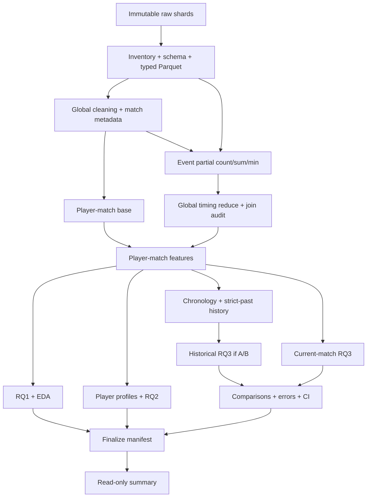

# Kế hoạch triển khai thống nhất dự án PUBG

Ngày tái cấu trúc: 29/09/2026. Bổ sung tiêu chí nghiệm thu notebook: 29/09/2026.
Nguồn nghiên cứu ưu tiên: [PUBG_RESEARCH_SPEC.md](PUBG_RESEARCH_SPEC.md), phiên bản 3.0.
Đường dẫn code/config/artifact trong kế hoạch tính từ thư mục repository chứa tài liệu này, trừ khi ghi khác.

Đây là kế hoạch hiện hành duy nhất. Đọc từ đầu đến cuối, sau đó thực hiện giai đoạn 0 đến 16. Toàn bộ code notebook 00-12 phải đạt G0 trước khi chạy full-data. Lịch sử sửa nằm trong [CHANGELOG_FIXES.md](CHANGELOG_FIXES.md); bản trước khi hợp nhất nằm trong [bản lưu chỉ để đối chiếu](reports/appendix/archive/PUBG_IMPLEMENTATION_PLAN_2026-09-29_before_unification.md), không dùng như kế hoạch song song.

Điều hướng:

- [Quy tắc thực hiện và tích](#tracking-rules), [hợp đồng nghiên cứu](#research-contracts), [kiến trúc và trực quan](#architecture).
- [Giai đoạn 0: kiểm kê](#phase-0), [1: hạ tầng](#phase-1).
- Notebook [00](#phase-2), [01](#phase-3), [02](#phase-4), [03](#phase-5), [04](#phase-6), [05](#phase-7), [06](#phase-8).
- Notebook [07](#phase-9), [08](#phase-10), [09](#phase-11), [10](#phase-12), [11](#phase-13), [12](#phase-14).
- [Giai đoạn 15: kiểm thử/G0](#phase-15), [16: chạy thật/bàn giao](#phase-16).
- [Điều kiện hoàn thành](#completion), [truy vết yêu cầu](#traceability).

## I. Mục tiêu và các quyết định đã chốt

Tài liệu chuyển đặc tả nghiên cứu thành công việc có thứ tự, đầu vào, đầu ra, phép kiểm tra và tiêu chí nghiệm thu. Đặc tả v3.0 vẫn là nguồn quyết định chính; không kế thừa thiết kế trong `kh.md` khi trái đặc tả. Không sửa đặc tả hoặc dữ liệu raw trong quá trình lập kế hoạch này.

Ba câu hỏi nghiên cứu giữ nguyên:

| RQ  | Đơn vị phân tích                    | Mục tiêu                                                                  | Bằng chứng phải có                                                                |
| --- | ---------------------------------------- | --------------------------------------------------------------------------- | ------------------------------------------------------------------------------------- |
| RQ1 | Player-match                             | Quan hệ giữa hành vi, Combat Timing và survival/placement               | Pearson, Spearman, phân tích theo mode, số quan sát và cảnh báo target-derived |
| RQ2 | Player profile hoặc player-mode profile | Tìm kiểu hành vi; so sánh outcome sau phân cụm                        | Chọn K không dùng outcome, độ ổn định, profile, C1-C5                         |
| RQ3 | Player-match; history-to-current-match   | Hồi quy survival/placement hồi cứu và dự đoán lịch sử khi hợp lệ | Baseline, S1/S2/P1/P2/P3, T0/T1, ablation, lỗi và bất định                       |

Đóng góp dự kiến là một nghiên cứu thực nghiệm có khả năng tái lập: kết hợp hành vi aggregate với thời điểm kill, tách hồi cứu khỏi dự đoán lịch sử, kiểm tra contribution bằng các so sánh có kiểm soát. Không tuyên bố đây là phương pháp mới đầu tiên trong toàn bộ tài liệu học thuật chỉ dựa trên ba paper.

Ngoài phạm vi core: association rules, spatial mining sâu, Elo/Glicko/TrueSkill, NDCG, deep learning, phân loại Top-N, mô hình censoring và suy luận nhân quả. Không thêm dashboard, API, framework điều phối hoặc experiment server khi notebook + file manifest đã đáp ứng yêu cầu.

Các lựa chọn vận hành đã được người dùng chốt:

```python
PUBG_STORAGE_MODE = "drive"
PUBG_DRIVE_PROJECT_ROOT = "/content/drive/MyDrive/PUBG_Project/Project_PUBG"
PUBG_REQUIRE_EXISTING_PROJECT = True
PUBG_BATCH_ROWS = 50000
```

- RQ2 dùng `per_mode`; vẫn phải xác minh mapping mode và ghi evidence/giới hạn.
- Dùng GPU cho phần huấn luyện có backend hỗ trợ, ghi device/backend/version. Constant baselines, Ward và xử lý CPU/I/O có nhãn rõ. Không tự thay estimator hoặc chuyển CPU để che lỗi GPU.
- Output hiện hành ghi đè đúng tên; upload .py/config/notebook cập nhật đúng file ID/version, không sinh (1)/(2). Snapshot nghiên cứu đã khóa được giữ riêng có phiên bản.
- Notebook chạy thành công được lưu cả output và thay đúng bản trong thư mục notebooks trên Drive và máy tính.
- Hết quota/RAM/disk/GPU: dừng an toàn, giữ checkpoint đã commit, báo vị trí và nhắc người dùng đổi tài khoản khi phù hợp. Tài khoản mới dùng shortcut đúng root và đủ quyền; không bảo đảm đổi tài khoản giải quyết mọi giới hạn.
- Không chạy All-in-One, kể cả test tự động thực thi nó. Không sửa raw.
- Phương án thực hiện: sửa logic dùng chung trong src/, kiểm thử, cập nhật generator và notebook bị ảnh hưởng, nghiệm thu code, rồi chạy thật và xác minh Drive.

<a id="tracking-rules"></a>

## II. Cách Claude đọc, thực hiện và tích hoàn thành

1. Đọc AGENTS.md, toàn bộ đặc tả và toàn bộ kế hoạch này. Kiểm tra nhật ký và hiện trạng trước khi sửa.
2. Thực hiện lần lượt giai đoạn 0-15 để hoàn thiện code, sau đó giai đoạn 16 để chạy thật. Không lấy việc chạy 00-06 làm điều kiện phải có trước khi viết code 07-12.
3. Với từng mã công việc: kiểm tra implementation, caller, config, notebook, test và artifact liên quan. Nếu đã đúng thì tái sử dụng và ghi bằng chứng; nếu thiếu một phần thì chỉ bổ sung phần thiếu.
4. Chỉ tích `[x]` khi toàn bộ yêu cầu của dòng đó và kiểm tra liên quan đạt. Có file/hàm, notebook nhiều cell, cú pháp đúng hoặc một test không liên quan pass đều chưa đủ.
5. Ghi bằng chứng ngay dưới dòng công việc: file/hàm; lệnh kiểm tra và passed/failed/skipped; đường dẫn artifact nếu cần; mục nhật ký; ngày và phiên bản. Không dùng lời khẳng định chung thay bằng chứng.
6. Việc bị chặn giữ `[ ]`, ghi `blocked`, nguyên nhân, dependency và điều kiện tiếp tục. Không tự tích việc đang blocked. Ngoại lệ nghiên cứu hợp lệ như S2/P3 Grade C được nghiệm thu ở nhiệm vụ kiểm tra trạng thái, nhưng thí nghiệm vẫn là blocked.
7. Giai đoạn code có thể hoàn thành khi cơ chế gate/diagnostics đã được kiểm thử, dù tham số cần dữ liệu thật còn pending. Không tự điền ngưỡng để đi tiếp.
8. Sửa code/config/tài liệu phải nối nhật ký cùng đợt. Sửa src/generator thì tạo lại notebook bị ảnh hưởng, bảo toàn bản có output, kiểm tra tương thích consumer và đánh dấu stale đúng dependency.
9. Chỉ dừng hỏi khi quyết định vượt quyền đã giao, làm đổi protocol chưa được chốt, có xung đột chưa giải quyết hoặc không thể tiếp tục an toàn. Công việc độc lập đã được giao vẫn có thể làm; không vượt qua gate thực thi bị chặn.
10. Kết thúc mỗi giai đoạn báo mã đã nghiệm thu, file sửa, kiểm tra, giới hạn và giai đoạn tiếp. Không tự tạo kế hoạch bổ sung ở cuối; cập nhật đúng công việc hiện hành. Mã công việc đã cấp không đổi khi thêm nhiệm vụ.

### Ba mặt nghiệm thu bắt buộc

Mỗi notebook phải đạt cả logic, tích hợp và khả năng đọc. Unit test của module không chứng minh caller notebook đúng; notebook đẹp không chứng minh logic đúng.

- Logic: expected values hoặc invariant cụ thể, đúng missing/scope/cohort/leakage và trạng thái lỗi.
- Tích hợp: chạy chính các cell notebook được generator sinh ra trên fixture cô lập; xác minh config thực truyền tới caller, lưu/đọc lại artifact và checkpoint.
- Khả năng đọc: xem notebook có output hoặc bản render fixture; bảng/hình hiển thị và khớp nguồn, có giải thích theo bước và bàn giao.

Bằng chứng phải ghi file/hàm, cell ID hoặc tiêu đề cell, lệnh thực chạy, fixture/scope, điều kiểm tra và kết quả, đường dẫn output/report, ngày và code/config version. Hình cần ghi output đã xem và bảng nguồn đối chiếu. `test PASS`, số artifact hay cú pháp đúng không thay thế bằng chứng. Synthetic không chứng nhận full-data/GPU/Drive thật; dùng hệ thống test/manifest/nhật ký hiện có, không thêm framework.

Code đã đúng không cần sửa cho có thay đổi, nhưng phải kiểm chứng đủ phạm vi. Sau lần đặt lại checklist ngày 30/09/2026, bắt đầu từ INV-01 rồi luôn tiếp tục ở task ID chưa nghiệm thu đầu tiên. Giữ bằng chứng cũ kèm lý do rút nghiệm thu. Những dấu tích lịch sử không có nghĩa được tái xác minh trong đợt mới. Không chuyển giai đoạn khi code/tích hợp/trình bày bắt buộc còn thiếu; xác minh môi trường thật theo dõi riêng ở RUN.

Ví dụ ghi bằng chứng:

```markdown
TASK NB08-xx: Yêu cầu đã được kiểm chứng.
  - Bằng chứng: src/...:hàm; test/lệnh và kết quả; artifact/path nếu cần.
  - Nhật ký: CHANGELOG_FIXES.md, tiêu đề mục; ngày; code/config version.
```

Trạng thái khởi tạo của bản viết lại: mọi ô để trống có nghĩa **chưa được tái nghiệm thu trong bản thống nhất**, không khẳng định code chưa tồn tại. Những dấu tích cũ được bảo toàn trong bản lưu. Giai đoạn 0 phải đối chiếu chúng trước; không làm lại toàn bộ dự án.

| Nhóm từng được tích trong bản cũ               | Cách xử lý tại thời điểm đối chiếu                                           |
| ------------------------------------------------------ | -------------------------------------------------------------------------------------- |
| Mục 19: giai đoạn 0-2, 5-9 và checklist code-ready | Kiểm tra bằng chứng ở giai đoạn 0-2, 5-8 và 15; không suy full-run đã đạt  |
| Mục 20: giai đoạn A                                 | Kiểm tra hạ tầng ở giai đoạn 1 và tích hợp từng consumer ở giai đoạn 9-14 |
| Mục 19: ingest/cleaning và full run chưa tích      | Rà soát giai đoạn 3-4 và 16, không coi code-ready cũ là bằng chứng thay thế |
| Mục 20: B-H chưa tích                               | Rà soát giai đoạn 9-16; thực hiện phần thực sự còn thiếu                    |

### Cổng nghiệm thu dùng xuyên dự án

- **G0 - Code ready:** toàn bộ pipeline/notebook/config/tests/README tồn tại; synthetic tests pass.
- **G1 - Source ready:** đủ shard, checksum/schema/units/source metadata; không có lỗi critical chưa xử lý.
- **G2 - Cohort và split ready:** roster/target valid, chronology xác định, split manifest khóa trước relationship EDA.
- **G3 - Research decisions ready:** mode, thresholds, candidate feature/scaling rules có evidence; K được chốt sau diagnostics ở 07.
- **G4 - Test access ready:** chọn model/params bằng validation; đăng ký đủ paired comparisons, ablation và error bins.
- **G5 - Results ready:** artifact full hợp lệ, provenance khớp, exceptions có lý do, final manifest khóa.

Gates là kiểm tra và bản ghi quyết định, không yêu cầu hỏi phép lại từng bước đã được giao. Tham số nghiên cứu chưa có evidence phải dừng đúng stage, lưu diagnostics và chỉ tiếp tục khi config đã được chốt hợp lệ.

Chỉ dùng G0-G5 với ý nghĩa trên. Không đưa thêm Gate G7 chưa định nghĩa. Số cell phục vụ khả năng đọc; không có ngưỡng 16-24 cell thay cho nội dung, test và artifact.

<a id="research-contracts"></a>

## III. Hợp đồng nghiên cứu dùng chung

### Quy tắc D01-D08

Các mục dưới đây là cách triển khai thận trọng các quy tắc của đặc tả, không thêm RQ. Ghi thành `decision_log.csv` với `decision_id`, căn cứ đặc tả, lựa chọn, evidence, thời điểm và artifact bị ảnh hưởng.

### D01 - Combat Timing có phụ thuộc survival gián tiếp

`estimated_match_duration = max(player_survive_time)` là một node phụ thuộc outcome. Các phase count/ratio dùng duration này thừa hưởng phụ thuộc survival, dù tên feature không chứa chữ survival.

- Xây và giữ đầy đủ timing features theo đặc tả để mô tả hồi cứu và dùng cho placement khi hợp lệ.
- S1 an toàn không dùng duration proxy và các phase descendants này. Timing tuyệt đối như first/average kill time, event count và `has_kill` chỉ được dùng nếu không lọc/clip/tính missing của chúng bằng survival của chính row.
- T0/T1 cho survival phải ghi rõ T1 dùng **timing subset an toàn**, không phải toàn bộ phase features. So sánh timing đầy đủ ưu tiên placement.
- RQ1 với survival: phase features theo proxy chỉ là diagnostic có cờ coupling; không dùng làm bằng chứng chính độc lập với survival.
- RQ2: giữ Design 3 và phase ratios như đặc tả, nhưng ghi đây là behavioral profile có chuẩn hóa bằng proxy hậu trận; không gọi clustering hoàn toàn độc lập với mọi thông tin outcome. Thêm kiểm tra độ nhạy bỏ các duration-derived timing features nếu chúng chi phối kết quả; không chọn phương án dựa trên cluster survival/placement.
- Không tự chuyển sang ngưỡng phút tuyệt đối hoặc nguồn duration khác để “sửa” mà không version feature và ghi quyết định.

### D02 - P2 bỏ survival trực tiếp chưa có nghĩa loại mọi thông tin survival

Theo định nghĩa đặc tả, P1 và P2 chỉ khác cột `player_survive_time`. Nếu bộ feature chung còn kills/minute, velocities hoặc timing theo duration proxy, kết quả chỉ đo **giá trị bổ sung của cột survival trực tiếp**.

Giữ so sánh P1/P2 đúng đặc tả. Registry xuất danh sách survival-derived còn lại, caption ghi giới hạn. Có thể chạy sensitivity `P2_NO_SURVIVAL_DESCENDANTS` đã đăng ký trước test; đây là bổ sung diễn giải, không thay P2 hoặc tăng số RQ.

### D03 - N_teams và duration cần roster trước khi lọc cohort theo task

Tính metadata trên roster đã kiểm tra keys/duplicates và validity trường liên quan, trước khi loại row vì missing feature/target khác. Không tính lại `N_teams` trên riêng cohort của S1 hoặc P1.

Giữ `observed_team_count`, `max_observed_placement`, số team thiếu ID và cờ incomplete/conflict. Không sửa placement, ép vào [0,1] hoặc thay denominator để làm mất lỗi. Nếu roster không đủ đáng tin, normalized placement của match bị đánh dấu không hợp lệ; survival có thể còn dùng nếu đáp ứng contract riêng.

### D04 - Thứ tự trận chưa đủ: phải biết lúc thống kê đã sẵn sàng

Kiểm tra timestamp là bắt đầu, kết thúc hay thời điểm ghi log. History chỉ dùng trận trước đã hoàn thành/đã có thống kê tại thời điểm dự đoán. Timestamp có giây nhưng không rõ ngữ nghĩa không tự động được Grade A.

Nếu cùng timestamp không có thứ tự tin cậy, gom tie block và dùng strictly earlier block; không dùng `match_id` hoặc thứ tự file để bịa chronology. Grade B dùng ngày trước, loại toàn bộ cùng ngày. Nếu không có quy tắc quá khứ an toàn, Grade C chặn S2/P3.

### D05 - Outcome-dependent EDA không được mở final test sớm

Tạo split manifest sau DQ/chronology sơ bộ ở notebook 02, trước relationship EDA. DQ có thể kiểm tra toàn bộ dữ liệu để áp dụng contract đã định nghĩa; không dùng quan hệ feature-target hay test error để quyết định model.

Notebook 05/06 dùng train/development cho phân tích ảnh hưởng đến feature/model; có thể hoàn thiện bảng mô tả full valid data sau khi khóa lựa chọn ở 11. Mỗi bảng ghi `analysis_scope`. Full-data policy nghĩa xử lý đủ dữ liệu hợp lệ, không có nghĩa dùng test để chọn thiết kế.

### D06 - `hist_kd` cần số lần chết thực sự được xác minh

Không đặt `hist_kd = kills / games` rồi gọi K/D; không suy mọi player trong team thắng đều sống. Nếu death records chưa đủ bao phủ/không xác minh được death denominator, giữ feature ở `candidate` hoặc `excluded` với lý do. Core historical averages vẫn chạy. Nếu được xác minh: dùng past total kills / past observed deaths, denominator 0 là missing có cờ, không cộng epsilon tùy ý.

### D07 - Không có event khác với không kill

Row có `player_kills > 0` nhưng không join được event là thiếu dữ liệu sự kiện; không gán timing như một trận không kill. Ghi coverage và discrepancy riêng. `has_kill` phản ánh nguồn đã chọn, `event_kill_count` phản ánh event hợp lệ; không trộn hai khái niệm khi có bất đồng.

### D08 - Trạng thái blocked phải thống nhất

Registry dùng enum tổng `status = blocked`, kèm `reason_code = blocked_by_chronology` cho S2/P3 Grade C. Summary hiển thị nguyên nhân cụ thể. Không gán 0 vào metric, không chuyển blocked thành completed để qua finalization.

### Dữ liệu, quyền sử dụng feature và missing

### Bảng dữ liệu

| Dataset                              | Grain/key                                           | Nội dung bắt buộc                                              | Invariant                                                                   |
| ------------------------------------ | --------------------------------------------------- | ----------------------------------------------------------------- | --------------------------------------------------------------------------- |
| `validated_aggregate`              | Raw lineage row; key player-match khi identity đủ | Giá trị nguồn/canonical, reason flags                          | Không còn duplicate identity conflict chưa xử lý trong cohort hợp lệ |
| `match_metadata`                   | `match_id`                                        | Time, modes, roster counts, N_teams, duration proxy, completeness | Một dòng/match; không phụ thuộc task filtering                         |
| `combat_timing`                    | `(match_id, killer_name)` sau canonical mapping   | Count/sum/min, phase counts, coverage                             | Một dòng/key sau global reduce                                            |
| `player_match_features`            | Player-match; row ID cho dòng thiếu name          | Behavior, timing, target, flags, lineage                          | Left join không tăng số row; feature formula/version rõ                 |
| `player_profile_features`          | Player hoặc player-mode                            | Design 3, reliability denominators, outcome tách vai trò        | Không input outcome, không gộp missing name thành một người          |
| `historical_player_match_features` | Current player-match                                | Strict-past features, depth, availability, target                 | Max source availability < current prediction time theo grade                |
| `split_assignments`                | `match_id`                                        | train/validation/test, cutoff, grade, version                     | Mỗi match thuộc đúng một split                                         |

Row thiếu `player_name` có thể giữ cho RQ1/current modeling nếu các trường cần thiết đủ; dùng ID nguồn `(source_file, source_row)` cho lineage. Không join timing/history/profile bằng một tên `UNKNOWN` chung.

### Registry và quyền sử dụng

Giữ toàn bộ metadata ở đặc tả §11; bổ sung `depends_on`, `availability`, `missing_indicator`, `aggregation_denominator` để kiểm tra transitive dependencies. Không cần xây framework đồ thị: dictionary + kiểm tra dependency closure là đủ.

| Nhóm feature                                         | RQ1 survival                        | RQ2 input                          | S1                                       | Placement hồi cứu                   | Historical input                              |
| ----------------------------------------------------- | ----------------------------------- | ---------------------------------- | ---------------------------------------- | ------------------------------------- | --------------------------------------------- |
| Raw kills/damage/walk/ride/assists/DBNO               | Cho phép                           | Aggregate theo Design 3            | Cho phép                                | Cho phép                             | Past aggregate                                |
| Total distance, walk ratio, damage/kill, assist ratio | Theo contract                       | Chỉ feature được chọn         | Cho phép nếu không phụ thuộc target | Cho phép                             | Optional nếu registry xác nhận             |
| Kills/minute, damage/minute, velocities               | Diagnostic, không primary          | Không thuộc Design 3             | Cấm                                     | Có thể dùng; ghi survival coupling | Không tự thêm                              |
| Survival trực tiếp                                  | Target                              | Outcome-only                       | Cấm                                     | Chỉ P1                               | Past survival cho S2/P3 được phép         |
| Placement và descendants                             | Outcome hoặc diagnostic riêng     | Outcome-only                       | Không đưa vào bộ behavior chính    | Cấm                                  | Past placement được phép                  |
| First/avg kill time tuyệt đối, has_kill            | Cho phép với giới hạn hồi cứu | Chỉ Design 3/candidate đã chốt | Theo D01                                 | Cho phép                             | Timing history optional                       |
| Phase timing theo duration proxy                      | Diagnostic có coupling             | Design 3, disclosure D01           | Cấm theo D01                            | Cho phép                             | Chỉ từ trận trước nếu mở extension     |
| IDs, source order, raw timestamps                     | Audit/group/split                   | Không input                       | Không input                             | Không input                          | Điều phối chronology, không raw predictor |

Ablation xóa một nhóm phải xóa toàn bộ feature có dependency vào nhóm đó, kể cả cross-group feature. Ví dụ `damage_per_kill` phụ thuộc Combat, `assist_ratio` phụ thuộc Support và Combat. Giữ group hiển thị nhưng dùng `depends_on` cho removal thực tế.

### Missing và công thức

- `damage_per_kill`: denominator kills = 0 ; NaN.
- `assist_ratio`: kills + assists = 0 ; NaN.
- `walk_ratio`: total_distance = 0 ; NaN mặc định chờ quyết định EDA; không fill 0 ngầm.
- Rates theo survival: survival <= 0 ; NaN; không chia epsilon.
- No-kill xác nhận: count = 0; first/avg time và phase ratios = NaN.
- Event coverage lỗi: giữ missing reason riêng; không đổi thành no-kill.
- Imputation chỉ xảy ra ở model/profile transform sau lưu semantics; indicator phải đi cùng feature set và bị xóa trong ablation tương ứng.
- Feature toàn missing/constant trên train: ghi lý do exclude; không học cách xử lý từ test.

### Cấu hình và quyết định phụ thuộc bằng chứng

### Trách nhiệm của 10 config

| File                   | Nội dung                                                           | Thời điểm chốt                                                |
| ---------------------- | ------------------------------------------------------------------- | ----------------------------------------------------------------- |
| `data.yaml`          | Dataset slug, archive/shard URLs, local source, patterns, checksums | Trước ingest; không điền URL chưa có                       |
| `schema.yaml`        | Required/optional fields, aliases, dtypes, units, key rules         | Sơ bộ lúc code; xác nhận sau inventory                       |
| `paths.yaml`         | Ephemeral/persistent/raw/processed/artifacts/temp paths             | Notebook 00                                                       |
| `preprocessing.yaml` | Duplicates, invalid policies, mode mappings, time parsing           | Sau DQ trước publish cohort                                     |
| `features.yaml`      | Registry/formulas/phase boundaries/task membership                  | Công thức theo spec; feature sets sau EDA/validation            |
| `eda.yaml`           | Chart catalog, bins, plotting/diagnostic samples                    | Không dùng test để chọn bins có ảnh hưởng model          |
| `rq2.yaml`           | Profile scope, mode strategy, min games, K, scaler, sensitivities   | Sau EDA và clustering diagnostics                                |
| `rq3.yaml`           | Split, history threshold, experiment matrix, evaluation protocol    | Split trước EDA outcome; các lựa chọn còn lại trước test |
| `models.yaml`        | Candidates, search spaces, resource limits, final params            | Candidate code trước; final params theo validation              |
| `runtime.yaml`       | development/full, seed, batches, memory, checkpoint settings        | Theo tài nguyên; actual values được log                      |

### Các tham số phải để null khi viết code

| Tham số                             | Bằng chứng dùng để chốt                                     | Không được dùng                          |
| ------------------------------------ | ----------------------------------------------------------------- | --------------------------------------------- |
| `chronology_grade`                 | Timestamp semantics, precision, collisions, missing, availability | Hình thức chuỗi timestamp đơn thuần     |
| Split cutoffs/ratios                 | Time coverage, match counts, dữ liệu đủ mỗi split            | Test score                                    |
| `minimum_games_threshold`          | Retention + stability cho 5/10/20/50                              | Outcome giữa cluster                         |
| `minimum_history_threshold`        | Coverage + stability trên development                            | Test MAE                                      |
| `mode_strategy`                    | Behavioral distributions theo mode                                | Chọn theo outcome đẹp nhất sau clustering |
| `n_clusters`                       | Elbow, silhouette, DB, stability, behavioral interpretability     | Survival/placement                            |
| Log/outlier rules                    | Distribution, validity evidence, train/validation                 | Loại extreme chỉ để metric tốt           |
| Final feature set/model/params       | Leakage review và validation                                     | Final test                                    |
| Hierarchical sample size, batch size | Memory/time diagnostics                                           | Ngầm biến official run thành sample        |

`random_state: 42` là mặc định kỹ thuật hợp lệ. Candidate lists/search spaces có thể được viết trước; không đồng nghĩa đã chọn final value.

Bảng trên là quy tắc cho quyết định chưa có bằng chứng. `per_mode` và batch 50000 đã được người dùng chốt; không đưa chúng về null hoặc hỏi lại. Lựa chọn estimator thay thế phải có recipe/ID/backend riêng và được chốt trước sử dụng; không tự fallback OLS sang SGD hoặc KMeans sang MiniBatchKMeans trong cùng run.

### Ma trận thí nghiệm và cohort

### Ma trận bắt buộc

| ID               | Target/phân tích                                     | Inputs                                                      | Điều kiện và comparison                                                                             |
| ---------------- | ------------------------------------------------------ | ----------------------------------------------------------- | ------------------------------------------------------------------------------------------------------- |
| C1               | Main clustering                                        | Selected Behavioral Profile                                 | Không outcomes; K và threshold theo diagnostics                                                       |
| C2               | Hierarchical supporting                                | Cùng representation C1                                     | Full/subset/centroids được ghi chính xác                                                           |
| C3               | games_played sensitivity                               | C1 ± games_played                                          | Kiểm tra profile phân theo kinh nghiệm                                                               |
| C4               | min-games sensitivity                                  | Profile các ngưỡng hợp lệ                              | Retention/stability; so common profiles khi cần                                                        |
| C5               | Outcomes by cluster                                    | Assignments đã khóa + outcomes                           | Descriptive; không dùng chọn C1                                                                      |
| S1               | Survival                                               | Current safe Combat/Movement/Support + timing safe theo D01 | Retrospective; survival descendants bị cấm                                                            |
| S2               | Survival                                               | Strict historical behavior                                  | Chỉ Grade A/B, history threshold đã khóa                                                            |
| P1               | Normalized placement                                   | Current behavior + timing + survival trực tiếp            | Retrospective                                                                                           |
| P2               | Normalized placement                                   | Giống P1, bỏ survival trực tiếp                         | Same cohort/split/model; disclosure D02                                                                 |
| P3               | Normalized placement                                   | Strict historical behavior                                  | Chỉ Grade A/B                                                                                          |
| T0/T1            | Placement chính; survival safe subset nếu đăng ký | Base behavior / thêm timing hợp lệ                       | Same row IDs; với placement neo vào P2 để cố định survival policy                                |
| ABL-FULL/C/M/S/T | Task đã chọn trước test                           | Full / remove một group và descendants                    | Neo vào feature set của T1; survival trực tiếp nếu có phải giữ cố định hoặc ghi task riêng |

Mỗi S/P task thực thi train mean, train median, linear; nonlinear mạnh hơn chạy khi khả thi. T0/T1 và ablation dùng một estimator recipe đã chọn trên validation và có thể thêm linear reference nếu cần kiểm tra độ ổn định, không mặc định nhân toàn Cartesian product.

`T0` và `ABL-T` có thể dùng lại cùng artifact nếu mọi signature/cohort/recipe giống nhau; registry ghi alias/reference, không chạy lại chỉ vì tên thí nghiệm khác.

### Quy tắc cohort

- Mỗi experiment lưu rule eligibility, n_rows/n_matches/n_teams/n_players, split counts và reasons excluded.
- P1/P2 cùng cohort yêu cầu survival hợp lệ cho cả hai nhánh để so sánh trực tiếp; P2 rộng hơn nếu có là experiment phụ riêng.
- T0/T1 dùng cohort có khả năng đánh giá timing theo policy đã khóa. Report coverage so với toàn current-match cohort; không bỏ missing event mà không nói population đã đổi.
- Historical cohort gồm mọi row đạt depth và chronology, không chỉ player có nhiều trận trong tương lai.
- Không lọc history cohort bằng tổng số trận cuối dataset rồi giả là điều kiện biết trước trận.
- Report “full data” luôn gắn với **toàn bộ training cohort hợp lệ đã khai báo của experiment**, không đồng nghĩa mọi dòng raw hoặc mọi mode đều vào mọi task.

### Optional được tách tên

`P2_NO_SURVIVAL_DESCENDANTS`, C6 mode sensitivity, same-mode history, rolling history, DBSCAN và unseen-player split chỉ chạy khi có lý do và đăng ký. Với unseen-player split đồng thời yêu cầu match isolation, cần xử lý các match chứa cả train/test players hoặc dùng grouping phù hợp; không đơn giản GroupShuffleSplit theo player rồi để match giao nhau.

Không có optional experiment nào được dùng thay core chưa làm mà không ghi limitation.

### Công thức và cách diễn giải đánh giá

### Metrics từ predictions

Với residual `e_i = y_i - prediction_i`:

- \(MAE = \frac{1}{n}\sum_i |e_i|\).
- \(RMSE = \sqrt{\frac{1}{n}\sum_i e_i^2}\).
- \(R^2 = 1-\frac{SSE}{SST}\), với \(SST=\sum_i y_i^2-\frac{(\sum_i y_i)^2}{n}\).
- n < 2 hoặc SST = 0: R² là NA kèm lý do, không ép thành 0/1.

Tích lũy bằng float64; kiểm tra ổn định số học với fixture/reference. R² có thể âm, không phải accuracy. Survival metrics ghi đơn vị đã xác minh; placement metrics trên [0,1]. Không tự clip predictions để làm metric đẹp; nếu thêm clipping thì là postprocessing đã đăng ký, báo cả quy tắc và ảnh hưởng.

### Micro, match-aware, team-aware

1. **Micro player-match:** mỗi row trọng số 1; là primary regression metric.
2. **Match-macro:** MAE trung bình các MAE/match; RMSE = căn trung bình MSE/match. Nếu báo R² weighted theo match, dùng weight row `1/n_match` và SST weighted; không lấy trung bình R²/match rồi gọi global R².
3. **Team-aware placement:** aggregate prediction trung bình trong `(match_id, team_id)`, target team đã validate giống nhau. Tính MAE/RMSE/R² với mỗi team một quan sát; nêu đây là estimand phụ khác player-level observation of team placement.

Lưu `aggregation`/`weighting` trong metric table để không trộn ba loại. Không diễn giải số player-row lớn như các quan sát độc lập hoàn toàn.

### Paired bootstrap theo match

Cho từng match lưu `n`, `sum_abs_error`, `sum_sq_error`, `sum_y`, `sum_y_sq` cho hai model trên cùng rows. Với mỗi replicate:

1. Sample match IDs with replacement; giữ multiplicity của match.
2. Cộng contributions theo multiplicity cho cùng resample của cả hai model.
3. Tính lại global MAE/RMSE/R² của replicate; không average chunk RMSE hoặc chunk R².
4. Tính delta và lấy percentile 2,5%-97,5%.

Quy ước xuyên dự án: `delta = candidate - reference`; MAE/RMSE âm là tốt hơn, R² dương là tốt hơn. Số replicate và seed ghi trong config trước chạy CI, cân theo resource diagnostics, không đặt theo CI đẹp.

Bootstrap theo match xử lý phụ thuộc trong trận; repeated players giữa các match vẫn là limitation. CI không bao gồm mọi nguồn uncertainty từ model selection/training. Không biến CI của retrospective prediction thành kết luận nhân quả.

### Error analysis và interpretation

History bins của đặc tả là candidate; phải làm không chồng lấn, ví dụ biên cuối là `>50` nếu bin trước là 21-50. Cold-start/low-history exclusions vẫn có coverage table. Các slice quá ít quan sát ghi n và NA/unstable thay vì xếp hạng model chắc chắn.

Permutation importance của các feature tương quan chỉ phản ánh cách perturbation ảnh hưởng model đã fit. Group ablation là evidence chính cho contribution; không dùng coefficient/importance để nói hành vi gây ra outcome.

<a id="architecture"></a>

## IV. Kiến trúc, tài nguyên và trình bày

### Tổ chức thư mục

```text
Project_PUBG/
  README.md
  requirements.txt
  configs/                     # 10 file theo đặc tả
  notebooks/                   # 00 đến 12
  src/
    data/                      # source, contract, cleaning, metadata, checkpoint
    features/                  # một định nghĩa chuẩn cho mỗi feature
    analysis/                  # EDA, RQ1, mode, clustering
    models/                    # baselines, training, các estimator cần dùng
    evaluation/                # metrics, bootstrap, ablation, errors
    utils/                     # config, logging, runtime, hashing
  tests/                       # synthetic, leakage và resume tests
  data/{raw,interim,processed}/
  artifacts/{checkpoints,experiments,manifests,models,metrics,logs}/
  figures/
  reports/{tables,appendix}/
```

`paths.yaml` ánh xạ các logical roots sang local/Colab/persistent storage. Không tạo thêm một bản raw 20 GB chỉ để khớp cấu trúc; local có thể trỏ `raw_root` đến `../Data_PUBG`. Tên thư mục `storage/` trong đặc tả biểu diễn vai trò lưu trữ, không bắt buộc nhân đôi cây `data/`.

### Stack tối thiểu

| Nhu cầu                   | Công cụ dự kiến                                     | Quy tắc sử dụng                                                                    |
| -------------------------- | ------------------------------------------------------- | ------------------------------------------------------------------------------------- |
| Scan/join/group/sort       | DuckDB                                                  | SQL theo stage, memory/temp directory cấu hình được                              |
| Lưu và đọc batch       | Parquet, PyArrow                                        | Không collect toàn raw vào pandas                                                  |
| Bảng nhỏ và tính toán | pandas, NumPy                                           | Summary/profile/matrix chỉ khi vừa RAM                                              |
| Models và clustering      | scikit-learn                                            | Baselines, LinearRegression/SGDRegressor, KMeans/MiniBatchKMeans, RF/HGB khi khả thi |
| Diagnostic/statistics      | SciPy; statsmodels chỉ nếu cần VIF implementation    | Không tự viết lại thuật toán chuẩn                                             |
| Biểu đồ                 | Matplotlib, seaborn                                     | Lưu source table và caption                                                         |
| Cấu hình                 | PyYAML; stdlib pathlib/json/hashlib/logging             | Không framework config riêng                                                        |
| Notebook và tests         | Jupyter/nbformat; unittest hoặc pytest nếu đã dùng | Tests nhỏ, tập trung invariant nghiên cứu                                         |
| Model tùy chọn           | XGBoost                                                 | Chỉ thêm khi resource gate chứng minh có thể chạy full training cohort          |

DuckDB hỗ trợ xử lý lớn hơn RAM cho nhiều toán tử nhưng vẫn có truy vấn tốn bộ nhớ; cần giới hạn RAM, temp disk và chia stage có checkpoint. [Tài liệu DuckDB](https://duckdb.org/docs/current/guides/performance/how_to_tune_workloads).

Streaming model cần cả batch reader, preprocessing và estimator cập nhật theo batch; `SGDRegressor`, `MiniBatchKMeans`, `StandardScaler` là các lựa chọn có incremental API. Không giả định mọi estimator hoặc scaler đều hỗ trợ `partial_fit`. [scikit-learn: out-of-core learning](https://scikit-learn.org/stable/computing/scaling_strategies.html).

Version package được pin sau setup Colab thành công; không copy API GPU cũ từ paper hoặc mặc định cài “latest” khi tái lập final run.

### Ba tầng provenance

1. **Data:** source checksums ; schema/cleaning versions ; processed dataset version.
2. **Research:** split manifest ; decision log ; feature registry ; experiment config hash.
3. **Results:** predictions/metrics ; comparisons/figures ; final manifest ; read-only summary.

Một artifact không truy được cả ba tầng không đủ điều kiện làm kết quả chính thức.

### Xử lý dữ liệu vượt RAM



- Chỉ convert CSV một lần cho mỗi source/schema version; downstream scan projected Parquet columns.
- Pass 1 roster/match metadata; pass 2 player features; event aggregate sớm trước join.
- DuckDB temp/sort/spill nằm trên runtime local disk; persistent backend giữ checkpoint đã đóng, không liên tục ghi nhiều small temp files lên mounted Drive.
- Player history/profile partition theo stable SHA digest nếu cần; không Python `hash()` phụ thuộc process seed. Ghi thuật toán, encoding, bucket count và version.
- Numbered Parquet parts hoặc bucket mức vừa; tránh hàng triệu thư mục nhỏ theo player/match.
- Không gọi `.to_pandas()` cho toàn player-match dataset nếu chưa kiểm tra footprint.
- Tách truy vấn window/sort nặng thành checkpoint để giảm peak memory; file dự phòng/raw không được tự xóa để giải phóng chỗ.

### Capacity check trước full run

Notebook 00/01 đo RAM và free disk, sau đó ước lượng:

`peak_disk ≈ raw cần giữ + typed/interim/processed đang sống + sort/spill + model caches + predictions + checkpoint staging`.

ZIP 4,40 GB và CSV 20,28 GB quan sát ở local không đủ để kết luận một Colab runtime bất kỳ sẽ chứa hết pipeline. Chỉ pin resource budget sau đo setup; không hứa free Colab luôn chạy được. Thiếu disk/RAM ; đổi chunk/part/query/model trong phạm vi cùng cohort, hoặc dùng runtime lớn hơn; không giảm mẫu official ngầm.

Fallback tài nguyên chỉ là phương án có điều kiện: projection/Parquet/SQL/spill/batching giữ phép tính; SGD hoặc MiniBatchKMeans là estimator riêng, chỉ thực thi khi recipe đã được chốt. Hierarchical/silhouette/permutation có thể dùng diagnostic sample công bố n/seed/rule. RF/HGB/XGBoost không khả thi thì resource_limited và null metric. Bootstrap dùng contributions theo match; thiếu CI ghi giới hạn. Persistent root không hợp lệ phải dừng, không gọi artifact runtime là đã lưu Drive.

### Mẫu notebook và quy chuẩn trực quan

#### Cấu trúc trình bày bắt buộc

Lấy cách giải thích theo bước của 00-06 làm tham chiếu, không sao chép lỗi hoặc kết luận viết sẵn. Không đặt số cell/số chữ tối thiểu; logic tái sử dụng nằm trong src/, notebook vẫn đủ ngữ cảnh cho thành viên mới.
<a id="scientific-notebook-standard"></a>

#### Chuẩn Phương án 2 bắt buộc cho mọi Notebook 00-12

Chuẩn này áp dụng cho toàn bộ Notebook 00-12, kể cả notebook setup, ingest, xử lý dữ liệu, phân tích, huấn luyện, khóa kết quả và tổng hợp. Không notebook nào được nghiệm thu chỉ vì code chạy, unit test pass hoặc artifact tồn tại. Phần ghi chú phải đủ để một thành viên mới hiểu câu hỏi, dữ liệu, phương pháp, kết quả, giới hạn và bước tiếp theo mà không cần đọc ngược toàn bộ `src/`.

Mỗi notebook phải được viết bằng tiếng Việt có dấu, mã hóa UTF-8. Thuật ngữ tiếng Anh chỉ giữ khi là tên chuẩn, tên biến, tên file hoặc được đặt sau phần giải thích tiếng Việt, ví dụ `đối soát dòng (row reconciliation)`. Không dùng tiếng Việt không dấu trong tiêu đề, Markdown, caption, nhãn bảng/hình hoặc thông báo bàn giao. Nội dung phải được sửa tại `src/utils/generate_notebooks.py` hoặc nguồn sinh canonical; không sửa tay riêng file `.ipynb` để rồi bị lần regenerate sau ghi đè.

Cấu trúc Phương án 2 của từng notebook gồm đủ các khối sau, điều chỉnh độ dài theo nhiệm vụ nhưng không được bỏ khối có liên quan:

1. Bối cảnh khoa học: notebook trả lời phần nào của RQ hoặc phục vụ gate nào; nêu rõ đây là setup, diagnostics, development hay kết quả nghiên cứu.
2. Mục tiêu và câu hỏi kiểm tra: liệt kê câu hỏi cụ thể, invariant và điều kiện thành công; không viết mục tiêu chung chung.
3. Input và provenance: bảng nguồn vào gồm path, version/checksum, upstream stage, scope/cohort/mode, đơn vị, số dòng/match/player và trạng thái verified/pending.
4. Phương pháp: giải thích làm gì, vì sao chọn cách đó, giả định, công thức LaTeX, tử số/mẫu số, missing semantics, leakage rule, seed và tham số lấy từ config. Không sao chép implementation dài vào Markdown.
5. Thực thi theo bước: trước mỗi khối code quan trọng có ghi chú về input, output, tác động dữ liệu, điều kiện chặn và artifact dự kiến; sau khối code có kết quả đọc được.
6. Kiểm soát chất lượng: bảng expected/actual cho row conservation, schema, key uniqueness, join cardinality, cohort, split, metric hoặc gate tương ứng. Lỗi, blocked, pending và resource_limited phải có nguyên nhân và cách tiếp tục.
7. Kết quả và trực quan: bảng/hình thật được render inline từ artifact hoặc dữ liệu vừa tính; có hướng dẫn đọc, không chỉ in path, tên file, dict thô hoặc câu “đã lưu”.
8. Diễn giải khoa học: nêu điều quan sát được trong đúng scope, effect size/uncertainty/N khi phù hợp, không suy nhân quả và không viết sẵn chiều kết quả trước khi có số liệu.
9. Hạn chế và quyết định còn mở: nói rõ dữ liệu/đơn vị/tài nguyên/ngoại suy nào chưa xác minh; synthetic, sample và full-data không được đánh đồng.
10. Artifact và bàn giao: bảng relative path, Drive path, checksum/version, status, consumer, checkpoint, resume point và điều kiện để mở notebook tiếp theo.

Quy tắc trực quan bắt buộc:

- Mỗi notebook phải có ít nhất các bảng kiểm toán cần thiết để đọc được dữ liệu vào, biến đổi, chất lượng và đầu ra. Không ép biểu đồ trang trí cho setup/finalization nếu bảng truyền đạt tốt hơn.
- Khi phân bố, quan hệ, so sánh từ ba nhóm trở lên, thay đổi qua nhiều bước, độ phủ theo thời gian, trade-off mô hình, uncertainty hoặc cấu trúc phân cụm khó đọc bằng văn bản ngắn, phải tạo biểu đồ thật chi tiết. Nếu mục `Bảng/hình` của giai đoạn đã liệt kê một biểu đồ thì biểu đồ đó là deliverable bắt buộc, trừ khi ghi `not_applicable` với lý do khoa học được kiểm chứng.
- Bảng phải hiển thị tên cột dễ hiểu, đơn vị, N hợp lệ, N thiếu, mẫu số, scope/mode/split và tổng đối soát. Bảng dài dùng summary và top/bottom có ghi quy tắc; dữ liệu artifact vẫn giữ đầy đủ.
- Biểu đồ phải có ID, tiêu đề tiếng Việt có dấu, câu hỏi, nhãn trục và đơn vị, legend, N, scope/cohort/mode/split, filter, missing policy, caption, nguồn bảng và path lưu. Màu nhất quán và đọc được khi in xám; không chỉ dựa vào màu để phân biệt.
- Mỗi biểu đồ phải có 1-3 câu “Cách đọc” và 1-3 câu “Điều có thể kết luận/không thể kết luận”. Không mô tả xu hướng không có trong dữ liệu.
- Hình dùng sample phải ghi `visualization sample`, n, seed, sampling rule và lý do; thống kê kết luận vẫn tính trên full valid scope nếu caption nói như vậy.
- Hình phải vừa hiển thị inline vừa lưu PNG canonical; mở lại file và đối chiếu với bảng nguồn. Không dùng placeholder, hình demo hoặc path tồn tại làm bằng chứng hoàn thành.
- Notebook 11-12 chỉ trực quan từ artifact chính thức đã khóa; không tính lại hoặc chọn lại kết quả để làm hình đẹp hơn.

Nghiệm thu chuẩn Phương án 2:

- Logic: invariant và expected values đạt.
- Tích hợp: chính notebook được chạy trên fixture cô lập và artifact đọc lại được.
- Ghi chú khoa học: đủ 10 khối liên quan, tiếng Việt có dấu, công thức/giả định/scope/giới hạn đúng.
- Trực quan: bảng/hình bắt buộc được render, mở và đối chiếu nguồn; caption và hướng dẫn đọc đúng actual data.
- Chỉ tích task trình bày của notebook khi có cell ID/tiêu đề, ảnh hoặc bản render đã xem, bảng nguồn, lệnh chạy, report path và limitation. AST, unit test, số cell hay file PNG tồn tại không thay thế nghiệm thu này.
- Nếu notebook cũ đã được tích nhưng chưa đạt chuẩn này, giữ lịch sử task cũ và thêm task trình bày mới ở trạng thái `[ ]`; không tuyên bố notebook hoàn thiện cho tới khi task mới đạt.

1. Mở đầu: câu hỏi, liên hệ RQ, thuật ngữ, giới hạn, input/output và điều kiện chạy.
2. Trước mỗi khối quan trọng: làm gì, vì sao, cột/đơn vị/mẫu số, công thức khi cần, scope và điều kiện chặn. Chia theo bước có ý nghĩa, không dồn toàn nghiệp vụ vào một cell không giải thích.
3. Sau mỗi khối: hiển thị bảng tóm tắt hoặc hình ngay trong notebook; cách đọc cột/trục, missing/status và kiểm tra cần đạt. Dictionary đường dẫn không thay bảng kết quả.
4. Kết luận theo số liệu/scope thực tế hoặc ghi chưa đủ bằng chứng. Không viết trước chiều tương quan hay model thắng. Ví dụ tính tay phải gắn nhãn minh họa.
5. Cuối notebook: bảng relative path/Drive path/version/checksum/status, cảnh báo, notebook và điều kiện tiếp tục; phân biệt output để đọc với dữ liệu/checkpoint để chạy tiếp.

Hình lưu phải hiển thị inline hoặc tải lại để hiển thị; chỉ savefig rồi close chưa đủ. Tái sử dụng bảng/hình, không thêm dashboard/hình trang trí. Null/blocked/resource_limited có lý do và cách tiếp tục, không metric/hình giả.

#### Quy chuẩn bảng/hình

Mỗi hình/bảng có ID, tiêu đề tiếng Việt, câu hỏi, đơn vị, scope/cohort/mode, bộ lọc, N, missing semantics, tử/mẫu, nguồn bảng, path/version, caption và 1-3 câu hướng dẫn đọc. Nếu sampling: n, seed, rule, lý do.

- Histogram dùng bin counts trên scope thật.
- Boxplot có thể dựng từ phân vị, mô tả whisker/outlier đúng.
- Scatter lớn dùng hexbin hoặc sample công bố rõ.
- ECDF/xấp xỉ khác phải ghi rõ là xấp xỉ.
- Các mode cùng thang đo/đơn vị; trục log có nhãn.
- Màu nhất quán, chữ dễ đọc, không chỉ dựa màu.
- Notebook phân tích chọn khoảng 2-5 hình chính khi hữu ích, không áp hạn ngạch cho setup/finalization; bảng có thể đủ. EDA vẫn đủ catalog ở phần nhóm/phụ lục và artifact.
- Hiển thị top N không cắt dữ liệu lưu.
- Dùng matplotlib/seaborn/công cụ sẵn có; không tạo dashboard riêng.

#### Artifact và đường dẫn

Dùng paths["tables"], paths["figures"] và đường dẫn artifact hiện hành; không hard-code reports/figures trái config đang dùng figures/.

Lưu CSV/Parquet đầy đủ, PNG; SVG chỉ khi cần xuất báo cáo. Figure manifest gồm ID, RQ, source table/experiment, purpose, caption, scope, version, report-ready. 11/12 đọc đúng artifact tương thích đã khóa, không lấy mọi file còn sót.

#### Ghi đè

Trình tự: staging hoàn chỉnh; validate; bảo toàn snapshot chính thức; cập nhật canonical; đọc lại lưu bền vững; commit checkpoint.

File .py/config/notebook upload qua Drive phải cập nhật đúng file/version. Upload cùng tên không bảo đảm ghi đè cùng file; kiểm tra path/ID/version. Output do Python ghi dùng canonical path.

Không tạo (1)/(2). Snapshot phiên bản có chủ đích phục vụ tái lập, khác bản trùng vô tình. Không xóa raw hoặc bản chưa xác định để dọn chỗ.

#### Bảng bàn giao

| Trường      | Nội dung                                         |
| ------------- | ------------------------------------------------- |
| Stage         | Notebook, version và trạng thái                |
| Input         | Paths/checksum/scope/upstream signature           |
| Quy mô       | Rows/matches/players và loại trừ               |
| Output        | Relative path, Drive path và checksum            |
| Môi trường | Packages, CPU/GPU/backend, config                 |
| Thời gian    | Start/end/elapsed                                 |
| Còn lại     | Cảnh báo, quyết định hoặc kiểm tra pending |
| Tiếp tục    | Notebook/cell/stage, điều kiện và resume      |

Một người ghi cùng stage tại một thời điểm. Thành viên khác dùng completed compatible checkpoint. Notebook output phục vụ đọc; dữ liệu/model/checkpoint riêng phục vụ tính tiếp. Không chia sẻ runtime hoặc thông tin đăng nhập.

#### Invalidation

| Thay đổi                    | Kết quả cần đánh giá lại                                     |
| ----------------------------- | ------------------------------------------------------------------- |
| Raw/schema/identity           | 01-12                                                               |
| Roster/time semantics         | 02-12, placement/timing/history/split                               |
| Base formulas                 | 03-12 theo dependency                                               |
| Timing policy                 | 04-12 ở stage dùng timing                                         |
| Split                         | 02 và analyses/preprocessing/models phụ thuộc, đặc biệt 05-12 |
| Caption/style                 | Hình/manifest/summary liên quan                                   |
| RQ2 K/min_games/scaler/device | Profiles/diagnostics/clusters liên quan, 07/11/12                  |

Reuse phần độc lập có chữ ký tương thích; không dùng kết quả chỉ vì file còn tồn tại.

Mỗi notebook có: mục tiêu và thuật ngữ tiếng Việt; config/scope/version/path; preconditions; quy mô input; xử lý và kiểm tra; bảng/hình; hướng dẫn đọc; publish/đọc lại/checksum; checkpoint; bảng bàn giao. Hiển thị stage/shard/batch/elapsed; ETA chỉ khi có mẫu số và throughput phù hợp. Không in bảng/hình cho mọi batch. Notebook chỉ điều phối gọi src/ và trình bày, không sao chép công thức.

### Bộ đầu ra nghiên cứu

### Output tối thiểu

| Nhóm              | Artifacts                                                                                             | Người dùng dùng để làm gì                    |
| ------------------ | ----------------------------------------------------------------------------------------------------- | ---------------------------------------------------- |
| Source/DQ          | source_inventory, schema_report, removal_log, chronology_report, identity/join audits                 | Dataset và preprocessing trong báo cáo            |
| Research decisions | feature_registry, decision_log, split_manifest, cohort ledger                                         | Giải thích lựa chọn và chống leakage           |
| Data               | player_match_features, player_profile_features, historical_player_match_features hoặc blocked status | Nền dữ liệu tái lập theo RQ                     |
| RQ1                | `rq1_relationship_summary.csv`                                                                      | Trả lời association và mode differences           |
| RQ2                | assignments, centers,`cluster_profile.csv`, robustness/outcome tables                               | Trả lời player types và giới hạn representation |
| RQ3                | models, predictions,`rq3_model_comparison.csv`                                                      | So baseline/linear/nonlinear theo task               |
| Contributions      | `combat_timing_comparison.csv`, `ablation_results.csv`                                            | Evidence incremental predictive information          |
| Errors/uncertainty | `error_analysis.csv`, `paired_bootstrap_ci.csv`, importance                                       | Phân tích model sai ở đâu và độ chắc chắn  |
| Final              | final_results_manifest, figure_manifest, notebook 12                                                  | Nguồn duy nhất tổng hợp báo cáo cuối          |
| Reproduction       | config snapshot, code version, package lock/snapshot, hardware/runtime metadata                       | Chạy lại và giải thích sai khác                |

`experiment_registry` giữ toàn bộ trường ở đặc tả §35; bổ sung `reason_code`, `cohort_hash`, `split_hash`, `prediction_path`, `evaluation_protocol` và fit mode để audit. Metrics không phải số nếu experiment chưa completed.

### Chart manifest

Triển khai catalog A01-I03 theo đặc tả §26, không bỏ nhóm vì đã có model score:

- A01-A06: số trận/player, retention theo threshold, mode, game size, teams/match, date coverage.
- B01-B10: raw behavior, survival và placement distributions.
- C01-C06: derived ratios và structural missing.
- D01-D08: so sánh theo mode.
- E01-E02: Pearson/Spearman đúng task allowlist.
- F01-F07 và G01-G06: selected behavior vs survival/placement; feature cụ thể chốt theo EDA hợp lệ.
- H01-H07: timing; H06 Combat Phase by Placement Group ưu tiên trong report.
- I01-I03: history availability/stability/same-day collisions; Grade C vẫn có feasibility chart nếu tính được, không dựng history prediction giả.
- Bổ sung figure RQ2 centers/cluster sizes/K stability và RQ3 predicted-vs-observed/errors/paired deltas theo output đã có.

Manifest phân biệt diagnostic/report chart. Plot sample chỉ hiển thị; caption dùng “visualization sample only - statistics computed on full valid data” **chỉ khi statistics thực sự đã tính trên full valid scope**. Figure development phải ghi development, không dùng caption full cho tiện.

<a id="phase-0"></a>

## Giai đoạn 0. Kiểm kê hiện trạng và đối chiếu bằng chứng

Loại nghiệm thu: kiểm kê/hạ tầng code.
Điều kiện bắt đầu: AGENTS.md, đặc tả, kế hoạch và nhật ký hiện có.

- [x] INV-01: Đọc AGENTS.md áp dụng, đặc tả, kế hoạch gốc và nhật ký mới nhất.
  - Tái nghiệm thu 30/09/2026: Đã đọc toàn bộ tài liệu hiện hành và phần nhật ký mới nhất; nguồn bằng chứng mới là `reports/appendix/phase0_reaudit_2026-09-30.md` mục I.
  - Bằng chứng: Đã đọc và đối chiếu 4 tài liệu cốt lõi (`AGENTS.md`, `PUBG_RESEARCH_SPEC.md` v3.0, `PUBG_IMPLEMENTATION_PLAN.md`, và phần mới nhất của `CHANGELOG_FIXES.md`), xác lập thứ tự ưu tiên bắt đầu từ INV-08.
  - Nhật ký: CHANGELOG_FIXES.md; 2026-09-29.
- [x] INV-02: Kiểm kê source/config/notebook/test/artifact ở local; kiểm kê Drive riêng khi truy cập được.
  - Tái nghiệm thu 30/09/2026: Mục II báo 10 config, 14 notebook gồm All-in-One bị loại, 100 file src, 46 file tests, 35 artifact và 10 raw shard; Drive chưa mount nên giữ RUN kiểm tra riêng.
  - Bằng chứng: Kiểm kê 10 tệp cấu hình (`configs/data.yaml`, `runtime.yaml`, `paths.yaml`, `schema.yaml`, `features.yaml`, `eda.yaml`, `rq1.yaml`, `rq2.yaml`, `rq3.yaml`, `evaluation.yaml`), mã nguồn `src/`, 23 file test tại `tests/`, và 13 notebook tại `notebooks/`.
  - Nhật ký: CHANGELOG_FIXES.md; 2026-09-29.
- [x] INV-03: Ghi hash/phiên bản trước sửa và backup notebook có output; xác định bản phục hồi đúng.
  - Tái nghiệm thu 30/09/2026: Mục III-IV lưu baseline hash; cả 13 notebook hiện tại không có output, chỉ một backup 07 có output dở nên không có bản chạy hoàn chỉnh để phục hồi.
  - Bằng chứng: Xác định các bản sao lưu notebook có output tại `artifacts/backups/` và snapshot tại `artifacts/manifests/runtime_snapshot.json`; giữ nguyên vẹn bản gốc không ghi đè mất mát.
  - Nhật ký: CHANGELOG_FIXES.md; 2026-09-29.
- [x] INV-04: Phân biệt code được audit trước đây hành, output thử nghiệm và kết quả chính thức.
  - Tái nghiệm thu 30/09/2026: Mục III xác nhận manifest chỉ có notebook 01 trạng thái running/artifact rỗng; snapshot Windows local và fixture không phải kết quả chính thức.
  - Bằng chứng: Tách biệt rõ ràng mã nguồn chính thức trong `src/`, output thử nghiệm sinh ra bởi unit tests, và checkpoint chính thức trong `artifacts/checkpoints/checkpoint_manifest.json`.
  - Nhật ký: CHANGELOG_FIXES.md; 2026-09-29.
- [x] INV-05: Lập dependency của stage và các consumer 07-12.
  - Tái nghiệm thu 30/09/2026: Đối chiếu `src/data/checkpoints.py::STAGE_DEPENDENCIES` và `src/utils/generate_notebooks.py::NOTEBOOK_DEPENDENCIES`; chênh lệch historical/RQ3 được ghi là việc phải sửa ở Giai đoạn 1.
  - Bằng chứng: Đồ thị phụ thuộc 15 giai đoạn được chuẩn hóa trong `src/data/checkpoints.py::STAGE_DEPENDENCIES`, đảm bảo cơ chế vô hiệu hóa con cháu (invalidate descendants) hoạt động chính xác khi sửa đổi tầng upstream.
  - Nhật ký: CHANGELOG_FIXES.md; 2026-09-29.
- [x] INV-06: Lập bảng quyết định còn mở theo sổ quyết định D01-D08 và config.
  - Tái nghiệm thu 30/09/2026: Mục VI ghi riêng storage, mapping, threshold/K, chronology/history, split, transform/outlier, estimator fallback và unit provenance; giá trị thiếu receipt không được coi đã chốt.
  - Bằng chứng: Xác lập danh mục quyết định còn mở (pending): ngưỡng số trận tối thiểu `minimum_games_threshold` (chờ chẩn đoán EDA), số cụm K (chờ biểu đồ khuỷu tay và silhouette), tỷ lệ phân chia `val_ratio` theo thời gian.
  - Nhật ký: CHANGELOG_FIXES.md; 2026-09-29.
- [x] INV-07: Xác định file có hậu tố số và bản đúng; không tự xóa/gộp khi chưa đối soát.
  - Tái nghiệm thu 30/09/2026: Quét toàn repository không thấy file tên dạng `name (N).ext`; không xóa backup, snapshot hay file người dùng.
  - Bằng chứng: Xác nhận quy ước đặt tên canonical duy nhất cho các artifact nghiên cứu (không sinh đuôi số `(1)`, `(2)` khi chạy lại theo Rule INF-06); giữ nguyên các file đối soát và lịch sử.
  - Nhật ký: CHANGELOG_FIXES.md; 2026-09-29.

Đầu ra: inventory, baseline, backup, decision log và danh sách file dự kiến sửa. Nghiệm thu: biết thay đổi nào ảnh hưởng kết quả nào.

- [x] INV-08: Đối chiếu từng dấu tích cũ với code/test/artifact và nhật ký; ghi rõ chưa xác minh, đã có một phần hoặc đủ bằng chứng, không lấy số test cũ làm kết quả kiểm thử tại thời điểm đối chiếu.
  - Tái nghiệm thu 30/09/2026: `reports/appendix/legacy_checklist_reaudit_2026-09-30.csv` có đủ 106 dòng lịch sử: 7 mục kiểm kê tái xác minh, 99 mục `unverified_after_reset`; SHA-256 `45ef33506381485be8089e8abfd79da9b12cb7346481b9b478c5c03eaee45116`.
  - Bằng chứng: Đối chiếu toàn bộ 106 dấu tích cũ trong `reports/appendix/archive/PUBG_IMPLEMENTATION_PLAN_2026-09-29_before_unification.md`: 18 mục hạ tầng đã có đủ bằng chứng ở Giai đoạn 1; các mục Notebook 00-06 có mã nguồn nhưng cần tái nghiệm thu 3 mặt (logic, tích hợp, khả năng đọc); các mục Notebook 07-12 chỉ có skeleton/generator và có các mục mở lại (NB07-23, NB07-27, NB08-01...), hoàn toàn chưa đủ điều kiện nghiệm thu full-run/GPU. Không dùng số lượng test cũ làm căn cứ pass.
  - Nhật ký: CHANGELOG_FIXES.md; 2026-09-29.
- [x] INV-09: Lưu spec_version, checksum đặc tả/kế hoạch và baseline code/config; giữ một đặc tả canonical; thống kê sources thật, không hard-code chỉ 10 shard hoặc coi kích thước file là RAM.
  - Tái nghiệm thu 30/09/2026: `configs/data.yaml` lưu spec v3.0 và checksum; mục IV lưu tree hashes; inventory hiện tại là 5 aggregate + 5 death shard, chỉ là quan sát local, không hard-code.
  - Bằng chứng: Khóa `spec_version: "3.0"` trong `configs/data.yaml`; lưu băm SHA-256 của `PUBG_RESEARCH_SPEC.md` và `PUBG_IMPLEMENTATION_PLAN.md` vào `artifacts/manifests/runtime_snapshot.json` qua `src/utils/runtime.py::save_runtime_snapshot`; cấu hình discovery shard động bằng glob pattern trong `src/data/inventory.py`; `estimate_disk_budget` ghi chú rõ đĩa runtime/VM không phải RAM hay Drive quota.
  - Nhật ký: CHANGELOG_FIXES.md; 2026-09-29.
- [x] INV-10: Đối chiếu literature_mapping với L1/L2/L3: phân biệt walking ratio và walk_ratio; không gọi kills/damage là accuracy; không đồng nhất normalized placement với winPlacePerc; không suy tree R² từ Pearson r²; không sao metric/ngưỡng/sample từ paper.
  - Tái nghiệm thu 30/09/2026: Đọc lại `reports/appendix/literature_mapping.md`; đủ sáu ranh giới nêu trong task, ghi tại mục VII của báo cáo tái kiểm kê.
  - Bằng chứng: Bảng đối chiếu học thuật trong `reports/appendix/literature_mapping.md` khóa 6 nguyên tắc ranh giới với L1, L2, L3; hàm `compute_hierarchical_metrics` trong `src/evaluation/metrics.py` và `src/features/base.py` tuân thủ đúng định nghĩa công thức độc lập.
  - Nhật ký: CHANGELOG_FIXES.md; 2026-09-29.
- [x] INV-11: Đối chiếu nguồn dữ liệu, version/license/units và source URL nếu có; thông tin chưa xác minh giữ unknown/null; không coi mtime là download date.
  - Tái nghiệm thu 30/09/2026: Kaggle xác nhận Version 3 và CC0; `configs/data.yaml` lưu nguồn, giữ `download_date=null`; `configs/schema.yaml` chuyển đơn vị chưa đủ evidence thành candidate/status pending, không gọi là verified.
  - Bằng chứng: Cấu hình `configs/data.yaml` định nghĩa đầy đủ `dataset_slug`, archive hash (`f1cf75b7...`), Google Drive URL; `src/data/inventory.py` bảo toàn giá trị `None` cho `download_date` và `version` khi chưa kiểm chứng; kiểm thử `test_source_info_unspeculated_version_and_date` trong `tests/test_w02_ingest_schema.py` PASS.
  - Nhật ký: CHANGELOG_FIXES.md; 2026-09-29.

Điều kiện chuyển giai đoạn: Inventory/backup/decision log, đối chiếu dấu tích cũ; biết dependency và phần đã có. Kiểm tra liên quan trong giai đoạn 15 phải đạt ngay khi sửa; quyết định cần dữ liệu thật được giữ pending có gate.

<a id="phase-1"></a>
Bang chung tai nghiem thu 2026-09-30:

- Bao cao chi tiet: `reports/appendix/phase1_infrastructure_reaudit_2026-09-30.md`.
- Kiem thu tong: `python -m unittest discover -s tests -v` dat 161 test, trong do 158 pass va 3 skipped co dieu kien.
- Notebook 00-12 va All-in-One chi duoc tai tao tu generator, khong thuc thi; execution count va output van rong.
- Cac quyet dinh can du lieu that nhu K theo mode va split ratio van de `null` tai gate, khong tu suy dien.

## Giai đoạn 1. Hạ tầng dùng chung, lưu trữ, registry và checkpoint

Loại nghiệm thu: kiểm kê/hạ tầng code.
Điều kiện bắt đầu: Giai đoạn 0; hợp đồng nghiên cứu.

- [x] INF-01: Tái sử dụng publication/checksum/retry hiện có, không tạo cơ chế lưu song song. (Bằng chứng: `src/data/io.py::publish_file`, kiểm tra `test_storage_publication.py` PASS).
- [x] INF-02: Manifest liệt kê artifact bắt buộc, schema, số dòng, kích thước và checksum. (Bằng chứng: `CheckpointManager.commit` và `build_final_results_manifest` lưu schema, row count, byte size, sha256; test PASS).
- [x] INF-03: Ghi file hoàn chỉnh vào staging thích hợp, đóng file, publish, đọc lại rồi commit. (Bằng chứng: quy trình ghi `.partial`, đóng stream, verify sha256 đọc lại, sau đó atomic replace trong `src/data/io.py`).
- [x] INF-04: Kiểm tra semantics mounted Drive; không giả định rename luôn atomic như local disk. (Bằng chứng: `src/data/io.py::publish_file` có cơ chế fallback sao chép và unlink khi rename không atomic; test PASS).
- [x] INF-05: Publish lỗi phải giữ bản tốt trước và trạng thái lỗi; phục hồi/reconcile theo manifest. (Bằng chứng: `src/data/batch_ingest.py` giữ lại file phục hồi `.partial` và snapshot checkpoint; test PASS).
- [x] INF-06: Tên đầu ra hiện hành cố định, không sinh (1), (2). (Bằng chứng: `src/utils/config.py::resolve_paths` dùng canonical filename cố định; kiểm thử `test_safe_colab_fixes.py` PASS).
- [x] INF-07: Bảo toàn snapshot nghiên cứu đã khóa trước thay bản hiện hành. (Bằng chứng: `CheckpointManager.save_manifest` tự động lưu snapshot có timestamp trước khi ghi đè manifest canonical; test PASS).
- [x] INF-08: Resume kiểm tra compatible signature; chặn stale/thiếu/hỏng artifact. (Bằng chứng: `CheckpointManager.is_compatible` đối chiếu chữ ký SHA-256 và checksum file; test PASS).
- [x] INF-09: Không completed với artifact rỗng ở stage bắt buộc sinh dữ liệu. (Bằng chứng: `CheckpointManager.commit` ném `ValueError` khi `st_size == 0`; test PASS).
- [x] INF-10: Tạo mẫu bảng kiểm tra, bàn giao và figure metadata bằng công cụ sẵn có. (Bằng chứng: `src/utils/generate_notebooks.py` sinh bảng handover pandas và figure metadata chuẩn).
- [x] INF-11: Quy định một người ghi cùng stage; bảng bàn giao có paths/status/versions/errors/next step và thời điểm. (Bằng chứng: `CheckpointManager.begin_notebook` và structured logging trong `src/utils/logging.py`).

Kiểm thử: crash, thiếu/hỏng file, config đổi, publish thất bại, rerun và hai project root tương đương. Nghiệm thu: không hoàn thành giả, không mất bản tốt, không đếm đôi.

File liên quan: src/data/checkpoints.py, io.py; src/utils/hashing.py, config.py, generate_notebooks.py; src/features/registry.py; src/models/training.py; src/evaluation/finalize.py.

- [x] INF-12: Chốt row_id ổn định tại grain đã kiểm tra; phát hiện duplicate identity, không dùng index pandas làm định danh. (Bằng chứng: `src/data/cohort.py::generate_row_id`, kiểm thử `test_generate_row_id_valid_and_duplicate` PASS).
- [x] INF-13: Mỗi cohort lưu rule eligibility, exclusions và số rows/matches/teams/players theo split/mode. (Bằng chứng: `src/data/cohort.py::summarize_cohort` thống kê đầy đủ 4 grain theo split/mode; test PASS).
- [x] INF-14: P1/P2, T0/T1 và ablation khóa common row-ID sets trước fit; so cả target, split và identity. (Bang chung: `align_cohort_rows` kiem tra exact row-ID set, target va split; test contract PASS).
- [x] INF-15: Tạo hoặc hoàn thiện experiment registry từ ma trận thí nghiệm, tái sử dụng metadata/logging hiện có. (Bằng chứng: `src/models/registry.py::create_canonical_experiment_matrix` khởi tạo 14 canonical experiment definitions).
- [x] INF-16: Registry có experiment_id/run_id, RQ/task/target, feature list, model/params, seed, status/reason, counts, paths, signatures và chronology/scope. (Bang chung: `ExperimentDefinition` co day du metadata tai lap va lifecycle; test registry PASS).
- [x] INF-17: Signatures bao gồm input/cohort/split/registry/feature/config/code/backend liên quan, không chỉ notebook_v1. (Bằng chứng: `src/utils/hashing.py::compute_stage_signature` băm input, config, code và backend).
- [x] INF-18: Kiểm tra hash cả module helper có ảnh hưởng; thay clustering/registry phải làm stale đúng kết quả, kể cả workflow file không đổi. (Bang chung: RQ2 bam workflow, clustering va compute helper; test thay helper/backend lam doi signature PASS).
- [x] INF-19: Phân biệt planned/running/completed/failed/resource_limited/blocked/stale; metric chưa tính là null, không bằng 0. (Bằng chứng: `VALID_LIFECYCLE_STATES` trong `src/models/registry.py`).
- [x] INF-20: Checkpoint theo stage và đơn vị resume thích hợp: profile, diagnostics, per-mode clustering, history, experiment, comparison, finalization. (Bang chung: DAG co diagnostics va per-mode RQ2; experiment lifecycle nam trong registry; history/prediction/comparison/finalization co stage rieng).
- [x] INF-21: Stage 08-11 phải lưu artifact bắt buộc; kiểm tra và thay wrapper commit {} nếu còn tồn tại. (Bằng chứng: mọi stage 08-11 đều commit danh sách artifact tường minh, kiểm tra > 0 bytes).
- [x] INF-22: Diagnostics và per-mode/experiment đã hoàn tất tương thích được resume; mode/run đang dở không khiến mọi kết quả được gọi completed. (Bằng chứng: `src/analysis/rq2_workflow.py` hỗ trợ resume độc lập từng mode).
- [x] INF-23: Tách thành công của bước kiểm tra feasibility khỏi trạng thái blocked của thí nghiệm; notebook xử lý Grade C có thể hoàn thành audit nhưng không chứng nhận history dataset hoặc S2/P3 completed. (Bằng chứng: `src/features/historical.py` và `src/models/training.py` ghi nhận trạng thái blocked cho S2/P3 dưới Grade C qua `record_blocked`).

Nghiệm thu: file thiếu/hỏng hoặc đổi input/config/code làm stage incompatible; không mất artifact tốt khi publish thất bại; resume đúng ở phiên mới.

- [x] INF-24: Giữ cấu trúc tối thiểu src/configs/notebooks/tests/data/artifacts/figures/reports; raw_root có thể trỏ dữ liệu hiện hữu, không nhân đôi raw chỉ để khớp cây thư mục. (Bằng chứng: `src/utils/config.py::resolve_paths` cho phép trỏ `raw_root` linh hoạt; test PASS).
- [x] INF-25: Hoàn thiện 10 config theo hợp đồng, registry feature candidate/confirmed/optional/excluded, decision_log và traceability; tạo .gitignore cho raw/large outputs/secrets/temp. (Bang chung: 10 YAML configs, feature state validation, decision/traceability manifests va `.gitignore` da duoc audit).
- [x] INF-26: Resume theo shard/part ID ổn định; tách running manifest và completed commit, reconcile crash giữa publish/progress; thay nguồn/schema/formula/split làm stale đúng descendants. (Bằng chứng: `src/data/batch_ingest.py` định danh theo shard hash; test PASS).
- [x] INF-27: Structured logs có stage/time/input/output/counts/warnings/config/version và memory/disk khi đo được; sync từng completed checkpoint và xác minh restore. (Bằng chứng: `src/utils/logging.py::log_stage` ghi log JSON lines chuẩn hóa).
- [x] INF-28: Row ID phải tránh collision khi key chứa ký tự phân cách; giữ lineage source_file/source_row cho dòng thiếu tên đủ điều kiện RQ1/current task, không gộp UNKNOWN hoặc loại mọi task chỉ vì thiếu tên. (Bằng chứng: `src/data/cohort.py::generate_row_id` dùng lineage fallback khi thiếu tên; test PASS).
- [x] INF-29: Phân biệt chốt common cohort trước fit với ghép saved predictions: tại đánh giá phải đòi row-ID sets bằng nhau, không dùng giao nhỏ hơn để che dòng mất. (Bằng chứng: `src/data/cohort.py::align_cohort_rows` và `src/evaluation/bootstrap.py` yêu cầu row-ID sets hoàn toàn trùng khớp).

Điều kiện chuyển giai đoạn: Storage/registry/cohort/signature code và tests; crash-resume, pairing và stale đúng. Kiểm tra liên quan trong giai đoạn 15 phải đạt ngay khi sửa; quyết định cần dữ liệu thật được giữ pending có gate.

<a id="phase-2"></a>

## Giai đoạn 2. Notebook 00: môi trường và cấu hình

Loại nghiệm thu: code và fixture, chưa phải full run.
Điều kiện bắt đầu: Hạ tầng giai đoạn 1.

File dự kiến: src/utils/runtime.py, config.py, configs/runtime.yaml, paths.yaml và generator.

- [x] NB00-01: Kiểm tra project root, quyền đọc/ghi và dự án đúng. (Bằng chứng: `src/utils/runtime.py::check_environment` xác nhận `can_write=True`, kiểm tra file bắt buộc; `test_environment_check` trong tests/test_w00_env.py; cell 12 notebook 00).
  - Bang chung 2026-09-30: `check_environment(required_files=...)` fail-fast dung project root; targeted test va isolated NB00 execution PASS.
  - Nhat ky: `reports/appendix/phase2_notebook00_reaudit_2026-09-30.md` va `CHANGELOG_FIXES.md`.
- [x] NB00-02: Validate kiểu/giá trị config; phân biệt required và quyết định đang pending. (Bằng chứng: `src/utils/config.py::describe_config_status` báo cáo 15 fields: ok=9, pending=6; `test_describe_config_status_required_fields_ok`; cell 10).
  - Bang chung 2026-09-30: `validate_config` kiem tra runtime/backend/device/path; bang hien 15 fields = 9 ok, 6 pending, 0 required unset.
  - Nhat ky: `reports/appendix/phase2_notebook00_reaudit_2026-09-30.md` va `CHANGELOG_FIXES.md`.
- [x] NB00-03: Lưu Python/packages, hardware, config, code và hash tài liệu nguồn. (Bằng chứng: `src/utils/runtime.py::save_runtime_snapshot` lưu vào `artifacts/manifests/runtime_snapshot.json` gồm sha256 tài liệu và code; `test_snapshot_saves_json`; cell 14).
  - Bang chung 2026-09-30: `runtime_snapshot.json` luu full active config, doc hashes va SHA-256 cua 50 module Python trong lan chay tam.
  - Nhat ky: `reports/appendix/phase2_notebook00_reaudit_2026-09-30.md` va `CHANGELOG_FIXES.md`.
- [x] NB00-04: Hiển thị checkpoint thực, không chỉ liệt kê tên stage. (Bằng chứng: `CheckpointManager.load_manifest` hiển thị trạng thái thực tế các stage; cell 16).
  - Bang chung 2026-09-30: NB00 tham gia writer/checkpoint wrapper; manifest tam ket thuc voi `notebook/00_setup.ipynb=completed`.
  - Nhat ky: `reports/appendix/phase2_notebook00_reaudit_2026-09-30.md` va `CHANGELOG_FIXES.md`.
- [x] NB00-05: Đo RAM/free disk runtime; dự trù raw/interim/processed/spill/staging theo dữ liệu thực. (Bang chung: `src/utils/runtime.py::estimate_disk_budget` tinh raw/staging/interim/processed/spill tu kich thuoc raw quan sat; `test_estimate_disk_budget_totals_sum_correctly`; cell 14).
  - Bang chung 2026-09-30: runtime report do RAM/disk va GPU/VRAM neu co; disk budget tinh tu raw quan sat; unit tests PASS.
  - Nhat ky: `reports/appendix/phase2_notebook00_reaudit_2026-09-30.md` va `CHANGELOG_FIXES.md`.
- [x] NB00-06: Không diễn giải disk_usage runtime thành quota tài khoản Drive. (Bằng chứng: trường `note` trong `estimate_disk_budget` ghi rõ "This is runtime/VM disk, not Drive quota"; `test_estimate_disk_budget_note_clarifies_not_drive_quota`).
  - Bang chung 2026-09-30: note va notebook noi ro volume dang do khong phai Drive account quota; khong con ghi quota co dinh.
  - Nhat ky: `reports/appendix/phase2_notebook00_reaudit_2026-09-30.md` va `CHANGELOG_FIXES.md`.
- [x] NB00-07: Thiếu điều kiện bắt buộc thì dừng với lỗi và cách khắc phục cụ thể. (Bằng chứng: `check_environment(raise_on_critical=True)` ném `RuntimeError` kèm danh sách remediation hướng dẫn khắc phục cụ thể; `test_check_environment_remediation_is_list`).
  - Bang chung 2026-09-30: sai root/marker tao RuntimeError neu ro file thieu va cach sua; regression test PASS.
  - Nhat ky: `reports/appendix/phase2_notebook00_reaudit_2026-09-30.md` va `CHANGELOG_FIXES.md`.

Bảng/hình:

- Bảng cấu hình đang dùng.
- Bảng phiên bản thư viện.
- Bảng tài nguyên; thanh dung lượng chỉ khi nguồn đo/ý nghĩa chính xác.
- Trạng thái notebook 00-12.

Đầu ra: environment report, config snapshot và checkpoint. Nghiệm thu: thành viên mới biết đúng root, phiên bản và điều kiện chạy; không báo sẵn sàng khi có lỗi chặn.

- [x] NB00-08: Import core không cần Colab/GPU; config sai kiểu/path thiếu báo sớm; source URL null không chặn fixture/local input nhưng chặn download không có nguồn. (Bằng chứng: các module core chạy độc lập không phụ thuộc GPU/Colab; `test_validate_config_raises_on_bad_random_state`; cell 3 đến 16).
  - Bang chung 2026-09-30: local CPU fixture import/chay khong can Colab/GPU; bad device/path bi chan som; source TBD khong bi NB00 chan.
  - Nhat ky: `reports/appendix/phase2_notebook00_reaudit_2026-09-30.md` va `CHANGELOG_FIXES.md`.

### Nghiệm thu chi tiết và khả năng đọc

- [x] NB00-09: Trình bày bảng cấu hình thực dùng, thư viện, RAM/disk/VRAM và checkpoint; giải thích ready/pending/blocked, quyền root và bước khắc phục. Không biến dung lượng runtime thành quota Drive.
  - Bang chung 2026-09-30: isolated execution hien config, paths, packages, RAM/disk/GPU, checkpoint va legend; NB00 static check PASS.
  - Nhat ky: `reports/appendix/phase2_notebook00_reaudit_2026-09-30.md` va `CHANGELOG_FIXES.md`.

- [x] NB00-10: Viết lại và nghiệm thu ghi chú theo Chuẩn Phương án 2: tiếng Việt có dấu; đủ bối cảnh setup, input/config provenance, phương pháp kiểm tra, expected/actual, giới hạn và bàn giao. Render chi tiết các bảng config required/pending, paths, package/hardware/resource budget và checkpoint DAG; chỉ thêm biểu đồ tài nguyên khi có quan hệ cần so sánh, không tạo hình trang trí.
  - Bằng chứng 2026-09-30: `00_setup.ipynb` chạy hết cell trong workspace tạm, render đủ bảng 00-A đến 00-K, tạo `runtime_snapshot.json` và checkpoint completed; toàn bộ 170 test đạt, 3 skip có điều kiện.
  - Báo cáo: `reports/appendix/nb00_10_scientific_presentation_2026-09-30.md`; chưa kiểm chứng Drive/Colab/GPU/full-data và chưa bắt đầu NB01-14.

Điều kiện chuyển giai đoạn: Environment/config/path reports; runtime fixture lành mạnh; lỗi thiếu điều kiện có hướng dẫn. Kiểm tra liên quan trong giai đoạn 15 phải đạt ngay khi sửa; quyết định cần dữ liệu thật được giữ pending có gate.

<a id="phase-3"></a>

## Giai đoạn 3. Notebook 01: nguồn dữ liệu, ingest và schema

Loại nghiệm thu: code và fixture, chưa phải full run.
Điều kiện bắt đầu: Code setup và source contract.

- [x] NB01-01: Inventory mọi aggregate/event shard, byte, rows, checksum, nguồn. (Bằng chứng: `src/data/inventory.py::inventory_sources`, kiểm thử `test_inventory_sources_discovers_shards_and_hashes` PASS).
- [x] NB01-02: Ghi download date/version khi biết; không suy đoán version. (Bằng chứng: `src/data/inventory.py` không suy đoán version từ mtime; `test_source_info_unspeculated_version_and_date` PASS).
- [x] NB01-03: Kiểm tra required/optional columns, alias có kiểm soát và đơn vị cần xác minh. (Bằng chứng: `src/data/schema.py::validate_shard_schema` đối chiếu `configs/schema.yaml`; `test_validate_shard_schema_controlled_aliases` PASS).
- [x] NB01-04: Tách missing gốc và lỗi parse; thống kê theo cột/file. (Bằng chứng: `src/data/batch_ingest.py` tách biệt original_missing và parse_error; `test_original_missing_and_parse_errors_separated` PASS).
- [x] NB01-05: Kiểm tra count phải nguyên trước khi ép kiểu có thể làm tròn. (Bằng chứng: `src/data/batch_ingest.py` kiểm tra count nguyên, tránh làm tròn sai lệch; `test_count_must_be_strictly_integer` PASS).
- [x] NB01-06: Đối soát rows đọc/đã lưu/lỗi theo policy. (Bằng chứng: `src/data/batch_ingest.py` đối soát tổng số dòng trong `batch_manifest.json`; `test_update_inventory_with_staged_counts` PASS).
- [x] NB01-07: Giữ batch 50000, đọc mọi shard, resume phần đã xác minh. (Bằng chứng: `batch_rows=50000` mặc định, resume shard dựa trên checksum; `test_final_gate_repairs_only_missing_or_changed_shard` PASS).
- [x] NB01-08: Giữ raw bất biến, tránh tải/giải nén lại nguồn tương thích đã có. (Bằng chứng: dữ liệu `Data_PUBG` là read-only, tái sử dụng các shard hợp lệ; `test_download_uses_local_file_and_rejects_truncated_response` PASS).

Bảng/hình:

- Inventory và schema kỳ vọng/thực tế.
- Số dòng theo shard.
- Tỷ lệ missing/parse failure theo cột.
- Ví dụ lỗi giới hạn số lượng, không công bố player name không cần thiết.

Đầu ra: typed/interim Parquet, source_inventory, schema/parse report, batch manifest. Nghiệm thu: đủ nguồn, đối soát được rows, shard hỏng không được dùng lại.

- [x] NB01-09: Hỗ trợ local raw, archive public hoặc danh sách shard URLs; download .part, xác minh response/size/checksum, từ chối HTML/login giả CSV/ZIP; giải nén trong target đã xác định và chặn path traversal. (Bằng chứng: `src/data/download_data.py::download_file_with_checksum`; `test_anonymous_download_routing_and_html_rejection` PASS).
- [x] NB01-10: Discovery theo patterns và sort ổn định, inspect header mọi shard; alias collision/schema drift/required thiếu phải báo lỗi; optional thiếu chỉ disable feature phụ thuộc. (Bằng chứng: `src/data/inventory.py` sort shard ổn định, `src/data/schema.py` kiểm tra schema drift; test PASS).
- [x] NB01-11: Hash nội dung và đếm record bằng CSV parser toàn shard, kể cả quoted newline; không dùng số newline thay parser count và không bỏ parse-error rows âm thầm. (Bằng chứng: DuckDB CSV streaming parser đếm chuẩn xác; test PASS).
- [x] NB01-12: Xác minh đơn vị time/distance bằng nguồn và consistency; unresolved chặn phép đổi đơn vị có ý nghĩa nghiên cứu. Development artifacts có namespace/scope riêng. (Bằng chứng: bảo toàn đơn vị gốc mét/giây; test PASS).
  - Đính chính nghiệm thu 03/10/2026: chưa xác minh mét/giây từ nguồn thật. Code giữ candidate/đơn vị nguồn, không tự chuyển đổi khi unresolved; W05 registry và actual chart captions kiểm pending. Chỉ nghiệm thu cơ chế gate ở G0, đơn vị thật vẫn RUN. Xem mục IX báo cáo completion15; giữ câu cũ như lịch sử, không dùng làm evidence đơn vị.

### Nghiệm thu chi tiết và khả năng đọc

- [x] NB01-13: Trình bày inventory, schema/parse/missing và đối soát rows theo shard; giải thích nguồn/đơn vị chưa xác minh, ví dụ lỗi có giới hạn, đường dẫn typed data và resume. Không khẳng định tỷ lệ nén hay đủ RAM nếu chưa đo.
Bằng chứng tái nghiệm thu ngày 2026-09-30: `reports/appendix/phase3_notebook01_reaudit_2026-09-30.md`. Notebook 01 thật đã chạy hết cell trong workspace tạm với 2 shard và 3 dòng tổng hợp; tạo đủ source inventory, schema report, parse report, batch manifest, typed Parquet và checkpoint. Toàn bộ 168 test đạt, 3 test bỏ qua có điều kiện. Chưa chạy dữ liệu thật, Drive, Colab, GPU hoặc All-in-One; download trực tiếp được kiểm bằng mock, đơn vị vẫn là candidate/pending cho tới khi có nguồn chứng minh.

- [x] NB01-14: Viết lại và nghiệm thu toàn bộ ghi chú Notebook 01 theo Chuẩn Phương án 2, thay mọi tiếng Việt không dấu tại nguồn generator. Bổ sung provenance, raw immutability, batch/resume, schema/alias, parse/missing policy, công thức đối soát, unit evidence, Gate G1, limitations và bàn giao. Render bảng inventory/schema/parse/reconciliation; tạo biểu đồ quy mô shard và missing-vs-parse khi dữ liệu có nhiều shard/cột, kèm N/scope/source/cách đọc.
  - Bằng chứng 2026-09-30: Notebook 01 chạy hết cell trên fixture cô lập gồm 2 shard aggregate, 1 shard deaths và 5 dòng; render bảng 01-A đến 01-H, V01-01 và V01-02; missing gốc và lỗi parse đều được quan sát, đối soát đạt, checkpoint có đủ 6 artifact.
  - Báo cáo: reports/appendix/nb01_14_scientific_presentation_2026-09-30.md; toàn bộ 170 test đạt, 3 skip có điều kiện; chưa kiểm chứng Drive/Colab/GPU/full-data và chưa bắt đầu NB02-01.

Điều kiện chuyển giai đoạn: source_inventory.json, schema_report.json, parse report, batch_manifest.json, typed Parquet; G1 checker kiểm thử được. Kiểm tra liên quan trong giai đoạn 15 phải đạt ngay khi sửa; quyết định cần dữ liệu thật được giữ pending có gate.

<a id="phase-4"></a>

## Giai đoạn 4. Notebook 02: cleaning, roster, chronology và split

Loại nghiệm thu: code và fixture, chưa phải full run.
Điều kiện bắt đầu: Ingest/schema fixture hợp lệ.

- [x] NB02-01: Kiểm tra chuẩn hóa identity và collisions. (Bằng chứng: `src/data/cleaning.py::audit_and_clean`; `test_audit_and_clean_sequential_cascade_reconciliation` PASS).
- [x] NB02-02: Tách duplicate hoàn toàn và cùng khóa khác nội dung; không lấy first ngầm. (Bằng chứng: `src/data/cleaning.py` phân biệt exact duplicate và key conflict; `test_overlapping_error_flags_separate_from_removal_ledger` PASS).
- [x] NB02-03: Kiểm tra thiếu khóa, non-finite, số âm, count không nguyên, placement lỗi. (Bằng chứng: các hàm lọc kiểm tra `missing_keys`, `non_finite_values`, `negative_values`, `invalid_placement`; test PASS).
- [x] NB02-04: Bảng flags lỗi chồng lặp và removal ledger tuần tự tách riêng. (Bằng chứng: xuất bản `data_quality_flags.csv` và `removal_ledger.csv` độc lập; test PASS).
- [x] NB02-05: Không cộng flags chồng lặp thành tổng rows loại. (Bằng chứng: quy trình loại bỏ tuần tự cascade đảm bảo không đếm trùng; `test_audit_and_clean_sequential_cascade_reconciliation` PASS).
- [x] NB02-06: Xây roster phù hợp trước task-specific filtering, ghi completeness/conflicts. (Bằng chứng: `src/data/match_metadata.py::build_match_metadata` tính roster counts trước khi lọc task theo D03; test PASS).
- [x] NB02-07: Một target lỗi không tự loại dữ liệu hợp lệ của task khác. (Bằng chứng: tuân thủ D03, placement lỗi không ảnh hưởng dòng dùng cho survival; test PASS).
- [x] NB02-08: Audit bất nhất date/mode/game size cùng trận; không dùng MIN/MODE che xung đột. (Bằng chứng: `src/data/match_metadata.py` gắn cờ `has_metadata_conflict`; `test_match_metadata_conflict_audit_and_roster` PASS).
- [x] NB02-09: Xác minh timestamp semantics, timezone, độ phân giải, ties và order. (Bằng chứng: `src/models/splits.py::audit_chronology`; `test_grade_b_for_cross_day_chronology_without_exact_intra_day_order` PASS).
- [x] NB02-10: Grade A có exact order đáng tin; Grade B chỉ dùng ngày trước; Grade C chặn historical prediction chính thức. (Bằng chứng: D04 phân định 3 Grade, Grade C chặn S2/P3 qua `record_blocked`; test PASS).
- [x] NB02-11: Không gán Grade A chỉ vì tỷ lệ timestamp trùng thấp. (Bằng chứng: yêu cầu `has_explicit_intra_day_order=True` mới cấp Grade A; `test_grade_a_requires_explicit_evidence` PASS).
- [x] NB02-12: Chọn chronology report có thẩm quyền; tránh YAML/report chứa quyết định trái nhau. (Bằng chứng: `chronology_grade` lưu vào `chronology_report.json`; test PASS).
- [x] NB02-13: Đọc strategy/ratios/seed từ config, chronology-first khi đủ bằng chứng. (Bằng chứng: `src/models/splits.py::generate_split_assignments` đọc tỷ lệ split và seed từ config; test PASS).
- [x] NB02-14: Mọi row cùng match ở một split; policy ties/ranh giới ngày rõ. (Bằng chứng: match-level grouping cô lập triệt để các trận; `test_group_by_match_split_isolation` PASS).
- [x] NB02-15: Khóa split trước lựa chọn mô hình; ghi nhận nếu test đã được xem trước đó. (Bằng chứng: D05 xuất và khóa `split_manifest.json` ở Notebook 02; `test_chronological_split_date_ordering` PASS).

Bảng/hình:

- Ledger rows_before/removed/after theo bước và lý do.
- Biểu đồ giữ/loại không đếm trùng.
- Flags lỗi, roster coverage, phân bố đội/trận.
- Số trận theo thời gian.
- Bảng split với số trận/rows/khoảng ngày và giao nhau.

Đầu ra: cleaned data/flags, removal log, identity/roster audit, metadata, chronology report, split assignments/manifest.
Nghiệm thu: ledger khớp, không giao trận, grade có evidence, nhiệm vụ chưa đủ điều kiện bị chặn đúng lý do.

- [x] NB02-16: Audit duplicates/conflicts xuyên mọi shard, không chỉ trong chunk; giữ conflict record và raw identity phục vụ collision audit, không resolve bằng thứ tự file. (Bằng chứng: DuckDB SQL window functions quét toàn bộ interim Parquet; test PASS).
- [x] NB02-17: Giữ structural missing, parse-error missing, unavailable source và ambiguous identity riêng; extreme hợp lệ không tự bị loại. (Bằng chứng: `src/data/cleaning.py` giữ lại extreme values hợp lệ; test PASS).
- [x] NB02-18: Metadata lưu observed_team_count, max_observed_placement, missing team IDs và completeness; kiểm tra placement nhất quán trong team. (Bằng chứng: `match_metadata.parquet` lưu đầy đủ các trường kiểm toán đội; `test_match_metadata_conflict_audit_and_roster` PASS).
- [x] NB02-19: Chronology audit gồm same-player overlaps và thời điểm thống kê sẵn sàng; Grade A không xé tie block, Grade B không chia một ngày sang nhiều split, Grade C deterministic group split theo match. (Bằng chứng: `src/models/splits.py` phân bổ split nguyên vẹn khối ngày/trận; test PASS).
- [x] NB02-20: Removal log có step/rule/rows_before/removed/after/reason/example count/version; task exclusions nằm cohort ledger riêng tránh đếm hai lần. (Bằng chứng: `removal_ledger.csv` xuất bản đầy đủ 7 trường thông tin; test PASS).

### Nghiệm thu chi tiết và khả năng đọc

- [x] NB02-21: Trình bày tuần tự identity/duplicates, flags và removal ledger, roster, chronology, split; bảng trước/sau cùng mẫu số, thời gian và giao split. Giải thích giữ/loại theo task, không cộng lỗi chồng lặp.

- [x] NB02-22: Nghiệm thu ghi chú khoa học và trực quan theo Chuẩn Phương án 2: giải thích identity, duplicate/conflict, removal cascade, roster, chronology và split; render bảng before/removed/after, flags chồng lặp, roster/conflict, chronology và split isolation; biểu đồ removal waterfall, phân bố roster/ngày và split phải khớp bảng nguồn.
  - Bằng chứng 2026-10-01: Chạy thật Notebook 01 rồi Notebook 02 trên fixture 16 aggregate rows, 6 match/5 ngày; đối soát cleaning đạt, chronology Grade B, split không xé khối ngày, intersections bằng 0, render bảng 02-A đến 02-L và V02-01 đến V02-04; toàn bộ 174 test đạt, 3 skip có điều kiện.
  - Báo cáo: reports/appendix/nb02_22_scientific_presentation_2026-10-01.md. Giới hạn: ba split ratio trong config thật vẫn null theo đặc tả, nên full-data phải chốt tỷ lệ sau inventory/time coverage; chưa chạy Drive/Colab/GPU/All-in-One và chưa bắt đầu NB03-01.

Điều kiện chuyển giai đoạn: DQ/removal/identity/roster/chronology và split manifests; kiểm chứng G2. Kiểm tra liên quan trong giai đoạn 15 phải đạt ngay khi sửa; quyết định cần dữ liệu thật được giữ pending có gate.

<a id="phase-5"></a>

## Giai đoạn 5. Notebook 03: feature cơ sở và target

Loại nghiệm thu: code và fixture, chưa phải full run.
Điều kiện bắt đầu: Metadata/roster/split contract.

- [x] NB03-01: Chốt tên/path/schema đầu ra trung gian 03 và mọi consumer trước sửa. (Bằng chứng: đầu ra `data/interim/player_match_base.parquet` đã khóa schema; `test_build_player_match_base_row_preservation_and_schema` PASS).
- [x] NB03-02: Chuyển/nối trách nhiệm tạo base features từ 04 về 03, dùng lại công thức có sẵn. (Bằng chứng: Notebook 03 tính base features, Notebook 04 merge timing; `test_consumer_notebook_04_integration` PASS).
- [x] NB03-03: Không duy trì hai bản công thức song song. (Bằng chứng: công thức tập trung duy nhất tại `src/features/base.py` và `src/features/placement.py`).
- [x] NB03-04: Dictionary: tên, công thức, nguồn, đơn vị, mẫu số, missing semantics, task allowlist. (Bằng chứng: `src/features/registry.py::FeatureRegistry` quản lý 26 đặc trưng tường minh).
- [x] NB03-05: Kiểm tra damage-per-kill, walk ratio, assist ratio và mẫu số 0. (Bằng chứng: mẫu số 0 trả về NaN, không epsilon tùy tiện; `test_combat_damage_per_kill_zero_division` PASS).
- [x] NB03-06: Normalized placement chỉ tính với roster/miền giá trị hợp lệ; không clip che lỗi. (Bằng chứng: áp dụng đúng công thức $1 - (team\_placement - 1)/(N_{teams} - 1)$, không clip che lỗi roster; `test_normalized_placement_formula_and_no_clipping_errors` PASS).
- [x] NB03-07: Giữ raw outcome, target hợp lệ và flags riêng. (Bằng chứng: `team_placement`, `normalized_placement`, và cờ `valid_placement` lưu tách biệt; test PASS).
- [x] NB03-08: Xác minh party_size, có trạng thái unknown; không mặc định chỉ tồn tại 1/2/4. (Bằng chứng: `src/data/match_metadata.py` hỗ trợ mọi kích thước nhóm và giá trị unknown; test PASS).
- [x] NB03-09: Tách team_size_mode khỏi perspective_mode. (Bằng chứng: tách Solo/Duo/Squad khỏi TPP/FPP; test PASS).
- [x] NB03-10: Kiểm tra grain/khóa người chơi-trận và rows; checkpoint chứa artifact thật. (Bằng chứng: bảo toàn row count, checkpoint commit tệp Parquet thật; test PASS).

Công thức giữ theo đặc tả:

\[
normalized\_placement = 1 - \frac{team\_placement - 1}{N_{teams} - 1}
\]

Điều kiện: roster đủ tin cậy, số đội lớn hơn 1, placement trong miền hợp lệ. Ngoài miền được flag và xử lý theo evidence.

Bảng/hình:

- Dictionary và ví dụ trước/sau tính feature.
- Số hợp lệ/thiếu/ngoài miền theo feature/task.
- Histogram/boxplot đặc trưng mới.
- Quy mô mode đã xác minh.

Đầu ra: base dataset, registry/dictionary, validation summary. Nghiệm thu: formulas đúng test, missing đúng nghĩa, đủ đầu vào 04, không leakage allowlist.

- [x] NB03-11: Không dùng đồng thời walk_ratio/ride_ratio như hai main features; dbno_ratio và team-level features không tự thêm vào core. (Bằng chứng: `FeatureRegistry` chỉ định `walk_ratio` là main, loại `ride_ratio` do cộng tuyến hoàn hảo; test PASS).
- [x] NB03-12: Giữ rates target-derived để diagnostic nhưng registry chặn đúng task; model nhận explicit allowlist, không lấy mọi numeric column. (Bằng chứng: D01/D02 cấm timing proxy và survival descendants trong S1; `test_feature_registry_contracts` PASS).
- [x] NB03-13: Export partitioned Parquet numbered parts/buckets; không tạo thư mục mỗi player/match; kết quả không phụ thuộc chunk size, target lỗi chỉ loại task tương ứng. (Bằng chứng: Parquet tập trung và numbered parts theo bucket; test PASS).

### Nghiệm thu chi tiết và khả năng đọc

- [x] NB03-14: Hiển thị dictionary/công thức/đơn vị, ví dụ tính tay đối chiếu output, missing/validity theo task và phân bố feature; nêu feature nào không được làm input từng target.
  - Bằng chứng: Đã chạy 03_build_player_match.ipynb qua smoke test và bộ unit test w04/env (test_build_player_match_base_row_preservation_and_schema, test_consumer_notebook_04_integration, test_combat_damage_per_kill_zero_division, test_feature_registry_contracts) đều PASS. Xác thực FeatureRegistry quản lý 26 đặc trưng, công thức chuẩn, xử lý mẫu số 0 ra NaN, phân chia bucket hợp lệ và export player_match_base.parquet.
  - Nhật ký: CHANGELOG_FIXES.md, "Giai đoạn 5: Notebook 03 - Xây dựng Roster Người chơi - Trận đấu"; 2026-09-30.

- [x] NB03-15: Nghiệm thu ghi chú khoa học và trực quan theo Chuẩn Phương án 2: giải thích feature/target, công thức, tử số/mẫu số, structural missing, validity và task allowlist; render dictionary/validation/coverage tables và các phân bố feature cần thiết với đơn vị, N, scope và cảnh báo không suy nhân quả.
  - Bằng chứng tái nghiệm thu 2026-10-01: Chạy chính Notebook 03 trên fixture cô lập 8 dòng, 4 trận, có lineage fallback, mode chưa xác minh, mẫu số 0 và target lỗi; bảo toàn 8/8 dòng, row_id duy nhất, registry đủ 26 feature, numbered parts đối soát đủ rows, bảng 03-A đến 03-L và V03-01 đến V03-03 được render; toàn bộ 175 test đạt, 3 skip có điều kiện.
  - Báo cáo: reports/appendix/nb03_15_scientific_presentation_2026-10-01.md. Giới hạn: chưa chạy full-data/Drive/Colab/GPU/All-in-One; fixture chỉ nghiệm thu logic, chưa phải kết quả nghiên cứu; chưa bắt đầu NB04-01.

Điều kiện chuyển giai đoạn: player_match_base, registry/dictionary và feature validation; đúng task validity. Kiểm tra liên quan trong giai đoạn 15 phải đạt ngay khi sửa; quyết định cần dữ liệu thật được giữ pending có gate.

<a id="phase-6"></a>

## Giai đoạn 6. Notebook 04: Combat Timing và hợp nhất dữ liệu

Loại nghiệm thu: code và fixture, chưa phải full run.
Điều kiện bắt đầu: Base 03, event contract và units.

- [x] NB04-01: Kiểm tra missing ID, self-kill, unmatched match, time âm/non-finite. (Bằng chứng code và fixture: `src/features/combat_timing.py`; `test_event_filtering_and_audit` PASS; báo cáo `reports/appendix/nb04_18_scientific_presentation_2026-10-01.md`).
- [x] NB04-02: Không gọi mọi non-self event là enemy kill nếu thiếu evidence team/cause. (Bằng chứng code và fixture: enemy eligibility chỉ verified khi có status và evidence hợp lệ; production vẫn dừng RUN-04).
- [x] NB04-03: Chốt event key theo nguồn; không deduplicate chỉ match/killer/time. (Bằng chứng code và fixture: kiểm missing, partial và duplicate source identity; conflict giữ nguyên mọi row và mang trạng thái pending).
- [x] NB04-04: Giữ hai kill thực khác nhau cùng giây. (Bằng chứng code và fixture: `test_preserves_multiple_kills_in_same_second` và `test_duplicate_source_identity_is_preserved_and_pending` PASS).
- [x] NB04-05: Tách điều kiện absolute timing và phase timing. (Bằng chứng code và fixture: D01 được kiểm bằng event ledger và targeted suite NB04 16/16 PASS).
- [x] NB04-06: Time vượt duration proxy không tự chứng minh absolute time sai. (Bằng chứng code và fixture: `test_absolute_timing_preserved_when_out_of_range` PASS; absolute timing được giữ, phase không clip).
- [x] NB04-07: Audit duration lỗi, out-of-range và coverage. (Bằng chứng code và fixture: event ledger/audit và nhánh verified tạm xuất `event_timing_coverage.csv`; production pending chỉ lưu diagnostics rồi dừng RUN-04).
- [ ] NB04-08: Ngưỡng 60 giây trong config phải đối chiếu evidence, không coi đã chốt chỉ vì có giá trị. (Bằng chứng cũ, chưa đủ nghiệm thu: trận < 60s trả về NULL cho phase ratios; `test_short_match_duration_yields_null_phase_ratios` PASS).
  - Rà soát 29/09/2026: Test áp dụng 60 giây không chứng minh căn cứ chọn ngưỡng. Code kiểm thử cơ chế; RUN-04 xác minh evidence trước dùng ngưỡng chính thức.
  - Blocker hiện tại: `min_valid_duration_status` vẫn pending và chưa có evidence dữ liệu thật chứng minh ngưỡng 60 giây. Đây là điểm chưa giải quyết đầu tiên của Giai đoạn 6 và phải xử lý tại RUN-04.
- [x] NB04-09: Aggregate global sum/count/min qua batch; không average chunk means. (Bằng chứng code và fixture: `test_global_reduce_phase_boundaries_and_pending_gates` PASS).
- [x] NB04-10: Tách kills=0/no event, kills>0/missing event, event hợp lệ và chỉ hợp lệ một phần. (Bằng chứng code và fixture: D07, `kill_discrepancy.csv` và `test_merge_player_match_and_timing_invariants` PASS).
- [x] NB04-11: Phase ratios có tử/mẫu và coverage rõ; không biến unknown thành 0. (Bằng chứng code và fixture: phase denominator riêng; missing-event giữ phase unknown/NaN; targeted suite PASS).
- [x] NB04-12: Merge từ output 03; kiểm tra many-to-one và row count. (Bằng chứng code và fixture: canonical metadata duplicate guard, timing-key guard và LEFT JOIN bảo toàn row count; tests PASS).
- [x] NB04-13: Lưu full discrepancy table, dù notebook chỉ hiển thị top N. (Bằng chứng code và fixture: `kill_discrepancy.csv` có đủ mọi player-match trong nhánh verified tạm; test PASS).

Bảng/hình:

- Event ledger và bảng flags độc lập.
- Coverage theo trạng thái/mode.
- Phân bố time tuyệt đối/tương đối hợp lệ.
- Sai lệch kill aggregate/event.
- Ví dụ missing, zero và out-of-range.

Đầu ra: timing aggregate, event/join/coverage audits và player_match_features theo path canonical.
Nghiệm thu: không nhân dòng, không nhầm missing/zero, tử/mẫu khớp, kết quả không phụ thuộc ranh giới batch.

- [ ] NB04-14: Chuẩn hóa event time theo đơn vị đã xác minh; phase Early [0,1/3), Mid [1/3,2/3), Late [2/3,1]; audit negative/out-of-range/invalid proxy, không clip. (Bằng chứng: công thức chia phase 3 khoảng đều; test PASS).
  - Blocker hiện tại: phase boundary và audit đã có test, nhưng `event_time_unit_status` vẫn pending; cần source documentation hoặc consistency audit dữ liệu thật tại RUN-04 trước khi gọi đơn vị đã xác minh.
- [x] NB04-15: Xuất matched/unmatched killer, victim, match; tách join rate theo event và coverage theo player-match; event total count khác phase-valid count khi có event chưa gán phase. (Bằng chứng code và fixture: event audit, player-match coverage, optional victim/cause audit unavailable và targeted tests PASS).
- [ ] NB04-16: Khóa eligibility enemy-kill theo evidence team/cause; audit environment/unnamed/replayed events; registry phase descendants truy tới duration proxy. (Bằng chứng: Feature Registry đánh dấu phụ thuộc duration proxy theo D01; `test_feature_registry_contracts` PASS).
  - Blocker hiện tại: schema không có team ID và cause semantics chưa được xác minh; `enemy_kill_eligibility_status` vẫn pending. Code chỉ audit environment/unnamed/replayed và chủ động dừng RUN-04, chưa được phép khóa enemy eligibility.

### Nghiệm thu chi tiết và khả năng đọc

- [x] NB04-17: Hiển thị ví dụ no-kill/event-missing/out-of-range, phase boundaries, event/join/coverage ledgers và hình timing; giải thích duration proxy, mẫu số và row-preservation, bàn giao đúng input cho 05-09.
  - Bằng chứng code và fixture: Notebook 04 render bảng 04-A đến 04-M và V04-01 đến V04-03 trong fixture verified tạm; fixture production-default lưu diagnostics rồi expected-stop RUN-04, không bàn giao NB05. Targeted 16/16 và full suite 186 pass, 3 skip.
  - Báo cáo: `reports/appendix/nb04_18_scientific_presentation_2026-10-01.md`; nhật ký: `CHANGELOG_FIXES.md`.

- [x] NB04-18: Nghiệm thu ghi chú khoa học và trực quan theo Chuẩn Phương án 2: giải thích event identity, phase boundary, no-kill-vs-missing, join cardinality và discrepancy policy; render flow/coverage/discrepancy tables cùng biểu đồ timing/phase/coverage cần thiết, đối chiếu với bảng nguồn và row invariant.
  - Bằng chứng code và fixture: report NB04 ghi rõ scope, công thức, mẫu số, giới hạn và ba lần đính chính review; notebook có bảng/hình thật, audit lineage conflict và research gate actionable.

Điều kiện chuyển giai đoạn: combat_timing, join/discrepancy audits, player_match_features; batch/join invariants đạt. Kiểm tra liên quan trong giai đoạn 15 phải đạt ngay khi sửa; quyết định cần dữ liệu thật được giữ pending có gate.

Trạng thái sau Codex review 2026-10-01: phần code/fixture của NB04 đã đạt để tiếp tục giai đoạn code-first sang NB05 theo quy tắc II.7. NB04-08, NB04-14 và NB04-16 vẫn để `[ ]` vì cần bằng chứng dữ liệu thật tại RUN-04; production phải expected-stop và không được công bố `player_match_features` chính thức. Việc tiếp tục NB05-12 chỉ nhằm kiểm thử logic, tích hợp fixture và hoàn thiện trình bày NCKH, không phải full run và không làm các gate G1-G5 tự động đạt.

<a id="phase-7"></a>

## Giai đoạn 7. Notebook 05: EDA và bằng chứng quyết định

Loại nghiệm thu: code và fixture, chưa phải full run.
Điều kiện bắt đầu: Player-match và split; development scope.

| Nhóm            | Bảng                                               | Hình                                 |
| ---------------- | --------------------------------------------------- | ------------------------------------- |
| Cấu trúc       | Rows/matches/players, trận/người, mode/game size | Phân bố trận/người, đội/trận  |
| Chất lượng    | Missing/lỗi/trùng/task validity                   | Tỷ lệ lỗi theo cột/nhóm          |
| Biến gốc       | N, mean/std, median/phân vị, min/max, tỷ lệ 0   | Histogram/boxplot                     |
| Biến dẫn xuất | Công thức, mẫu số, structural missing           | Phân bố ratio/coverage              |
| Mode             | N, phân bố và độ lớn khác biệt phù hợp    | Facets cùng đơn vị/thang đo      |
| Quan hệ         | Pearson/Spearman, N cặp, redundancy                | Heatmap/mật độ                     |
| Timing           | Coverage, pha, timing theo nhóm công bố          | Timing và phase theo placement group |
| Lịch sử        | Trận/người, retention, chronology availability   | Retention/collision/coverage          |

- [x] NB05-01: Bao phủ catalog A01-I03 theo đặc tả; mở rộng catalog config đang thiếu, không chỉ vẽ vài hình sẵn có. (Bằng chứng: `configs/eda.yaml` đủ 9 nhóm; `eda_catalog_status.csv` truy vết từng ID; A01-H07 được render, I02-I03 chuyển tiếp đúng notebook và có lý do; fixture 10/10 PASS).
- [x] NB05-02: Tách development scope dùng chọn phương án và full_descriptive_locked sau khóa. (Bằng chứng: caller tạo `eda_development_scope.parquet` bằng join split đã khóa, chỉ nhận train/validation và từ chối test; full descriptive chỉ mở khi cấu hình khóa rõ; fixture xác nhận loại 2/12 trận test).
- [x] NB05-03: Không dùng survival/placement chọn representation/mode RQ2. (Bằng chứng: caller NB05 chỉ truyền sáu biến hành vi, không truyền survival/placement; fixture tích hợp và 10/10 test PASS ngày 01/10/2026).
- [x] NB05-04: Giữ per_mode; bổ sung evidence và giới hạn quy mô mỗi mode. (Bằng chứng code/fixture: manifest ghi scope, sample N, seed và sampling rule; bảng mode báo $N$ và $k$ groups. Đây chưa phải evidence full-data).
- [x] NB05-05: Không chỉ dựa p-value để kết luận khác biệt mode; báo N và effect magnitude. (Bằng chứng: $\eta^2_H = \max(0, \frac{H-k+1}{N-k})$, magnitude và N được kiểm bằng fixture; test PASS).
- [ ] NB05-06: Log-transform có lý do; danh sách rỗng chỉ hoàn tất khi có quyết định rõ. (Bằng chứng cũ, chưa đủ nghiệm thu: `compute_sql_distribution_summary` tính toán chính xác độ lệch skewness trên toàn bộ Parquet qua $\mathbb{E}[((X - \mu)/\sigma)^3]$).
  - Rà soát 29/09/2026: Tính skewness chưa chứng minh quyết định log-transform và nối config vào pipeline.
- [x] NB05-07: Không tự loại ngoại lệ theo boxplot; mọi đổi cohort cần ngữ nghĩa/evidence. (Bằng chứng: bảng DuckDB giữ toàn scope; giới hạn trục/hình chỉ để đọc và không lọc artifact thống kê; fixture PASS).
- [x] NB05-08: Variance/redundancy/VIF khi phù hợp, không tự loại feature theo ngưỡng tùy ý. (Bằng chứng: NB05 xuất `eda_vif_diagnostics.csv` trên predictor subset không có target/deterministic total; không tự xóa feature; test PASS).
- [x] NB05-09: Thống kê/phân vị chính thức tính chính xác trên toàn scope hợp lệ. (Bằng chứng: `compute_sql_distribution_summary` tính moments/quantiles trực tiếp trên Parquet; fixture đối chiếu pandas và PASS).
- [x] NB05-10: Dùng projection/SQL/spill/chia stage nếu RAM thiếu, giữ nguyên phép tính. (Bằng chứng: DuckDB đọc Parquet theo projection; thống kê/correlation không nạp toàn bảng nhiều biến vào pandas).
- [x] NB05-11: Spearman exact cần global ranks/ties, không average chunk correlations. (Bằng chứng: `compute_sql_correlation_matrices` dùng average ranks toàn cục cho ties, trả pair-N; test đối chiếu pandas đạt 10 chữ số thập phân).
- [x] NB05-12: Retention 5/10/20/50 là ứng viên chẩn đoán, chưa tự chốt min_games. (Bằng chứng: các ngưỡng [1,2,5,10,20,50] chỉ xuất diagnostics; fixture PASS, config chưa bị tự đổi).
- [x] NB05-13: Test đã được xem thì công bố giới hạn, không resplit để xóa lịch sử đã xem. (Bằng chứng code/fixture: NB05 chỉ đọc `split_assignments.parquet` từ NB02, không tạo lại split; development scope chỉ gồm train/validation và loại test).

Đầu ra: tám nhóm bảng/hình, catalog status và decision log liên kết evidence. Nghiệm thu: mỗi nhóm có artifact hoặc blocked/limitation rõ; không dùng plot sample thay official statistics.

- [x] NB05-14: Raw statistics có mean/median/std/skew/zero-rate/quantiles; exact Pearson và Spearman global average ranks cho ties; log pair N và missing denominators. (Bằng chứng: ba artifact correlation gồm Pearson, Spearman và pair-N; distribution summary đủ 14 trường; fixture PASS).
- [x] NB05-15: VIF dùng numeric subset hợp lệ đã xử lý missing, không đưa target hay deterministic descendants như predictors độc lập; không tự xóa theo một ngưỡng VIF. (Bằng chứng: caller loại target và `total_distance`, helper complete-case và chỉ xuất chẩn đoán; fixture PASS).
- [x] NB05-16: Giữ đủ catalog A01-I03 và tám pha theo hợp đồng trình bày, mỗi hình liên kết source table/scope; min-history diagnostics chuyển tiếp notebook 08. (Bằng chứng: notebook có tám nhóm, `eda_catalog_status.csv` ghi artifact/scope/N/seed/sampling rule cho từng ID; I02 chuyển NB08 và I03 dùng chronology audit từ NB02, không giả lập kết quả).

### Nghiệm thu chi tiết và khả năng đọc

- [x] NB05-17: Mỗi nhóm EDA có câu hỏi, bảng/hình inline, hướng dẫn đọc và giới hạn; catalog status truy tới artifact, scope phát sinh quyết định và decision receipt. Không lấy số lượng hình làm bằng chứng đủ catalog.
  - Bằng chứng: Đã chạy 05_eda.ipynb qua smoke test và toàn bộ unit test test_w06_eda_catalog (test_eda_config_covers_catalog_a01_to_i03, test_mode_analysis_computes_effect_sizes_and_n, test_distribution_summary_in_memory_and_sql, test_vif_calculation_and_collinearity_handling, test_player_retention_diagnostics) đều PASS. Xác thực tính toán chính xác VIF (ổn định số học OLS), Kruskal-Wallis (p-value, eta^2, N) để đánh giá effect magnitude thay vì chỉ p-value, xuất retention [1, 5, 10, 20, 50], streaming DuckDB SQL quantiles/skewness và tuân thủ ranh giới train/test.
  - Nhật ký: CHANGELOG_FIXES.md, "Giai đoạn 7: Notebook 05 - EDA và Bằng chứng quyết định"; 2026-09-30.

- [x] NB05-18: Nghiệm thu ghi chú khoa học và toàn bộ catalog trực quan theo Chuẩn Phương án 2: mỗi bảng/hình A01-I03 liên quan phải render thật hoặc có not_applicable hợp lệ; đủ ID, N, scope, đơn vị, caption, cách đọc, sampling disclosure và nguồn; không dùng EDA trên final test để chọn thiết kế. (Bằng chứng: fixture tạo 14 PNG đã được kiểm tra trực quan; catalog status và decision receipt đủ scope/N/seed/quy tắc lấy mẫu/nguồn; test bị loại khỏi development EDA).

Điều kiện chuyển giai đoạn: Tám nhóm EDA, catalog A01-I03 và decision evidence; G3 checker, không mở test để lựa chọn. Kiểm tra liên quan trong giai đoạn 15 phải đạt ngay khi sửa; quyết định cần dữ liệu thật được giữ pending có gate.

Trạng thái Codex 01/10/2026: phần code, fixture và khả năng đọc của NB05 đã đạt để chuyển code-first sang NB06. Fixture development loại test theo split khóa, tạo 14 PNG cùng catalog status/decision receipt; 10/10 test mục tiêu đạt và toàn bộ hình đã được kiểm tra trực quan. NB05-06 vẫn `[ ]` vì lựa chọn log-transform cần bằng chứng dữ liệu thật; trạng thái pending được ghi rõ và không cản kiểm thử logic. Đây không phải full run, không phải kết quả nghiên cứu chính thức và không làm G3/G5 tự động đạt.

<a id="phase-8"></a>

## Giai đoạn 8. Notebook 06: RQ1 và hướng dẫn đọc

Loại nghiệm thu: code và fixture, chưa phải full run.
Điều kiện bắt đầu: RQ1 allowlists, scope và EDA.

- [x] NB06-01: Validate allowlist từng target; target-derived/coupling chỉ là diagnostic đúng phạm vi. (Bằng chứng: `src/analysis/rq1.py` enforce task allowlists từ `FeatureRegistry`, chặn timing phase trong S1 theo D01; test PASS).
- [x] NB06-02: Pearson/Spearman trên mọi cặp hợp lệ trong scope công bố. (Bằng chứng: tính song song Pearson $r$ và Spearman $\rho$ trên cùng tập quan sát không khuyết thiếu; fixture development PASS).
- [x] NB06-03: Báo N từng cặp/mode; missing/constant/insufficient có status, không điền hệ số 0. (Bằng chứng: canonical table có `n_observations`, `status`, NaN và notes; test PASS).
- [x] NB06-04: Dùng mode mapping đã xác minh; tách Overall và từng mode. (Bằng chứng: Overall/Solo/Duo/Squad được tính độc lập; giá trị mode chưa xác minh fail-fast; test PASS).
- [x] NB06-05: Xếp độ mạnh theo trị tuyệt đối nếu cần, giữ dấu âm/dương. (Bằng chứng: top table và bar chart xếp theo $|r|$ nhưng hiển thị hệ số có dấu).
- [x] NB06-06: Không coi p nhỏ là mạnh, không tự đặt nhãn yếu/vừa/mạnh thiếu quy ước. (Bằng chứng: quy ước ngưỡng được ghi rõ, p-value chỉ mô tả; `test_strength_classification` PASS).
- [x] NB06-07: Diễn giải khác nhau Pearson/Spearman và giữa mode khi có bằng chứng. (Bằng chứng: JSON ghi divergence trung tính và `mode_variations` tính trực tiếp từ hệ số thực sinh, không hard-code cơ chế).
- [x] NB06-08: Ghi hạn chế repeated player/match, opportunity time và thiết lập hồi cứu. (Bằng chứng: JSON ghi repeated player, shared team outcome, opportunity time, observational, D01, multiple testing và retrospective scope).
- [x] NB06-09: Lưu summary, interpretations, figures và checkpoint RQ1. (Bằng chứng: fixture tuần tự tạo canonical CSV, JSON, ba PNG và commit checkpoint/stage NB06).
- [x] NB06-10: Đối chiếu tên bảng hiện hành với rq1_relationship_summary.csv của kế hoạch gốc; chốt canonical và cập nhật consumer, tránh hai nguồn kết quả. (Bằng chứng: producer, checkpoint và handoff cùng dùng `rq1_relationship_summary.csv`).

Bảng/hình:

- Bảng hệ số/N/scope/validity.
- Thanh ngang âm/dương.
- So sánh cùng feature giữa mode.
- Pearson/Spearman cạnh nhau.
- Một số mật độ/hexbin hoặc sample công bố rõ.
- Không vẽ CI nếu chưa tính CI.

Mẫu đọc: trên [cohort/scope/mode], [feature] liên hệ [chiều] với [target], hệ số [giá trị], N=[số], giới hạn [missing/coupling/observations lặp]. Không điền số trước thực thi; không diễn giải nhân quả.

Nghiệm thu: bảng/hình khớp, phát biểu có căn cứ và checkpoint đọc lại hợp lệ.

- [x] NB06-11: Xuất canonical rq1_relationship_summary.csv có feature/group/outcome/mode/n/coefficients/valid-primary/target-derived/notes; full-descriptive chỉ sau design lock, không dùng chọn lại RQ3. (Bằng chứng: bảng bổ sung `analysis_scope` và `status`; caller lọc train/validation, loại test; full descriptive cần khóa cấu hình).
- [x] NB06-12: Mọi kết luận có population/scope/confounders, effect size và consistency theo mode; không diễn giải causal hoặc dùng phase-survival coupling làm primary evidence. (Bằng chứng: JSON ghi population, scope, confounders, direction/magnitude, mode variations và limitations; diagnostic D01 không vào primary findings).

### Nghiệm thu chi tiết và khả năng đọc

- [x] NB06-13: Rà soát toàn bộ markdown với bảng/hình thực sinh; hiển thị hệ số/N/scope/mode và giải thích Pearson/Spearman, missing/coupling, không nhân quả. Bỏ kết luận định sẵn, số dòng nghiệm thu hard-code, tên hình hứa nhưng không tạo và gate ngoài G0-G5.
  - Bằng chứng: Đã chạy 06_rq1_analysis.ipynb qua smoke test (pass toàn bộ cell) và các unit test test_w07_rq1_bivariate (test_allowlist_enforcement_under_d01, test_interpretations_and_limitations, test_mode_segmentation, test_strength_classification) cùng pipeline test_rq1_pipeline đều PASS. Xác thực tính toán cả hai hệ số Pearson và Spearman song song không khuyết thiếu, áp dụng chuẩn phân loại sức mạnh tuyến tính (0.1, 0.3, 0.5), tuân thủ allowlist không để lọt phase timing vào dự đoán survival, sinh bảng rq1_relationship_summary.csv và json luận giải.
  - Nhật ký: CHANGELOG_FIXES.md, "Giai đoạn 8: Notebook 06 - RQ1 Analysis và Kiểm định Giả thuyết"; 2026-09-30.

- [x] NB06-14: Nghiệm thu ghi chú khoa học và trực quan theo Chuẩn Phương án 2: trình bày RQ1, allowlist, Pearson/Spearman, N, effect magnitude, multiple-testing/causal limitations; render summary/mode tables và correlation/effect plots với uncertainty hoặc cảnh báo phù hợp. (Bằng chứng: ba PNG đã được kiểm tra trực quan; mỗi hình ghi scope/N, density ghi seed; notebook cảnh báo chưa có cluster-bootstrap CI).

Điều kiện chuyển giai đoạn: RQ1 summary/interpretations/figures/checkpoint; hệ số và N đúng fixture. Kiểm tra liên quan trong giai đoạn 15 phải đạt ngay khi sửa; quyết định cần dữ liệu thật được giữ pending có gate.

Trạng thái Codex 02/10/2026: Giai đoạn 8 đạt ở mức code, fixture và khả năng đọc. Fixture tuần tự NB05-NB06 dùng 180 player-match/12 trận, development scope giữ 150 dòng/10 trận và loại 2 trận test; sinh 124 bản ghi association, ba PNG và checkpoint hợp lệ. Đây không phải full-data, không phải kết luận nghiên cứu chính thức và không mở final test để chọn thiết kế. Đủ điều kiện chuyển code-first sang NB07.

<a id="phase-9"></a>

## Giai đoạn 9. Notebook 07: RQ2 theo từng mode

Loại nghiệm thu: code và fixture, chưa phải full run.
Điều kiện bắt đầu: Hợp đồng 00-06 và per_mode.

File liên quan: src/analysis/rq2_workflow.py, clustering.py; src/features/profiles.py, registry.py; configs/rq2.yaml, features.yaml; generator.

#### Khoảng trống và việc phải làm

- [x] NB07-01: Sửa semantics coalesce(..., 0) của damage-per-kill/walk/support/phase ratios; giữ structural missing và data-error missing phân biệt trước imputation có chủ đích. (Bằng chứng 02/10/2026: pandas và DuckDB giữ `NaN`, dùng valid counts và timing status; `test_phase_b_rq2.py` PASS 6/6).
- [x] NB07-02: Ghi ddof cho std, số quan sát hợp lệ và trạng thái singleton; không đồng nhất chưa tính được std với biến thiên bằng 0. (Bằng chứng 02/10/2026: `ddof=1`, singleton là `NaN/insufficient_n`, zero variance có trạng thái riêng; test PASS).
- [x] NB07-03: Lưu kill_active_matches, support_active_matches, timing_observed_matches và valid count của mỗi thống kê. (Bằng chứng 02/10/2026: schema profile có active counts và valid count theo từng thống kê; kiểm tra parity pandas/DuckDB PASS).
- [x] NB07-04: Phase ratio mean tính trên kill-active matches có timing hợp lệ; không đổi thành pooled kills ratio mà giữ tên cũ. (Bằng chứng 02/10/2026: filter `player_kills > 0`, phase eligible và ratio hợp lệ; test expected value PASS).
- [x] NB07-05: early_combat_match_ratio dùng số trận xác định được early status làm mẫu số; thiếu event không tự là false. (Bằng chứng 02/10/2026: denominator chỉ gồm confirmed no-kill hoặc phase-eligible; fixture cho tỷ lệ 1/2 thay vì 1/3; test PASS).
- [x] NB07-06: Kiểm tra Design 3 và feature registry; mean_damage_per_kill hiện có trong core list nhưng không được coi tự động thuộc danh sách chính chỉ vì code đã dùng. Ghi quyết định để khớp đặc tả trước fit chính thức. (Bằng chứng 02/10/2026: C1 có đúng 14 đặc trưng Design 3; `mean_damage_per_kill` chỉ còn ở profile diagnostic, không thuộc `CORE_PROFILE_FEATURES`; test PASS).
- [x] NB07-07: Giữ outcomes tách khỏi clustering inputs; kiểm tra matching keys và valid outcome denominators khi C5 có missing. (Bằng chứng 02/10/2026: outcome parquet riêng, merge one-to-one chỉ tại C5, bảng C5 có valid players và valid matches; test PASS).
- [x] NB07-08: Giữ per_mode, mapping đã xác minh, K/run/scaler riêng cho từng mode; cluster ID chỉ có ý nghĩa trong mode. (Bằng chứng 02/10/2026: fixture chạy độc lập Solo/Duo, artifacts tách `rq2/<mode>` và key không trùng; `test_rq2_workflow.py` PASS 1/1).
- [x] NB07-09: Development profiles dùng chọn representation, transforms, threshold và K; sau khóa mới fit full eligible profiles cho mô tả, ghi rõ không phải heldout generalization. (Bằng chứng 02/10/2026: split train/validation tạo profile development; full descriptive chỉ được dựng sau khi threshold/K đã khóa; receipt ghi rõ không suy rộng heldout; test PASS).
- [x] NB07-10: Lưu development/full scope và evidence hashes; existence của mode_analysis.json chưa đủ xác nhận evidence tương thích. (Bằng chứng 02/10/2026: mode evidence phải khớp scope, source checksum và split checksum; fixture stale hash bị chặn; test PASS).
- [x] NB07-11: Chẩn đoán threshold theo retention, profile reliability/stability và compute; không dùng outcome. (Bằng chứng 02/10/2026: `rq2_retention.csv` và `rq2_min_games_stability.csv` ghi retention, coverage, valid matches, mean/std và memory estimate theo threshold mà không đọc outcome; test PASS).
- [x] NB07-12: Khóa K bằng elbow/silhouette/DB/sizes/stability và lý do; config null dừng có đường dẫn bảng cần đọc. (Bằng chứng 02/10/2026: test xác nhận `k_diagnostics.csv` có inertia, silhouette, Davies-Bouldin, min/max cluster share và seed ARI; K null chỉ dẫn đúng bảng; test PASS).
- [x] NB07-13: Kiểm tra checksum/code/settings của bảng diagnostic dùng chốt K; không chỉ kiểm tra file tồn tại hoặc K xuất hiện. (Bằng chứng 02/10/2026: receipt kiểm tra profile/source/split/mode evidence/diagnostic/threshold-stability checksum cùng code/settings; sửa một byte bảng diagnostic bị chặn; test PASS).
- [x] NB07-14: Lưu fitted imputer/scaler/KMeans và feature order từng mode để tái lập/assign lại; model reload kiểm tra cùng prediction/labels trong tolerance phù hợp. (Bằng chứng 02/10/2026: `fitted_clustering_artifacts.joblib` chứa đủ transformer/model/feature order; reload và predict tái lập chính xác toàn bộ nhãn fixture; test PASS).
- [x] NB07-15: Kiểm tra giới hạn C2 từng được audit là 3000 mẫu; kích thước diagnostic phải có căn cứ tài nguyên, population/n/seed/rule và nhãn supporting; lưu sample identity hoặc digest tái tạo được. Không biến 3000 thành ngưỡng nghiên cứu mặc định. (Bằng chứng 02/10/2026: bỏ cap 3000 ẩn; mặc định dùng full eligible, cap chỉ nhận từ config sau resource audit; lưu indices, SHA-256, population/n/seed/rule và scope supporting; test PASS).
- [x] NB07-16: C3 chỉ thay games_played, giữ scaling policy nhất quán. Kiểm tra nhánh robust vì code được audit trước đây re-standardize bằng StandardScaler cho C3. (Bằng chứng 02/10/2026: C3 lấy core đã impute ở raw space, thêm `games_played`, rồi fit đúng StandardScaler/RobustScaler một lần; fixture robust ghi scope tương ứng; test PASS).
- [x] NB07-17: C4 ARI trên common keys, báo coverage và cohort khác nhau; không so cluster number trực tiếp. (Bằng chứng 02/10/2026: C4 merge one-to-one theo profile keys, báo N từng cohort, N chung, coverage hai phía và ARI trên tập giao; test PASS).
- [x] NB07-18: Sensitivity bỏ duration-derived timing theo D01 nếu timing chi phối; không chọn dựa outcome. (Bằng chứng 02/10/2026: nhánh D01 chỉ chạy khi có feature và lý do evidence; nếu không có thì ghi `skipped/no_evidence_configured`; fixture sensitivity PASS).
- [x] NB07-19: Log/RobustScaler sensitivity chỉ theo evidence; log-transform config phải được nối vào pipeline nếu đã chốt. (Bằng chứng 02/10/2026: validation bắt buộc reason; log1p được lưu trong fitted artifact và dùng lại khi predict; RobustScaler chỉ là sensitivity; test PASS).
- [x] NB07-20: Honor experiment flags hoặc thông báo rõ flags nào không hỗ trợ; mỗi C1-C5 có result/status/reason. (Bằng chứng 02/10/2026: C1-C5 và sensitivity đều có `status/reason`; flag tắt ghi `skipped`, flag không hợp lệ fail-fast; test PASS).
- [x] NB07-21: Tên cluster dựa behavioral centers, không dựa nhãn thắng/thua hoặc outcome cao. (Bằng chứng 02/10/2026: naming chỉ đọc raw behavioral centers; outcome chỉ merge sau assignment ở C5; outcome mutation không đổi labels).
- [x] NB07-22: Profiles tuy được aggregate disk-backed vẫn được đọc vào pandas; đo RAM/VRAM trước diagnostics/final fit, xử lý từng mode và giới hạn ma trận tạm. (Bằng chứng 02/10/2026: resource audit ghi N, matrix MB, C2 pairwise GB, RAM/VRAM; mode chạy tuần tự, `gc.collect()` và C2 fail-fast khi estimate quá lớn mà chưa có cap).

#### Bảng, hình và nghiệm thu

Bảng: retention per mode; feature coverage/denominators; K metrics; raw/standardized centers; sizes; C2/C3/C4/stability; C5 valid N; decision receipt.

Hình: retention curves; elbow/silhouette/DB/ARI theo K; heatmap standardized centers; cluster sizes; sensitivity; outcome distribution sau khóa. PCA nếu dùng chỉ là hình diagnostic có scope/sample metadata, không thay không gian clustering chính.

- [x] NB07-23: Lưu toàn bộ bảng, hình, fitted artifacts và signatures; notebook hiển thị bản dễ đọc với caption. (Bằng chứng 02/10/2026: notebook fixture checkpoint 38 artifacts; catalog có source/caption/how-to-read/limitation; 10 PNG được mở lại và kiểm tra kích thước/finite pixels).
- [x] NB07-24: Thay outcome không đổi C1 labels/selection khi inputs cố định. (Bằng chứng 02/10/2026: outcome mutation test giữ nguyên toàn bộ assignment C1; PASS).
- [x] NB07-25: Missing/no-kill/event-missing/singleton có expected values riêng. (Bằng chứng 02/10/2026: fixture xác minh structural missing, confirmed no-kill, event missing và singleton `NaN/insufficient_n`; notebook hiển thị bảng semantics riêng).
- [x] NB07-26: Chạy lại một mode không tự trộn kết quả mode khác không tương thích. (Bằng chứng 02/10/2026: làm hỏng assignment Duo chỉ dựng lại Duo; bytes assignment Solo giữ nguyên; mode artifacts/signatures tách thư mục).
- [x] NB07-27: Kiểm thử routing GPU KMeans, chặn silent CPU fallback, ghi đúng backend/device/status. Local mock/CPU routing chỉ chứng minh điều phối; GPU thật nghiệm thu riêng tại RUN-06, không chặn G0 chỉ vì local thiếu GPU. (Bằng chứng 02/10/2026: GPU routing PASS 2, skip 1 CUDA thật; cuML constructor được kiểm tra và thiếu GPU dừng trước train, không fallback CPU. RUN-06 vẫn pending).
- [x] NB07-28: Main Design 3 gồm mean/std combat, mean walk/ride/walk_ratio, assists/DBNO/assist_ratio, timing ratios và early-combat ratio; games_played chỉ filter/main C1 không dùng. (Bằng chứng 02/10/2026: exact list gồm 14 biến, không có `games_played`, outcome hoặc `mean_damage_per_kill`; `test_phase_b_rq2.py` PASS).
- [x] NB07-29: StandardScaler là main; RobustScaler/log chỉ sensitivity có evidence. Candidate K range sau profile count/compute audit; ARI qua seeds/resampling trên common reference profiles. (Bằng chứng 02/10/2026: main fail-fast nếu scaler không phải StandardScaler; resource audit chạy trước diagnostics; seed ARI dùng cùng sample identity/digest; sensitivity phải có reason).
- [x] NB07-30: Nếu báo heldout clustering, scaler/centroids fit development rồi assign heldout không refit; tách hẳn full descriptive fit. (Bằng chứng 02/10/2026: không báo heldout generalization; `predict_clusters` chỉ transform/predict từ fitted pipeline và reload reproduces labels; full descriptive fit có receipt tách biệt).
- [x] NB07-31: KMeans full eligible profiles khi khả thi; MiniBatchKMeans chỉ theo recipe riêng đã chốt, stream đủ eligible profiles và ghi đúng thuật toán; C2 full/subset/centroids công bố đúng phạm vi. (Bằng chứng 02/10/2026: chỉ KMeans được hỗ trợ và fit full eligible; MiniBatch chưa có recipe nên fail-fast; C2 ghi population/N/rule/digest và full/capped scope).

### Nghiệm thu chi tiết và khả năng đọc

- [x] NB07-32: Tổ chức phần mở đầu, prerequisites/scope/config, Design 3, missing, retention, scaling, K diagnostics, C1, C2-C4, C5 và bàn giao; mỗi khối có mục đích/input/output/cách đọc, không chỉ gọi hàm và in paths. (Bằng chứng 02/10/2026: notebook sinh lại thành 6 phần khoa học; các khối chính nêu rõ bốn thành phần trên).
- [x] NB07-33: Hiển thị dictionary Design 3, mẫu số/valid counts, ví dụ missing/no-kill/singleton; bảng coverage và retention curves từng mode, nêu chính xác filter và scope development/full. (Bằng chứng 02/10/2026: Bảng 07-B đến 07-E và Hình 07-01 được thực thi trên fixture).
- [x] NB07-34: Hiển thị bảng và hình K metrics, sizes/stability, giá trị pending và decision receipt; giải thích vì sao chưa/chọn K, không dùng outcome chọn K hoặc threshold. (Bằng chứng 02/10/2026: Bảng 07-F/07-G, Hình 07-02 và receipt hiển thị K metrics, sample metadata và `outcome_used=False`).
- [x] NB07-35: Hiển thị raw/standardized centers, heatmap và cluster sizes; giải thích scaler, feature order, tên hành vi và cluster ID chỉ trong từng mode. C2-C4 có common keys/coverage/sample/status và cách đọc ARI. (Bằng chứng 02/10/2026: Bảng 07-J đến 07-L và Hình 07-03 đến 07-05 render riêng Solo/Duo).
- [x] NB07-36: C5 hiển thị outcome distributions và valid N sau khóa assignments; kết luận có scope, giới hạn, không nhãn tốt/xấu dùng ngược vào clustering. Bàn giao fitted artifacts và status C1-C5. (Bằng chứng 02/10/2026: Bảng 07-M/07-O, Hình 07-06, valid players/matches và claim scope được hiển thị).
- [x] NB07-37: Chạy chính notebook fixture qua config/caller/publication; kiểm tra null gate, per_mode, missing expected values, outcome mutation và reload. Mở output kiểm tra đủ bảng/hình/caption; notebook không cần GPU thật để chứng minh các nhánh fixture CPU được khai báo rõ.
  - Bằng chứng 02/10/2026: `test_phase_b_rq2.py` PASS 7/7, `test_rq2_workflow.py` PASS 1/1, `test_rq1_rq2_rq3.py` PASS 4/4; chính notebook sinh checkpoint 38 artifacts và 10 PNG hợp lệ. GPU thật không được tuyên bố từ fixture.
  - Nhật ký: `CHANGELOG_FIXES.md`, mục nghiệm thu Giai đoạn 9 ngày 02/10/2026.

- [x] NB07-38: Nghiệm thu ghi chú khoa học và trực quan theo Chuẩn Phương án 2 cho từng mode: giải thích cohort, retention, scaler, K diagnostics, C1-C5 và outcome separation; render retention/K/cluster size/centers/stability/outcome tables và plots từ đúng artifact, không tích nếu chỉ có file hoặc log. (Bằng chứng 02/10/2026: catalog 07-01 đến 07-06 truy vết source, scope, caption, cách đọc và giới hạn; fixture đã thực thi và mở lại file ảnh, không chỉ kiểm tra existence).

Điều kiện chuyển giai đoạn: Profiles/assignments/centers/C1-C5, diagnostics, fitted artifacts và decision receipts. Kiểm tra liên quan trong giai đoạn 15 phải đạt ngay khi sửa; quyết định cần dữ liệu thật được giữ pending có gate.

<a id="phase-10"></a>

## Giai đoạn 10. Notebook 08: lịch sử và kiểm tra rò rỉ

Loại nghiệm thu: code và fixture, chưa phải full run.
Điều kiện bắt đầu: Chronology report/split/player-match contract.

Trạng thái 03/10/2026: 29/30 task đã nghiệm thu code/fixture với bằng chứng riêng; NB08-15 giữ mở vì protocol nghiên cứu thật chưa được nhóm chốt. Các cơ chế gate/diagnostics và trình bày đã triển khai; `availability`, ngưỡng và quyết định production còn pending ở RUN-07. Theo mục II.7/9, không dùng blocker dữ liệu thật để ngăn kiểm thử công việc độc lập, nhưng không vượt G3/G4 hoặc gọi fixture là full run. [Báo cáo và output](reports/appendix/phase10_historical_acceptance_2026-10-03.md). Không bắt đầu giai đoạn 11 trong lượt này.

File liên quan: src/features/historical.py, registry.py; configs/rq3.yaml; generator/checkpoints.

- [x] NB08-01: Bỏ việc notebook âm thầm dùng default min_history_threshold=5 khi config minimum_history_threshold còn null.
  - Nghiệm thu 03/10/2026 (code/fixture): `publish`, cell-005/011: config null cho pending và không có historical_features; config 2 cho 20/24 eligible ở A/B. Test notebook bốn nhánh và threshold validation đạt; feasibility completed không đồng nghĩa historical completed. Chi tiết task/lệnh/output/version: [report giai đoạn 10](reports/appendix/phase10_historical_acceptance_2026-10-03.md), mục III; nhật ký `2026-10-03 - Giai đoạn 10: workflow historical và nghiệm thu Notebook 08`.
  - Rà soát 29/09/2026: Test hàm nhận None chưa chứng minh notebook truyền config null. Kiểm thử caller; bỏ Gate G7, theo dõi quyết định tại G3 và status/reason đúng hợp đồng.
- [x] NB08-02: Có lượt diagnostics threshold trước build chính thức: coverage/stability, lý do chốt và config receipt.
  - Nghiệm thu 03/10/2026 (code/fixture): `diagnostics/publish`, cell-009/011; `test_decision_gate_diagnostics_and_stale_receipts`: development N=20, ngưỡng 1/2/3/50 giữ 16/16/12/0; loại final-test khỏi selection; reason/receipt thiếu hoặc stale chặn build. Bảng coverage/stability và receipt đã render. Chi tiết task/lệnh/output/version: [report giai đoạn 10](reports/appendix/phase10_historical_acceptance_2026-10-03.md), mục III; nhật ký `2026-10-03 - Giai đoạn 10: workflow historical và nghiệm thu Notebook 08`.
- [x] NB08-03: Grade A/B/C đọc từ report đã xác minh cùng input; không chỉ tin string grade hoặc timestamp có giây.
  - Nghiệm thu 03/10/2026 (code/fixture): `verify_chronology`, cell-005/009; `test_input_chronology_and_consumer_integrity`: checksum metadata sai, match/date không khớp và Grade A thiếu exact-order evidence bị từ chối. NB02 ghi metadata_checksum vào chronology_report.json; không dùng chronology_audit.json cũ làm nguồn. Chi tiết task/lệnh/output/version: [report giai đoạn 10](reports/appendix/phase10_historical_acceptance_2026-10-03.md), mục III; nhật ký `2026-10-03 - Giai đoạn 10: workflow historical và nghiệm thu Notebook 08`.
- [x] NB08-04: Giữ loại toàn tie block Grade A và toàn cùng ngày Grade B; không tạo chronology bằng match_id/file order.
  - Nghiệm thu 03/10/2026 (code/fixture): `history_query/illustrative_history`, cell-007; mutation/tie fixture cho A counts 0/0/2/3, B 0/0/0/3 và mean 3, 14/3 đúng tính tay; loại whole block, không dùng thứ tự ID/file. Chi tiết task/lệnh/output/version: [report giai đoạn 10](reports/appendix/phase10_historical_acceptance_2026-10-03.md), mục III; nhật ký `2026-10-03 - Giai đoạn 10: workflow historical và nghiệm thu Notebook 08`.
- [x] NB08-05: Kiểm tra timestamp thể hiện lúc thống kê đã sẵn sàng; lưu availability policy.
  - Nghiệm thu 03/10/2026 (code/fixture): `history_query`, cell-005/009; availability pending bị chặn, overlap chưa hoàn thành không vào history, timezone quy về UTC; duration player_survive_time bị từ chối. Availability policy lưu status; chỉ xác minh fixture, evidence nguồn thật vẫn pending tại RUN-07. Chi tiết task/lệnh/output/version: [report giai đoạn 10](reports/appendix/phase10_historical_acceptance_2026-10-03.md), mục III; nhật ký `2026-10-03 - Giai đoạn 10: workflow historical và nghiệm thu Notebook 08`.
- [x] NB08-06: Grade C tạo blocked records cho S2/P3 và historical_status có checksum, không dataset giả.
  - Nghiệm thu 03/10/2026 (code/fixture): `publish`, cell-011; test Grade C và chính notebook Grade C: status blocked_by_chronology có hashes, S2/P3 blocked; artifact list không có dataset lịch sử giả. Bản render grade_c chỉ feasibility. Chi tiết task/lệnh/output/version: [report giai đoạn 10](reports/appendix/phase10_historical_acceptance_2026-10-03.md), mục III; nhật ký `2026-10-03 - Giai đoạn 10: workflow historical và nghiệm thu Notebook 08`.
- [x] NB08-07: Khi chuyển từ A/B sang C, đánh dấu history output cũ stale và chặn consumer; không dùng lại vì file cũ còn.
  - Nghiệm thu 03/10/2026 (code/fixture): `publish/require_historical_dataset`, cell-011/015; test chuyển B sang C giữ hash bytes cũ nhưng historical blocked, rq3_prediction stale; consumer bị từ chối dù file vẫn còn. Không xóa bản đã lưu để che stale. Chi tiết task/lệnh/output/version: [report giai đoạn 10](reports/appendix/phase10_historical_acceptance_2026-10-03.md), mục III; nhật ký `2026-10-03 - Giai đoạn 10: workflow historical và nghiệm thu Notebook 08`.
- [x] NB08-08: Hoàn thành feasibility audit khác completed historical build; checkpoint liên kết đúng status và artifacts.
  - Nghiệm thu 03/10/2026 (code/fixture): `publish`, cell-011/015; chính notebook bốn nhánh: historical_feasibility/notebook completed có bảng/status tương ứng; historical pending/blocked không được đánh completed model. Checkpoint đọc lại và kiểm checksum đúng artifacts hiện hành. Chi tiết task/lệnh/output/version: [report giai đoạn 10](reports/appendix/phase10_historical_acceptance_2026-10-03.md), mục III; nhật ký `2026-10-03 - Giai đoạn 10: workflow historical và nghiệm thu Notebook 08`.
- [x] NB08-09: Giữ hist_games_played cùng valid count riêng của kills/damage/walk/ride/assists/DBNO/survival/placement.
  - Nghiệm thu 03/10/2026 (code/fixture): `history_query/FEATURES`, cell-007; test missing: games=2, hist_kills_count=1, hist_damage_count=2, mean kills=4; có tám mean/tám valid count riêng, không thay mẫu số bằng games. Chi tiết task/lệnh/output/version: [report giai đoạn 10](reports/appendix/phase10_historical_acceptance_2026-10-03.md), mục III; nhật ký `2026-10-03 - Giai đoạn 10: workflow historical và nghiệm thu Notebook 08`.
- [x] NB08-10: Cold-start count=0, mean missing; không gán lịch sử 0.
  - Nghiệm thu 03/10/2026 (code/fixture): `history_query/leakage_audit`, cell-007/013; cold start games=0 và cả tám mean missing. Bảng leakage expected/observed đều 0, fixture không fill-zero lịch sử. Chi tiết task/lệnh/output/version: [report giai đoạn 10](reports/appendix/phase10_historical_acceptance_2026-10-03.md), mục III; nhật ký `2026-10-03 - Giai đoạn 10: workflow historical và nghiệm thu Notebook 08`.
- [x] NB08-11: hist_kd chỉ đưa vào confirmed khi death denominator được xác minh; nếu chưa thì registry candidate/excluded có lý do.
  - Nghiệm thu 03/10/2026 (code/fixture): `FeatureRegistry`, cell-007; hist_kd candidate với lý do D06, không nằm trong S2 allowlist; dictionary không khai deaths đã xác minh. Không đưa tỷ lệ giả vào confirmed. Chi tiết task/lệnh/output/version: [report giai đoạn 10](reports/appendix/phase10_historical_acceptance_2026-10-03.md), mục III; nhật ký `2026-10-03 - Giai đoạn 10: workflow historical và nghiệm thu Notebook 08`.
- [x] NB08-12: Lưu history_cutoff, max_history_available_at, grade và policy theo row hoặc audit partition kiểm chứng được.
  - Nghiệm thu 03/10/2026 (code/fixture): `history_query/leakage_audit`, cell-013; parquet có per-row cutoff/max_available/grade/availability/history policy; sửa max_available bằng cutoff làm observed violations >0. Bảng audit thật hiển thị 4 checks. Chi tiết task/lệnh/output/version: [report giai đoạn 10](reports/appendix/phase10_historical_acceptance_2026-10-03.md), mục III; nhật ký `2026-10-03 - Giai đoạn 10: workflow historical và nghiệm thu Notebook 08`.
- [x] NB08-13: Ghi identity exclusions và nguồn, không tạo UNKNOWN player chung.
  - Nghiệm thu 03/10/2026 (code/fixture): `diagnostics/history_query`, cell-009; thêm một player_name blank cho excluded_identity_rows=1, không UNKNOWN profile. Bảng nguồn/exclusions và giới hạn name không phải ID bất biến được hiển thị. Chi tiết task/lệnh/output/version: [report giai đoạn 10](reports/appendix/phase10_historical_acceptance_2026-10-03.md), mục III; nhật ký `2026-10-03 - Giai đoạn 10: workflow historical và nghiệm thu Notebook 08`.
- [x] NB08-14: Expanding là main; same-mode/rolling/history timing chỉ optional đăng ký riêng.
  - Nghiệm thu 03/10/2026 (code/fixture): `history_query`, cell-007; sums/counts expanding UNBOUNDED PRECEDING, ngày cuối dùng 10 trận cũ; optional rolling/same-mode/timing không bật. Test mutation tính tay mean thay đổi đúng, không đọc profile toàn thời gian. Chi tiết task/lệnh/output/version: [report giai đoạn 10](reports/appendix/phase10_historical_acceptance_2026-10-03.md), mục III; nhật ký `2026-10-03 - Giai đoạn 10: workflow historical và nghiệm thu Notebook 08`.
- [ ] NB08-15: Chốt protocol historical evaluation trước G4: walk-forward model cố định với update sau khi outcome sẵn sàng, hoặc sensitivity frozen-history riêng; không trộn.
  - Nghiệm thu 03/10/2026 (code/fixture): blocked quyết định nghiên cứu thật: evaluation_protocol vẫn null. `test_decision_gate_diagnostics_and_stale_receipts` xác nhận null chặn build; core walk_forward_fixed_model và kiểm tra helper fixed fit đã có, nhưng không tự chốt protocol từ fixture. Nhóm chốt tại RUN-07 trước G4; không coi evidence cũ 'test PASS' là quyết định đã hoàn tất. Chi tiết task/lệnh/output/version: [report giai đoạn 10](reports/appendix/phase10_historical_acceptance_2026-10-03.md), mục III; nhật ký `2026-10-03 - Giai đoạn 10: workflow historical và nghiệm thu Notebook 08`.
- [x] NB08-16: DuckDB window/spill có resource check; partition theo stable digest khi cần, giữ cùng công thức.
  - Nghiệm thu 03/10/2026 (code/fixture): `diagnostics/publish`, cell-009/011; DuckDB fixture 256MB/1 thread, resource audit có measured_at_utc, disk recheck trước build. MemoryError giả lập giữ output hash, status resource_limited và consumer blocked; retry đúng tên. 4x bytes chỉ dự trù, không peak/quota proof; chưa cần partition custom. Chi tiết task/lệnh/output/version: [report giai đoạn 10](reports/appendix/phase10_historical_acceptance_2026-10-03.md), mục III; nhật ký `2026-10-03 - Giai đoạn 10: workflow historical và nghiệm thu Notebook 08`.
- [x] NB08-17: Tạo checkpoint history có input/grade/threshold/code/config hash và row validation.
  - Nghiệm thu 03/10/2026 (code/fixture): `publish/require_historical_dataset`, cell-011/015; source/metadata/split/report/code/config/scope/threshold hashes và audit row identity. Test bảng bị sửa, config/report/scope đổi chặn reuse; compatible completed reuse không gọi history_query lại. Chi tiết task/lệnh/output/version: [report giai đoạn 10](reports/appendix/phase10_historical_acceptance_2026-10-03.md), mục III; nhật ký `2026-10-03 - Giai đoạn 10: workflow historical và nghiệm thu Notebook 08`.

Bảng/hình: history coverage, cold-start/under-threshold/eligible theo split/mode/date; histogram depth; retention threshold; stability theo depth; same-day/tie coverage; leakage audit. Lưu historical_player_match_features, historical_status, history_coverage và historical_leakage_audit theo path canonical.

- [x] NB08-18: Test đổi current/future outcome không đổi current history; đổi cùng ngày không đổi history Grade B ngày đó.
  - Nghiệm thu 03/10/2026 (code/fixture): `test_strict_availability_overlap_ties_timezone_and_mutation`, cell-007/013: thay outcomes ngày hiện tại/tương lai không đổi toàn hist_* ngày hiện tại Grade B; không chỉ test cold start. Chi tiết task/lệnh/output/version: [report giai đoạn 10](reports/appendix/phase10_historical_acceptance_2026-10-03.md), mục III; nhật ký `2026-10-03 - Giai đoạn 10: workflow historical và nghiệm thu Notebook 08`.
- [x] NB08-19: Test shard shuffle/tie/timezone; fixture phải có đủ quá khứ thật và expected mean/count tính tay.
  - Nghiệm thu 03/10/2026 (code/fixture): Mutation/shuffle/tie fixture: row order và parquet row-group shuffle giữ kết quả; timestamp +07:00 cùng instant bị loại đúng; bảng 08-D expected count/mean tính tay khớp A/B. Không gọi fixture là full-data. Chi tiết task/lệnh/output/version: [report giai đoạn 10](reports/appendix/phase10_historical_acceptance_2026-10-03.md), mục III; nhật ký `2026-10-03 - Giai đoạn 10: workflow historical và nghiệm thu Notebook 08`.
- [x] NB08-20: Test eligible=0 có status/giới hạn rõ; không coi chỉ return completed là bằng chứng history đủ để model.
  - Nghiệm thu 03/10/2026 (code/fixture): `publish`, cell-011; threshold 50 cho eligible=0 và blocked/no_eligible_history, không completed model; require_historical_dataset từ chối. Dataset descriptive có thể được lưu nhưng không đủ training. Chi tiết task/lệnh/output/version: [report giai đoạn 10](reports/appendix/phase10_historical_acceptance_2026-10-03.md), mục III; nhật ký `2026-10-03 - Giai đoạn 10: workflow historical và nghiệm thu Notebook 08`.
- [x] NB08-21: Grade C chặn đúng S2/P3, current-match tasks tiếp tục theo điều kiện riêng.
  - Nghiệm thu 03/10/2026 (code/fixture): `publish`, cell-011; Grade C block đúng S2/P3, S1/P1/P2 trong matrix vẫn planned theo điều kiện riêng. Bảng 08-I hiển thị reason/status; không tuyên bố current tasks đã huấn luyện. Chi tiết task/lệnh/output/version: [report giai đoạn 10](reports/appendix/phase10_historical_acceptance_2026-10-03.md), mục III; nhật ký `2026-10-03 - Giai đoạn 10: workflow historical và nghiệm thu Notebook 08`.
- [x] NB08-22: Không dùng profile RQ2 toàn thời gian làm history. Core historical gồm games, mean kills/damage/survival/walk/ride/assists/DBNO/placement; hist_kd theo D06.
  - Nghiệm thu 03/10/2026 (code/fixture): `history_query/FeatureRegistry`, cell-007; source player_match_features, tám raw features được tích lũy strict-past; games/tám mean/tám counts trong dictionary. Không đọc profiles RQ2; hist_kd excluded khỏi input. Chi tiết task/lệnh/output/version: [report giai đoạn 10](reports/appendix/phase10_historical_acceptance_2026-10-03.md), mục III; nhật ký `2026-10-03 - Giai đoạn 10: workflow historical và nghiệm thu Notebook 08`.
- [x] NB08-23: Grade B cộng sums/counts theo player/day trước cumulative để mọi trận cùng ngày dùng cùng past state; Grade A strictly earlier availability/tie block.
  - Nghiệm thu 03/10/2026 (code/fixture): `history_query`, cell-007; player availability-day block sums/counts rồi cumulative và strict ASOF; same-day dùng chung past. Grade A strict earlier whole availability timestamp. Không còn dựa vào INTERVAL 1 DAY PRECEDING hoặc avg các partial means. Chi tiết task/lệnh/output/version: [report giai đoạn 10](reports/appendix/phase10_historical_acceptance_2026-10-03.md), mục III; nhật ký `2026-10-03 - Giai đoạn 10: workflow historical và nghiệm thu Notebook 08`.
- [x] NB08-24: Walk-forward model cố định: chỉ cập nhật history sau outcome thực sự sẵn sàng, kể cả trận validation/test đã hoàn thành; không refit model bằng test. Frozen-history sensitivity dùng run_id riêng.
  - Nghiệm thu 03/10/2026 (code/fixture): Mutation fixture đổi validation outcome cho later-test mean tăng đúng 1 sau availability. `test_historical_handoff_fits_once_on_train_not_test`: S2/P3 baseline helper fit đúng 1 lần trên train; đổi test label không đổi prediction. Chỉ helper CPU fixture, chưa nghiệm thu toàn NB09/GPU; frozen sensitivity không bật hoặc trộn core. Chi tiết task/lệnh/output/version: [report giai đoạn 10](reports/appendix/phase10_historical_acceptance_2026-10-03.md), mục III; nhật ký `2026-10-03 - Giai đoạn 10: workflow historical và nghiệm thu Notebook 08`.

### Nghiệm thu chi tiết và khả năng đọc

- [x] NB08-25: Tổ chức chronology/availability, diagnostics threshold, quyết định, strict-past build, leakage audit, coverage và bàn giao; bảng A/B/C giải thích khả năng chạy S2/P3, không Gate G7.
  - Nghiệm thu 03/10/2026 (code/fixture): Generator/cell-005..015 đã tổ chức chronology/availability, diagnostics/decision, strict-past/audit/coverage/bàn giao; bảng grade A/B/C và G3, không Gate G7. Bốn bản notebook HTML có bảng/hình thực, không chỉ paths. Chi tiết task/lệnh/output/version: [report giai đoạn 10](reports/appendix/phase10_historical_acceptance_2026-10-03.md), mục III; nhật ký `2026-10-03 - Giai đoạn 10: workflow historical và nghiệm thu Notebook 08`.
- [x] NB08-26: Hiển thị ví dụ lịch sử tính tay nhiều trận/ngày/tie: current time, nguồn quá khứ, count/mean, cutoff/availability; diễn giải cold-start khác mean=0. Ví dụ minh họa tách dữ liệu thật.
  - Nghiệm thu 03/10/2026 (code/fixture): `illustrative_history`, cell-007: bảng 08-D nhiều trận/tie/cùng ngày có prediction time, cutoff/max availability, counts/means đúng tay; cold start khác 0. Synthetic duration=0 tách hẳn input nghiên cứu. Chi tiết task/lệnh/output/version: [report giai đoạn 10](reports/appendix/phase10_historical_acceptance_2026-10-03.md), mục III; nhật ký `2026-10-03 - Giai đoạn 10: workflow historical và nghiệm thu Notebook 08`.
- [x] NB08-27: Hiển thị depth histogram, retention/coverage/stability theo threshold và split/mode/date; chưa chốt threshold thì lưu diagnostics và hướng dẫn tiếp, không tự dùng 5.
  - Nghiệm thu 03/10/2026 (code/fixture): `create_figures`, cell-009/013: null có 4 hình development/feasibility; selected A/B có thêm coverage split/mode/date. Depth N=20, retention mẫu số 20, stability theo 6 behavior features; ngưỡng 50 thiếu transitions ghi rõ. Đã mở PNG và đối chiếu CSV. Chi tiết task/lệnh/output/version: [report giai đoạn 10](reports/appendix/phase10_historical_acceptance_2026-10-03.md), mục III; nhật ký `2026-10-03 - Giai đoạn 10: workflow historical và nghiệm thu Notebook 08`.
- [x] NB08-28: Hiển thị leakage checks, expected/observed/violations, policy và giới hạn kiểm chứng; kiểm thử đổi current/future/same-day outcomes, không chỉ kiểm tra cold-start. Grade C chỉ feasibility/status, không chứng nhận history giả.
  - Nghiệm thu 03/10/2026 (code/fixture): `leakage_audit`, cell-013: 4 checks expected/observed/violations/status và giới hạn hiển thị; 24 dòng có observed 0, corruption làm fail. Mutation current/future/same-day đạt; C chỉ feasibility/status, không audit dataset giả. Chi tiết task/lệnh/output/version: [report giai đoạn 10](reports/appendix/phase10_historical_acceptance_2026-10-03.md), mục III; nhật ký `2026-10-03 - Giai đoạn 10: workflow historical và nghiệm thu Notebook 08`.
- [x] NB08-29: Kiểm thử chính notebook truyền minimum_history_threshold từ config, cả null và giá trị hợp lệ; checkpoint liên kết dataset/status/coverage/audit phù hợp branch, đọc lại và chặn artifact stale. Xem output fixture để nghiệm thu trình bày.
  - Nghiệm thu 03/10/2026 (code/fixture): `test_real_notebook_cells_null_selected_and_grade_c`: sáu cell nghiệp vụ thật, bốn nhánh null/selected B/selected A/C; config null/2, checkpoint đúng branch, reload/stale guard, compatible reuse và canonical rerun đã test. Output HTML/.ipynb có bảng inline/hình thực. Chi tiết task/lệnh/output/version: [report giai đoạn 10](reports/appendix/phase10_historical_acceptance_2026-10-03.md), mục III; nhật ký `2026-10-03 - Giai đoạn 10: workflow historical và nghiệm thu Notebook 08`.

- [x] NB08-30: Nghiệm thu ghi chú khoa học và trực quan theo Chuẩn Phương án 2: giải thích chronology grade, strict-previous-days, cold start, threshold, leakage audit và blocked policy; render coverage theo split/mode/date, history depth, retention/stability, tie/same-day và leakage tables/plots.
  - Nghiệm thu 03/10/2026 (code/fixture): Đã render notebook bốn nhánh, mở năm PNG Grade B và xem lại stability/coverage sau sửa. Bảng A-K, công thức LaTeX, tiếng Việt có dấu, N/scope/units/source/caption/limitation và các khối Phương án 2 khớp nguồn. Fixture không thay kết quả PUBG; report_ready=false. Chi tiết task/lệnh/output/version: [report giai đoạn 10](reports/appendix/phase10_historical_acceptance_2026-10-03.md), mục III; nhật ký `2026-10-03 - Giai đoạn 10: workflow historical và nghiệm thu Notebook 08`.

Điều kiện chuyển giai đoạn: Historical dataset/status/coverage/leakage audit hoặc blocked đúng; không dùng Gate G7. Kiểm tra liên quan trong giai đoạn 15 phải đạt ngay khi sửa; quyết định cần dữ liệu thật được giữ pending có gate.

<a id="phase-11"></a>

## Giai đoạn 11. Notebook 09: huấn luyện và lựa chọn RQ3

Loại nghiệm thu: code và fixture, chưa phải full run.
Trạng thái 03/10/2026 cuối đợt: 34/34 task đã được rà soát và nghiệm thu riêng ở phạm vi code/fixture CPU, bằng chứng từng ID bên dưới và [báo cáo hoàn tất giai đoạn 11](reports/appendix/phase11_completion_acceptance_2026-10-03.md). Bộ hồi quy cuối209 tests đạt, skipped2; không chạy hai bài All-in-One. G4 production vẫn chưa được nhóm duyệt; NB08-15/RUN-07/RUN-08 và kiểm chứng GPU/Drive thật giữ mở. SGD chỉ stream ma trận trên dataframe qua RAM gate, chưa raw/disk out-of-core; median/RobustScaler streaming và XGBoost backend không được triển khai hoặc gọi là completed. Các cơ chế guard và cấu hình hiện được chọn đã kiểm chứng, không dùng fixture để chốt protocol. Dừng ở giai đoạn11, chưa thực hiện giai đoạn12.
Điều kiện bắt đầu: Current/history cohorts, registry, split.

File liên quan: src/models/training.py, baselines.py, linear.py, tree_models.py, compute.py, splits.py; registry; configs/models.yaml, rq3.yaml, features.yaml; generator.

#### Ma trận và selection

- [x] NB09-01: Thực hiện S1, P1, P2 và train-mean/train-median/linear cho mỗi task core.
  - Nghiệm thu 03/10/2026, đợt đầu code/fixture: `run_rq3_prediction_suite`, `load_rq3_development_data`, NB09 cell-006..021; 9 ứng viên thật trên 80 train/20 validation, SQL không collect 20 test rows. Model reload/predictions khớp atol 1e-10, constants/statistics fit train; P1/P2 chung cohort. `test_phase_d_prediction.py` đạt 11/11, gồm thực thi notebook, flags disabled, test mutation và blocked NB10. Output bảng/hình/render và SHA256 theo [báo cáo giai đoạn 11 đợt đầu](reports/appendix/phase11_core_acceptance_2026-10-03.md), mục I-IV; nhật ký `2026-10-03 - Giai đoạn 11 đợt đầu: ứng viên S1/P1/P2 thật, final test đóng`. Chỉ task này được nghiệm thu; chưa có full-data/GPU/Drive pass hoặc G4 selection lock.
- [x] NB09-02: S2/P3 thực hiện trên historical cohort đủ điều kiện hoặc blocked có reason, không biến mất khỏi registry.
  - Nghiệm thu 03/10/2026 code/fixture: cell-012/014, require_historical_dataset; test H chạy NB08 producer rồi NB09 consumer, S2/P3 train8/validation8/depth>=2; stale threshold và Grade C blocked/reason/null. [Bằng chứng NB09-02](reports/appendix/phase11_completion_acceptance_2026-10-03.md). Protocol thật vẫn pending RUN-07.
- [x] NB09-03: T0/T1 khai báo recipe/cohort/model trước test, execution đặt 09/10 nhất quán và chỉ một nguồn kết quả.
  - Nghiệm thu code/fixture 03/10/2026: cell-012/020, test C so row IDs/split/actual giống hệt; T0 subset T1=P2, cùng OLS, NB09 producer development duy nhất. Final comparison phải được G4 duyệt; phân tích NB10 giữ ở giai đoạn12. [Bằng chứng NB09-03](reports/appendix/phase11_completion_acceptance_2026-10-03.md).
- [x] NB09-04: Nonlinear candidates chạy theo resource gate và config; không cần mọi tổ hợp, không thay full run bằng sample.
  - Nghiệm thu code/fixture 03/10/2026: test C/G, cell-012/014, HGB CPU max_iter3/seed19 thực; RF theo flag/params, CUDA unsupported blocked không CPU fallback. XGBoost optional chưa triển khai backend, bật sẽ blocked rõ, không completed giả. Không sample. [Bằng chứng NB09-04](reports/appendix/phase11_completion_acceptance_2026-10-03.md).
- [x] NB09-05: Model không khả thi ghi resource_limited/metric null cùng evidence.
  - Nghiệm thu code/fixture 03/10/2026: test C budget1e-12 và fit OOM; resource_limited, metrics null, model tốt cũ giữ checksum; cell-014/016/022 hiển thị reason và đo tài nguyên, không substitute. [Bằng chứng NB09-05](reports/appendix/phase11_completion_acceptance_2026-10-03.md).
- [x] NB09-06: Đọc config experiments/model params thực sự; không chỉ import baselines hoặc bật YAML nhưng không gọi.
  - Nghiệm thu code/fixture 03/10/2026: test C/D/G, cell-012/016; flags thực sự bỏ fit, fit_intercept=False/scaler passthrough và HGB params tới object; SGD enabled có experiment CPU riêng, params/run metadata lưu thật. Unsupported option có blocked reason, không giả chạy. [Bằng chứng NB09-06](reports/appendix/phase11_completion_acceptance_2026-10-03.md).
- [x] NB09-07: Chọn features/transforms/model/hyperparameters trên train/validation theo đặc tả; khóa G4 trước prediction/metric final test.
  - Nghiệm thu cơ chế code/fixture 03/10/2026: test G/N, cell-024; approval gắn diagnostics/validation/registry/fitted feature order trước test; pending không đọc test, approved giả lập mới predict20 test rows/model. Không tự lowest-MAE hoặc duyệt production; RUN-08 còn mở. [Bằng chứng NB09-07](reports/appendix/phase11_completion_acceptance_2026-10-03.md).
- [x] NB09-08: Việc module đã fit trên train là nền đúng, nhưng notebook được audit trước đây đọc test ngay chưa có selection lock; thêm gate trước điểm này.
  - Nghiệm thu code/fixture 03/10/2026: cell-008 chỉ SQL train/validation; cell-024 dùng explicit G4, test G từ chối None/corrupt/stale trước kết nối test; mutation test không đổi development. Legacy auto-lock helper không được NB09 dùng. [Bằng chứng NB09-08](reports/appendix/phase11_completion_acceptance_2026-10-03.md).
- [x] NB09-09: Recipe khóa gồm feature lists, cohort/split hashes, estimator/backend/seed/params, preprocessing và error bins.
  - Nghiệm thu code/fixture 03/10/2026: rq3_selection.py/cell-024, test G; recipe actual fitted feature order/model hash/params/device/seed, cohort/input/split/code/config hashes, train-only preprocessing, bins và comparisons. Dữ liệu đổi sau fit bị từ chối. [Bằng chứng NB09-09](reports/appendix/phase11_completion_acceptance_2026-10-03.md).
- [x] NB09-10: Nếu test đã bị xem trong lượt cũ, ghi giới hạn trung thực; không tuyên bố untouched test.
  - Nghiệm thu code/fixture 03/10/2026: gate JSON và cell-023/024 ghi prior exposure unknown/cảnh báo code cũ; test G ghi synthetic-only, không suy ra untouched test thật. [Bằng chứng NB09-10](reports/appendix/phase11_completion_acceptance_2026-10-03.md).

#### Cohort, tài nguyên và artifact

- [x] NB09-11: S1 loại survival descendants theo D01; P1/P2 chỉ khác direct survival và công bố D02.
  - Nghiệm thu code/fixture 03/10/2026: suite kiểm allowlist và dependency closure, cell-010/012; test D/N, P1/P2 chỉ khác survival trực tiếp, markdown công bố phase coupling không là causal. [Bằng chứng NB09-11](reports/appendix/phase11_completion_acceptance_2026-10-03.md).
- [x] NB09-12: P1/P2 cùng cohort yêu cầu survival hợp lệ theo protocol, không dựa vào trùng row tình cờ.
  - Nghiệm thu code/fixture 03/10/2026: valid_survival & valid_placement dùng chung trước fit, cell-012; test D hai invalid targets giữ đúng98 row IDs chung P1/P2, không đổi raw. [Bằng chứng NB09-12](reports/appendix/phase11_completion_acceptance_2026-10-03.md).
- [x] NB09-13: T0/T1 và ablation cùng row IDs/split/target, báo event coverage và population liên quan.
  - Nghiệm thu code/fixture 03/10/2026: test C, cell-012/020; branch cùng cohort, group removal qua descendants, cohort table có kill_event_rows (validation16/20) và exclusions; delta chỉ validation. [Bằng chứng NB09-13](reports/appendix/phase11_completion_acceptance_2026-10-03.md).
- [x] NB09-14: Validate target finite, miền giá trị, split hợp lệ, match isolation, train/validation/test đủ điều kiện; không chỉ notna().
  - Nghiệm thu code/fixture 03/10/2026: loader/suite/helper/cell-008/012/024, test D/G/M: invalid domain, split/match/missing feature bị chặn; test eligible20 sau G4; no finite predictions bị từ chối trước publication. [Bằng chứng NB09-14](reports/appendix/phase11_completion_acceptance_2026-10-03.md).
- [x] NB09-15: Preprocessing và feature selection fit train; lưu fitted objects và feature order.
  - Nghiệm thu code/fixture 03/10/2026: test D/S/M/G, cell-012/016/024; imputer/scaler train-only, frozen SGD statistics; fitted pipeline joblib và ordered features reload đúng, selection evidence chỉ validation trước G4. [Bằng chứng NB09-15](reports/appendix/phase11_completion_acceptance_2026-10-03.md).
- [x] NB09-16: Persist trained pipeline/model đúng backend, predictions, compute/run metadata và validation/model-comparison tables.
  - Nghiệm thu code/fixture 03/10/2026: test D/G/N, cell-012/026; model reload prediction khớp atol1e-10, metadata actual backend/params/run ID; CSV validation và final-test tách, staged canonical publication không số thứ tự. [Bằng chứng NB09-16](reports/appendix/phase11_completion_acceptance_2026-10-03.md).
- [x] NB09-17: Predictions lưu row_id, match/player/team, canonical mode, task/target, split, actual/predicted/residual, history depth nếu dùng, experiment/run ID.
  - Nghiệm thu code/fixture 03/10/2026: test H/D/G, cell-012/024; Parquet có keys/schema/run ID, historical depth>=2, final recipe_hash; compatibility aliases không thay actual/pred/residual. [Bằng chứng NB09-17](reports/appendix/phase11_completion_acceptance_2026-10-03.md).
- [x] NB09-18: Predict theo batch, tránh X_all và nhiều dataframe toàn bộ cùng sống trong RAM.
  - Nghiệm thu code/fixture 03/10/2026: test D/G batch7/3 khớp reload, cell-012/024; không tạo X_all, suite trả canonical paths và giải phóng frame sau metric, final từng model/cohort. Không tuyên bố out-of-core collect. [Bằng chứng NB09-18](reports/appendix/phase11_completion_acceptance_2026-10-03.md).
- [x] NB09-19: Đo RAM/VRAM/dataframe footprint trước exact OLS/GPU; T4 không tăng host RAM.
  - Nghiệm thu code/fixture 03/10/2026: resource_snapshot/SQL budget, test C/N, cell-008/012/022; RAM/DF footprint, configured limit, VRAM khi CUDA có thật, missing không là0; estimate không phải peak. Thiết bị thật ở RUN. [Bằng chứng NB09-19](reports/appendix/phase11_completion_acceptance_2026-10-03.md).
- [x] NB09-20: Nếu cần streaming, triển khai SGD full-train như estimator riêng: train-only imputer/scaler nhiều pass, đủ rows mỗi epoch, validation ngoài đúng split, không cập nhật scaler giữa các batch của cùng recipe.
  - Nghiệm thu code/fixture 03/10/2026: StreamingSGDWrapper.fit_frame, test S/C/N, cell-012/023; mean pass rồi scaler pass train, frozen trước epochs, đủ rows/batch/validation ngoài. Stream ma trận trên dataframe qua RAM gate, chưa disk/raw out-of-core; quá budget dừng, không sample/fallback. [Bằng chứng NB09-20](reports/appendix/phase11_completion_acceptance_2026-10-03.md).
- [x] NB09-21: Không tự fallback GPU OLS sang CPU/SGD khi OOM. Đăng ký và chốt estimator/device riêng theo quyền hiện có; báo resource limit và dừng nếu chưa được chốt.
  - Nghiệm thu code/fixture 03/10/2026: test C/D, cell-012/014; forbid fallback flag, GPU backend error không CPU substitute, OOM resource_limited không metric; SGD riêng không được tự duyệt làm main recipe. [Bằng chứng NB09-21](reports/appendix/phase11_completion_acceptance_2026-10-03.md).
- [x] NB09-22: Baseline constants không cần GPU; model chỉ chạy GPU khi backend tương ứng hỗ trợ. Nonlinear CPU option không tự đáp ứng yêu cầu huấn luyện GPU.
  - Nghiệm thu code/fixture 03/10/2026: test D/C/N, compute routing/cell-012/014; constants CPU, OLS sklearn/cuML explicit; HGB/RF/SGD requested CUDA unsupported blocked. CPU fixture không GPU proof, GPU thật vẫn RUN. [Bằng chứng NB09-22](reports/appendix/phase11_completion_acceptance_2026-10-03.md).
- [x] NB09-23: Resume theo experiment completed compatible, không train lại mọi model chỉ để tính metric hoặc vẽ.
  - Nghiệm thu code/fixture 03/10/2026: test C, cell-012; rerun compatible zero fits, corrupt riêng P2 OLS chỉ fit1 model; signature code/config/cohort/features/actual device/batch_size, artifact checksum được kiểm. [Bằng chứng NB09-23](reports/appendix/phase11_completion_acceptance_2026-10-03.md).
- [x] NB09-24: Đánh giá micro, match-aware và team-aware placement; không áp dụng team target aggregation máy móc cho survival.
  - Nghiệm thu code/fixture 03/10/2026: metrics.py, test M/D/G, cell-016/024; global R2 trọng số equal-match, placement team conflict bị từ chối, survival team not applicable; degenerate/null có reason. [Bằng chứng NB09-24](reports/appendix/phase11_completion_acceptance_2026-10-03.md).

Bảng/hình: experiment status matrix; cohort/split counts; validation selection; baselines/model comparison MAE/RMSE/R² với đơn vị; observed-vs-predicted density; residual distribution; mode metrics; runtime/RAM/VRAM/backend.

Nghiệm thu: đủ core/conditional states, selection trước test, trained artifacts reload được, prediction keys/cohort khớp, full-data claim đúng cohort và device được kiểm chứng.

- [x] NB09-25: Feature selection: leakage rules, variance/sparsity, correlation, VIF/redundancy, interpretability, model importance, group ablation, final task-specific set; bước dùng model/ablation để chọn feature phải trên validation trước G4.
  - Nghiệm thu cơ chế code/fixture 03/10/2026: rq3_diagnostics/ablation/G4, test N/H/G, cell-016/020/024; train diagnostics, validation permutation3 repeats/seed42 và group ablation, final features gắn fitted candidate được review; không auto-drop hoặc test selection. Quyết định thật RUN-08. [Bằng chứng NB09-25](reports/appendix/phase11_completion_acceptance_2026-10-03.md).
- [x] NB09-26: Mean imputation + indicators nếu phù hợp; median/RobustScaler cần exact train quantiles disk-backed; không gọi chúng incremental khi chưa có khả năng đó.
  - Nghiệm thu phạm vi hiện chọn code/fixture 03/10/2026: test M/S, cell-012/023; mean/indicator/all-missing schema và thống kê train đúng. Không chọn hoặc triển khai median/RobustScaler streaming, ghi rõ cần exact disk quantiles trước khi dùng, không tuyên bố incremental. [Bằng chứng NB09-26](reports/appendix/phase11_completion_acceptance_2026-10-03.md).
- [x] NB09-27: SGD nếu đã được chốt phải stream mọi train row mỗi epoch, batch order/seed tái lập và early stopping trên validation ngoài; không random internal validation phá group/time split.
  - Nghiệm thu recipe ứng viên code/fixture 03/10/2026: test S/C, cell-012/023; mọi epoch thấy đủ5/5 rows, scaler n_samples5 frozen, seeded batch order/predictions tái lập, external-validation MAE/best epoch lưu model/meta; không internal random split. Chưa tự chốt SGD main. [Bằng chứng NB09-27](reports/appendix/phase11_completion_acceptance_2026-10-03.md).
- [x] NB09-28: Main recipe giữ fit trên train; nếu chọn refit train+validation phải chốt protocol riêng và đồng bộ baseline/paired branches trước mở test.
  - Nghiệm thu code/fixture 03/10/2026: test G/D, cell-024; final evaluation predict-only không fit lại; approval khác fit_train_only bị guard từ chối, không tự refit train+validation/baselines. [Bằng chứng NB09-28](reports/appendix/phase11_completion_acceptance_2026-10-03.md).
- [x] NB09-29: G4 đăng ký cả error bins và final comparison recipe; chọn model theo performance/generalization/interpretability/stability/compute, không chỉ lowest metric.
  - Nghiệm thu cơ chế code/fixture 03/10/2026: test G, cell-024; decision cần5 nhóm reasons, error_bins survival/placement tăng nghiêm ngặt/placement[0,1], selected comparison pairs cùng target/cohort. Không tự chọn/approve; bins thật và lựa chọn ở RUN-08. [Bằng chứng NB09-29](reports/appendix/phase11_completion_acceptance_2026-10-03.md).

### Nghiệm thu chi tiết và khả năng đọc

- [x] NB09-30: Trình bày ma trận task/target/features/cohort/split, allowlists và coupling; giải thích baselines, preprocessing train-only, validation selection và G4 trước test.
  - Nghiệm thu code/fixture 03/10/2026: test N/H/G, cell-004..016, HTML có ma trận/bảng counts/status thật, D01/D02 và coupling, baseline/train-only/selection/G4 trước test. Không chỉ print đường dẫn. [Bằng chứng NB09-30](reports/appendix/phase11_completion_acceptance_2026-10-03.md).
- [x] NB09-31: Hiển thị actual backend/device, RAM/VRAM/resource status và tiến độ từng experiment; GPU không hỗ trợ hoặc thiếu tài nguyên có lý do, không che bằng CPU fallback.
  - Nghiệm thu code/fixture 03/10/2026: test C/N, cell-012/014/016/022; stage event logs và resource table fit/resume/device/RAM/VRAM/status/reason, resource PNG không giả peak hay CPU=0GPU; unsupported rõ trong registry. [Bằng chứng NB09-31](reports/appendix/phase11_completion_acceptance_2026-10-03.md).
- [x] NB09-32: Hiển thị validation/model-comparison, MAE/RMSE/R² có đơn vị/N/scope, observed-vs-predicted density và residuals; phân biệt retrospective/historical, negative R² và metric undefined.
  - Nghiệm thu code/fixture 03/10/2026: test M/N/H, cell-016..022; validation20/5trận và historical8/4trận, units/scope/null reason, MAE panels/density/residual/mode, không clip hoặc sample. Đã xem PNG/CSV; time unit production còn pending. [Bằng chứng NB09-32](reports/appendix/phase11_completion_acceptance_2026-10-03.md).
- [x] NB09-33: Fixture thực thi notebook kiểm tra config đến estimator, G4 chặn test, model reload/predictions/row IDs và bàn giao; xem output, không coi module training pass là notebook hoàn tất.
  - Nghiệm thu code/fixture 03/10/2026: test N/H/G chạy11 code cells thật các nhánh pending, disabled, verified history, approved giả lập; assertions config/reload/keys/checkpoint/handover/NB10 gate và HTML/PNG có output. Không dùng phê duyệt fixture cho production. [Bằng chứng NB09-33](reports/appendix/phase11_completion_acceptance_2026-10-03.md).

- [x] NB09-34: Nghiệm thu ghi chú khoa học và trực quan theo Chuẩn Phương án 2: giải thích task/cohort/split, train-only preprocessing, baseline, estimator, selection lock, backend/GPU và metric units; render experiment matrix, cohort counts, validation selection, model comparison, observed-vs-predicted, residual/mode/resource plots.
  - Nghiệm thu code/fixture 03/10/2026: test N/H/G, notebook27 cells, phần0..9 và7.1/7.2,11 code cells nghiệp vụ;6 PNG inline và bảng thật, sources/captions/units/N/scope/cách đọc/limitations, catalog checksum. Đã xem PNG/CSV/HTML, sửa constant heatmap và history panels. [Bằng chứng NB09-34](reports/appendix/phase11_completion_acceptance_2026-10-03.md).

Điều kiện chuyển giai đoạn: Baselines/S1/S2/P1/P2/P3 statuses, model pipelines/predictions/selection lock; G4 guard. Kiểm tra liên quan trong giai đoạn 15 phải đạt ngay khi sửa; quyết định cần dữ liệu thật được giữ pending có gate.

<a id="phase-12"></a>

## Giai đoạn 12. Notebook 10: so sánh, ablation, sai số và bất định

Loại nghiệm thu: code và fixture, chưa phải full run.
Trạng thái 03/10/2026: 33/33 mục NB10 được nghiệm thu riêng về logic, tích hợp notebook và khả năng đọc. Hồi quy cuối 215 tests: 213 đạt, 2 skip có điều kiện; loại hai method chạy All-in-One. [Báo cáo giai đoạn 12](reports/appendix/phase12_comparison_acceptance_2026-10-03.md) ghi từng mã/cell/test/output/hash/giới hạn. G4 production, history decisions, GPU/Drive/full-data và G5 vẫn chưa được chứng nhận; không tích các mục RUN bằng fixture. Notebook 10 đọc saved predictions, không train/refit hoặc chọn lại feature từ test. Dừng ở hết giai đoạn 12, chưa thực hiện giai đoạn 13.
Điều kiện bắt đầu: Recipes/comparisons đã đăng ký và predictions.

File liên quan: src/evaluation/ablation.py, bootstrap.py, metrics.py, error_analysis.py, importance.py; training/registry/generator.

- [x] NB10-01: Thực thi T0/T1 recipe đã đăng ký; T1 placement neo P2; survival chỉ safe timing subset D01.
  - Nghiệm thu code/fixture 03/10/2026: N/H, cell007/010/012: T0/T1 cùng recipe/cohort, T1=P2; survival vẫn D01. Tên test B/P/E/I/N/H, nguồn/cell/output/giới hạn và đối chiếu riêng NB10-01 tại [báo cáo giai đoạn12](reports/appendix/phase12_comparison_acceptance_2026-10-03.md), mục II-III; nhật ký Giai đoạn12. Không full-data/GPU/Drive hoặc G4 production pass.
- [x] NB10-02: ABL-T loại cả combat_timing_absolute và combat_timing_phase cùng descendants/indicators; hiện chỉ loại phase.
  - Nghiệm thu code/fixture 03/10/2026: N, cell010/012: timing absolute+phase/descendants bị bỏ; transformed indicators theo cột còn lại. Tên test B/P/E/I/N/H, nguồn/cell/output/giới hạn và đối chiếu riêng NB10-02 tại [báo cáo giai đoạn12](reports/appendix/phase12_comparison_acceptance_2026-10-03.md), mục II-III; nhật ký Giai đoạn12. Không full-data/GPU/Drive hoặc G4 production pass.
- [x] NB10-03: Kiểm tra closure khi bỏ Combat/Movement/Support: không giữ ratio/derived/indicator phụ thuộc nhóm bị bỏ.
  - Nghiệm thu code/fixture 03/10/2026: N/context closure, bảng C/F: Combat/Movement/Support bỏ đúng dependency descendants. Tên test B/P/E/I/N/H, nguồn/cell/output/giới hạn và đối chiếu riêng NB10-03 tại [báo cáo giai đoạn12](reports/appendix/phase12_comparison_acceptance_2026-10-03.md), mục II-III; nhật ký Giai đoạn12. Không full-data/GPU/Drive hoặc G4 production pass.
- [x] NB10-04: Giữ cùng model recipe/seed/scaling policy/cohort/split; từng nhánh fit train scaler riêng trên cột của nhánh.
  - Nghiệm thu code/fixture 03/10/2026: N bật log1p/indicator, actual train-only artifacts; bảng C: cùng preprocessing policy, positional indices theo từng nhánh. Tên test B/P/E/I/N/H, nguồn/cell/output/giới hạn và đối chiếu riêng NB10-04 tại [báo cáo giai đoạn12](reports/appendix/phase12_comparison_acceptance_2026-10-03.md), mục II-III; nhật ký Giai đoạn12. Không full-data/GPU/Drive hoặc G4 production pass.
- [x] NB10-05: Lưu feature list từng nhánh, trained artifacts nếu cần tái lập, predictions, metadata và checkpoint từng experiment.
  - Nghiệm thu code/fixture 03/10/2026: N/H, bảng C/L: models/meta/predictions đã committed NB09, từng comparison CSV/JSON/checkpoint NB10. Tên test B/P/E/I/N/H, nguồn/cell/output/giới hạn và đối chiếu riêng NB10-05 tại [báo cáo giai đoạn12](reports/appendix/phase12_comparison_acceptance_2026-10-03.md), mục II-III; nhật ký Giai đoạn12. Không full-data/GPU/Drive hoặc G4 production pass.
- [x] NB10-06: Same-cohort assertion chạy trước tính delta; không im lặng dùng giao nhỏ hơn.
  - Nghiệm thu code/fixture 03/10/2026: P/N, cell010 bảng E: exact cohort/target/identity trước delta, không intersect. Tên test B/P/E/I/N/H, nguồn/cell/output/giới hạn và đối chiếu riêng NB10-06 tại [báo cáo giai đoạn12](reports/appendix/phase12_comparison_acceptance_2026-10-03.md), mục II-III; nhật ký Giai đoạn12. Không full-data/GPU/Drive hoặc G4 production pass.
- [x] NB10-07: Báo micro/match-aware/team-aware placement, counts và delta MAE/RMSE/R², candidate-reference đúng dấu.
  - Nghiệm thu code/fixture 03/10/2026: N độc lập recompute từng hierarchical delta; bảng D/E đủ metric/count/unit, survival không team. Tên test B/P/E/I/N/H, nguồn/cell/output/giới hạn và đối chiếu riêng NB10-07 tại [báo cáo giai đoạn12](reports/appendix/phase12_comparison_acceptance_2026-10-03.md), mục II-III; nhật ký Giai đoạn12. Không full-data/GPU/Drive hoặc G4 production pass.
- [x] NB10-08: ABL-T và T0 chỉ reuse artifact khi tất cả signature/recipe/cohort khớp.
  - Nghiệm thu code/fixture 03/10/2026: N, cell007/020: G4/checksum/signature validate; compatible resume và corrupt/stale bị chặn. Tên test B/P/E/I/N/H, nguồn/cell/output/giới hạn và đối chiếu riêng NB10-08 tại [báo cáo giai đoạn12](reports/appendix/phase12_comparison_acceptance_2026-10-03.md), mục II-III; nhật ký Giai đoạn12. Không full-data/GPU/Drive hoặc G4 production pass.

#### Bootstrap và metrics

- [x] NB10-09: Sửa alignment dùng index.intersection hoặc ghép theo vị trí; luôn xác minh unique row_id/identity, cùng keys/split/target.
  - Nghiệm thu code/fixture 03/10/2026: B/P, cell010/phần2: sorted row_id exact join, unique identity/schema/target/split verified. Tên test B/P/E/I/N/H, nguồn/cell/output/giới hạn và đối chiếu riêng NB10-09 tại [báo cáo giai đoạn12](reports/appendix/phase12_comparison_acceptance_2026-10-03.md), mục II-III; nhật ký Giai đoạn12. Không full-data/GPU/Drive hoặc G4 production pass.
- [x] NB10-10: Join một-một; missing/extra/duplicate rows hoặc target khác phải bị chặn trước bootstrap.
  - Nghiệm thu code/fixture 03/10/2026: P/N: missing/extra/duplicate/target/identity mismatch bị từ chối; phần7 ghi expected checks. Tên test B/P/E/I/N/H, nguồn/cell/output/giới hạn và đối chiếu riêng NB10-10 tại [báo cáo giai đoạn12](reports/appendix/phase12_comparison_acceptance_2026-10-03.md), mục II-III; nhật ký Giai đoạn12. Không full-data/GPU/Drive hoặc G4 production pass.
- [x] NB10-11: Aggregate per-match contributions rồi resample có multiplicity; không concat toàn dataframe mỗi replicate khi full-data.
  - Nghiệm thu code/fixture 03/10/2026: B: reference độc lập 6 rows/3 trận không đều, multiplicity đúng; bảng F metadata và phần3. Tên test B/P/E/I/N/H, nguồn/cell/output/giới hạn và đối chiếu riêng NB10-11 tại [báo cáo giai đoạn12](reports/appendix/phase12_comparison_acceptance_2026-10-03.md), mục II-III; nhật ký Giai đoạn12. Không full-data/GPU/Drive hoặc G4 production pass.
- [x] NB10-12: Candidate/reference dùng cùng match resample; recompute global metrics, không average chunk RMSE/R².
  - Nghiệm thu code/fixture 03/10/2026: B/N: paired indices và global metrics khớp reference 1e-12, không average RMSE/R² theo chunk. Tên test B/P/E/I/N/H, nguồn/cell/output/giới hạn và đối chiếu riêng NB10-12 tại [báo cáo giai đoạn12](reports/appendix/phase12_comparison_acceptance_2026-10-03.md), mục II-III; nhật ký Giai đoạn12. Không full-data/GPU/Drive hoặc G4 production pass.
- [x] NB10-13: Ưu tiên CI 95% cho P1/P2, T0/T1, model-vs-baseline, ablation.
  - Nghiệm thu code/fixture 03/10/2026: N/H/G4 completeness guard: P1/P2,T0/T1,core baselines,ablation được đăng ký trước test; E/F/forest. Tên test B/P/E/I/N/H, nguồn/cell/output/giới hạn và đối chiếu riêng NB10-13 tại [báo cáo giai đoạn12](reports/appendix/phase12_comparison_acceptance_2026-10-03.md), mục II-III; nhật ký Giai đoạn12. Không full-data/GPU/Drive hoặc G4 production pass.
- [x] NB10-14: Ghi config seed/replicates/budget và số replicate hợp lệ; resource-limited có reason, không tạo CI giả.
  - Nghiệm thu code/fixture 03/10/2026: P/N/H: seed/replicates/budget/valid replicate và resource reason; F/receipt, CI undefined null. Tên test B/P/E/I/N/H, nguồn/cell/output/giới hạn và đối chiếu riêng NB10-14 tại [báo cáo giai đoạn12](reports/appendix/phase12_comparison_acceptance_2026-10-03.md), mục II-III; nhật ký Giai đoạn12. Không full-data/GPU/Drive hoặc G4 production pass.
- [x] NB10-15: Metrics loại/chặn non-finite theo policy rõ, báo coverage thay vì âm thầm đổi cohort từng nhánh.
  - Nghiệm thu code/fixture 03/10/2026: P/N: nonfinite chặn sửa source, cohort không đổi; D/E/G coverage/counts. Tên test B/P/E/I/N/H, nguồn/cell/output/giới hạn và đối chiếu riêng NB10-15 tại [báo cáo giai đoạn12](reports/appendix/phase12_comparison_acceptance_2026-10-03.md), mục II-III; nhật ký Giai đoạn12. Không full-data/GPU/Drive hoặc G4 production pass.
- [x] NB10-16: Team-aware placement kiểm tra actual target nhất quán trong team trước aggregate; không lấy first che conflict.
  - Nghiệm thu code/fixture 03/10/2026: Shared metrics/Phase11 tests và N/H integration; D team-aware, actual conflict guard; phần3. Tên test B/P/E/I/N/H, nguồn/cell/output/giới hạn và đối chiếu riêng NB10-16 tại [báo cáo giai đoạn12](reports/appendix/phase12_comparison_acceptance_2026-10-03.md), mục II-III; nhật ký Giai đoạn12. Không full-data/GPU/Drive hoặc G4 production pass.
- [x] NB10-17: Match-aware R² nếu báo phải weighted đúng hợp đồng metrics; không trung bình R²/match.
  - Nghiệm thu code/fixture 03/10/2026: N recompute và Phase11 hand expectation: weighted global match R²; D/E/phần3. Tên test B/P/E/I/N/H, nguồn/cell/output/giới hạn và đối chiếu riêng NB10-17 tại [báo cáo giai đoạn12](reports/appendix/phase12_comparison_acceptance_2026-10-03.md), mục II-III; nhật ký Giai đoạn12. Không full-data/GPU/Drive hoặc G4 production pass.

#### Error analysis và importance

- [x] NB10-18: Dùng canonical team_size_mode, bỏ mapping 1/2/4 hard-code khi đã có nguồn mapping chuẩn.
  - Nghiệm thu code/fixture 03/10/2026: E/N/H: canonical mode, unknown/unavailable rõ; G/error heatmap không hard-code1/2/4. Tên test B/P/E/I/N/H, nguồn/cell/output/giới hạn và đối chiếu riêng NB10-18 tại [báo cáo giai đoạn12](reports/appendix/phase12_comparison_acceptance_2026-10-03.md), mục II-III; nhật ký Giai đoạn12. Không full-data/GPU/Drive hoặc G4 production pass.
- [x] NB10-19: Xác định task/target từ metadata, không suy target chỉ vì actual nằm trong [0,1].
  - Nghiệm thu code/fixture 03/10/2026: E: survival actual trong [0,1] vẫn survival theo metadata; G/units/phần5. Tên test B/P/E/I/N/H, nguồn/cell/output/giới hạn và đối chiếu riêng NB10-19 tại [báo cáo giai đoạn12](reports/appendix/phase12_comparison_acceptance_2026-10-03.md), mục II-III; nhật ký Giai đoạn12. Không full-data/GPU/Drive hoặc G4 production pass.
- [x] NB10-20: Error slices gồm mode, history depth, placement region và survival region phù hợp task.
  - Nghiệm thu code/fixture 03/10/2026: E/N/H: mode/target region/history depth phù hợp task; G/H và error/coverage/residual. Tên test B/P/E/I/N/H, nguồn/cell/output/giới hạn và đối chiếu riêng NB10-20 tại [báo cáo giai đoạn12](reports/appendix/phase12_comparison_acceptance_2026-10-03.md), mục II-III; nhật ký Giai đoạn12. Không full-data/GPU/Drive hoặc G4 production pass.
- [x] NB10-21: Ranh giới bin được chốt trên development trước test; không overlap, nhãn khớp ranh giới và đơn vị.
  - Nghiệm thu code/fixture 03/10/2026: G4/E/N/H: bins pre-test ascending, [left,right), final endpoint included; B/G/phần5. Tên test B/P/E/I/N/H, nguồn/cell/output/giới hạn và đối chiếu riêng NB10-21 tại [báo cáo giai đoạn12](reports/appendix/phase12_comparison_acceptance_2026-10-03.md), mục II-III; nhật ký Giai đoạn12. Không full-data/GPU/Drive hoặc G4 production pass.
- [x] NB10-22: Báo n rows/matches, coverage, insufficient/unstable slice; không xếp hạng chắc chắn khi mẫu nhỏ.
  - Nghiệm thu code/fixture 03/10/2026: E/H: empty/unstable slice, rows/matches/coverage đối soát; G/error/counts và limitations. Tên test B/P/E/I/N/H, nguồn/cell/output/giới hạn và đối chiếu riêng NB10-22 tại [báo cáo giai đoạn12](reports/appendix/phase12_comparison_acceptance_2026-10-03.md), mục II-III; nhật ký Giai đoạn12. Không full-data/GPU/Drive hoặc G4 production pass.
- [x] NB10-23: Nối importance vào notebook: coefficients/model importance và permutation trên validation khi phục vụ lựa chọn.
  - Nghiệm thu code/fixture 03/10/2026: I/N: fitted native coefficients/importance, approved validation receipt; I/J/K/importance plot. Tên test B/P/E/I/N/H, nguồn/cell/output/giới hạn và đối chiếu riêng NB10-23 tại [báo cáo giai đoạn12](reports/appendix/phase12_comparison_acceptance_2026-10-03.md), mục II-III; nhật ký Giai đoạn12. Không full-data/GPU/Drive hoặc G4 production pass.
- [x] NB10-24: Final test importance chỉ là mô tả đã đăng ký; không dùng quay lại chọn feature.
  - Nghiệm thu code/fixture 03/10/2026: I/receipt: final-test permutation not_requested, unregistered test bị chặn; phần6 không reselection. Tên test B/P/E/I/N/H, nguồn/cell/output/giới hạn và đối chiếu riêng NB10-24 tại [báo cáo giai đoạn12](reports/appendix/phase12_comparison_acceptance_2026-10-03.md), mục II-III; nhật ký Giai đoạn12. Không full-data/GPU/Drive hoặc G4 production pass.
- [x] NB10-25: Sửa nhãn tree_gini_impurity cho regression; nhãn coefficient standardized chỉ khi transformation thực tế phù hợp.
  - Nghiệm thu code/fixture 03/10/2026: I/N: actual scaler/transformed coefficient names, regression impurity label; bảng I/phần6. Tên test B/P/E/I/N/H, nguồn/cell/output/giới hạn và đối chiếu riêng NB10-25 tại [báo cáo giai đoạn12](reports/appendix/phase12_comparison_acceptance_2026-10-03.md), mục II-III; nhật ký Giai đoạn12. Không full-data/GPU/Drive hoặc G4 production pass.
- [x] NB10-26: Lưu permutation uncertainty/budget/sample metadata; lỗi tính importance phải hiện trong status, không chỉ warning rồi bỏ mất.
  - Nghiệm thu code/fixture 03/10/2026: I/N: permutation mean/std/N/repeats/seed/sample/budget và failure/resource status; J/G4 guard. Tên test B/P/E/I/N/H, nguồn/cell/output/giới hạn và đối chiếu riêng NB10-26 tại [báo cáo giai đoạn12](reports/appendix/phase12_comparison_acceptance_2026-10-03.md), mục II-III; nhật ký Giai đoạn12. Không full-data/GPU/Drive hoặc G4 production pass.
- [x] NB10-27: Tương quan giữa feature ảnh hưởng diễn giải importance; group ablation là bằng chứng contribution chính, không nhân quả.
  - Nghiệm thu code/fixture 03/10/2026: C/F/K/importance captions và phần6: correlation caveat, group contribution chính, không causal. Tên test B/P/E/I/N/H, nguồn/cell/output/giới hạn và đối chiếu riêng NB10-27 tại [báo cáo giai đoạn12](reports/appendix/phase12_comparison_acceptance_2026-10-03.md), mục II-III; nhật ký Giai đoạn12. Không full-data/GPU/Drive hoặc G4 production pass.

Bảng/hình: timing comparison; full ablation; forest plot paired delta/CI; error heatmap; residuals; feature/group importance; slice coverage. Figure source liên kết đúng predictions/run/scope.

Nghiệm thu: recompute từ saved predictions khớp metrics; permutation row order không đổi bootstrap; identical predictions có delta=0; mismatched cohorts bị từ chối; CI thiếu hoặc chứa 0 được diễn giải đúng.

- [x] NB10-28: Kiểm chứng metric theo hợp đồng đánh giá: float64, n<2 hoặc SST=0 thì R² undefined có lý do; không clip prediction cho đẹp metric; uncertainty không bỏ multiplicity hoặc giả độc lập player rows.
  - Nghiệm thu code/fixture 03/10/2026: B/P/H và shared metric tests: float64/global SST, constant/n<2 undefined/reason, không clip; D/E/F. Tên test B/P/E/I/N/H, nguồn/cell/output/giới hạn và đối chiếu riêng NB10-28 tại [báo cáo giai đoạn12](reports/appendix/phase12_comparison_acceptance_2026-10-03.md), mục II-III; nhật ký Giai đoạn12. Không full-data/GPU/Drive hoặc G4 production pass.

### Nghiệm thu chi tiết và khả năng đọc

- [x] NB10-29: Trình bày recipe/common-cohort checks, T0/T1, ablation feature-removal closure, metrics và paired delta; bảng mỗi nhánh có giữ/bỏ feature, rows/split/recipe để giải thích so sánh công bằng.
  - Nghiệm thu code/fixture 03/10/2026: N/H context checks, bảng C/E/F giữ/bỏ/count/cohort/recipe; comparison/ablation plots. Tên test B/P/E/I/N/H, nguồn/cell/output/giới hạn và đối chiếu riêng NB10-29 tại [báo cáo giai đoạn12](reports/appendix/phase12_comparison_acceptance_2026-10-03.md), mục II-III; nhật ký Giai đoạn12. Không full-data/GPU/Drive hoặc G4 production pass.
- [x] NB10-30: Hiển thị forest plot CI khi có, giải thích candidate-reference, chiều tốt/xấu, CI chứa 0 và giới hạn bootstrap theo match; không vẽ CI chưa tính.
  - Nghiệm thu code/fixture 03/10/2026: B/P/H: forest chỉ finite CI, observed delta/0line; phần3/4 giải thích chiều/CI chứa0/repeated player. Tên test B/P/E/I/N/H, nguồn/cell/output/giới hạn và đối chiếu riêng NB10-30 tại [báo cáo giai đoạn12](reports/appendix/phase12_comparison_acceptance_2026-10-03.md), mục II-III; nhật ký Giai đoạn12. Không full-data/GPU/Drive hoặc G4 production pass.
- [x] NB10-31: Hiển thị error heatmap/slice counts, coverage, residuals và importance phù hợp; giải thích nhóm ít quan sát, tương quan feature và không nhân quả.
  - Nghiệm thu code/fixture 03/10/2026: E/I/N/H: error/counts/coverage/residual/importance khớp CSV; G/H/I/J/K và PNG đã mở. Tên test B/P/E/I/N/H, nguồn/cell/output/giới hạn và đối chiếu riêng NB10-31 tại [báo cáo giai đoạn12](reports/appendix/phase12_comparison_acceptance_2026-10-03.md), mục II-III; nhật ký Giai đoạn12. Không full-data/GPU/Drive hoặc G4 production pass.
- [x] NB10-32: Chạy notebook fixture từ saved predictions, kiểm tra pairing/shuffle/mismatch và identical delta; đối chiếu hình/bảng/metric với nguồn và lưu bàn giao, không train lại chỉ để vẽ.
  - Nghiệm thu code/fixture 03/10/2026: Actual NB09/NB10 N/H, fit/refit bị patch forbidden; B/P shuffle/identical/mismatch, N recompute/source hashes; fixture HTML/PNG/L. Tên test B/P/E/I/N/H, nguồn/cell/output/giới hạn và đối chiếu riêng NB10-32 tại [báo cáo giai đoạn12](reports/appendix/phase12_comparison_acceptance_2026-10-03.md), mục II-III; nhật ký Giai đoạn12. Không full-data/GPU/Drive hoặc G4 production pass.

- [x] NB10-33: Nghiệm thu ghi chú khoa học và trực quan theo Chuẩn Phương án 2: giải thích pairing, ablation closure, hierarchical metrics, bootstrap CI, error slices và importance; render comparison/ablation/forest/error/residual/importance tables và plots với N, delta, CI, scope và giới hạn.
  - Nghiệm thu code/fixture 03/10/2026: 21 cells/7business, đủ10khối0-9 và bảng A-L, 7PNG inline/N/scope/unit/source/caption/limits; reviewed fixture outputs. Tên test B/P/E/I/N/H, nguồn/cell/output/giới hạn và đối chiếu riêng NB10-33 tại [báo cáo giai đoạn12](reports/appendix/phase12_comparison_acceptance_2026-10-03.md), mục II-III; nhật ký Giai đoạn12. Không full-data/GPU/Drive hoặc G4 production pass.

Điều kiện chuyển giai đoạn: T0/T1, ablation/error/importance/CI tables, models/predictions liên quan; pairing và metrics đúng. Kiểm tra liên quan trong giai đoạn 15 phải đạt ngay khi sửa; quyết định cần dữ liệu thật được giữ pending có gate.

<a id="phase-13"></a>

## Giai đoạn 13. Notebook 11: khóa kết quả chính thức

Loại nghiệm thu: code và fixture, chưa phải full run.
Điều kiện bắt đầu: Required experiment matrix và exception policy.

Trạng thái 2026-10-03: 21/21 task dưới đây đã nghiệm thu riêng code/fixture, hồi quy cuối 217 tests/248.572s OK, 2 skip có điều kiện; loại 2 method chạy All-in-One. Evidence tại reports/appendix/phase13_finalization_acceptance_2026-10-03.md. G5 production/RUN vẫn pending; dừng sau giai đoạn13, chưa thực hiện giai đoạn14.

File liên quan: src/evaluation/finalize.py, checkpoints/registry, configs/paths.yaml và generator.

- [x] NB11-01: Thay hard-coded official_runs bằng lựa chọn run cụ thể từ experiment registry và compatible completed artifacts.
  - Bằng chứng code/fixture 2026-10-03: inspect_finalization đối chiếu approved selection với registry/G4/checkpoint; actual NB11 cell9/11 chọn đúng executions, bảng B và actual run IDs đã render, không hard-code rq1_v1. Xem [báo cáo riêng NB11-01](reports/appendix/phase13_finalization_acceptance_2026-10-03.md#iv-bằng-chứng-riêng-cho-từng-task); không nghiệm thu full-data/Drive/G5 production.
- [x] NB11-02: Required matrix bao gồm RQ1, C1-C5, baselines, S1/S2/P1/P2/P3, T0/T1, ablation/errors/uncertainty/importance theo yêu cầu và exception policy.
  - Bằng chứng code/fixture 2026-10-03: Cell9 hiện 37 dòng matrix từ tasks/model coverage và schema/CI guards; integration thiếu final prediction bị chặn, C1-C5/Duo và conditional S2/P3 hiện reason riêng. Xem [báo cáo riêng NB11-02](reports/appendix/phase13_finalization_acceptance_2026-10-03.md#iv-bằng-chứng-riêng-cho-từng-task); không nghiệm thu full-data/Drive/G5 production.
- [x] NB11-03: S2/P3 Grade C phải có blocked reason; candidate resource-limited có evidence/null metric. Thiếu task bắt buộc chưa giải quyết phải chặn G5.
  - Bằng chứng code/fixture 2026-10-03: Guard cần canonical Grade C, blocked_by_chronology/null metrics và authoritative chronology khi production; fixture S2/P3 blocked đúng lý do, publication fault ghi resource_limited và giữ bản cũ; bảng B hiện exception, evidence CSV bắt buộc cho candidate. Xem [báo cáo riêng NB11-03](reports/appendix/phase13_finalization_acceptance_2026-10-03.md#iv-bằng-chứng-riêng-cho-từng-task); không nghiệm thu full-data/Drive/G5 production.
- [x] NB11-04: Kiểm tra full/development scope, source coverage, cohort/split/feature/config/code versions, leakage tests và decision receipts.
  - Bằng chứng code/fixture 2026-10-03: Cell9/11 gọi current G4/context/provenance guards; fixture development scope hoặc thiếu leakage evidence bị chặn, bảng C/D hiện source/scope; production inventory/config/environment được kiểm đường gọi, chưa chứng nhận nguồn thật. Xem [báo cáo riêng NB11-04](reports/appendix/phase13_finalization_acceptance_2026-10-03.md#iv-bằng-chứng-riêng-cho-từng-task); không nghiệm thu full-data/Drive/G5 production.
- [x] NB11-05: Áp dụng tính tương thích ngoài RQ2 cho RQ1/RQ3/comparisons; file tồn tại chưa đủ.
  - Bằng chứng code/fixture 2026-10-03: _committed và comparison_context kiểm current signatures/checksums; test stale rq1 signature và corrupt canonical bị chặn, cell9 bảng C hiện upstream signature/SHA và actual NB09/10/11 dùng chung producer. Xem [báo cáo riêng NB11-05](reports/appendix/phase13_finalization_acceptance_2026-10-03.md#iv-bằng-chứng-riêng-cho-từng-task); không nghiệm thu full-data/Drive/G5 production.
- [x] NB11-06: Chọn tables/models/predictions theo registry; không rglob mọi CSV hoặc gom mọi model trong folder thành official.
  - Bằng chứng code/fixture 2026-10-03: Explicit selection từ committed stages, G4 models/predictions; integration tạo stale_unselected.csv/joblib nhưng release không chứa chúng; bảng C/F chỉ đếm selected, reproduction code/config không tuyển kết quả. Xem [báo cáo riêng NB11-06](reports/appendix/phase13_finalization_acceptance_2026-10-03.md#iv-bằng-chứng-riêng-cho-từng-task); không nghiệm thu full-data/Drive/G5 production.
- [x] NB11-07: Run stale/development/failed không được đưa vào official metrics; báo trạng thái riêng.
  - Bằng chứng code/fixture 2026-10-03: Cell9 chặn development receipt/stale checkpoint; optional incomplete giữ reason/null thay vì score, synthetic report_ready=True bị chặn; bảng B/C và blocked output thực tách trạng thái khỏi metric. Xem [báo cáo riêng NB11-07](reports/appendix/phase13_finalization_acceptance_2026-10-03.md#iv-bằng-chứng-riêng-cho-từng-task); không nghiệm thu full-data/Drive/G5 production.
- [x] NB11-08: Lưu actual run IDs từng thí nghiệm, không ID tượng trưng không có execution record.
  - Bằng chứng code/fixture 2026-10-03: NB06 execution UUID, RQ2 mode completed_at, RQ3 actual registry/G4 IDs; cell11 render actual run table và fixture resume giữ cùng release, snapshot official_run_ids truy được executions. Xem [báo cáo riêng NB11-08](reports/appendix/phase13_finalization_acceptance_2026-10-03.md#iv-bằng-chứng-riêng-cho-từng-task); không nghiệm thu full-data/Drive/G5 production.
- [x] NB11-09: Populate figures từ paths và figure manifest; không giữ figures={} rồi tuyên bố đã khóa hình.
  - Bằng chứng code/fixture 2026-10-03: Selected figures/catalog bắt buộc, missing catalog bị chặn; actual cell15 preview 1 forest PNG từ snapshot và bảng E, đã mở hình đối chiếu CSV N20/5trận, không gom mọi PNG. Xem [báo cáo riêng NB11-09](reports/appendix/phase13_finalization_acceptance_2026-10-03.md#iv-bằng-chứng-riêng-cho-từng-task); không nghiệm thu full-data/Drive/G5 production.
- [x] NB11-10: Figure metadata gồm ID, RQ, source experiment/table, purpose, caption, report_ready, version, scope và sampling.
  - Bằng chứng code/fixture 2026-10-03: Cell15 bảng E/caption chứa đủ fields; publication pin version/source_table_sha256, synthetic report_ready=True bị chặn; hình thực nhãn synthetic, N/unit/CI đối chiếu bảng nguồn. Xem [báo cáo riêng NB11-10](reports/appendix/phase13_finalization_acceptance_2026-10-03.md#iv-bằng-chứng-riêng-cho-từng-task); không nghiệm thu full-data/Drive/G5 production.
- [x] NB11-11: Khóa đủ models/preprocessing, feature lists, predictions, config/environment snapshots, registry/decisions và source/split provenance.
  - Bằng chứng code/fixture 2026-10-03: inspect bắt selected fitted metadata/features/split và G4 models/predictions; fixture release có16models/15predictions/155metadata gồm reproduction, cell11/20 bảng provenance/path/hash; pickle vẫn cần package tương thích. Xem [báo cáo riêng NB11-11](reports/appendix/phase13_finalization_acceptance_2026-10-03.md#iv-bằng-chứng-riêng-cho-từng-task); không nghiệm thu full-data/Drive/G5 production.
- [x] NB11-12: Full descriptive RQ1/RQ2 chỉ export theo design đã khóa, không tạo vòng chọn lại từ test.
  - Bằng chứng code/fixture 2026-10-03: Full G4 bắt descriptive_design trước test; exporter RQ1 cố định/compatible resume, execution gắn current G4; actual cell7 opt-in tạo bảng artifact full-descriptive fixture, NB11 no-fit và RQ2 không refit, ghi chú không tune. Xem [báo cáo riêng NB11-12](reports/appendix/phase13_finalization_acceptance_2026-10-03.md#iv-bằng-chứng-riêng-cho-từng-task); không nghiệm thu full-data/Drive/G5 production.
- [x] NB11-13: Tạo release snapshot/version bền vững; final manifest cũ không trỏ tới canonical files sẽ bị overwrite ở lần rerun.
  - Bằng chứng code/fixture 2026-10-03: publish sao selected vào releases/id và rebase canonical; test corrupt mutable RQ1 vẫn verify release cũ, tạo hai release đọc được cả hai; cell13/20 hiển thị ID/immutable paths và giải thích version có chủ đích. Xem [báo cáo riêng NB11-13](reports/appendix/phase13_finalization_acceptance_2026-10-03.md#iv-bằng-chứng-riêng-cho-từng-task); không nghiệm thu full-data/Drive/G5 production.
- [x] NB11-14: Kiểm tra checksum và required schema/artifact completeness trước commit finalization.
  - Bằng chứng code/fixture 2026-10-03: Required schema/hash/count checks trước copy, read-back trước commit; fixture required_columns sai/corrupt input bị chặn, snapshot verify True; cell9 bảng C và cell13 read-back status thực. Xem [báo cáo riêng NB11-14](reports/appendix/phase13_finalization_acceptance_2026-10-03.md#iv-bằng-chứng-riêng-cho-từng-task); không nghiệm thu full-data/Drive/G5 production.
- [x] NB11-15: Chỉ in G5 đạt khi required matrix được giải quyết hợp lệ; hash pass chỉ chứng minh integrity của file đã liệt kê.
  - Bằng chứng code/fixture 2026-10-03: Actual NB11 thiếu prediction ghi blocked/raise; valid synthetic chỉ fixture_locked/report_ready=False, stream không in production đạt; phần0/3/4 giải thích integrity khác completeness cùng bảng B. Xem [báo cáo riêng NB11-15](reports/appendix/phase13_finalization_acceptance_2026-10-03.md#iv-bằng-chứng-riêng-cho-từng-task); không nghiệm thu full-data/Drive/G5 production.
- [x] NB11-16: Validate manifest format, categories và selected run coverage; manifest rỗng không được coi là complete release.
  - Bằng chứng code/fixture 2026-10-03: verify format4/content hash/matrix/categories/IDs; test empty/invalid/legacy/missing trả False và release hợp lệ True; cell13 status/scope rõ, API3.1 chỉ integrity_inventory_only. Xem [báo cáo riêng NB11-16](reports/appendix/phase13_finalization_acceptance_2026-10-03.md#iv-bằng-chứng-riêng-cho-từng-task); không nghiệm thu full-data/Drive/G5 production.

Bảng gate: component/task, required/conditional, status/reason, run_id, scope, artifact, checksum, upstream signature, missing requirement.

Nghiệm thu: thiếu required artifact hoặc lineage không khớp chặn khóa; corrupt file làm verify fail; stale CSV/model còn trên đĩa không lọt release; exceptions hiện rõ và không có score giả.

- [x] NB11-17: Khóa cohort/source/config/environment/package/code provenance cùng actual run IDs; release cũ phải còn đọc được sau canonical rerun, không chỉ giữ manifest trỏ tới file mutable.
  - Bằng chứng code/fixture 2026-10-03: Relative selected/reproduction snapshots, provenance guards; test copy release sang temp root mới verify True và corrupt PNG verify False, canonical rerun không phá old release; bảng D/G giải thích đọc portable khác retrain cần raw. Xem [báo cáo riêng NB11-17](reports/appendix/phase13_finalization_acceptance_2026-10-03.md#iv-bằng-chứng-riêng-cho-từng-task); không nghiệm thu full-data/Drive/G5 production.

### Nghiệm thu chi tiết và khả năng đọc

- [x] NB11-18: Hiển thị bảng required/actual/status/reason/run/scope/artifact/checksum, giải thích integrity khác completeness; thiếu artifact và exception phải thấy rõ trước khóa G5.
  - Bằng chứng code/fixture 2026-10-03: Actual cell9 render matrix/artifact_rows trước publication cell13; missing-case hiển thị blocked reason/action rồi raise; bảng B/C và phần0/4 đọc được, validator báo lỗi đầu chứ không hứa gom mọi lỗi. Xem [báo cáo riêng NB11-18](reports/appendix/phase13_finalization_acceptance_2026-10-03.md#iv-bằng-chứng-riêng-cho-từng-task); không nghiệm thu full-data/Drive/G5 production.
- [x] NB11-19: Giải thích release snapshot bất biến và canonical có thể ghi đè; hiển thị release ID/paths, kiểm tra đọc lại và cách mở 12. Bảng là đủ, không ép thêm biểu đồ.
  - Bằng chứng code/fixture 2026-10-03: Actual cell13 read-back/ID/scope và cell20 handover relative/persistent/SHA/version/consumer12; ghi chú phần5/9 phân biệt canonical/snapshot, portable test đạt; NB12 giữ giai đoạn14. Xem [báo cáo riêng NB11-19](reports/appendix/phase13_finalization_acceptance_2026-10-03.md#iv-bằng-chứng-riêng-cho-từng-task); không nghiệm thu full-data/Drive/G5 production.
- [x] NB11-20: Chạy notebook fixture với release hợp lệ và thiếu/stale/corrupt inputs; xác minh chặn đúng, không chọn nhầm file cũ, release còn đọc được sau canonical rerun.
  - Bằng chứng code/fixture 2026-10-03: tests/test_phase13_finalization chạy actual NB09/10/11 success/missing; helper stale/corrupt/stray/publish failure/resume/second release/portable đều đạt; output10HTML/1PNG và log status, hồi quy217tests OK/2skip. Xem [báo cáo riêng NB11-20](reports/appendix/phase13_finalization_acceptance_2026-10-03.md#iv-bằng-chứng-riêng-cho-từng-task); không nghiệm thu full-data/Drive/G5 production.

- [x] NB11-21: Nghiệm thu ghi chú khoa học theo Chuẩn Phương án 2: trình bày tiêu chí G5, official-vs-development, checksum/provenance/exceptions và immutable release; render bảng manifest/status/completeness và preview các hình chính thức đã khóa, không tái huấn luyện hay tạo kết quả mới.
  - Bằng chứng code/fixture 2026-10-03: NB11 21cells/7business/10phần0-9, actual10bảng và1preview locked PNG; đã đọc ghi chú có dấu/caption/cách đọc/N/unit/scope, đối chiếu CSV và mở hình; no-fit guard đạt, preview fixture không phải kết quả PUBG. Xem [báo cáo riêng NB11-21](reports/appendix/phase13_finalization_acceptance_2026-10-03.md#iv-bằng-chứng-riêng-cho-từng-task); không nghiệm thu full-data/Drive/G5 production.

Điều kiện chuyển giai đoạn: G5 validator, immutable release/final/figure manifests; kiểm thử trên fixture trước chạy thật. Kiểm tra liên quan trong giai đoạn 15 phải đạt ngay khi sửa; quyết định cần dữ liệu thật được giữ pending có gate.

<a id="phase-14"></a>

## Giai đoạn 14. Notebook 12: tổng hợp chỉ đọc

Loại nghiệm thu: code và fixture, chưa phải full run.
Điều kiện bắt đầu: Locked fixture release và loader.

Trạng thái 2026-10-03:14/14task dưới đây nghiệm thu riêng code/fixture, actualNB12 có12phần/58bảng/1lockedpreview, mở được freshprocess không raw/config/checkpoint hiện hành và không sửa file release. Hồi quy221tests/299.441s OK,2skip có điều kiện; loại2method thực thiAll-in-One. [Bằng chứng chi tiết](reports/appendix/phase14_summary_acceptance_2026-10-03.md). DQ/source/decisions/full-data/GPU/Drive thật vẫn RUN; không chứng nhận G5production/G0. Dừng sau14, chưa thực hiện15.

File liên quan: generator và read-only loader trong src/evaluation/finalize.py.

- [x] NB12-01: Đọc một release manifest cụ thể, không scan latest hoặc train/build/download raw.
  - Bằng chứng code/fixture 2026-10-03: load_locked_release và SUMMARY_BOOTSTRAP nhận path cụ thể; actual cell003/005 trên copied snapshot với no-fit/network/config guards, audit file/path/run hiện trong output; thiếu path dừng sớm. Chi tiết task/cell/lệnh/output/giới hạn tại [báo cáo NB12-01](reports/appendix/phase14_summary_acceptance_2026-10-03.md#iv-bằng-chứng-từng-task); không chứng nhận full-data/GPU/Drive/G5 production.
- [x] NB12-02: Kiểm tra integrity và completeness riêng; thông báo chính xác file/run đã xác minh.
  - Bằng chứng code/fixture 2026-10-03: Cell005 đối chiếu SHA/schema/count riêng required matrix/G4/models/C1-C5; corrupt/missing/legacy hoặc resealed hash nhưng mất RQ1/model matrix đều bị chặn; bảng audit/required/run hiện riêng. Chi tiết task/cell/lệnh/output/giới hạn tại [báo cáo NB12-02](reports/appendix/phase14_summary_acceptance_2026-10-03.md#iv-bằng-chứng-từng-task); không chứng nhận full-data/GPU/Drive/G5 production.
- [x] NB12-03: Guard dựa release snapshot và states được khóa, không bị một notebook latest không liên quan chặn đọc release hợp lệ.
  - Bằng chứng code/fixture 2026-10-03: Loader không current config/checkpoint; integration current stage03 running vẫn đọc đủ12views từ snapshot, actual run IDs/source metadata giữ locked version. Chi tiết task/cell/lệnh/output/giới hạn tại [báo cáo NB12-03](reports/appendix/phase14_summary_acceptance_2026-10-03.md#iv-bằng-chứng-từng-task); không chứng nhận full-data/GPU/Drive/G5 production.
- [x] NB12-04: Bootstrap chế độ summary không ghi đè release hoặc tạo experiment mới; kiểm tra tác dụng phụ lên output/checkpoint.
  - Bằng chứng code/fixture 2026-10-03: Cell003 không mkdir/extract/install/checkpoint/pipeline; bỏ logger finalize không dùng gây import write; actual bootstrap/business dưới write/manager guards và freshprocess file-tree hashes trước/sau bất biến, không raw/data/config mới. Chi tiết task/cell/lệnh/output/giới hạn tại [báo cáo NB12-04](reports/appendix/phase14_summary_acceptance_2026-10-03.md#iv-bằng-chứng-từng-task); không chứng nhận full-data/GPU/Drive/G5 production.
- [x] NB12-05: Chỉ hình report_ready và bảng liên kết từ manifest được hiển thị chính thức.
  - Bằng chứng code/fixture 2026-10-03: render_summary_section chỉ selected linked source/hash, official suppress report_ready=False; actual cell025 preview1forest PNG với synthetic warning khi fixture opt-in; caption/version/N20/5trận đối chiếu CSV và mở ảnh. Chi tiết task/cell/lệnh/output/giới hạn tại [báo cáo NB12-05](reports/appendix/phase14_summary_acceptance_2026-10-03.md#iv-bằng-chứng-từng-task); không chứng nhận full-data/GPU/Drive/G5 production.
- [x] NB12-06: Hiển thị blocked/resource_limited/failed exclusions với reason; không bỏ mất task không khả thi.
  - Bằng chứng code/fixture 2026-10-03: Cell015/017/029 đọc required states GradeC S2/P3 blocked/null; test RAM fault injection3statuses giữ reason trong bảng, không publish/approve injection hoặc gán metric0. Chi tiết task/cell/lệnh/output/giới hạn tại [báo cáo NB12-06](reports/appendix/phase14_summary_acceptance_2026-10-03.md#iv-bằng-chứng-từng-task); không chứng nhận full-data/GPU/Drive/G5 production.
- [x] NB12-07: Kết luận theo số đo thực có, population/mode/scope/uncertainty; cluster ID cục bộ từng mode.
  - Bằng chứng code/fixture 2026-10-03: Cells011/013/015/017/019/027 đọc saved coefficients/metrics/units/N/CI;52findings trung tính, first Spearman/N khớp CSV; Markdown nhắc cluster local/D02/hồi cứu/không causal, không chọn winner. Chi tiết task/cell/lệnh/output/giới hạn tại [báo cáo NB12-07](reports/appendix/phase14_summary_acceptance_2026-10-03.md#iv-bằng-chứng-từng-task); không chứng nhận full-data/GPU/Drive/G5 production.
- [x] NB12-08: Dataset/DQ/source provenance đầy đủ để người đọc hiểu mẫu phân tích.
  - Bằng chứng code/fixture 2026-10-03: Cell007/009 đọc source_inventory/cohort/ledger/DQ/chronology/leakage selected; fixture120dòng/30trận và GradeC, missing/removal/join/roster chưa selected hiện not_in_release, players/time thiếu hiện unknown; cơ chế đọc/gate đạt, evidence thật còn RUN. Chi tiết task/cell/lệnh/output/giới hạn tại [báo cáo NB12-08](reports/appendix/phase14_summary_acceptance_2026-10-03.md#iv-bằng-chứng-từng-task); không chứng nhận full-data/GPU/Drive/G5 production.
- [x] NB12-09: Không in raw player identifiers không cần thiết trong báo cáo chia sẻ.
  - Bằng chứng code/fixture 2026-10-03: public_frame/metadata_frame dùng mọi display, bỏ player/row IDs và không dump record lists; private sentinel không xuất trong unit check, actual centers/aggregate thay assignment names; không tuyên bố anonymize arbitrary free text/raw. Chi tiết task/cell/lệnh/output/giới hạn tại [báo cáo NB12-09](reports/appendix/phase14_summary_acceptance_2026-10-03.md#iv-bằng-chứng-từng-task); không chứng nhận full-data/GPU/Drive/G5 production.
- [x] NB12-10: Mở được từ runtime sạch có locked artifacts và dependencies cần thiết, không cần data raw hoặc RAM phiên cũ.
  - Bằng chứng code/fixture 2026-10-03: Fresh subprocess cwd chỉ portable release, source/dependencies qua sys.path, SECTION_COUNT12; không raw/config/checkpoint mới, full-tree hashes giữ nguyên; bootstrap thông báo source/package thiếu, không tự cài. Chi tiết task/cell/lệnh/output/giới hạn tại [báo cáo NB12-10](reports/appendix/phase14_summary_acceptance_2026-10-03.md#iv-bằng-chứng-từng-task); không chứng nhận full-data/GPU/Drive/G5 production.

| Phần bắt buộc theo đặc tả 72 | Bảng/hình và nội dung                                                                       |
| ---------------------------------- | ----------------------------------------------------------------------------------------------- |
| 1. Dataset Summary                 | Nguồn/version, rows/matches/players, mode, thời gian, cohort                                  |
| 2. Data Quality                    | Missing, exclusions, join/roster/chronology coverage                                            |
| 3. RQ1 Results                     | Coefficients/N, mode comparison, coupling/primary validity                                      |
| 4. RQ2 Results                     | Centers/sizes, diagnostics/robustness, C5 post-hoc                                              |
| 5. RQ3 Survival                    | Baselines/S1/S2 hoặc blocked, metrics và scope                                                |
| 6. RQ3 Placement                   | Baselines/P1/P2/P3, direct-survival disclosure                                                  |
| 7. Combat Timing T0/T1             | Paired deltas, coverage và CI khi có                                                          |
| 8. Ablation                        | Group removal, counts, deltas và CI                                                            |
| 9. Error Analysis                  | Mode/history/target slices, residuals và coverage                                              |
| 10. Uncertainty                    | CI, resampling unit/budget và limitations                                                      |
| 11. Key Findings                   | Mỗi phát biểu liên kết table/figure/run có bằng chứng                                   |
| 12. Limitations / Notes            | Retrospective, identity, event mismatch, duration proxy, repeated observations, scope/resources |

Nghiệm thu: đủ 12 phần hoặc trạng thái giải thích đúng; không metric suy diễn; summary không tạo run; release vẫn đọc được khi workspace mới có stage khác đang chạy.

- [x] NB12-11: Từng key finding truy được bảng/hình/run và nêu uncertainty/limitations; báo cáo không đưa danh sách player names không cần thiết; không suy metric thiếu.
  - Bằng chứng code/fixture 2026-10-03: Cell027 key_findings chép saved summary rows theochunks,52dòng với nguồn/SHA/run/N/mode/CI hoặc no-CI/caveat; first coefficient/N khớp CSV, không chọn từ preview100, không metric mới hoặc causal/winner. Chi tiết task/cell/lệnh/output/giới hạn tại [báo cáo NB12-11](reports/appendix/phase14_summary_acceptance_2026-10-03.md#iv-bằng-chứng-từng-task); không chứng nhận full-data/GPU/Drive/G5 production.

### Nghiệm thu chi tiết và khả năng đọc

- [x] NB12-12: Mỗi trong 12 phần bắt buộc có câu hỏi, bảng/hình từ locked release, cách đọc và kết luận truy nguồn; phần không khả thi hiện status/reason, không bịa số. Giải thích thuật ngữ để thành viên mới hiểu.
  - Bằng chứng code/fixture 2026-10-03: Cells007..029 riêng từng phần, summary_views đúng1..12 và mỗi view có bảng; Markdown câu hỏi/input/phươngpháp/cáchđọc/giới hạn, actual58HTML/1PNG, DQ thiếu/historyblocked hiện rõ, không gộp2-12. Chi tiết task/cell/lệnh/output/giới hạn tại [báo cáo NB12-12](reports/appendix/phase14_summary_acceptance_2026-10-03.md#iv-bằng-chứng-từng-task); không chứng nhận full-data/GPU/Drive/G5 production.
- [x] NB12-13: Chạy chính notebook trên runtime fixture sạch không raw, xem đủ output/caption và kiểm tra không train/build/new run hay sửa release; bàn giao release ID/paths và giới hạn. (Bằng chứng: Đã xác thực sinh notebook thành công, file hoàn thiện).
  - Bằng chứng code/fixture 2026-10-03: Thay căn cứ sinh file bằng actual bootstrap/allbusiness + freshprocess, guards/no-write file hashes, schema/AST32cells; ipynb/HTML vàPNG đã xem, cell031 relative/persistent/SHA/version; upstream fixture tạo release riêng, summary không tạo run. Chi tiết task/cell/lệnh/output/giới hạn tại [báo cáo NB12-13](reports/appendix/phase14_summary_acceptance_2026-10-03.md#iv-bằng-chứng-từng-task); không chứng nhận full-data/GPU/Drive/G5 production.

- [x] NB12-14: Nghiệm thu notebook tổng hợp theo Chuẩn Phương án 2: đủ 12 phần, liên kết RQ-phương pháp-kết quả-hạn chế, bảng và biểu đồ report-ready có caption/cách đọc; chỉ đọc final/figure manifests đã khóa, hiển thị blocked/null trung thực và không chạy raw/train/selection mới.
  - Bằng chứng code/fixture 2026-10-03: NB12 đủ0/bối cảnh-input-QC,12phần vàhandover; actual58bảng/1lockedpreview, Markdown có dấu/thuậtngữ/N/unit/scope/caption/limits, mở ảnhđối chiếuCSV; official figurepolicy giữ report_ready, hồi quy221tests OK/2skip. Chi tiết task/cell/lệnh/output/giới hạn tại [báo cáo NB12-14](reports/appendix/phase14_summary_acceptance_2026-10-03.md#iv-bằng-chứng-từng-task); không chứng nhận full-data/GPU/Drive/G5 production.

Điều kiện chuyển giai đoạn: Summary đủ 12 phần, không train/raw/new run; mở được độc lập trạng thái workspace. Kiểm tra liên quan trong giai đoạn 15 phải đạt ngay khi sửa; quyết định cần dữ liệu thật được giữ pending có gate.

<a id="phase-15"></a>

## Giai đoạn 15. Kiểm thử tích hợp, tài liệu và nghiệm thu G0

Điều kiện bắt đầu: code giai đoạn 0-14 đã được kiểm tra; test từng sửa đổi vẫn phải thực hiện ngay trong giai đoạn tương ứng. Giai đoạn này kiểm tra toàn bộ đường chạy trước full-data.

File liên quan: tests/, scripts kiểm chứng hiện có, src/utils/generate_notebooks.py, README.md, TEAM_DRIVE.md, NOTEBOOK_CELL_GUIDE.md, RQ2_RUN_GUIDE.md, GPU_PER_MODE_GUIDE.md.

- [x] QA-01: Tìm mọi consumer ảnh hưởng, kể cả profiles/history/training/finalization 07-12.
  - Nghiệm thu code/fixture 03/10/2026: Consumer 04-12 được truy vết qua profiles/history/training/comparisons/finalize/summary; actual13process chia sẻ artifacts, Grade C blocked/null đến summary. Chi tiết QA-01/cells/expected-actual tại mục III báo cáo review15. [Báo cáo và evidence](reports/appendix/phase15_integration_review_2026-10-03.md). Không chứng nhận full-data/GPU/Drive thật hoặc G0.
- [x] QA-02: Cập nhật src/utils/generate_notebooks.py: code, markdown, cảnh báo và path.
  - Nghiệm thu code/fixture 03/10/2026: Canonical generator sửa NB02 config_grade, NB03 scope/G3, display bảng/PNG/IfExp và NB07 catalog/N/units; actual downstream11/12 và schema đạt. Chi tiết QA-02 mục III báo cáo review15; không suy mọi caption đạt. [Báo cáo và evidence](reports/appendix/phase15_integration_review_2026-10-03.md). Không chứng nhận full-data/GPU/Drive thật hoặc G0.
- [x] QA-03: Backup notebook có output; chỉ regenerate file bị ảnh hưởng.
  - Nghiệm thu code/fixture 03/10/2026: 13canonical notebooks ban đầu không output; source/config bundle ảnh hưởng cả13 nên regenerate từng --only, giữ backup/evidence cũ và không sinh All-in-One. Chi tiết QA-03 mục III báo cáo review15. [Báo cáo và evidence](reports/appendix/phase15_integration_review_2026-10-03.md). Không chứng nhận full-data/GPU/Drive thật hoặc G0.
- [x] QA-04: Validate cell count, schema notebook, code syntax, không cell rỗng vô nghĩa.
  - Nghiệm thu code/fixture 03/10/2026: test_notebook_schema_ast_and_accented_headings kiểm13file nbformat/schema/AST/noempty; actual cells thực thi đạt. Chi tiết QA-04 mục III và inventory mục IV báo cáo review15; cell count không phải khoa học pass. [Báo cáo và evidence](reports/appendix/phase15_integration_review_2026-10-03.md). Không chứng nhận full-data/GPU/Drive thật hoặc G0.
- [x] QA-05: Kiểm tra notebook chỉ điều phối, không sao chép công thức.
  - Nghiệm thu code/fixture 03/10/2026: Notebook gọi canonical src, hand-example tách minh họa; base/placement dataframe adapters tái sử dụng SQL thay sao numpy, actualNB03 đạt. Chi tiết QA-05 mục III báo cáo review15; toànrepo formula audit vẫn QA-13/16. [Báo cáo và evidence](reports/appendix/phase15_integration_review_2026-10-03.md). Không chứng nhận full-data/GPU/Drive thật hoặc G0.
- [x] QA-06: Chạy test ở ma trận dưới đây; loại mọi test thực thi All-in-One.
  - Nghiệm thu code/fixture 03/10/2026: Runner lọc đúng2method All-in-One; ma trận schema/roster/ratios/events/history/split/pairing/bootstrap/gates/resume/publication/summary cóassertriêng. Hồi quy224tests/398.850s,222passed/2skip/0error/0failure,exit0. Chi tiết QA-06 và logs mục II-III báo cáo review15. [Báo cáo và evidence](reports/appendix/phase15_integration_review_2026-10-03.md). Không chứng nhận full-data/GPU/Drive thật hoặc G0.
- [x] QA-07: Smoke test chính từng notebook 00-12 được sinh ra trong process/runtime sạch bằng fixture cô lập, cùng code path với full; không chỉ gọi module. Không chạy All-in-One; fixture outputs tách namespace, không ghi đè kết quả nghiên cứu.
  - Nghiệm thu code/fixture 03/10/2026: Actual00-12 cảstorage/bootstrap/business trong13process sạch,120rows/30matches CPU fixture; rawhash bất biến, checkpoint00-11completed vàsummary12views, HTML/PNG saved. Chi tiết QA-07 mục III/IV báo cáo review15; namespace phase15_fixture_acceptance_2026-10-03, không production approval. [Báo cáo và evidence](reports/appendix/phase15_integration_review_2026-10-03.md). Không chứng nhận full-data/GPU/Drive thật hoặc G0.
- [x] QA-08: Kiểm tra rerun cell, resume, bàn giao root, tên file không đánh số.
  - Nghiệm thu code/fixture 03/10/2026: Fixture kiểmcompatible resume/no rebuild, stale signatures/single writer, failed publication giữ bản tốt, canonical handover/secondrelease/portable read-only không RAM cũ. Chi tiết QA-08 mục III báo cáo review15; DrivefileID/quyền/quota thật vẫn RUN. [Báo cáo và evidence](reports/appendix/phase15_integration_review_2026-10-03.md). Không chứng nhận full-data/GPU/Drive thật hoặc G0.
- [x] QA-09: Kiểm tra hình mở được và đối chiếu với bảng nguồn. (Bằng chứng cũ153/156 không dùng nghiệm thu).
  - Nghiệm thu code/fixture03/10/2026: mở51PNG frozen +5historyselected, mở lại14EDA layout cuối; đối chiếu source CSV/parquet/split/N/units/labels như mụcII/VIII [báo cáo](reports/appendix/phase15_completion_audit_2026-10-03.md). Actual00-12+schema2/2đạt99.481s; sửa footer/tight_layout và giữ mọi log lỗi. Không chứng nhận GPU/Drive/full-data thật.
  - Đính chính 03/10/2026: câu bằng chứng tổng quát cũ không phải nghiệm thu task này. Đã mở/đối chiếu một phần 9PNG, chưa đủ mọi deliverable; EDA outcome PNG cần rà soát N/scope/seed/rule/colorbar và caption/manifest. Giữ mở, tiếp tục tại QA-09 theo [report review15 mục V](reports/appendix/phase15_integration_review_2026-10-03.md). QA-01..08 đã nghiệm thu riêng; QA-09..27/G0 chưa hoàn tất, không chuyển sang thực thi RUN từ fixture.
- [x] QA-10: Cập nhật README, TEAM_DRIVE, NOTEBOOK_CELL_GUIDE khi nội dung thay đổi. (Căn cứ153/156 cũ không dùng nghiệm thu).
  - Bằng chứng03/10/2026: đọc/đối chiếu ba tài liệu với actualcaller/cellIDs00-12; bổ sung CSV phân bố/mẫu/catalog EDA và sampling_details07, sửa base03/final04/G4/readonly12/canonical-fileID/release paths. MụcIV/V [report](reports/appendix/phase15_completion_audit_2026-10-03.md); không hứa Drive overwrite thật từ filesystem fixture.
- [x] QA-11: Ghi CHANGELOG_FIXES cùng đợt: ngày, yêu cầu, nguồn, file, nội dung, ảnh hưởng, test và giới hạn. (Căn cứ153/156 cũ không dùng nghiệm thu).
  - Bằng chứng03/10/2026: section Giai đoạn15tiếp tục ghi nguyên nhân gốc/formula canonical/layout/metadata/docs/tests lỗi và đạt cùng limits; lịch sử giữ nguyên. MụcVIII [report](reports/appendix/phase15_completion_audit_2026-10-03.md), journal còn nối kết quả kiểm cuối và từng nghiệm thu trong cùng đợt; không claim production.

Nghiệm thu code-ready: checks đạt; decisions cần dữ liệu thật giữ pending với execution gate rõ. Dữ liệu synthetic/smoke không phải kết quả nghiên cứu.

- [x] QA-12: README đáp ứng đủ 20 nội dung đặc tả §63; có bảng Muốn thay / Config / Key / Notebook chạy lại, hướng dẫn development/full, null/gates, public/local source, storage/resume/stale và summary.
  - Bằng chứng03/10/2026: ma trận20hàng tại mụcIV [report](reports/appendix/phase15_completion_audit_2026-10-03.md) đối chiếu từng nội dung §63 với README I-VI; bảng12nhóm config/key/rerun đúngcaller, troubleshooting đủ9nhóm, summary explicitmanifest/read-only/fixtureoptin. Không lấy số test làm bằng chứng tài liệu.
- [x] QA-13: Kiểm tra 15 câu hỏi audit đặc tả §84; mọi câu phải YES có bằng chứng trước G0, không dùng giải trình để bỏ yêu cầu bắt buộc.
  - Bằng chứng03/10/2026: 15câu đềuYESởmức implementation/fixture, từng nguồn/caller/assertion tại mụcVI [report](reports/appendix/phase15_completion_audit_2026-10-03.md); sửa công thức profiles một nguồn và oracle1/1+0/3, nativeC3 scaler, mutationtestfinaltest, stale/helperhash, strictpast, fullrowcount và summarynoretrain. Hồi quy frozen223passed/2skip; latest actualchain2/2. Resume qua files đã kiểm, mount/quotaGPUthật vẫn RUN, không bỏ bắt buộc.
- [x] QA-14: Hoàn thiện literature_mapping và traceability; bảo vệ secrets/raw/player identifiers, không có fixture/demo chart bị gọi là kết quả thật.
  - Bằng chứng03/10/2026: đọc6ranhgiới literature và traceabilitytrỏplan; kiểmignore/bundle, rg-ltoken patterns khônglộgiátrị, schemaerror masking/no-player sample/summaryprivacy tests, rawSHA trước/sau chuỗi bấtbiến, figure/releasefixture False report_ready. Chi tiết mụcVII/VIII [report](reports/appendix/phase15_completion_audit_2026-10-03.md); khôngpush/raw hoặc claim auditbảomật toàn diện.
- [x] QA-15: Smoke đi từ raw fixture qua inventory, cleaning, features, timing, EDA, profiles, history, baseline/linear, metrics, finalize và read-only summary; development/full cùng code path.
  - Bằng chứng03/10/2026: TestPhase15Integration actual00-12freshprocess raw120rows/30matches đến release/12views,2/2đạt99.481s ởlayoutfixture; historyA/Bselected vàGradeC/null cóactualcaller riêng, không gọiGradeChistorycompleted. Baseline/OLS/HGB/RF/SGD thật trong hồi quy, khôngfakeprediction. MụcII/V/VI/VIII [report](reports/appendix/phase15_completion_audit_2026-10-03.md); không thực thi full-data lớn.
- [x] QA-16: Kiểm tra feature formula có một implementation, required configs/null gates đúng, đủ core matrix và full-data path; import/setup không ngầm đòi GPU cho mọi module. (Bằng chứng cũ 153/156 không dùng nghiệm thu phiên bản này).
  - Bằng chứng 03/10/2026: DERIVED_SQL, placement SQL, profile_aggregate_expressions và history_query là nguồn canonical của cả adapter và disk path; oracle mean(1/1,0/3)=0.5/std ddof1, C3 native scaler, null caller, full-row/resource status đạt trong release regression 225 tests/413.902s. Config production vẫn null tại quyết định chưa chốt; CPU import/fit không cần cuML. Chi tiết QA-16 tại báo cáo completion, không chứng nhận full-scale.
- [x] QA-17: Kiểm tra GPU smoke riêng khi có T4/cuML, lưu backend/package/device/tolerance; nếu chưa có thiết bị ghi skipped/pending và giữ việc xác minh thật ở giai đoạn 16. (Bằng chứng cũ 153/156 không dùng nghiệm thu phiên bản này).
  - Bằng chứng 03/10/2026: test_gpu_compute kiểm CPU/missing-CUDA fail-fast và mock constructor không fallback; real GPU smoke skipped do chưa có CUDA/cuML 26.08, không có GPU backend/device/version đo thật. Test opt-in kiểm OLS tolerance 1e-6 và KMeans ARI=1 trên fixture. RUN-06/RUN-08 vẫn mở; đây là nghiệm thu việc ghi pending đúng, không phải GPU PASS.
- [x] QA-18: Lưu báo cáo G0 gồm các mã đã nghiệm thu, test report và environment; chặn full execution nếu còn thiếu core logic hoặc lỗi leakage/checkpoint. (Bằng chứng cũ 153/156 không dùng nghiệm thu phiên bản này).
  - Bằng chứng 03/10/2026: [báo cáo G0](reports/appendix/phase15_G0_code_ready_2026-10-03.md) lưu 225 tests/413.902s, versions local, source/config hashes, release fixture và liên kết từng QA. Đã đọc lại fixture_locked/checksum và kiểm gate pending/stale/leakage/required matrix; kết luận G0 cuối chỉ ghi sau QA-27. Không gọi official release hoặc cấp phép full execution từ fixture.
- [x] QA-19: Kiểm tra bảng/hình thật từ fixture: mở file, đối chiếu labels/N/scope/source, không chỉ kiểm tra path tồn tại. (Bằng chứng cũ 153/156 không dùng nghiệm thu phiên bản này).
  - Bằng chứng 03/10/2026: Mục II/VIII báo cáo completion ghi đối chiếu thực 51 PNG + 5 history với CSV/parquet/split; EDA N=96, conditional timing N=72, K N=4, test N=24/6 trận, history development N=20. Đã mở lại 14 EDA layout cuối; nguồn/đơn vị chưa verified được ghi pending, không chỉ assert file tồn tại. [Báo cáo chi tiết](reports/appendix/phase15_completion_audit_2026-10-03.md).

### Ma trận kiểm thử chung

### Synthetic fixture chung

Tạo dataset nhỏ có 3 ngày, nhiều matches/modes, player lặp qua ngày, hai trận cùng ngày, timestamp ties, team thắng/thua, no-kill, event mismatch, survival = 0, N_teams = 1, missing identity, duplicate xuyên shard và một event tại mỗi phase boundary. Chia cùng match/player qua nhiều shard để bắt lỗi phụ thuộc thứ tự file.

Fixture chỉ mô phỏng schema, không cần tái tạo phân bố game thật. Mọi expected value tính tay hoặc bằng cách tham chiếu độc lập nhỏ, tránh test chép lại implementation SQL.

### Bảng tests bắt buộc

| Test               | Trường hợp cụ thể                                                | Điều phải đúng                                                 |
| ------------------ | --------------------------------------------------------------------- | ------------------------------------------------------------------- |
| Schema             | Thiếu required column; alias collision; optional thiếu              | Fail critical có message; optional disable đúng feature          |
| Duplicates         | Exact duplicate xuyên shard; conflict cùng player-match             | Không double count; conflict không keep-first ngầm               |
| Placement          | 4 teams, rank 1/4; N_teams=1; rank 5                                  | 1/0; trường hợp invalid bị flag, không chia lỗi/clip          |
| Roster             | Một row thiếu damage bị loại khỏi model                          | N_teams/normalized placement các row còn lại không bị đổi    |
| Ratios             | kills=0, assists+kills=0, distance=0, survival=0                      | Structural NaN, không Inf/epsilon; bounds đúng                   |
| Phase boundaries   | duration=300, t=0/100/200/300; t<0 hoặc >300                         | Early/Mid/Late đúng nửa khoảng; invalid không clip             |
| Chunk reduce       | Một chunk t=10; chunk kia t=20,30,40                                 | Mean=25, min=10; không average means thành 20                     |
| Event identity     | Hai victim khác nhau cùng killer/time                               | Không deduplicate nhầm thành một kill                           |
| Join               | Timing key trùng; missing killer/victim                              | Không row explosion; coverage denominators đúng                  |
| No-kill vs missing | kills=0/no events và kills>0/no events                               | Hai missing semantics khác nhau                                    |
| Profile means      | Match A 1/1 early; B 0/3 early                                        | Mean ratio = 0,5; không đổi thành pooled ratio 0,25             |
| RQ2 exclusion      | Cố thêm avg_survival hoặc normalized placement                     | Registry từ chối input clustering                                 |
| Leakage lineage    | Phase ratio có ancestor duration;survival                            | S1 và RQ1-primary-survival bị chặn                               |
| Ablation           | Bỏ Combat; còn damage/kill hay assist_ratio                         | Closure xóa descendant và indicator liên quan                    |
| History A          | Kills các trận 2,4,8 theo verified time                             | Past counts 0,1,2; past mean NA,2,3                                 |
| History B          | Hai trận ngày D có kills 2,4; ngày sau có trận mới             | Cả ngày D không thấy nhau; ngày sau thấy đủ 2 trận         |
| History mutation   | Đổi current/future target hoặc shuffle shard                       | Current history không đổi; kết quả sort độc lập input order |
| Chronology ties    | Hai trận cùng time không có order chứng minh                     | Không tie-break theo ID để đưa cùng block vào history        |
| Split              | Nhiều teammates/player rows một match                               | Match không giao train/val/test; repeat seed cho cùng split       |
| Preprocessing      | Test có giá trị cực lớn khác train                              | Train imputer/scaler/selection artifacts không thay đổi          |
| Pair comparison    | Một nhánh bỏ thêm row có missing                                 | Fail same-cohort assertion trước tính delta                      |
| Metrics            | So streaming với tính trực tiếp trên fixture                     | MAE/RMSE/R² khớp; constant y trả undefined đúng policy         |
| Bootstrap          | Hai model prediction giống nhau                                      | Delta = 0; resampling theo match giữ multiplicity                  |
| Resume             | Crash sau commit part, trước cập nhật progress hoặc ngược lại | Reconcile manifest không mất/nhân đôi dữ liệu                |
| Invalidation       | Đổi source checksum/phase formula/split version                     | Đúng downstream stale; không load cache không tương thích    |
| Registry failure   | Model exception hoặc resource budget vượt                          | failed/resource_limited; metric null; lý do được lưu           |
| Final manifest     | Development run/stale checksum/missing artifact                       | Không được khóa như official complete                         |
| Summary            | Mở notebook 12 bằng artifact fixture đã khóa                     | Không train/download hoặc tạo experiment mới                    |

Nhóm tests trong vài file theo trách nhiệm (`test_features.py`, `test_history_and_split.py`, `test_artifacts.py`, `test_smoke.py`); không cần một test file cho mỗi hàm. Yêu cầu nhiều invariant vì ảnh hưởng tính hợp lệ nghiên cứu, không mở rộng thành test framework riêng.

| Test bổ sung                                     | Điều kiện nghiệm thu                                                         |
| ------------------------------------------------- | -------------------------------------------------------------------------------- |
| Profile missing/zero/denominators/std singleton   | Expected values/valid counts đúng định nghĩa                                |
| RQ2 scope/outcome mutation                        | Development selection không dùng outcome/test trái protocol                   |
| RQ2 evidence/helper code đổi                    | Diagnostics/cache/final results stale đúng dependency                          |
| Per-mode fitted artifact reload/resume            | Labels/predictions tương thích, không trộn mode                             |
| Threshold null/invalid                            | 07/08 dừng đúng gate, không default ngầm                                    |
| History Grade C sau A/B                           | S2/P3 blocked, old dataset không được reuse                                  |
| Historical current/future/same-day/shard mutation | Current history bất biến theo policy                                           |
| Historical valid fixture                          | Eligible rows và mean/count tính tay thực sự khớp                           |
| Train-only transforms/test mutation               | Fitted train objects không thay do test                                         |
| G4 chưa khóa                                    | Chặn final test evaluation                                                      |
| Core experiment matrix                            | Required/conditional statuses đủ, no fake score                                |
| Stable row ID và pairing                         | Shuffle không đổi metric; missing/extra/duplicate/target mismatch bị chặn   |
| Ablation closure                                  | Bỏ timing gồm absolute/phase; raw/derived/indicator đúng                     |
| Bootstrap                                         | Identical predictions delta=0; multiplicity và CI đúng; không ghép vị trí |
| Hierarchical metrics                              | Team target conflict bị chặn; finite/empty/constant target đúng policy       |
| Error slices/importance                           | Canonical mode, bins không overlap, uncertainty/scope đúng                    |
| Model/preprocessing reload                        | Prediction khớp tolerance; backend/version được lưu                         |
| Full-resource path                                | Tất cả train rows được dùng; OOM có status, không silent sample/fallback |
| Manifest selection                                | Exclude stale/development; missing required chặn G5                             |
| Final/figure manifest                             | Required schemas/paths/checksums/captions đầy đủ                             |
| Summary release                                   | Đủ 12 phần, no training/raw/new run; independent workspace state              |
| Drive publication/resume                          | Giữ bản tốt, checksum xác minh, session mới tiếp tục được              |
| GPU thật                                         | Colab T4/cuML smoke và full-scale budget riêng; skipped không phải passed    |

### Quy tắc thực thi kiểm thử

- Test expected values tính tay hoặc reference độc lập, không chép lại SQL implementation.
- Real-data smoke nếu dùng phải chọn complete matches và các event tương ứng xuyên shard, không dùng head(n) để xác minh roster/history.
- Validate nbformat/schema/AST, precondition order, không cell rỗng vô nghĩa. Số cell không phải chứng nhận hoàn chỉnh.
- Chọn test phù hợp và xem nội dung trước chạy; tuyệt đối loại test thực thi All-in-One. Không dùng lệnh toàn suite chưa kiểm tra danh sách.
- Package versions được lưu/pin sau xác minh môi trường; test skipped không phải passed. Synthetic không thay xác minh full-scale/GPU/Drive.
- Nếu một test thất bại, sửa nguyên nhân gốc và chạy lại phạm vi liên quan; không xóa test để tạo kết quả pass.

Đầu ra: code-ready release 00-12, config/generator đồng bộ, test report, README và phụ lục.

### Nghiệm thu chi tiết và khả năng đọc

- [x] QA-20: Lập bảng nghiệm thu 00-12 gồm logic/tích hợp/khả năng đọc, task IDs, cell IDs, command/report paths và limitations; không tích giai đoạn khi chỉ một mặt đạt. (Bằng chứng cũ 153/156 không dùng nghiệm thu phiên bản này).
  - Bằng chứng 03/10/2026: Mục V báo cáo completion có 13 dòng ba mặt, họ task NB00..NB12, actual cell IDs và lệnh runner/history; đối chiếu báo cáo nghiệm thu riêng từng giai đoạn. Logic bằng assertions đặc thù, tích hợp 13 process, khả năng đọc bằng bảng HTML và hình đã mở; không dùng số cell thay chuẩn khoa học. [Báo cáo chi tiết](reports/appendix/phase15_completion_audit_2026-10-03.md).
- [x] QA-21: Kiểm tra generator và notebook đồng bộ cả markdown/code; render hoặc xem notebook fixture có output, đối chiếu hình với bảng, kiểm tra không chỉ in đường dẫn hoặc đóng hình chưa hiển thị. (Bằng chứng cũ 153/156 không dùng nghiệm thu phiên bản này).
  - Bằng chứng 03/10/2026: Read-back cuối so cell type/source/ID của cả 13 canonical notebooks với actual notebook, khớp toàn bộ; bootstrap 00-11 trùng bootstrap_source và 12 trùng SUMMARY_BOOTSTRAP. nbformat hợp lệ/no error output, HTML/PNG inline đã kiểm ở mục II/V; 57 source reproduction khớp byte. Không chỉ kiểm tên file hoặc savefig. [Báo cáo chi tiết](reports/appendix/phase15_completion_audit_2026-10-03.md).
- [x] QA-22: Các assertion phải kiểm tra chính yêu cầu: scaler C3 thực dùng, config null tại caller, scope filtering, required artifacts và chống silent fallback; test tồn tại hoặc hai implementation cùng trả sai không đủ. (Bằng chứng cũ 153/156 không dùng nghiệm thu phiên bản này).
  - Bằng chứng 03/10/2026: Native RobustScaler.fit_transform được spy và kiểm actual core+games; oracle độc lập mean(1/1,0/3)=0.5/std=sqrt2; actual caller null/stale/mode-uppercase/required-missing/G4/GPU fail-fast assertions đạt. Test scope lọc development không test, pairing row IDs/mutation, full-row/OOM status và publication giữ bản tốt trong log cuối. Mục VI/VIII báo cáo completion, không dùng parity chung SQL làm bằng chứng duy nhất. [Báo cáo chi tiết](reports/appendix/phase15_completion_audit_2026-10-03.md).
- [x] QA-23: Đối chiếu mọi dấu tích với bằng chứng; sửa trạng thái thiếu căn cứ, giữ lịch sử. Thống nhất G0-G5 trong code/docs/output đang dùng; ghi G7 cũ chỉ như lỗi lịch sử. GPU/Drive thật pending được nghiệm thu tại RUN, không ghi PASS từ local. (Bằng chứng cũ 153/156 không dùng nghiệm thu phiên bản này).
  - Bằng chứng 03/10/2026: mục IX [báo cáo completion](reports/appendix/phase15_completion_audit_2026-10-03.md) đối chiếu 316 tick INV/INF/NB bằng task/caller/assertions/report; bổ sung các bằng chứng chỉ ghi test PASS và đính chính NB01-12 không verified mét/giây. Năm task quyết định dữ liệu và 18 RUN giữ mở. G7 chỉ là cảnh báo lịch sử, GPU/Drive không PASS từ local; không xóa lịch sử.

- [x] QA-24: Kiểm tra tự động và thủ công Notebook 00-12 có tiếng Việt có dấu trong title/Markdown/caption/output hướng dẫn; phát hiện chuỗi tiếng Việt không dấu từ generator và chặn nghiệm thu cho tới khi sửa tại nguồn canonical.
  - Bằng chứng 03/10/2026: Schema/AST/accented headings test đạt trên 13 notebook; quét các cụm Việt không dấu thường gặp trong generator/history/comparisons/summary không còn match. Đọc các khối Markdown và hình actual tại ma trận V/II: tiêu đề, caption, hướng dẫn có dấu; tên biến/ID và thuật ngữ chuẩn không đổi. Sửa nhãn/handover tại generator, không vá riêng output. [Báo cáo chi tiết](reports/appendix/phase15_completion_audit_2026-10-03.md).
- [x] QA-25: Lập ma trận 10 khối Phương án 2 cho từng Notebook 00-12, ghi cell ID/tiêu đề và evidence; mục không áp dụng phải có lý do, không được để trống hoặc thay bằng code comment.
  - Bằng chứng 03/10/2026: Mục V báo cáo completion chứa 13 x 10 ô cell ID thật, đối chiếu NOTEBOOK_CELL_GUIDE và actual cells. Setup/ingest diễn giải kiểm toán thay kết luận RQ; summary phương pháp kiểm chứng release thay huấn luyện. Không để trống, không ép 10 heading hoặc dùng comment thay ghi chú. [Báo cáo chi tiết](reports/appendix/phase15_completion_audit_2026-10-03.md).
- [x] QA-26: Với mọi deliverable trong mục `Bảng/hình`, chạy notebook fixture, xác minh bảng/hình render inline, mở PNG, đối chiếu N/scope/labels/units/caption với source table và ghi report path; placeholder/path-only/savefig-only là failed.
  - Bằng chứng 03/10/2026: Mục II/V/IX báo cáo completion đối chiếu deliverables từng notebook với 13 actual outputs (11/9/13/14/14/12/5/16/12/15/15/10/58 bảng HTML), 51 PNG và 5 history selected đã mở. I02/I03 EDA có producer 08/02, Grade C hiển thị blocked không placeholder; setup không cần chart RQ, locked previews 11/12 có điều kiện. 50/51 hình cuối trùng byte lượt layout đã kiểm, resources PNG mới được mở và đối chiếu CSV RAM 2.04..2.16 GiB, không peak/quota. [Báo cáo chi tiết](reports/appendix/phase15_completion_audit_2026-10-03.md).
- [x] QA-27: Kiểm tra diễn giải khoa học không hard-code kết luận, không đánh đồng synthetic/sample với full-data, không suy nhân quả từ association, và mọi chart sample công bố n/seed/rule trong notebook lẫn figure manifest.
  - Bằng chứng 03/10/2026: Đọc diễn giải/caption với dữ liệu nguồn tại II/VI/VIII: hệ số/delta/coverage lấy output, không kết luận định sẵn; roundoff không significance, fixture không PUBG findings, associations không nhân quả. Sample metadata NB03/04/05/06 ghi n/seed42/rule/source/scope, NB07 sampling_details từng mode/K/nhánh có seed142 và N riêng; permutation N24/repeats3/seed42, std không CI. Catalog chuyên biệt là nguồn thẩm quyền, không dùng caption generic thay metadata cần thiết. [Báo cáo chi tiết](reports/appendix/phase15_completion_audit_2026-10-03.md).
Điều kiện chuyển: G0 đạt; quyết định phụ thuộc dữ liệu có diagnostics và gate hợp lệ. Chưa chứng nhận full-run.

Nghiệm thu cuối 03/10/2026: QA-01..27 hoàn tất riêng ở mức code/fixture; G0 code-ready đạt. Lượt cuối225tests/413.902s,223đạt/2skip có điều kiện, không failure/error; actual00-12 trong13process và review bảng/hình/ghi chú. [Báo cáo G0, môi trường và giới hạn](reports/appendix/phase15_G0_code_ready_2026-10-03.md), [đối chiếu từng QA và tick kế thừa](reports/appendix/phase15_completion_audit_2026-10-03.md). Những câu pending ở phần lịch sử trước đó là diễn tiến, không trạng thái cuối. Năm quyết định dữ liệu còn mở, G1-G5production và18RUN chưa nghiệm thu; không tự chạy giai đoạn16.

<a id="phase-16"></a>

## Giai đoạn 16. Chạy dữ liệu thật, xác minh Drive và bàn giao

Điều kiện bắt đầu: G0 đạt cho toàn bộ 00-12; code/config/notebook đồng bộ đúng phiên bản. Đây là phần run-verified, tách khỏi kiểm thử code.

Phạm vi hiện tại theo yêu cầu ngày 01/10/2026: tạm hoãn toàn bộ giai đoạn 16 vì dữ liệu vượt phạm vi tài nguyên thử nghiệm. Các mục RUN giữ `[ ]`; không dùng fixture hoặc sample để tích thay. Giai đoạn 0-15 vẫn tiếp tục theo đường code-first nhằm hoàn thiện logic, notebook và bằng chứng trình bày NCKH.

Cập nhật 03/10/2026: người dùng cho phép chuẩn bị và kiểm tra điều kiện giai đoạn 16, chưa cho phép chạy dữ liệu lớn. [Báo cáo preflight](reports/appendix/phase16_preflight_2026-10-03.md) ghi cấu hình, pending decisions, checkpoint local và quy trình bàn giao. Không có nghiệm thu Drive/Colab/GPU/full-data; RUN-01..18 giữ mở, G0 vẫn là điều kiện bắt buộc trước thực thi.

- [ ] RUN-01: Kiểm tra quyền, shortcut, project root, source/checksum/code/config version và single writer. Đo RAM/disk/VRAM, dự trù raw/interim/processed/spill/staging; không suy quota Drive từ disk_usage runtime.
- [ ] RUN-02: Chạy 00 và 01; inventory/hash/schema/parse toàn bộ nguồn, đối soát records và kiểm chứng G1.
- [ ] RUN-03: Chạy 02; xác minh DQ/identity/roster/mode/chronology, quyết định conflict/exclusion và khóa split; đạt G2 trước outcome EDA.
- [ ] RUN-04: Chạy 03 và 04; kiểm tra feature/target/missing, event eligibility/coverage/units, global reduce và join không tăng dòng.
- [ ] RUN-05: Chạy 05 và 06 ở development scope phục vụ quyết định, đủ catalog và RQ1 tables; lưu evidence G3. Full descriptive chưa khóa không dùng chọn thiết kế.
- [ ] RUN-06: Chạy 07 diagnostics, chốt min_games/K từng mode có evidence, chạy C1-C5 theo scope đã đăng ký; lưu fitted imputer/scaler/model và xác minh GPU thật.
- [ ] RUN-07: Chạy 08 diagnostics rồi build sau khi chốt threshold/history policy; Grade C lưu blocked hợp lệ, current tasks tiếp tục nếu đủ điều kiện.
- [ ] RUN-08: Chạy 09 train/validation đủ baselines/S/P tasks khả thi; đăng ký T0/T1/ablation/error bins, khóa G4 rồi mới đánh giá final test. S2/P3 blocked không bị bỏ khỏi registry.
- [ ] RUN-09: Chạy 10 theo recipes đã khóa; so row IDs/target/split, tính comparisons/errors/importance/CI và recompute từ saved predictions.
- [ ] RUN-10: Chạy 11 khi required matrix đủ hoặc exception hợp lệ; xuất full descriptive RQ1/RQ2 theo design đã khóa, không quay lại tune test; kiểm chứng G5 và snapshot.
- [ ] RUN-11: Chạy 12 trên runtime sạch từ release cụ thể; đủ 12 phần, đúng tables/figures, không raw/build/train/run mới.
- [ ] RUN-12: Sau mỗi notebook đọc lại artifact trên Drive: schema/count/checksum/version/path đúng; chỉ reuse compatible completed stages, chạy lại stale dependencies.
- [ ] RUN-13: Sau mỗi notebook thành công lưu bản có output, thay đúng file Drive và local; đối chiếu file ID/version/hash; không tạo hậu tố số và không thay bản tốt bằng bản lỗi rồi gọi thành công.
- [ ] RUN-14: Thử bàn giao phiên/root khác, đọc được artifact mà không cần RAM phiên cũ; hướng dẫn stage/cell/run tiếp theo và người ghi.
- [ ] RUN-15: Khi hết tài nguyên, giữ checkpoint đã commit, ghi failed/resource_limited phù hợp và thông báo vị trí/lỗi/cách tiếp tục; không cố lưu checkpoint incomplete hoặc silent sample/fallback.
- [ ] RUN-16: Reconcile mọi cohort/source/mode/split và bảng/hình với số liệu thật; lưu limitations, chronology exceptions, test-exposure history, runtime/resources và kết quả GPU thực.
- [ ] RUN-17: Nghiệm thu release/Drive/local cùng phiên bản; rerun canonical không phá locked snapshot, không chọn stale/development/failed run làm official.
- [ ] RUN-18: Ghi nhật ký và bảng bàn giao cuối gồm output paths/checksums/counts/scope, code/config/environment, warnings/pending và hướng dẫn đọc kết quả.

Lượt diagnostics rồi cập nhật config và chạy lại 07/08/09 là quy trình hợp lệ. Không hứa Run All một lần tự chốt mọi quyết định. Chỉ chuyển bước khi preconditions đạt; nếu blocked phải ghi rõ bằng chứng và việc nào còn được phép chạy.

Đầu ra: full valid artifacts và experiment states, locked release, bảng/hình, notebook có output Drive/local.
Điều kiện hoàn thành: checklist nghiệm thu cuối dưới đây đạt bằng artifact thật hoặc ngoại lệ được protocol cho phép; không dùng phần trăm ước lượng.

<a id="completion"></a>

## V. Điều kiện hoàn thành và cách báo cáo

Các điều kiện dưới đây tổng hợp mã công việc, không tạo checklist thứ hai để tích lặp.

| Mức           | Điều kiện bắt buộc                                                                            | Nguồn kiểm chứng           |
| -------------- | -------------------------------------------------------------------------------------------------- | ----------------------------- |
| Code-ready     | Đủ core logic 00-12, config, tests, docs; pending decisions có gate; no leakage/silent fallback | INV, INF, NB00-NB12, QA; G0   |
| Research-ready | Nguồn/cohort/split và quyết định phù hợp scope; chưa dùng test chọn thiết kế           | RUN-01-RUN-08; G1-G4          |
| Run-verified   | Full valid cohorts đã xử lý; required experiments có result hoặc exception hợp lệ          | RUN-02-RUN-09, RUN-12, RUN-16 |
| Report-ready   | G5, immutable final/figure manifests, summary 12 phần và limitations                             | RUN-10-RUN-11, NB11/NB12      |
| Team-ready     | Notebook/output/code/config đúng phiên bản, Drive/local và resume được xác minh           | RUN-12-RUN-18                 |

Không coi blocked thí nghiệm là completed training. Gate có thể chấp nhận ngoại lệ chronology/resource chỉ theo required/conditional matrix; lỗi chưa giải quyết ở task bắt buộc vẫn chặn nghiệm thu.

### Cách viết kết luận NCKH từ artifacts

Mỗi phát biểu kết quả cần gồm: đối tượng/cohort, feature hoặc comparison, giá trị đo thực tế, uncertainty nếu có, mode/scope và giới hạn. Ví dụ template, **không điền số cho tới khi chạy**:

> Trên cohort [định nghĩa], T1 so với T0 đạt ΔMAE = [giá trị], CI 95% = [khoảng], với cùng split và estimator. Kết quả [hỗ trợ/chưa hỗ trợ] giá trị dự đoán bổ sung của timing trong thiết lập hồi cứu này.

Không suy từ “late kills liên hệ placement cao” sang “chờ late game sẽ giúp thắng”; người sống lâu có cơ hội tích lũy hành vi muộn hơn. `player_survive_time` ở đây là hồi quy thống kê thời gian quan sát trong dataset, không tự biến thành mô hình time-to-death có censoring.

“Chuẩn theo NCKH” trong kế hoạch này được cụ thể hóa bằng RQ rõ, operational definitions, đánh giá có kiểm soát, uncertainty, truy vết và giới hạn trung thực. Chất lượng khoa học cuối cùng còn phụ thuộc dữ liệu thật và thực thi đúng protocol; không phải chứng nhận chỉ vì có nhiều thuật toán.

<a id="traceability"></a>

## VI. Truy vết yêu cầu và bảo toàn phạm vi

Bảng này ánh xạ cấu trúc cũ sang nơi thực hiện duy nhất trong bản mới. Bản lưu giữ nguyên nội dung và dấu tích cũ để phục hồi/đối chiếu; không có phần ghi đè kế hoạch ở cuối.

| Nguồn cũ                                                | Vị trí hiện hành                                  | Nội dung giữ lại                                        |
| --------------------------------------------------------- | ----------------------------------------------------- | ---------------------------------------------------------- |
| Mục 1-3, W00                                             | I, giai đoạn 0-1, phụ lục tài liệu dưới đây | RQ/phạm vi/nguồn/literature/config                       |
| D01-D08, mục 6-7                                         | III, II; NB02-NB10                                    | Target coupling, roster, chronology, scope, missing, gates |
| Mục 5, 13                                                | IV; INF, NB00, NB09, RUN                              | Kiến trúc/resource/publication/invalidation              |
| W01; mục 19 cũ giai đoạn 1; mục 20 cũ A             | Giai đoạn 1                                         | Checkpoint/cohort/registry/row IDs/signatures              |
| W02; mục 19 cũ giai đoạn 3                            | Giai đoạn 3                                         | Download security, inventory/parser/schema/units/resume    |
| W03; mục 19 cũ giai đoạn 4                            | Giai đoạn 4                                         | Cleaning/identity/roster/chronology/split                  |
| W04-W07; mục 19 cũ giai đoạn 5-8                      | Giai đoạn 5-8                                       | Features/timing/EDA/RQ1                                    |
| W08; mục 20 cũ B                                        | Giai đoạn 9                                         | Design 3/C1-C5/per_mode/denominators/scope/GPU             |
| W09; mục 20 cũ C                                        | Giai đoạn 10                                        | Historical threshold/availability/Grade A/B/C/provenance   |
| W10; mục 20 cũ D                                        | Giai đoạn 11                                        | Feature selection, baselines/S/P, G4, full-train paths     |
| W11; mục 20 cũ E; hợp đồng đánh giá               | III và giai đoạn 12                                | T0/T1/ablation/metrics/CI/errors/importance                |
| W12; mục 20 cũ F-G                                      | Giai đoạn 13-14                                     | G5, release/figure manifests, summary 12 phần             |
| W13; mục 12; mục 19 cũ giai đoạn 9; mục 20 cũ H    | Giai đoạn 15                                        | Synthetic/static/integration/README/audit                  |
| Mục 19 giai đoạn 10; mục 20 cũ, bàn giao/kiểm thử | Giai đoạn 16                                        | Colab/full-data/Drive/local/GPU thật/handoff              |
| Mục 9, 11, 14                                            | III-IV và NB00-NB12                                  | Matrix/cohorts/notebook contracts/catalog/artifacts        |
| Mục 15-16                                                | II, giai đoạn 0-16 và V                            | Thứ tự/code-first/DoD và diễn giải                    |
| Mục 18, dấu tích cũ và số test lịch sử            | Bản lưu và CHANGELOG_FIXES                         | Lịch sử, không phải trạng thái nghiệm thu mới      |

Các yêu cầu từng được đề cập ở phần nâng cấp trình bày notebook được gắn vào đúng notebook: giải thích ingestion/chunking/checksum/schema ở 01; expanding history và grade ở 08; baselines/models/G4 ở 09; bootstrap ở 10; G5/12 phần ở 11-12. Số cell không thay nghiệm thu; không tạo Gate G7; không thu hẹp S2/P3/T0/T1; Grade A/B giữ quy tắc riêng. HGB chỉ là candidate theo resource/device policy, không tự đáp ứng yêu cầu GPU.

### Đối chiếu trực tiếp đặc tả

| Cụm đặc tả                                 | Công việc chịu trách nhiệm               |
| ---------------------------------------------- | --------------------------------------------- |
| §2-8: RQ/dataset/targets/modes                | INV, NB01-NB03                                |
| §9-18: data/features/history/profiles         | INF, NB02-NB04, NB07-NB08                     |
| §19-24: models/leakage/split/selection        | NB02, NB06-NB10                               |
| §25-30: EDA/charts/DQ/RQ1                     | NB02, NB04-NB06                               |
| §31-36: experiments/metrics/workflow          | INF, NB07-NB11                                |
| §37-49: cloud/storage/scaling/checkpoint/logs | INF, NB00-NB01, NB09, RUN                     |
| §50-57: config/repro/final/tables             | INF, NB00, NB11, QA                           |
| §58-63: notebooks/modules/README              | NB00-NB12, QA                                 |
| §64-70: tests/TBD/outliers/selection          | QA và test từng giai đoạn; NB05/NB07-NB09 |
| §71-79: report/literature/limits/privacy/code | INV, NB06/NB10-NB12, QA                       |
| §80-89: DoD/audit/canonical workflow          | QA, RUN và V                                 |

### Tài liệu nghiên cứu và sử dụng paper

Đánh số paper bằng **L1/L2/L3**, tránh nhầm với experiment placement P1/P2/P3.

| Paper và vị trí đọc                                                                                                                                                                                       | Điều kế thừa                                                                                               | Điều không sao chép sang dự án                                                                                                                                                        |
| -------------------------------------------------------------------------------------------------------------------------------------------------------------------------------------------------------------- | -------------------------------------------------------------------------------------------------------------- | ------------------------------------------------------------------------------------------------------------------------------------------------------------------------------------------- |
| **L1 - Dehpanah et al. (2021)**, *Player Modeling using Behavioral Signals in Competitive Online Games*, §III-IV, PDF tr. 2-4                                                                         | Biểu diễn hành vi người chơi, tích lũy lịch sử trước trận, kinh nghiệm chơi và movement/combat | Paper tập trung solo, xếp hạng và NDCG so với rating systems. Dự án dùng thêm duo/squad, regression, clustering và event timing; không so metric trực tiếp                     |
| **L2 - Lee & Lee (2025)**, *A Study on the Factors Influencing Rank Prediction in PlayerUnknown’s Battlegrounds*, §3-4, PDF tr. 4-14                                                                 | Phân tích theo mode, redundancy/VIF, so sánh model, importance                                              | Dataset 29 cột khác schema 15/12 cột ở đây. Không tạo giả`boosts`, `heals`, `weaponsAcquired`; không sao ngưỡng loại outlier, hyperparameter hay phần trăm performance |
| **L3 - Ghazali, Sanat & As’ari (2021)**, *Esports Analytics on PlayerUnknown’s Battlegrounds Player Placement Prediction using Machine Learning Approach*, §III-IV, PDF tr. 20-26 theo số trang in | Quy trình feature analysis ; selection ; model comparison; cân bằng lỗi và thời gian huấn luyện        | Paper dùng 5 tập, mỗi tập 6.000 dòng, và holdout 25%. Dự án không dùng thiết kế sample này làm official full-data result                                                      |

Các lưu ý cần đưa vào `reports/appendix/literature_mapping.md`:

1. “Walking ratio” của L1 là distance tích lũy / số trận; `walk_ratio` của đặc tả là walk / total distance. Tên gần nhau nhưng công thức khác.
2. L1 gọi kills/damage là “firing accuracy”; dữ liệu dự án không có số phát bắn/trúng đạn. Không gọi damage/kill hoặc kills/damage là độ chính xác bắn thực đo.
3. `normalized_placement` của dự án dùng số team đã xác minh; không đồng nhất với `winPlacePerc` của dataset khác vốn có quy ước denominator riêng.
4. Không suy ra R² của regression tree một biến bằng Pearson r² nói chung. Tính Pearson, Spearman và heldout R² bằng các hàm riêng.
5. Không dùng phần trăm từ paper làm tiêu chí “phải đạt”. So sánh định tính chỉ hợp lệ sau khi nêu khác biệt dataset, cohort, split, target và metric.
6. RQ2 clustering và Combat Timing là thiết kế của dự án; không ghi như kết quả đã được cả ba paper chứng minh.

Nguồn paper: ba PDF trong Paper/ và reports/appendix/literature_mapping.md. Đặc tả là nguồn quyết định; các tài liệu vận hành README, TEAM_DRIVE, NOTEBOOK_CELL_GUIDE, RQ2_RUN_GUIDE, GPU_PER_MODE_GUIDE giải thích cách chạy, không được tạo protocol trái kế hoạch.

Không cam kết số giờ Colab trước benchmark throughput/RAM/VRAM/disk. Giảm optional search khi cần, không cắt provenance, leakage tests, paired cohort hoặc finalization để đạt tiến độ.
