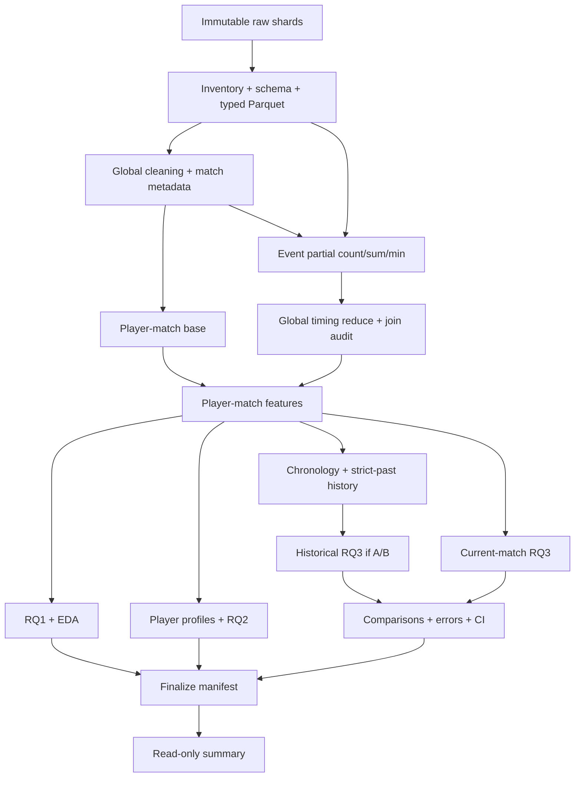

# Kế hoạch triển khai nghiên cứu khai phá dữ liệu PUBG

Kế hoạch chi tiết hiện hành: [notebook 00–06 theo phương án 2](#notebook-00-06-plan) và [notebook 07–12 theo audit](#notebook-07-12-plan). Mục 19–20 thuộc cùng kế hoạch chính; đặc tả nghiên cứu vẫn là nguồn quyết định ưu tiên.

**Ngày lập:** 24/09/2026  
**Căn cứ:** [PUBG_RESEARCH_SPEC.md](PUBG_RESEARCH_SPEC.md), phiên bản 3.0.  
**Trạng thái:** Kế hoạch triển khai; chưa phải kết quả thực nghiệm.  
**Quy trình:** Viết hoàn chỉnh code → kiểm thử → chạy Google Colab → khóa kết quả → tổng hợp báo cáo.  
**Thư mục code dự kiến:** `Project_PUBG/`; các đường dẫn triển khai bên dưới tương đối với thư mục này, trừ khi ghi khác.

## 1. Mục tiêu, phạm vi và cách sử dụng

Tài liệu chuyển đặc tả nghiên cứu thành công việc có thứ tự, đầu vào, đầu ra, phép kiểm tra và tiêu chí nghiệm thu. Đặc tả v3.0 vẫn là nguồn quyết định chính; không kế thừa thiết kế trong `kh.md` khi trái đặc tả. Không sửa đặc tả hoặc dữ liệu raw trong quá trình lập kế hoạch này.

Ba câu hỏi nghiên cứu giữ nguyên:

| RQ | Đơn vị phân tích | Mục tiêu | Bằng chứng phải có |
|---|---|---|---|
| RQ1 | Player-match | Quan hệ giữa hành vi, Combat Timing và survival/placement | Pearson, Spearman, phân tích theo mode, số quan sát và cảnh báo target-derived |
| RQ2 | Player profile hoặc player-mode profile | Tìm kiểu hành vi; so sánh outcome sau phân cụm | Chọn K không dùng outcome, độ ổn định, profile, C1–C5 |
| RQ3 | Player-match; history-to-current-match | Hồi quy survival/placement hồi cứu và dự đoán lịch sử khi hợp lệ | Baseline, S1/S2/P1/P2/P3, T0/T1, ablation, lỗi và bất định |

Đóng góp dự kiến là một nghiên cứu thực nghiệm có khả năng tái lập: kết hợp hành vi aggregate với thời điểm kill, tách hồi cứu khỏi dự đoán lịch sử, kiểm tra contribution bằng các so sánh có kiểm soát. Không tuyên bố đây là phương pháp mới đầu tiên trong toàn bộ tài liệu học thuật chỉ dựa trên ba paper.

Ngoài phạm vi core: association rules, spatial mining sâu, Elo/Glicko/TrueSkill, NDCG, deep learning, phân loại Top-N, mô hình censoring và suy luận nhân quả. Không thêm dashboard, API, framework điều phối hoặc experiment server khi notebook + file manifest đã đáp ứng yêu cầu.

**Cách làm:** thực hiện các gói W00–W13 ở mục 8; đánh dấu checklist khi đã có artifact và kiểm thử tương ứng. Toàn bộ code cần tồn tại trước full execution. Các quyết định phụ thuộc dữ liệu chỉ chốt ở execution gates, không điền số tùy ý để notebook chạy hết.

## 2. Hiện trạng đã kiểm tra và điều chưa biết

### 2.1. Bằng chứng cục bộ tại thời điểm lập kế hoạch

- Có `PUBG_RESEARCH_SPEC.md`, ba PDF trong `Paper/`, thư mục `Project_PUBG/` và dữ liệu đã giải nén trong `Data_PUBG/`.
- Có 5 file `aggregate/agg_match_stats_0.csv` đến `_4.csv` và 5 file `deaths/kill_match_stats_final_0.csv` đến `_4.csv`.
- Tổng kích thước 10 CSV là **20.281.921.579 byte**, khoảng **20,28 GB / 18,89 GiB**. Đây là kích thước file, không phải nhu cầu RAM.
- Header của cả 5 aggregate shard có cùng 15 tên cột; header của cả 5 death shard có cùng 12 tên cột.
- Mỗi shard mới được đọc header và dòng dữ liệu đầu tiên; chưa đếm toàn bộ dòng, tính checksum hay chứng nhận schema toàn bộ.
- Các dòng aggregate đầu có `date` dạng timestamp kèm `+0000`, ví dụ `2017-11-26T20:59:40+0000`; `match_mode` có giá trị `tpp`. Điều này cho thấy khả năng có chronology chi tiết, **chưa đủ để gán Grade A**.
- Một dòng death đầu có `killer_name == victim_name`. Vì vậy không được mặc định mỗi death row là một enemy kill hợp lệ.
- Chưa có thống kê chính thức về N matches, N players, tỷ lệ missing, chất lượng join, phân bố thời gian hoặc tính đầy đủ roster.

Trang [Kaggle của dataset](https://www.kaggle.com/datasets/skihikingkevin/pubg-match-deaths/data) đã được mở, nhưng nội dung động không cung cấp schema qua công cụ đọc trang. Schema sơ bộ ở đây lấy từ file cục bộ; không coi đó là xác minh dataset version hoặc license trên Kaggle.

### 2.2. Schema sơ bộ để viết contract

| Nhóm | Cột quan sát được | Vai trò |
|---|---|---|
| Aggregate identity/time | `date`, `match_id`, `player_name`, `team_id` | Thời gian, join, grouping; không làm predictor trực tiếp |
| Aggregate context | `game_size`, `match_mode`, `party_size` | Kiểm tra ngữ nghĩa; tách perspective và team size |
| Aggregate behavior | `player_assists`, `player_dbno`, `player_dist_ride`, `player_dist_walk`, `player_dmg`, `player_kills` | Combat, Movement, Support |
| Aggregate outcome | `player_survive_time`, `team_placement` | Target/nguồn target; quyền sử dụng theo task |
| Death core | `match_id`, `time`, `killer_name` | Combat Timing |
| Death audit | `victim_name`, `killed_by`, `killer_placement`, `victim_placement` | Kiểm tra event; placement không được lọt vào predictor |
| Death optional | `map`, `killer_position_x`, `killer_position_y`, `victim_position_x`, `victim_position_y` | Metadata/audit; không triển khai spatial mining core |

`game_size` phải kiểm chứng là số gì; không tự dùng nó thay `N_teams`. ID/team/name phải đọc dạng chuỗi khi cần để không mất định danh. Chuẩn hóa whitespace/case chỉ sau audit collision, giữ giá trị nguồn phục vụ đối chiếu.

## 3. Kế thừa ba bài báo một cách có kiểm soát

Đánh số paper bằng **L1/L2/L3**, tránh nhầm với experiment placement P1/P2/P3.

| Paper và vị trí đọc | Điều kế thừa | Điều không sao chép sang dự án |
|---|---|---|
| **L1 — Dehpanah et al. (2021)**, *Player Modeling using Behavioral Signals in Competitive Online Games*, §III–IV, PDF tr. 2–4 | Biểu diễn hành vi người chơi, tích lũy lịch sử trước trận, kinh nghiệm chơi và movement/combat | Paper tập trung solo, xếp hạng và NDCG so với rating systems. Dự án dùng thêm duo/squad, regression, clustering và event timing; không so metric trực tiếp |
| **L2 — Lee & Lee (2025)**, *A Study on the Factors Influencing Rank Prediction in PlayerUnknown’s Battlegrounds*, §3–4, PDF tr. 4–14 | Phân tích theo mode, redundancy/VIF, so sánh model, importance | Dataset 29 cột khác schema 15/12 cột ở đây. Không tạo giả `boosts`, `heals`, `weaponsAcquired`; không sao ngưỡng loại outlier, hyperparameter hay phần trăm performance |
| **L3 — Ghazali, Sanat & As’ari (2021)**, *Esports Analytics on PlayerUnknown’s Battlegrounds Player Placement Prediction using Machine Learning Approach*, §III–IV, PDF tr. 20–26 theo số trang in | Quy trình feature analysis → selection → model comparison; cân bằng lỗi và thời gian huấn luyện | Paper dùng 5 tập, mỗi tập 6.000 dòng, và holdout 25%. Dự án không dùng thiết kế sample này làm official full-data result |

Các lưu ý cần đưa vào `reports/appendix/literature_mapping.md`:

1. “Walking ratio” của L1 là distance tích lũy / số trận; `walk_ratio` của đặc tả là walk / total distance. Tên gần nhau nhưng công thức khác.
2. L1 gọi kills/damage là “firing accuracy”; dữ liệu dự án không có số phát bắn/trúng đạn. Không gọi damage/kill hoặc kills/damage là độ chính xác bắn thực đo.
3. `normalized_placement` của dự án dùng số team đã xác minh; không đồng nhất với `winPlacePerc` của dataset khác vốn có quy ước denominator riêng.
4. Không suy ra R² của regression tree một biến bằng Pearson r² nói chung. Tính Pearson, Spearman và heldout R² bằng các hàm riêng.
5. Không dùng phần trăm từ paper làm tiêu chí “phải đạt”. So sánh định tính chỉ hợp lệ sau khi nêu khác biệt dataset, cohort, split, target và metric.
6. RQ2 clustering và Combat Timing là thiết kế của dự án; không ghi như kết quả đã được cả ba paper chứng minh.

## 4. Những điểm cần làm rõ trước khi khóa feature và protocol

Các mục dưới đây là cách triển khai thận trọng các quy tắc của đặc tả, không thêm RQ. Ghi thành `decision_log.csv` với `decision_id`, căn cứ đặc tả, lựa chọn, evidence, thời điểm và artifact bị ảnh hưởng.

### D01 — Combat Timing có phụ thuộc survival gián tiếp

`estimated_match_duration = max(player_survive_time)` là một node phụ thuộc outcome. Các phase count/ratio dùng duration này thừa hưởng phụ thuộc survival, dù tên feature không chứa chữ survival.

- Xây và giữ đầy đủ timing features theo đặc tả để mô tả hồi cứu và dùng cho placement khi hợp lệ.
- S1 an toàn không dùng duration proxy và các phase descendants này. Timing tuyệt đối như first/average kill time, event count và `has_kill` chỉ được dùng nếu không lọc/clip/tính missing của chúng bằng survival của chính row.
- T0/T1 cho survival phải ghi rõ T1 dùng **timing subset an toàn**, không phải toàn bộ phase features. So sánh timing đầy đủ ưu tiên placement.
- RQ1 với survival: phase features theo proxy chỉ là diagnostic có cờ coupling; không dùng làm bằng chứng chính độc lập với survival.
- RQ2: giữ Design 3 và phase ratios như đặc tả, nhưng ghi đây là behavioral profile có chuẩn hóa bằng proxy hậu trận; không gọi clustering hoàn toàn độc lập với mọi thông tin outcome. Thêm kiểm tra độ nhạy bỏ các duration-derived timing features nếu chúng chi phối kết quả; không chọn phương án dựa trên cluster survival/placement.
- Không tự chuyển sang ngưỡng phút tuyệt đối hoặc nguồn duration khác để “sửa” mà không version feature và ghi quyết định.

### D02 — P2 bỏ survival trực tiếp chưa có nghĩa loại mọi thông tin survival

Theo định nghĩa đặc tả, P1 và P2 chỉ khác cột `player_survive_time`. Nếu bộ feature chung còn kills/minute, velocities hoặc timing theo duration proxy, kết quả chỉ đo **giá trị bổ sung của cột survival trực tiếp**.

Giữ so sánh P1/P2 đúng đặc tả. Registry xuất danh sách survival-derived còn lại, caption ghi giới hạn. Có thể chạy sensitivity `P2_NO_SURVIVAL_DESCENDANTS` đã đăng ký trước test; đây là bổ sung diễn giải, không thay P2 hoặc tăng số RQ.

### D03 — N_teams và duration cần roster trước khi lọc cohort theo task

Tính metadata trên roster đã kiểm tra keys/duplicates và validity trường liên quan, trước khi loại row vì missing feature/target khác. Không tính lại `N_teams` trên riêng cohort của S1 hoặc P1.

Giữ `observed_team_count`, `max_observed_placement`, số team thiếu ID và cờ incomplete/conflict. Không sửa placement, ép vào [0,1] hoặc thay denominator để làm mất lỗi. Nếu roster không đủ đáng tin, normalized placement của match bị đánh dấu không hợp lệ; survival có thể còn dùng nếu đáp ứng contract riêng.

### D04 — Thứ tự trận chưa đủ: phải biết lúc thống kê đã sẵn sàng

Kiểm tra timestamp là bắt đầu, kết thúc hay thời điểm ghi log. History chỉ dùng trận trước đã hoàn thành/đã có thống kê tại thời điểm dự đoán. Timestamp có giây nhưng không rõ ngữ nghĩa không tự động được Grade A.

Nếu cùng timestamp không có thứ tự tin cậy, gom tie block và dùng strictly earlier block; không dùng `match_id` hoặc thứ tự file để bịa chronology. Grade B dùng ngày trước, loại toàn bộ cùng ngày. Nếu không có quy tắc quá khứ an toàn, Grade C chặn S2/P3.

### D05 — Outcome-dependent EDA không được mở final test sớm

Tạo split manifest sau DQ/chronology sơ bộ ở notebook 02, trước relationship EDA. DQ có thể kiểm tra toàn bộ dữ liệu để áp dụng contract đã định nghĩa; không dùng quan hệ feature–target hay test error để quyết định model.

Notebook 05/06 dùng train/development cho phân tích ảnh hưởng đến feature/model; có thể hoàn thiện bảng mô tả full valid data sau khi khóa lựa chọn ở 11. Mỗi bảng ghi `analysis_scope`. Full-data policy nghĩa xử lý đủ dữ liệu hợp lệ, không có nghĩa dùng test để chọn thiết kế.

### D06 — `hist_kd` cần số lần chết thực sự được xác minh

Không đặt `hist_kd = kills / games` rồi gọi K/D; không suy mọi player trong team thắng đều sống. Nếu death records chưa đủ bao phủ/không xác minh được death denominator, giữ feature ở `candidate` hoặc `excluded` với lý do. Core historical averages vẫn chạy. Nếu được xác minh: dùng past total kills / past observed deaths, denominator 0 là missing có cờ, không cộng epsilon tùy ý.

### D07 — Không có event khác với không kill

Row có `player_kills > 0` nhưng không join được event là thiếu dữ liệu sự kiện; không gán timing như một trận không kill. Ghi coverage và discrepancy riêng. `has_kill` phản ánh nguồn đã chọn, `event_kill_count` phản ánh event hợp lệ; không trộn hai khái niệm khi có bất đồng.

### D08 — Trạng thái blocked phải thống nhất

Registry dùng enum tổng `status = blocked`, kèm `reason_code = blocked_by_chronology` cho S2/P3 Grade C. Summary hiển thị nguyên nhân cụ thể. Không gán 0 vào metric, không chuyển blocked thành completed để qua finalization.

## 5. Kiến trúc triển khai và công cụ

### 5.1. Tổ chức thư mục

```text
Project_PUBG/
  README.md
  requirements.txt
  configs/                     # 10 file theo đặc tả
  notebooks/                   # 00 đến 12
  src/
    data/                      # source, contract, cleaning, metadata, checkpoint
    features/                  # một định nghĩa chuẩn cho mỗi feature
    analysis/                  # EDA, RQ1, mode, clustering
    models/                    # baselines, training, các estimator cần dùng
    evaluation/                # metrics, bootstrap, ablation, errors
    utils/                     # config, logging, runtime, hashing
  tests/                       # synthetic, leakage và resume tests
  data/{raw,interim,processed}/
  artifacts/{checkpoints,experiments,manifests,models,metrics,logs}/
  figures/
  reports/{tables,appendix}/
```

`paths.yaml` ánh xạ các logical roots sang local/Colab/persistent storage. Không tạo thêm một bản raw 20 GB chỉ để khớp cấu trúc; local có thể trỏ `raw_root` đến `../Data_PUBG`. Tên thư mục `storage/` trong đặc tả biểu diễn vai trò lưu trữ, không bắt buộc nhân đôi cây `data/`.

### 5.2. Stack tối thiểu

| Nhu cầu | Công cụ dự kiến | Quy tắc sử dụng |
|---|---|---|
| Scan/join/group/sort | DuckDB | SQL theo stage, memory/temp directory cấu hình được |
| Lưu và đọc batch | Parquet, PyArrow | Không collect toàn raw vào pandas |
| Bảng nhỏ và tính toán | pandas, NumPy | Summary/profile/matrix chỉ khi vừa RAM |
| Models và clustering | scikit-learn | Baselines, LinearRegression/SGDRegressor, KMeans/MiniBatchKMeans, RF/HGB khi khả thi |
| Diagnostic/statistics | SciPy; statsmodels chỉ nếu cần VIF implementation | Không tự viết lại thuật toán chuẩn |
| Biểu đồ | Matplotlib, seaborn | Lưu source table và caption |
| Cấu hình | PyYAML; stdlib pathlib/json/hashlib/logging | Không framework config riêng |
| Notebook và tests | Jupyter/nbformat; unittest hoặc pytest nếu đã dùng | Tests nhỏ, tập trung invariant nghiên cứu |
| Model tùy chọn | XGBoost | Chỉ thêm khi resource gate chứng minh có thể chạy full training cohort |

DuckDB hỗ trợ xử lý lớn hơn RAM cho nhiều toán tử nhưng vẫn có truy vấn tốn bộ nhớ; cần giới hạn RAM, temp disk và chia stage có checkpoint. [Tài liệu DuckDB](https://duckdb.org/docs/current/guides/performance/how_to_tune_workloads).

Streaming model cần cả batch reader, preprocessing và estimator cập nhật theo batch; `SGDRegressor`, `MiniBatchKMeans`, `StandardScaler` là các lựa chọn có incremental API. Không giả định mọi estimator hoặc scaler đều hỗ trợ `partial_fit`. [scikit-learn: out-of-core learning](https://scikit-learn.org/stable/computing/scaling_strategies.html).

Version package được pin sau setup Colab thành công; không copy API GPU cũ từ paper hoặc mặc định cài “latest” khi tái lập final run.

### 5.3. Ba tầng provenance

1. **Data:** source checksums → schema/cleaning versions → processed dataset version.
2. **Research:** split manifest → decision log → feature registry → experiment config hash.
3. **Results:** predictions/metrics → comparisons/figures → final manifest → read-only summary.

Một artifact không truy được cả ba tầng không đủ điều kiện làm kết quả chính thức.

## 6. Data contracts và feature contracts

### 6.1. Bảng dữ liệu

| Dataset | Grain/key | Nội dung bắt buộc | Invariant |
|---|---|---|---|
| `validated_aggregate` | Raw lineage row; key player-match khi identity đủ | Giá trị nguồn/canonical, reason flags | Không còn duplicate identity conflict chưa xử lý trong cohort hợp lệ |
| `match_metadata` | `match_id` | Time, modes, roster counts, N_teams, duration proxy, completeness | Một dòng/match; không phụ thuộc task filtering |
| `combat_timing` | `(match_id, killer_name)` sau canonical mapping | Count/sum/min, phase counts, coverage | Một dòng/key sau global reduce |
| `player_match_features` | Player-match; row ID cho dòng thiếu name | Behavior, timing, target, flags, lineage | Left join không tăng số row; feature formula/version rõ |
| `player_profile_features` | Player hoặc player-mode | Design 3, reliability denominators, outcome tách vai trò | Không input outcome, không gộp missing name thành một người |
| `historical_player_match_features` | Current player-match | Strict-past features, depth, availability, target | Max source availability < current prediction time theo grade |
| `split_assignments` | `match_id` | train/validation/test, cutoff, grade, version | Mỗi match thuộc đúng một split |

Row thiếu `player_name` có thể giữ cho RQ1/current modeling nếu các trường cần thiết đủ; dùng ID nguồn `(source_file, source_row)` cho lineage. Không join timing/history/profile bằng một tên `UNKNOWN` chung.

### 6.2. Registry và quyền sử dụng

Giữ toàn bộ metadata ở đặc tả §11; bổ sung `depends_on`, `availability`, `missing_indicator`, `aggregation_denominator` để kiểm tra transitive dependencies. Không cần xây framework đồ thị: dictionary + kiểm tra dependency closure là đủ.

| Nhóm feature | RQ1 survival | RQ2 input | S1 | Placement hồi cứu | Historical input |
|---|---|---|---|---|---|
| Raw kills/damage/walk/ride/assists/DBNO | Cho phép | Aggregate theo Design 3 | Cho phép | Cho phép | Past aggregate |
| Total distance, walk ratio, damage/kill, assist ratio | Theo contract | Chỉ feature được chọn | Cho phép nếu không phụ thuộc target | Cho phép | Optional nếu registry xác nhận |
| Kills/minute, damage/minute, velocities | Diagnostic, không primary | Không thuộc Design 3 | Cấm | Có thể dùng; ghi survival coupling | Không tự thêm |
| Survival trực tiếp | Target | Outcome-only | Cấm | Chỉ P1 | Past survival cho S2/P3 được phép |
| Placement và descendants | Outcome hoặc diagnostic riêng | Outcome-only | Không đưa vào bộ behavior chính | Cấm | Past placement được phép |
| First/avg kill time tuyệt đối, has_kill | Cho phép với giới hạn hồi cứu | Chỉ Design 3/candidate đã chốt | Theo D01 | Cho phép | Timing history optional |
| Phase timing theo duration proxy | Diagnostic có coupling | Design 3, disclosure D01 | Cấm theo D01 | Cho phép | Chỉ từ trận trước nếu mở extension |
| IDs, source order, raw timestamps | Audit/group/split | Không input | Không input | Không input | Điều phối chronology, không raw predictor |

Ablation xóa một nhóm phải xóa toàn bộ feature có dependency vào nhóm đó, kể cả cross-group feature. Ví dụ `damage_per_kill` phụ thuộc Combat, `assist_ratio` phụ thuộc Support và Combat. Giữ group hiển thị nhưng dùng `depends_on` cho removal thực tế.

### 6.3. Missing và công thức

- `damage_per_kill`: denominator kills = 0 → NaN.
- `assist_ratio`: kills + assists = 0 → NaN.
- `walk_ratio`: total_distance = 0 → NaN mặc định chờ quyết định EDA; không fill 0 ngầm.
- Rates theo survival: survival <= 0 → NaN; không chia epsilon.
- No-kill xác nhận: count = 0; first/avg time và phase ratios = NaN.
- Event coverage lỗi: giữ missing reason riêng; không đổi thành no-kill.
- Imputation chỉ xảy ra ở model/profile transform sau lưu semantics; indicator phải đi cùng feature set và bị xóa trong ablation tương ứng.
- Feature toàn missing/constant trên train: ghi lý do exclude; không học cách xử lý từ test.

## 7. Config, quyết định dữ liệu và các cổng kiểm tra

### 7.1. Trách nhiệm của 10 config

| File | Nội dung | Thời điểm chốt |
|---|---|---|
| `data.yaml` | Dataset slug, archive/shard URLs, local source, patterns, checksums | Trước ingest; không điền URL chưa có |
| `schema.yaml` | Required/optional fields, aliases, dtypes, units, key rules | Sơ bộ lúc code; xác nhận sau inventory |
| `paths.yaml` | Ephemeral/persistent/raw/processed/artifacts/temp paths | Notebook 00 |
| `preprocessing.yaml` | Duplicates, invalid policies, mode mappings, time parsing | Sau DQ trước publish cohort |
| `features.yaml` | Registry/formulas/phase boundaries/task membership | Công thức theo spec; feature sets sau EDA/validation |
| `eda.yaml` | Chart catalog, bins, plotting/diagnostic samples | Không dùng test để chọn bins có ảnh hưởng model |
| `rq2.yaml` | Profile scope, mode strategy, min games, K, scaler, sensitivities | Sau EDA và clustering diagnostics |
| `rq3.yaml` | Split, history threshold, experiment matrix, evaluation protocol | Split trước EDA outcome; các lựa chọn còn lại trước test |
| `models.yaml` | Candidates, search spaces, resource limits, final params | Candidate code trước; final params theo validation |
| `runtime.yaml` | development/full, seed, batches, memory, checkpoint settings | Theo tài nguyên; actual values được log |

### 7.2. Các tham số phải để null khi viết code

| Tham số | Bằng chứng dùng để chốt | Không được dùng |
|---|---|---|
| `chronology_grade` | Timestamp semantics, precision, collisions, missing, availability | Hình thức chuỗi timestamp đơn thuần |
| Split cutoffs/ratios | Time coverage, match counts, dữ liệu đủ mỗi split | Test score |
| `minimum_games_threshold` | Retention + stability cho 5/10/20/50 | Outcome giữa cluster |
| `minimum_history_threshold` | Coverage + stability trên development | Test MAE |
| `mode_strategy` | Behavioral distributions theo mode | Chọn theo outcome đẹp nhất sau clustering |
| `n_clusters` | Elbow, silhouette, DB, stability, behavioral interpretability | Survival/placement |
| Log/outlier rules | Distribution, validity evidence, train/validation | Loại extreme chỉ để metric tốt |
| Final feature set/model/params | Leakage review và validation | Final test |
| Hierarchical sample size, batch size | Memory/time diagnostics | Ngầm biến official run thành sample |

`random_state: 42` là mặc định kỹ thuật hợp lệ. Candidate lists/search spaces có thể được viết trước; không đồng nghĩa đã chọn final value.

### 7.3. Gates

- **G0 — Code ready:** toàn bộ pipeline/notebook/config/tests/README tồn tại; synthetic tests pass.
- **G1 — Source ready:** đủ shard, checksum/schema/units/source metadata; không có lỗi critical chưa xử lý.
- **G2 — Cohort và split ready:** roster/target valid, chronology xác định, split manifest khóa trước relationship EDA.
- **G3 — Research decisions ready:** mode, thresholds, candidate feature/scaling rules có evidence; K được chốt sau diagnostics ở 07.
- **G4 — Test access ready:** chọn model/params bằng validation; đăng ký đủ paired comparisons, ablation và error bins.
- **G5 — Results ready:** artifact full hợp lệ, provenance khớp, exceptions có lý do, final manifest khóa.

Gates là validation và decision records trong workflow; không yêu cầu coding agent dừng hỏi phép cho từng bước đã được giao. Khi thực thi gặp tham số nghiên cứu chưa đủ căn cứ, notebook dừng có hướng dẫn thay đúng config và có thể chạy lại idempotently.

## 8. Work breakdown: từng gói triển khai

Các gói dưới đây là **công việc viết code trước**, kèm cách nghiệm thu khi chạy sau. Không dùng việc một notebook đã được tạo làm bằng chứng stage dữ liệu đã hoàn thành.

### W00 — Chốt hợp đồng nghiên cứu và môi trường tối thiểu

**Phụ thuộc:** đặc tả, schema sơ bộ, mapping paper.

- [ ] Ghi `spec_version`, checksum đặc tả và plan vào metadata dự án; chỉ có một đặc tả canonical.
- [ ] Kiểm tra nội dung hiện hữu trong `Project_PUBG/` trước khi viết; tái sử dụng phần tương thích, không ghi đè công việc người dùng.
- [ ] Tạo cấu trúc thư mục ở mục 5; chỉ thêm module khi có trách nhiệm cụ thể.
- [ ] Viết 10 config với required keys và null đúng chỗ.
- [ ] Tạo feature registry ban đầu; mọi feature còn chưa xác minh là `candidate`, không mặc định `confirmed`.
- [ ] Tạo `decision_log.csv`, `literature_mapping.md` và bảng traceability mục 14.
- [ ] Viết environment check: Python/packages, CPU/RAM/disk/GPU, quyền ghi, persistent backend.
- [ ] Viết `.gitignore` cho raw, large outputs, token và temporary files.

**Module:** `src/utils/config.py`, `runtime.py`, `logging.py`, `hashing.py`, `src/features/registry.py`.

**API dự kiến:** `load_config(config_dir)`, `validate_config(cfg, stage)`, `collect_runtime_info()`, `resolve_paths(cfg)`.

**Nghiệm thu:** config sai kiểu/path thiếu bị báo sớm; null nghiên cứu không bị thay bằng default ngầm; import core không cần Colab hoặc GPU. Source URL null không ngăn development fixture/local input nhưng chặn download không có nguồn.

### W01 — Manifest, checkpoint và khả năng chạy lại

**Phụ thuộc:** W00. Làm sớm vì mọi stage dài cần dùng cùng cơ chế.

- [ ] Viết metadata/checkpoint schema theo đặc tả §42–46, §53.
- [ ] Tính signature từ source fingerprints, config liên quan, schema/feature/pipeline versions và upstream signatures.
- [ ] Viết output vào staging path; xác minh row count/schema/checksum; chỉ publish manifest completed sau khi file bền vững đã đủ.
- [ ] Tách manifest `running` với commit hoàn chỉnh; process chết không để output dở được load như completed.
- [ ] Resume theo input shard/part ID ổn định và completion records; không dựa vào số dòng progress in ra màn hình.
- [ ] Cho phép invalidation theo dependencies và tạo run/version mới; không ghi đè final run đã khóa.
- [ ] Lưu structured logs: stage/time/input/output/counts/warnings/config/version và memory/disk nếu đo được.
- [ ] Sync persistent từng checkpoint đã hoàn tất; xác minh lại trước khi đánh dấu có thể restore.

**Module:** `src/data/checkpoints.py`, `src/data/io.py`, `src/utils/logging.py`.

**API:** `checkpoint_is_compatible(stage, signature)`, `commit_checkpoint(...)`, `invalidate_descendants(stage)`, `restore_checkpoint(...)`.

**Artifacts:** `artifacts/checkpoints/checkpoint_manifest.json`, `_metadata.json` trong dataset, `run_metadata.json` theo run.

**Nghiệm thu:** ngắt sau một part, chạy lại không duplicate; thay phase formula làm downstream stale; file tồn tại nhưng manifest chưa completed không được dùng. Không xây scheduler, message queue hay database server cho chức năng này.

### W02 — Download, inventory và schema validation

**Phụ thuộc:** W00–W01.

- [ ] Hỗ trợ local raw path, archive public URL hoặc danh sách shard URLs như đặc tả; không bắt buộc tải lại bản local.
- [ ] Download vào `.part`, kiểm tra response/size/checksum rồi publish; reject HTML/login page giả CSV/ZIP.
- [ ] Giải nén trong target directory đã xác định; chặn archive entry thoát thư mục; không sửa raw.
- [ ] Discover toàn bộ file theo patterns, sort danh sách ổn định; không hard-code chỉ 10 file hoặc coi 5 shard là 5 thí nghiệm.
- [ ] Ghi source URL/download date/version nếu xác minh được; file local không rõ ngày tải thì null, không lấy mtime làm ngày tải chắc chắn.
- [ ] Hash nội dung và parse-count toàn shard theo streaming. Không dùng số newline làm row count CSV nếu parser có thể gặp quoted newline.
- [ ] Inspect header tất cả shard; explicit cast, alias mapping có kiểm soát, parse-error counts; không bỏ dòng lỗi im lặng.
- [ ] Ghi schema drift/missing required column; optional thiếu chỉ disable feature phụ thuộc.
- [ ] Xác minh đơn vị time/distance từ tài liệu nguồn và consistency; chưa xác minh thì ghi unresolved, chặn phép đổi đơn vị có ý nghĩa nghiên cứu.

**Module:** `download_data.py`, `inventory.py`, `schema.py`, `io.py` trong `src/data/`.

**API:** `inventory_sources(source_cfg)`, `validate_schema(inventory, schema_cfg)`, `convert_shard_to_parquet(...)`.

**Artifacts:** `source_inventory.json`, `schema_report.json`, Parquet staging theo shard, parse error summary.

**Nghiệm thu:** inventory liệt kê mọi file nguồn, byte size, checksum, parser row count, schema/dtypes và trạng thái; số row parse hợp lệ + rejected reconcile với tổng record theo quy ước đã ghi. Development artifact gắn nhãn rõ, không thay manifest full.

### W03 — Cleaning, identity, roster, chronology và split sơ bộ

**Phụ thuộc:** W02.

- [ ] Audit exact duplicates và duplicate player-match xuyên shard, không chỉ trong từng chunk.
- [ ] Với duplicate key khác giá trị: giữ conflict record; chỉ resolve bằng rule có evidence, không dùng `drop_duplicates(keep='first')` tùy thứ tự file.
- [ ] Audit missing IDs/names, whitespace/case/encoding và collision khi canonical hóa.
- [ ] Validate số hữu hạn, counts nguyên không âm, distance/time không âm; extreme hợp lệ được giữ.
- [ ] Tách structural missing, parse-error missing, unavailable source và ambiguous identity.
- [ ] Tạo match roster trước task-specific filtering; xác minh placement nhất quán trong `(match_id, team_id)`.
- [ ] Tính `N_teams`, duration proxy, time/mode consistency; lưu completeness flags theo D03.
- [ ] Audit chronology: nulls, parse/timezone, precision, ties, match timestamp conflicts, same-player overlaps, ngày có nhiều trận, semantics availability.
- [ ] Gán Grade A/B/C kèm evidence; nếu grade chỉ đúng một cohort, ghi coverage/exclusion chính xác, không nâng grade toàn bộ dataset.
- [ ] Chốt split từ match metadata trước outcome relationship EDA. Grade B không chia một ngày qua hai split; Grade A không xé tie block.
- [ ] Grade C dùng deterministic group split theo match; S2/P3 blocked theo D08.
- [ ] Ghi removal log theo thứ tự; lý do loại của task riêng nằm trong cohort ledger để tránh đếm hai lần.

**Module:** `cleaning.py`, `match_metadata.py`, `src/features/historical.py` cho `validate_chronology()`, `src/models/splits.py` cho split dùng chung.

**Artifacts:** `match_metadata.parquet`, `chronology_report.json`, `identity_audit.csv`, `removal_log.csv`, `split_manifest.json`, `split_assignments.parquet`, `data_quality_summary.csv`.

**Nghiệm thu:** mọi match có đúng một split; metadata không thay đổi khi lọc S1/P1; thiếu chronology không chặn RQ1/current-match. Split version thay đổi làm model outputs stale.

### W04 — Behavioral features và player-match base

**Phụ thuộc:** W03 và feature registry.

- [ ] Triển khai Combat, Movement, Support, placement đúng công thức đặc tả §7, §12–14.
- [ ] Tính normalized placement bằng metadata đã khóa: `1 - (placement - 1)/(N_teams - 1)`.
- [ ] `N_teams <= 1`, nonfinite denominator, placement ngoài bounds hoặc roster invalid → flag/reject cho placement, không clip để qua test.
- [ ] Lưu rates target-derived nhưng đặt quyền theo registry, không xóa vì cần diagnostics.
- [ ] Không giữ đồng thời walk_ratio và ride_ratio như hai main features; `dbno_ratio` và team features không tự thêm core.
- [ ] Giữ raw outcomes cùng dataset nhưng model luôn nhận explicit allowlist, không chọn mọi cột numeric.
- [ ] Lưu validity per task: một lỗi placement không tự loại row khỏi survival nếu survival vẫn hợp lệ.
- [ ] Export partitioned Parquet theo numbered parts/buckets, không partition mỗi player/match.

**Module:** `src/features/combat.py`, `movement.py`, `support.py`, `placement.py`.

**Artifacts:** `data/interim/player_match_base/`, `feature_validation_base.csv`, dataset metadata.

**Nghiệm thu:** unique identity keys khi đủ identity; các ratios đúng range/NaN semantics; cùng dữ liệu chia chunk khác nhau cho cùng kết quả; targets không lọt vào allowed feature sets.

### W05 — Combat Timing và join audit

**Phụ thuộc:** W03–W04.

- [ ] Kiểm tra event key từ schema thật. Không deduplicate bằng `(match_id, killer_name, time)` vì hai kill hợp lệ có thể cùng giây.
- [ ] Audit exact/replayed rows, self-kills, environment deaths, unnamed killer và kill cause. Quy tắc enemy-kill eligibility cần evidence; event không rõ semantics được flag.
- [ ] Chuẩn hóa `time` thành event time theo đơn vị đã xác minh.
- [ ] Tách statistics timing tuyệt đối khỏi phase statistics dùng duration, để D01 thực thi được.
- [ ] Với phase hợp lệ: Early `[0,1/3)`, Mid `[1/3,2/3)`, Late `[2/3,1]`; negative/out-of-range/invalid proxy phải được audit, không clip.
- [ ] Từng chunk sinh count, sum time, min time, phase counts theo `(match_id, killer_name)`.
- [ ] Global reduce across tất cả shard: cộng sums/counts, lấy min toàn cục; avg = sum/count.
- [ ] Lưu event total count và phase-valid count riêng nếu tồn tại event chưa gán phase. Không báo phase ratios cộng bằng 1 nếu denominator chứa event bị loại chưa công bố.
- [ ] Khóa policy cho out-of-range sau audit; chỉ rows/timing fields đáp ứng policy mới vào comparison cohort.
- [ ] Left join timing vào base; validate many-to-one, cùng row count trước/sau.
- [ ] So event count với aggregate kills theo phân bố discrepancy; không yêu cầu equality tuyệt đối khi chưa hiểu source.
- [ ] Xuất matched/unmatched killer, victim, match; phân biệt join rate theo event và coverage theo player-match.
- [ ] Publish `player_match_features` và registry confirmed/excluded; không báo timing “sẵn có trước trận”.

**Module:** `src/features/combat_timing.py`; checkpoint helpers tái sử dụng W01.

**Artifacts:** event partials, `combat_timing/`, `event_join_audit.csv`, `kill_discrepancy.csv`, `player_match_features/`.

**Nghiệm thu:** chunk size không ảnh hưởng count/min/avg ngoài tolerance float; resume không đếm hai lần; structural no-kill khác event missing; join không nhân bản row; mọi phase descendant có lineage tới duration proxy.

### W06 — EDA đủ tám pha và decision log

**Phụ thuộc:** W05; split đã khóa.

| Pha | Phép tính | Output và quyết định |
|---|---|---|
| 1. Structural | N rows/matches/players/teams, date coverage, mode, games/player, N_teams | Bảng dataset overview; xác định coverage và phân bố quan sát |
| 2. Quality | Missing theo nguyên nhân, duplicate, invalid, outliers, identity, joins | DQ report; xử lý unresolved critical errors |
| 3. Raw | Mean/median/std/skew/zero rate, quantile, hist/box | Transform candidates, valid extremes |
| 4. Derived | Bounds, NaN/Inf, denominator support | Feature validity; exclude/correct lỗi công thức có version |
| 5. Mode | Behavioral distributions Overall/Solo/Duo/Squad và perspective nếu có | Mode strategy cho profile/model; không dựa trên outcome separation |
| 6. Relationships | Pearson/Spearman theo target và mode | Bộ feature candidates từ development; gắn target-derived flags |
| 7. Timing | Counts/ratios/first kill, coverage, timing theo mode/placement | Event interpretation, H01–H07, coupling notes |
| 8. History feasibility | Chronology, depth, same-day collisions, feature stability | Grade xác nhận; min-history diagnostics, khả năng S2/P3 |

- [ ] Tính statistics trên toàn valid cohort thuộc scope đã khai báo, không dùng development sample thay full statistics.
- [ ] Cung cấp view `development` và `full_descriptive_locked` để thực hiện D05. Bảng full-descriptive xuất sau khóa không được dùng quay lại chọn model.
- [ ] Pearson có thể dùng sufficient statistics theo batch; Spearman dùng external rank/sort với average ranks cho ties, không average Spearman của các chunk.
- [ ] Exact quantile/median cho con số chính thức dùng disk-backed query nếu cần; diagnostic approximate phải ghi phương pháp và giới hạn.
- [ ] Log numeric pair count và missing denominator cho từng association; constant feature trả NA có lý do.
- [ ] Chạy variance/sparsity và redundancy diagnostics trên development. VIF chỉ dùng numeric subset đã xử lý missing, không đưa target hoặc đồng thời các deterministic descendants vào như predictors độc lập; không tự xóa mọi feature vượt một ngưỡng VIF.
- [ ] Chỉ dùng sample để vẽ/diagnostic với seed, n, sampling rule và caption.
- [ ] Mọi quyết định về mode, transform, outlier và thresholds ghi evidence table + config hash.

**Module:** `eda.py`, `correlation.py`, `mode_analysis.py` trong `src/analysis/`.

**Nghiệm thu:** đủ 8 pha; registry/decision log chỉ ra giá trị đã chốt và còn null; chưa có metric test dùng cho lựa chọn; thống kê cross-chunk khớp fixture tính một lần.

### W07 — RQ1: phân tích quan hệ hành vi

**Phụ thuộc:** W06; registry RQ1 đã kiểm tra.

- [ ] Dựng task-specific feature set cho từng outcome, không dùng một heatmap unrestricted làm bằng chứng chính.
- [ ] Xuất Pearson/Spearman Overall và theo mode khi đủ dữ liệu.
- [ ] Viết `rq1_relationship_summary.csv` với feature, group, outcome, mode, n, coefficients, valid-primary, target-derived và notes.
- [ ] Trình bày effect size, dấu, consistency theo mode; không xếp “quan trọng” bằng p-value rất nhỏ khi N lớn.
- [ ] Tách absolute timing khỏi phase timing có duration coupling theo D01.
- [ ] Tạo bảng interpretation có liên kết figure/table, population, confounders và giới hạn observation time.
- [ ] Khóa lựa chọn có ảnh hưởng RQ3 trước khi xuất full-descriptive version sau test protocol lock.

**Module:** `src/analysis/rq1.py`, tái sử dụng correlation/plots.

**Nghiệm thu:** từng kết luận truy được bảng và scope; feature chứa survival không là primary evidence với survival; ngôn ngữ chỉ association, không causal.

### W08 — RQ2: profile, clustering và robustness

**Phụ thuộc:** W06–W07 theo thứ tự thực thi của đặc tả.

- [ ] Xây profile Design 3 đúng §17: mean/std combat; mean walk/ride/walk_ratio; assists/DBNO/assist_ratio; timing ratios; early-combat match ratio.
- [ ] `std` phải có quy ước ddof và trường hợp chỉ một quan sát; lưu n quan sát hợp lệ của mỗi thống kê.
- [ ] `avg_*_kill_ratio` là mean trên kill-active matches có timing hợp lệ, không bằng tổng phase kills/tổng kills trừ khi đặt tên feature khác.
- [ ] Định nghĩa `early_combat_match_ratio`: số trận có ≥1 early kill / số trận có khả năng xác định early-kill status; khi coverage đầy đủ denominator là games_played. Lưu denominator và coverage để tránh coi thiếu event là zero.
- [ ] Giữ `kill_active_matches`, `support_active_matches`, `timing_observed_matches`; `games_played` dùng filter, không input main C1.
- [ ] Chẩn đoán min games 5/10/20/50 theo retention/stability; không tự chọn 10 từ paper.
- [ ] Chốt overall/per-mode/player-mode từ mode EDA. Nếu phân tích per-mode, mỗi mode có run_id, scaler và K riêng nếu đã đăng ký.
- [ ] Giữ outcome table tách khỏi ma trận clustering; tên cluster được đặt sau khi xem behavioral centers.
- [ ] Với descriptive RQ2, dùng profile từ giai đoạn development để chọn representation/K; sau khóa có thể fit toàn eligible profiles cho bản phân cụm mô tả full data. Ghi rõ bản full fit là descriptive, không heldout generalization.
- [ ] Nếu báo heldout clustering: scaler/centroids fit trên development, assign heldout mà không refit; không trộn metric của hai quy trình.
- [ ] Main scaling StandardScaler; RobustScaler và log transform chỉ sensitivity theo quyết định có căn cứ.
- [ ] KMeans full profiles nếu khả thi; MiniBatchKMeans phải stream toàn eligible profile set và ghi đúng tên thuật toán.
- [ ] Candidate K range được cấu hình sau profile count/compute audit; log inertia, silhouette, Davies–Bouldin, sizes và stability trên cùng reference set.
- [ ] Stability qua seeds và/hoặc profile resampling, so label bằng ARI trên common profiles; không so cluster number trực tiếp.
- [ ] C2 hierarchical full nếu khả thi; nếu subset/centroids thì ghi supporting diagnostic, không gọi full-data validation.
- [ ] C3 có/không games_played; C4 sensitivity min-games; đối chiếu common profiles, ghi coverage khi cohort khác.
- [ ] C5 outcome comparison chỉ sau khi khóa input/K/labels; không đặt tên “best players” vì outcome cao.
- [ ] Kiểm tra sensitivity D01 nếu duration-derived timing chi phối; mọi diagnostic sample có n/seed/rule.

**Module:** `src/features/profiles.py`, `src/analysis/clustering.py`.

**Artifacts:** profiles, assignments, centers raw/standardized, size table, K diagnostics, robustness, `cluster_profile.csv`, outcome table.

**Nghiệm thu:** C1–C5 có result hoặc status/lý do; không outcome trong clustering matrix; min games và K không dựa outcome; full fit thật sự thấy toàn eligible profiles; tên cluster dựa evidence hành vi.

### W09 — Historical features và kiểm chứng thời gian

**Phụ thuộc:** W05–W06; chronology đã xác nhận. Không lấy profile RQ2 toàn thời gian làm history cho RQ3.

- [ ] Grade C: xuất blocked records cho S2/P3, không tạo fake history hoặc sort bằng file order.
- [ ] Grade A: partition theo stable player hash nếu cần; sort theo verified availability/order; accumulate rồi shift trước current match.
- [ ] Grade B: aggregate theo `(player, date)`, cumulative sums/counts của ngày trước, join về mọi trận ngày hiện tại. Tất cả trận một ngày dùng cùng past state.
- [ ] Với tie blocks Grade A chưa phân giải, loại current tie block khỏi history thay vì tie-break tạo dữ liệu quá khứ giả.
- [ ] Giữ riêng số quan sát hợp lệ mỗi historical feature; denominator không mặc định bằng games_played khi field có missing.
- [ ] Build core hist_games_played, avg kills/damage/survival/walk/ride/assists/DBNO/normalized placement; hist_kd theo D06.
- [ ] Cold start: count=0, means NaN; không giả lịch sử zero. Chọn threshold theo coverage/stability, ghi excluded cohort và cold-start population.
- [ ] Same-mode/rolling 5/10/history timing chỉ extension optional; expanding là main.
- [ ] Định nghĩa **walk-forward evaluation với model cố định** làm protocol đề xuất: dự đoán trận hiện tại, sau khi outcome sẵn sàng mới cập nhật state cho trận sau. Có thể sử dụng trận validation/test đã thực sự hoàn thành trước đó, không dùng tương lai và không refit model bằng test.
- [ ] Ghi rõ protocol trên trước G4. Nếu dùng frozen-history-at-cutoff sensitivity, đặt run_id riêng; không trộn với walk-forward.
- [ ] Thêm provenance `history_cutoff`, `max_history_available_at`, `hist_games_played` và grade cho mỗi row/audit partition.

**Module:** `src/features/historical.py`.

**Artifacts:** `historical_player_match_features/`, `history_coverage.csv`, `historical_leakage_audit.json`.

**Nghiệm thu:** sửa current/future outcome không thay current historical vector; sửa trận cùng ngày không thay historical vector Grade B của ngày đó; phân mảnh shard không thay history; người chơi không identity không vào cohort history.

### W10 — RQ3 baselines, preprocessing và model training

**Phụ thuộc:** W07–W09 theo workflow; W09 có thể trả blocked hợp lệ.

- [ ] Tạo registry experiments từ ma trận mục 9; mỗi run lưu dataset/cohort/split/feature/preprocessing/model signatures.
- [ ] Build eligibility mask theo task; không complete-case drop toàn dataset chỉ vì một feature không dùng.
- [ ] Freeze cùng row IDs cho mỗi cặp P1/P2, T0/T1 và ablation trước fit; missing handling không làm hai nhánh có cohort khác nhau.
- [ ] Fit train mean và train median baseline bằng toàn training cohort.
- [ ] Thực hiện feature selection theo thứ tự đặc tả §24: rule-based leakage filtering → variance/sparsity → correlation → VIF/redundancy → interpretability → model importance → group ablation → final task-specific set. Các bước model/ablation dùng để chọn feature phải chạy trên validation trước G4; ablation trên final test ở W11 chỉ đánh giá recipe đã khóa, không tạo vòng chọn feature sau test.
- [ ] Fit imputer/scaler/selector chỉ trên train; transform validation/test bằng artifact đã fit. Đây là quy tắc chống leakage chuẩn, bao gồm cả feature selection. [scikit-learn: common pitfalls](https://scikit-learn.org/stable/common_pitfalls.html).
- [ ] Streaming preprocessing: pass 1 tổng hợp train-only imputation statistics; pass 2 fit scaler trên dữ liệu train đã impute; pass 3+ fit SGD. Không cập nhật scaler giữa các batch đang train cùng model nếu làm không gian feature thay đổi.
- [ ] Mean imputer + missing indicators là phương án streaming đơn giản nếu phù hợp. Median imputer/RobustScaler cần exact train quantiles qua disk-backed engine hoặc diagnostic path ghi rõ; không tự coi chúng incremental.
- [ ] LinearRegression khi matrix vừa RAM; nếu không, SGDRegressor là full-data scalable baseline, ghi khác thuật toán.
- [ ] SGD stream đủ mọi train row mỗi epoch; giữ thứ tự batch/seed có thể tái lập, validation riêng cho early stopping; không dùng random internal validation làm mất group/time protocol.
- [ ] Chạy nonlinear candidates theo resource gate: RF/HGB hoặc XGBoost khả thi, không bắt buộc Cartesian product mọi model × mọi feature set × mọi seed.
- [ ] Nếu nonlinear không fit full cohort: `resource_limited`, metric null, baseline full vẫn được báo. Không train sample rồi giữ nhãn full.
- [ ] Chọn hyperparameter/model theo validation và đánh đổi performance/generalization/interpretability/stability/compute.
- [ ] Đăng ký final comparison recipe và error bins trước mở test. Đề xuất giữ model fit train, không refit train+validation ở main protocol để baseline/paired runs nhất quán; nếu refit phải đồng bộ mọi nhánh và ghi protocol riêng.
- [ ] Predict theo batch; lưu row_id, match_id, team_id, mode, target, prediction, experiment_id để đánh giá lại không train lại.

**Module:** `baselines.py`, `linear.py`, `tree_models.py`, `training.py`, `splits.py`; `xgboost_model.py` chỉ khi candidate được triển khai.

**Artifacts:** trained pipelines, feature lists, predictions Parquet, validation results, locked model selection, experiment registry, runtime diagnostics.

**Nghiệm thu:** đủ two constant baselines + linear full path; S1/P1/P2 thực thi; S2/P3 conditional đúng; model failed không có score giả; mọi learned transform có train provenance.

### W11 — T0/T1, ablation, lỗi, importance và bất định

**Phụ thuộc:** W10, G4.

- [ ] Chạy paired experiments đã đăng ký trên đúng common row set và split.
- [ ] Giữ cùng estimator family, hyperparameters, seeds, transform policy; scaler/imputer mỗi nhánh fit train trên các cột nhánh đó. Không yêu cầu dùng cùng một fitted scaler khi dimensions khác nhau.
- [ ] Ablation remove group + dependency descendants + missing indicators tương ứng.
- [ ] Report MAE/RMSE/R² micro, match-aware và team-aware cho placement như mục 10.
- [ ] Phân tích lỗi theo mode, history depth, placement region và survival region; boundary chọn trước test từ development, bins không overlap.
- [ ] Permutation/model importance trên validation cho quyết định; final test importance chỉ nếu đã đăng ký là mô tả, không quay lại chọn feature.
- [ ] Permutation đắt có thể diagnostic sample được ghi rõ; không đánh đồng nó với full-data ablation evidence.
- [ ] Paired bootstrap theo match từ contributions; ưu tiên P1/P2, T0/T1, model tốt vs baseline, ablation.
- [ ] Ghi budget/bootstrap seed/số replicate; nếu resource-limited, ghi limitation thay vì tạo CI.
- [ ] Nếu CI chứa 0 hoặc effect không ổn định theo mode, phản ánh đúng bằng chứng, không ép kết luận timing “cải thiện”.

**Module:** `metrics.py`, `bootstrap.py`, `error_analysis.py`, `importance.py`, `ablation.py` trong `src/evaluation/`.

**Artifacts:** model comparison, timing comparison, ablation, error analysis, CI tables, importance tables/plots.

**Nghiệm thu:** recompute metrics từ saved predictions khớp registry; paired row-ID sets bằng nhau; bootstrap giữ đầy đủ các row của match; diễn giải delta đúng dấu.

### W12 — Finalization và summary chỉ đọc

**Phụ thuộc:** W11; tất cả required stages có trạng thái rõ.

- [ ] Notebook 11 kiểm tra data mode full, source coverage, cohort/split versions, leakage tests và missing required artifacts.
- [ ] RQ1 full descriptive tables và RQ2 full descriptive fit chỉ xuất theo locked design; không đưa thay đổi mới trở lại lựa chọn RQ3 test.
- [ ] Loại run development, failed, stale khỏi danh sách metric chính thức; blocked/resource_limited hiển thị với reason và null metrics.
- [ ] Khóa run_id cụ thể cho RQ1, C1–C5, S1/S2/P1/P2/P3, T0/T1, ablation, error/uncertainty.
- [ ] Tạo `final_results_manifest.json` với path/checksum của tables/figures/models/config/registry liên quan.
- [ ] Tạo figure manifest: ID, RQ, source table/run, purpose, caption, report_ready, version và sampling/scope notes.
- [ ] Notebook 12 chỉ load final manifest; không scan “latest”, không build feature, không train, không download raw.
- [ ] Summary có đủ 12 phần đặc tả §72, phân biệt findings, limitations và experiment chưa khả thi.
- [ ] Lưu release snapshot/environment; kiểm tra mở summary trên runtime sạch chỉ có locked artifacts cần thiết.

**Module:** `src/evaluation/finalize.py`; summary dùng read-only loader.

**Nghiệm thu:** thay một artifact sau khóa gây checksum mismatch; thiếu RQ không bị bỏ qua im lặng; chạy 12 không tạo run mới; mọi figure report-ready có caption và source.

### W13 — README, audit và bàn giao code-ready

**Phụ thuộc:** triển khai W00–W12; thực hiện trước full Colab run để đúng code-first.

- [ ] README có đủ 20 mục đặc tả §63 và bảng “Muốn thay / Config / Key / Notebook chạy lại”.
- [ ] Mô tả setup, nguồn public/local, storage, development/full, gates/null, resume/stale và final summary.
- [ ] Chạy synthetic tests, smoke pipeline cùng code path, static notebook validation và review allowed feature sets.
- [ ] Kiểm tra không có metrics/demo charts bị ghi như kết quả thật; fixture nằm dưới development namespace.
- [ ] Xác minh 15 câu hỏi audit ở đặc tả §84 đều YES hoặc stage chưa ready có lý do cụ thể.
- [ ] Chỉ khi G0 pass mới bắt đầu full execution theo notebook 00–12.

**Nghiệm thu code-ready:** người dùng có thể clone/copy project, sửa source/storage config, chạy development smoke và mở đủ notebook mà không phải viết thêm core logic.

Trong README, mỗi thông báo dừng phải chỉ rõ stage, nguyên nhân và cách khắc phục: download fail, RAM/disk, runtime reset, null config, schema mismatch, stale checkpoint, chronology fail hoặc join quality chưa đạt. Với threshold/coverage chưa đủ căn cứ, in đường dẫn diagnostic table và config key cần chốt, không đưa một giá trị nghiên cứu tùy ý làm cách sửa nhanh.

## 9. Ma trận thí nghiệm và protocol lựa chọn

### 9.1. Ma trận bắt buộc

| ID | Target/phân tích | Inputs | Điều kiện và comparison |
|---|---|---|---|
| C1 | Main clustering | Selected Behavioral Profile | Không outcomes; K và threshold theo diagnostics |
| C2 | Hierarchical supporting | Cùng representation C1 | Full/subset/centroids được ghi chính xác |
| C3 | games_played sensitivity | C1 ± games_played | Kiểm tra profile phân theo kinh nghiệm |
| C4 | min-games sensitivity | Profile các ngưỡng hợp lệ | Retention/stability; so common profiles khi cần |
| C5 | Outcomes by cluster | Assignments đã khóa + outcomes | Descriptive; không dùng chọn C1 |
| S1 | Survival | Current safe Combat/Movement/Support + timing safe theo D01 | Retrospective; survival descendants bị cấm |
| S2 | Survival | Strict historical behavior | Chỉ Grade A/B, history threshold đã khóa |
| P1 | Normalized placement | Current behavior + timing + survival trực tiếp | Retrospective |
| P2 | Normalized placement | Giống P1, bỏ survival trực tiếp | Same cohort/split/model; disclosure D02 |
| P3 | Normalized placement | Strict historical behavior | Chỉ Grade A/B |
| T0/T1 | Placement chính; survival safe subset nếu đăng ký | Base behavior / thêm timing hợp lệ | Same row IDs; với placement neo vào P2 để cố định survival policy |
| ABL-FULL/C/M/S/T | Task đã chọn trước test | Full / remove một group và descendants | Neo vào feature set của T1; survival trực tiếp nếu có phải giữ cố định hoặc ghi task riêng |

Mỗi S/P task thực thi train mean, train median, linear; nonlinear mạnh hơn chạy khi khả thi. T0/T1 và ablation dùng một estimator recipe đã chọn trên validation và có thể thêm linear reference nếu cần kiểm tra độ ổn định, không mặc định nhân toàn Cartesian product.

`T0` và `ABL-T` có thể dùng lại cùng artifact nếu mọi signature/cohort/recipe giống nhau; registry ghi alias/reference, không chạy lại chỉ vì tên thí nghiệm khác.

### 9.2. Quy tắc cohort

- Mỗi experiment lưu rule eligibility, n_rows/n_matches/n_teams/n_players, split counts và reasons excluded.
- P1/P2 cùng cohort yêu cầu survival hợp lệ cho cả hai nhánh để so sánh trực tiếp; P2 rộng hơn nếu có là experiment phụ riêng.
- T0/T1 dùng cohort có khả năng đánh giá timing theo policy đã khóa. Report coverage so với toàn current-match cohort; không bỏ missing event mà không nói population đã đổi.
- Historical cohort gồm mọi row đạt depth và chronology, không chỉ player có nhiều trận trong tương lai.
- Không lọc history cohort bằng tổng số trận cuối dataset rồi giả là điều kiện biết trước trận.
- Report “full data” luôn gắn với **toàn bộ training cohort hợp lệ đã khai báo của experiment**, không đồng nghĩa mọi dòng raw hoặc mọi mode đều vào mọi task.

### 9.3. Optional được tách tên

`P2_NO_SURVIVAL_DESCENDANTS`, C6 mode sensitivity, same-mode history, rolling history, DBSCAN và unseen-player split chỉ chạy khi có lý do và đăng ký. Với unseen-player split đồng thời yêu cầu match isolation, cần xử lý các match chứa cả train/test players hoặc dùng grouping phù hợp; không đơn giản GroupShuffleSplit theo player rồi để match giao nhau.

Không có optional experiment nào được dùng thay core chưa làm mà không ghi limitation.

## 10. Đánh giá: công thức và đơn vị uncertainty

### 10.1. Metrics từ predictions

Với residual `e_i = y_i - prediction_i`:

- `MAE = sum(abs(e_i)) / n`.
- `RMSE = sqrt(sum(e_i²) / n)`.
- `R² = 1 - SSE / SST`, `SST = sum(y_i²) - sum(y_i)²/n`.
- n < 2 hoặc SST = 0: R² là NA kèm lý do, không ép thành 0/1.

Tích lũy bằng float64; kiểm tra ổn định số học với fixture/reference. R² có thể âm, không phải accuracy. Survival metrics ghi đơn vị đã xác minh; placement metrics trên [0,1]. Không tự clip predictions để làm metric đẹp; nếu thêm clipping thì là postprocessing đã đăng ký, báo cả quy tắc và ảnh hưởng.

### 10.2. Micro, match-aware, team-aware

1. **Micro player-match:** mỗi row trọng số 1; là primary regression metric.
2. **Match-macro:** MAE trung bình các MAE/match; RMSE = căn trung bình MSE/match. Nếu báo R² weighted theo match, dùng weight row `1/n_match` và SST weighted; không lấy trung bình R²/match rồi gọi global R².
3. **Team-aware placement:** aggregate prediction trung bình trong `(match_id, team_id)`, target team đã validate giống nhau. Tính MAE/RMSE/R² với mỗi team một quan sát; nêu đây là estimand phụ khác player-level observation of team placement.

Lưu `aggregation`/`weighting` trong metric table để không trộn ba loại. Không diễn giải số player-row lớn như các quan sát độc lập hoàn toàn.

### 10.3. Paired bootstrap theo match

Cho từng match lưu `n`, `sum_abs_error`, `sum_sq_error`, `sum_y`, `sum_y_sq` cho hai model trên cùng rows. Với mỗi replicate:

1. Sample match IDs with replacement; giữ multiplicity của match.
2. Cộng contributions theo multiplicity cho cùng resample của cả hai model.
3. Tính lại global MAE/RMSE/R² của replicate; không average chunk RMSE hoặc chunk R².
4. Tính delta và lấy percentile 2,5%–97,5%.

Quy ước xuyên dự án: `delta = candidate - reference`; MAE/RMSE âm là tốt hơn, R² dương là tốt hơn. Số replicate và seed ghi trong config trước chạy CI, cân theo resource diagnostics, không đặt theo CI đẹp.

Bootstrap theo match xử lý phụ thuộc trong trận; repeated players giữa các match vẫn là limitation. CI không bao gồm mọi nguồn uncertainty từ model selection/training. Không biến CI của retrospective prediction thành kết luận nhân quả.

### 10.4. Error analysis và interpretation

History bins của đặc tả là candidate; phải làm không chồng lấn, ví dụ biên cuối là `>50` nếu bin trước là 21–50. Cold-start/low-history exclusions vẫn có coverage table. Các slice quá ít quan sát ghi n và NA/unstable thay vì xếp hạng model chắc chắn.

Permutation importance của các feature tương quan chỉ phản ánh cách perturbation ảnh hưởng model đã fit. Group ablation là evidence chính cho contribution; không dùng coefficient/importance để nói hành vi gây ra outcome.

## 11. Hợp đồng cho 13 notebook

Mỗi notebook có cùng bố cục: mục tiêu/RQ → preconditions → load config và manifests → gọi hàm `src` → bảng/biểu đồ → validation/exit criteria → checkpoint và hướng dẫn bước tiếp. Không định nghĩa lại công thức, không hard-code đường dẫn máy cá nhân.

| Notebook | Input/preconditions | Nội dung chính | Output/exit criterion |
|---|---|---|---|
| `00_setup.ipynb` | Code + config | Cài/kiểm tra environment, storage, resource, versions, resume status | Runtime report; path/config healthy |
| `01_download_validate.ipynb` | Source local/public hợp lệ | Inventory, download nếu cần, schema, checksum | Source manifest đầy đủ, G1 |
| `02_data_quality_and_structure.ipynb` | Sources/schema passed | DQ, identity/roster audit, chronology sơ bộ, mode, split gate | DQ tables, chronology report, split manifest G2; null cutoff dừng có diagnostics |
| `03_build_player_match.ipynb` | Cleaning/metadata rules đã chốt | Canonical cleaning, metadata, targets, behavioral base | Validated base Parquet; removal log |
| `04_combat_timing.ipynb` | Base + deaths + units | Event reduce, timing, join audit | Final player-match dataset; coverage/lineage hợp lệ |
| `05_eda.ipynb` | Player-match + split | 8 pha EDA, threshold/mode/transform diagnostics | EDA tables/figures; decision log; downstream TBD rõ |
| `06_rq1_analysis.ipynb` | RQ1 allowlists | Relations Overall/mode, timing, interpretation | RQ1 tables/figures đúng scope |
| `07_rq2_clustering.ipynb` | Profile mode/min-games hoặc diagnostic mode | Profile, scaling, K diagnostics, C1–C5 | Assignments/profiles/robustness; K null chỉ chạy diagnostics rồi dừng fit final |
| `08_build_historical.ipynb` | Grade + history policy | History diagnostics rồi build strict-past | Historical data + leakage audit hoặc blocked_by_chronology |
| `09_rq3_prediction.ipynb` | Split, task features, cohorts, model candidates | Baselines, validation, candidate selection, T0/T1, final prediction khi G4 pass | Models/predictions/metrics/registry; không mở test trước gate |
| `10_ablation_error_analysis.ipynb` | Recipe/comparisons đã đăng ký, predictions | Ablation, errors, importance, CI | Comparison/error/CI tables verified |
| `11_finalize_results.ipynb` | Required results và exceptions rõ | Full descriptive export theo design đã khóa, final checks, lock manifest | G5; immutable official run references |
| `12_final_results_summary.ipynb` | Final manifest + referenced artifacts | 12 mục summary đặc tả §72 | Render được không raw/retraining/run mới |

Notebook 02 và 03 gọi chung cleaning/metadata functions, tái sử dụng checkpoint đã hợp lệ, không duy trì hai implementation. Notebook 07/08/09 cần hai lượt hợp lệ khi còn TBD: diagnostics → cập nhật config có evidence → chạy lại. Điều này được hướng dẫn trong README; không quảng cáo một lần Run All sẽ tự chọn mọi quyết định nghiên cứu.

## 12. Kiểm thử và chiến lược xác minh

### 12.1. Synthetic fixture chung

Tạo dataset nhỏ có 3 ngày, nhiều matches/modes, player lặp qua ngày, hai trận cùng ngày, timestamp ties, team thắng/thua, no-kill, event mismatch, survival = 0, N_teams = 1, missing identity, duplicate xuyên shard và một event tại mỗi phase boundary. Chia cùng match/player qua nhiều shard để bắt lỗi phụ thuộc thứ tự file.

Fixture chỉ mô phỏng schema, không cần tái tạo phân bố game thật. Mọi expected value tính tay hoặc bằng cách tham chiếu độc lập nhỏ, tránh test chép lại implementation SQL.

### 12.2. Bảng tests bắt buộc

| Test | Trường hợp cụ thể | Điều phải đúng |
|---|---|---|
| Schema | Thiếu required column; alias collision; optional thiếu | Fail critical có message; optional disable đúng feature |
| Duplicates | Exact duplicate xuyên shard; conflict cùng player-match | Không double count; conflict không keep-first ngầm |
| Placement | 4 teams, rank 1/4; N_teams=1; rank 5 | 1/0; trường hợp invalid bị flag, không chia lỗi/clip |
| Roster | Một row thiếu damage bị loại khỏi model | N_teams/normalized placement các row còn lại không bị đổi |
| Ratios | kills=0, assists+kills=0, distance=0, survival=0 | Structural NaN, không Inf/epsilon; bounds đúng |
| Phase boundaries | duration=300, t=0/100/200/300; t<0 hoặc >300 | Early/Mid/Late đúng nửa khoảng; invalid không clip |
| Chunk reduce | Một chunk t=10; chunk kia t=20,30,40 | Mean=25, min=10; không average means thành 20 |
| Event identity | Hai victim khác nhau cùng killer/time | Không deduplicate nhầm thành một kill |
| Join | Timing key trùng; missing killer/victim | Không row explosion; coverage denominators đúng |
| No-kill vs missing | kills=0/no events và kills>0/no events | Hai missing semantics khác nhau |
| Profile means | Match A 1/1 early; B 0/3 early | Mean ratio = 0,5; không đổi thành pooled ratio 0,25 |
| RQ2 exclusion | Cố thêm avg_survival hoặc normalized placement | Registry từ chối input clustering |
| Leakage lineage | Phase ratio có ancestor duration→survival | S1 và RQ1-primary-survival bị chặn |
| Ablation | Bỏ Combat; còn damage/kill hay assist_ratio | Closure xóa descendant và indicator liên quan |
| History A | Kills các trận 2,4,8 theo verified time | Past counts 0,1,2; past mean NA,2,3 |
| History B | Hai trận ngày D có kills 2,4; ngày sau có trận mới | Cả ngày D không thấy nhau; ngày sau thấy đủ 2 trận |
| History mutation | Đổi current/future target hoặc shuffle shard | Current history không đổi; kết quả sort độc lập input order |
| Chronology ties | Hai trận cùng time không có order chứng minh | Không tie-break theo ID để đưa cùng block vào history |
| Split | Nhiều teammates/player rows một match | Match không giao train/val/test; repeat seed cho cùng split |
| Preprocessing | Test có giá trị cực lớn khác train | Train imputer/scaler/selection artifacts không thay đổi |
| Pair comparison | Một nhánh bỏ thêm row có missing | Fail same-cohort assertion trước tính delta |
| Metrics | So streaming với tính trực tiếp trên fixture | MAE/RMSE/R² khớp; constant y trả undefined đúng policy |
| Bootstrap | Hai model prediction giống nhau | Delta = 0; resampling theo match giữ multiplicity |
| Resume | Crash sau commit part, trước cập nhật progress hoặc ngược lại | Reconcile manifest không mất/nhân đôi dữ liệu |
| Invalidation | Đổi source checksum/phase formula/split version | Đúng downstream stale; không load cache không tương thích |
| Registry failure | Model exception hoặc resource budget vượt | failed/resource_limited; metric null; lý do được lưu |
| Final manifest | Development run/stale checksum/missing artifact | Không được khóa như official complete |
| Summary | Mở notebook 12 bằng artifact fixture đã khóa | Không train/download hoặc tạo experiment mới |

Nhóm tests trong vài file theo trách nhiệm (`test_features.py`, `test_history_and_split.py`, `test_artifacts.py`, `test_smoke.py`); không cần một test file cho mỗi hàm. Yêu cầu nhiều invariant vì ảnh hưởng tính hợp lệ nghiên cứu, không mở rộng thành test framework riêng.

### 12.3. Smoke test và static review

- Chạy từ fixture raw → inventory → cleaning → behavior → timing → EDA summaries → profile → historical → baseline/linear fit → metrics → finalize → read-only summary.
- Dùng cùng hàm/config schemas/code path với full; `mode: development` thay nguồn và budget, không thay công thức/logic leakage.
- Fixture cung cấp đủ cấu hình đã xác định cho smoke; không dùng smoke threshold làm default nghiên cứu.
- Với real-data smoke sau này, chọn complete matches và lấy toàn bộ row/event tương ứng qua các shard. Không dùng `head(n)` làm cohort hợp lệ để kiểm chứng N_teams/history.
- Validate notebook format và thứ tự preconditions; tìm notebook có `.fit`, công thức feature hoặc đường dẫn hard-code ngoài orchestration hợp lý.
- Chạy tests với package versions đã pin; lưu kết quả và environment snapshot.
- Chưa cần chạy toàn 20 GB để chứng minh unit tests; full-scale correctness/resource là gate riêng.

**Lệnh nghiệm thu dự kiến nếu dùng unittest:** `python -m unittest discover -s tests -v`. Lệnh này là yêu cầu triển khai tương lai, chưa chạy được khi code/tests chưa được tạo.

## 13. Full-data resource, checkpoint và Colab execution

### 13.1. Luồng dữ liệu vượt RAM



- Chỉ convert CSV một lần cho mỗi source/schema version; downstream scan projected Parquet columns.
- Pass 1 roster/match metadata; pass 2 player features; event aggregate sớm trước join.
- DuckDB temp/sort/spill nằm trên runtime local disk; persistent backend giữ checkpoint đã đóng, không liên tục ghi nhiều small temp files lên mounted Drive.
- Player history/profile partition theo stable SHA digest nếu cần; không Python `hash()` phụ thuộc process seed. Ghi thuật toán, encoding, bucket count và version.
- Numbered Parquet parts hoặc bucket mức vừa; tránh hàng triệu thư mục nhỏ theo player/match.
- Không gọi `.to_pandas()` cho toàn player-match dataset nếu chưa kiểm tra footprint.
- Tách truy vấn window/sort nặng thành checkpoint để giảm peak memory; file dự phòng/raw không được tự xóa để giải phóng chỗ.

### 13.2. Capacity check trước full run

Notebook 00/01 đo RAM và free disk, sau đó ước lượng:

`peak_disk ≈ raw cần giữ + typed/interim/processed đang sống + sort/spill + model caches + predictions + checkpoint staging`.

ZIP 4,40 GB và CSV 20,28 GB quan sát ở local không đủ để kết luận một Colab runtime bất kỳ sẽ chứa hết pipeline. Chỉ pin resource budget sau đo setup; không hứa free Colab luôn chạy được. Thiếu disk/RAM → đổi chunk/part/query/model trong phạm vi cùng cohort, hoặc dùng runtime lớn hơn; không giảm mẫu official ngầm.

### 13.3. Fallback có kiểm soát

| Tắc nghẽn | Hướng xử lý | Điều phải giữ |
|---|---|---|
| CSV/EDA quá RAM | Projection, Parquet, DuckDB aggregate/spill, split stage | Toàn valid cohort, same formulas |
| Full feature matrix quá RAM | PyArrow batches, train-only statistics, SGD partial_fit | Mọi training row được sử dụng |
| KMeans full quá RAM | MiniBatchKMeans full stream | Đổi tên thuật toán, cùng representation |
| Hierarchical/silhouette quá đắt | Diagnostic subset hoặc centroid support | n/seed/rule; không giả full metric |
| RF/HGB/XGBoost không đủ tài nguyên | resource_limited + full linear/baselines | Không thay bằng sample cùng nhãn |
| Colab reset | Restore completed compatible checkpoint | Không double count, không bỏ shard |
| Persistent path chưa cấu hình | Export checkpoint trước reset; README hướng dẫn | Không tuyên bố đã durable khi chỉ ở local runtime |
| Bootstrap quá tốn | Contributions theo match; budget đã log | Same resample cho pair; limitation nếu chưa tính CI |

### 13.4. Invalidation và rerun

| Thay đổi | Artifact stale | Notebook chạy lại |
|---|---|---|
| Raw checksum/schema/identity rules | Tất cả dataset/model downstream | 01–12 |
| Match roster/time semantics | Metadata, placement/timing/history, split và phụ thuộc | 02–12 |
| Combat Timing formula/policy | Timing → player-match → profile/history dùng timing → RQ runs liên quan | 04–12, stage không phụ thuộc có thể reuse theo signature |
| RQ2 threshold/K/scaler | Profile/cluster results tương ứng, reports/final manifests | 07, 11, 12 |
| History grade/threshold/policy | History và S2/P3 + comparisons liên quan | 08–12 |
| Split cutoffs | Learned preprocessing, models, development analyses chịu ảnh hưởng | 02 và các notebook phụ thuộc 05–12; base formulas có thể reuse |
| Model hyperparameters | Run model và downstream evaluation | 09–12 |
| Figure caption/style | Figure/figure manifest/summary | Stage vẽ tương ứng, 11–12 |

Raw không invalidated theo nghĩa sửa/xóa; source version mới tạo processing lineage mới. Final manifest cũ vẫn giữ để truy vết, không bị sửa lặng lẽ.

## 14. Artifacts và ma trận truy vết về đặc tả

### 14.1. Output tối thiểu

| Nhóm | Artifacts | Người dùng dùng để làm gì |
|---|---|---|
| Source/DQ | source_inventory, schema_report, removal_log, chronology_report, identity/join audits | Dataset và preprocessing trong báo cáo |
| Research decisions | feature_registry, decision_log, split_manifest, cohort ledger | Giải thích lựa chọn và chống leakage |
| Data | player_match_features, player_profile_features, historical_player_match_features hoặc blocked status | Nền dữ liệu tái lập theo RQ |
| RQ1 | `rq1_relationship_summary.csv` | Trả lời association và mode differences |
| RQ2 | assignments, centers, `cluster_profile.csv`, robustness/outcome tables | Trả lời player types và giới hạn representation |
| RQ3 | models, predictions, `rq3_model_comparison.csv` | So baseline/linear/nonlinear theo task |
| Contributions | `combat_timing_comparison.csv`, `ablation_results.csv` | Evidence incremental predictive information |
| Errors/uncertainty | `error_analysis.csv`, `paired_bootstrap_ci.csv`, importance | Phân tích model sai ở đâu và độ chắc chắn |
| Final | final_results_manifest, figure_manifest, notebook 12 | Nguồn duy nhất tổng hợp báo cáo cuối |
| Reproduction | config snapshot, code version, package lock/snapshot, hardware/runtime metadata | Chạy lại và giải thích sai khác |

`experiment_registry` giữ toàn bộ trường ở đặc tả §35; bổ sung `reason_code`, `cohort_hash`, `split_hash`, `prediction_path`, `evaluation_protocol` và fit mode để audit. Metrics không phải số nếu experiment chưa completed.

### 14.2. Chart manifest

Triển khai catalog A01–I03 theo đặc tả §26, không bỏ nhóm vì đã có model score:

- A01–A06: số trận/player, retention theo threshold, mode, game size, teams/match, date coverage.
- B01–B10: raw behavior, survival và placement distributions.
- C01–C06: derived ratios và structural missing.
- D01–D08: so sánh theo mode.
- E01–E02: Pearson/Spearman đúng task allowlist.
- F01–F07 và G01–G06: selected behavior vs survival/placement; feature cụ thể chốt theo EDA hợp lệ.
- H01–H07: timing; H06 Combat Phase by Placement Group ưu tiên trong report.
- I01–I03: history availability/stability/same-day collisions; Grade C vẫn có feasibility chart nếu tính được, không dựng history prediction giả.
- Bổ sung figure RQ2 centers/cluster sizes/K stability và RQ3 predicted-vs-observed/errors/paired deltas theo output đã có.

Manifest phân biệt diagnostic/report chart. Plot sample chỉ hiển thị; caption dùng “visualization sample only — statistics computed on full valid data” **chỉ khi statistics thực sự đã tính trên full valid scope**. Figure development phải ghi development, không dùng caption full cho tiện.

### 14.3. Traceability

| Cụm yêu cầu đặc tả | Gói đáp ứng | Kiểm chứng chính |
|---|---|---|
| §2–8 RQ/dataset/targets/modes | W00, W02–W04 | Schema, target tests, mode/chronology evidence |
| §9–18 data/features/history/profiles | W03–W05, W08–W09 | Data grain, formula, chunk/history tests |
| §19–24 clustering/prediction/leakage/split/models/selection | W07–W11 | Allowlists, selection protocol, same-match split |
| §25–30 EDA/charts/DQ/identity/RQ1 | W03, W05–W07 | 8 phases, catalog, RQ1 table |
| §31–36 experiments/evaluation/order | W08–W11 | Registry C/S/P/T/ABL, metrics/CI |
| §37–49 cloud/storage/scaling/checkpoint/logs | W00–W02, mọi stage dài | Full reader, crash-resume, stale invalidation |
| §50–57 config/repro/environment/final manifests/tables | W00–W01, W12–W13 | Null validation, signatures, final lock |
| §58–63 notebooks/modules/README | W00–W13 | 13 notebooks và usage guide |
| §64–70 tests/workflow/TBD/outliers/model selection | W03, W06, W10, W13 | Synthetic suite, G0–G4, no test tuning |
| §71–79 report/literature/limits/privacy/code quality | W00, W07–W13 | Paper mapping, limitation notes, no public player-name dump |
| §80–89 definitions/audit/canonical workflow | W12–W13 và mục 16 | DoD code-ready tách khỏi DoD full-run |

## 15. Lộ trình và thứ tự ưu tiên

### 15.1. Critical path

`W00 → W01 → W02 → W03 → W04 → W05 → W06 → W07 → W08 → W09 → W10 → W11 → W12`.

W13 được chuẩn bị xuyên suốt, hoàn tất trước full execution. Đây là thứ tự phụ thuộc và nghiệm thu; không yêu cầu một file/hàm phải viết nối tiếp hoàn toàn với file khác. Không cần triển khai mô hình phức tạp trước khi pipeline dữ liệu và leakage tests đúng.

### 15.2. Mốc bàn giao code-first

| Mốc | Gói | Đầu ra review được | Điều kiện hoàn thành |
|---|---|---|---|
| M0 — Hợp đồng | W00 | Config, registry, source/literature mapping | Các TBD và D01–D08 được ghi rõ |
| M1 — Data foundation | W01–W03 | Source/DQ/metadata/checkpoint/split code | Synthetic inventory/resume/split tests pass |
| M2 — Feature correctness | W04–W05 | Behavior + timing datasets trên fixture | Formula/chunk/lineage/join tests pass |
| M3 — RQ1/RQ2 | W06–W08 | EDA + profiles + clustering code/notebooks | Outcome exclusion và reproducible diagnostics pass |
| M4 — Historical/RQ3 | W09–W11 | History, training, evaluation code | History mutation, train-only fit, pairing/metrics tests pass |
| M5 — Code-ready release | W12–W13 | Đủ 00–12, README, manifests, smoke | G0 pass; không thiếu core path |
| M6 — Full execution | 00–10 trên Colab | Full valid processed data và experiment results | G1–G4, resource/chronology exceptions minh bạch |
| M7 — Research handoff | 11–12 | Locked tables/figures/summary | G5 và DoD full-run |

### 15.3. Dự trù tiến độ

Chưa có deadline/số người làm nên đây là ước lượng lập lịch, không phải thời gian chạy đã đo. Với một người đã quen Python/ML, dự trù khoảng **15–25 ngày làm việc cho code + kiểm thử + tài liệu**, thêm thời gian Colab/data-dependent decisions theo benchmark. Các mốc nên được theo dõi bằng completion criteria hơn là ép ngày cố định.

Gợi ý phân bổ công sức: M0–M1 3–5 ngày; M2 3–4 ngày; M3 3–5 ngày; M4 4–7 ngày; M5 2–4 ngày. Tổng thời gian full ingestion/model training chưa thể ước lượng đáng tin trước khi đo throughput, cohort size và tài nguyên runtime.

Nếu thời gian hạn chế, giảm optional candidates/search budget và dùng full-data scalable baselines; không cắt provenance, history tests, leakage checks, paired cohort hoặc finalization. Nếu nonlinear/hierarchical không khả thi, báo limitation đúng thực tế thay vì thay mẫu để hoàn thành hình thức.

## 16. Definition of Done và checklist bàn giao

### 16.1. Hoàn tất implementation, chưa cần full run

- [ ] Đủ `src`, 10 config, 13 notebooks, tests và README.
- [ ] Development/full cùng code path; không có công thức riêng trong notebook.
- [ ] Mọi required synthetic/unit/smoke checks pass; test report và versions được lưu.
- [ ] Features có registry, dependency lineage và task allowlist.
- [ ] Grade B không dùng cùng ngày; Grade C chặn S2/P3 đúng status/reason.
- [ ] Model preprocessing chỉ fit train; match split invariant được kiểm tra.
- [ ] Full-data baseline và incremental linear path tồn tại.
- [ ] Checkpoint có signature, atomic publication/reconciliation và resume tests.
- [ ] Null config dừng có hướng dẫn, không tự chốt research thresholds.
- [ ] Notebook 11 khóa run cụ thể; notebook 12 chỉ đọc.
- [ ] README giải thích nguồn/storage/rerun/stale/null và các giới hạn tài nguyên.
- [ ] Không có metric thật được tuyên bố từ fixture/development output.

### 16.2. Hoàn tất full research run

- [ ] Mọi shard được inventory/hash/schema-check; processed cohort được reconcile.
- [ ] Source version nếu chưa biết được ghi unknown; checksum cục bộ vẫn xác định snapshot.
- [ ] DQ/identity/join/chronology/roster issues có quyết định và coverage.
- [ ] Split và model-selection protocol khóa trước test; test không dùng để tune.
- [ ] Đủ 8 pha EDA với analysis_scope rõ; full-data statistics không bị thay bằng plot sample.
- [ ] RQ1 có bảng association hợp lệ, mode-aware và coupling disclosures.
- [ ] RQ2 có C1–C5 hoặc limitation/status chính xác; outcomes không dùng chọn cluster.
- [ ] S1/P1/P2 và baselines có kết quả; S2/P3 có kết quả hợp lệ hoặc blocked do chronology có evidence.
- [ ] T0/T1, ablation và error analysis giữ cohort/protocol đã khai báo.
- [ ] CI cho comparisons ưu tiên có kết quả hoặc resource limitation rõ.
- [ ] Không failed/stale/development run nào được chọn như official metric.
- [ ] Final manifest/figure manifest khóa; summary mở được trên artifact snapshot.
- [ ] Báo cáo nêu các giới hạn ở đặc tả §75, thêm D01/D02 và historical availability nếu liên quan.

### 16.3. Cách viết kết luận NCKH từ artifacts

Mỗi phát biểu kết quả cần gồm: đối tượng/cohort, feature hoặc comparison, giá trị đo thực tế, uncertainty nếu có, mode/scope và giới hạn. Ví dụ template, **không điền số cho tới khi chạy**:

> Trên cohort [định nghĩa], T1 so với T0 đạt ΔMAE = [giá trị], CI 95% = [khoảng], với cùng split và estimator. Kết quả [hỗ trợ/chưa hỗ trợ] giá trị dự đoán bổ sung của timing trong thiết lập hồi cứu này.

Không suy từ “late kills liên hệ placement cao” sang “chờ late game sẽ giúp thắng”; người sống lâu có cơ hội tích lũy hành vi muộn hơn. `player_survive_time` ở đây là hồi quy thống kê thời gian quan sát trong dataset, không tự biến thành mô hình time-to-death có censoring.

“Chuẩn theo NCKH” trong kế hoạch này được cụ thể hóa bằng RQ rõ, operational definitions, đánh giá có kiểm soát, uncertainty, truy vết và giới hạn trung thực. Chất lượng khoa học cuối cùng còn phụ thuộc dữ liệu thật và thực thi đúng protocol; không phải chứng nhận chỉ vì có nhiều thuật toán.

## 17. Tài liệu đối chiếu

Nguồn chính và paper cục bộ:

- [Đặc tả nghiên cứu v3.0](PUBG_RESEARCH_SPEC.md).
- **L1:** [Dehpanah et al. — Player Modeling using Behavioral Signals in Competitive Online Games](<Paper/Player Modeling using Behavioral Signals in Competitive Online Games_p1.pdf>), bản PDF arXiv:2112.04379v1, 2021; đặc biệt §III–IV.
- **L2:** [Lee & Lee — A Study on the Factors Influencing Rank Prediction in PlayerUnknown’s Battlegrounds](<Paper/A Study on the Factors Influencing Rank Prediction in PlayerUnknown’s Battlegrounds_p2.pdf>), *Electronics* 2025, 14, 626; DOI 10.3390/electronics14030626; đặc biệt §3–4.
- **L3:** [Ghazali, Sanat & As’ari — Esports Analytics on PlayerUnknown’s Battlegrounds Player Placement Prediction using Machine Learning Approach](<Paper/Esports Analytics on PlayerUnknown’s Battlegrounds Player Placement Prediction using Machine Learning_p3.pdf>), *IJHaTI* 5(1), 17–28, 2021; đặc biệt §III–IV và Tables III–VI.
- [Nguồn dataset Kaggle](https://www.kaggle.com/datasets/skihikingkevin/pubg-match-deaths/data); schema sơ bộ được kiểm tra trên 10 CSV cục bộ như mục 2.

Tài liệu kỹ thuật chính thức được đối chiếu khi lập kế hoạch:

- [DuckDB — Tuning Workloads](https://duckdb.org/docs/current/guides/performance/how_to_tune_workloads): resource/spill và giới hạn truy vấn lớn.
- [scikit-learn — Scaling strategies](https://scikit-learn.org/stable/computing/scaling_strategies.html): streaming và incremental learning.
- [scikit-learn — Common pitfalls](https://scikit-learn.org/stable/common_pitfalls.html): split và learned preprocessing để tránh leakage.

**Trạng thái bàn giao của file này:** đã lập kế hoạch dựa trên đặc tả, các phần phương pháp/kết quả liên quan của ba paper, inventory kích thước và header/dòng đầu dữ liệu cục bộ. Chưa triển khai pipeline, chưa chạy full ingestion/modeling và chưa tạo kết quả nghiên cứu. Công việc tiếp theo theo kế hoạch là W00, không phải chạy full dataset ngay.

## 18. Cập nhật triển khai ngày 25/09/2026

Mục này cập nhật trạng thái sau khi kế hoạch ban đầu được triển khai một phần. Nó không thay đổi mục tiêu, cohort hoặc protocol trong đặc tả.

### 18.1. Đã triển khai và kiểm thử

- Có 13 notebook riêng và một notebook All-in-One, dùng chung logic trong `src/`.
- Notebook 01 đọc mọi CSV trong ZIP theo batch, ghi Parquet theo shard, kiểm tra checksum và resume theo manifest. Không giải nén toàn bộ CSV và không lấy mẫu.
- Hai chế độ lưu trữ được giữ: `runtime` cho một phiên và `drive` để chạy nối tiếp, bàn giao giữa các tài khoản trong cùng thư mục chia sẻ.
- Notebook 05 đọc từng feature cùng mode; notebook 06 đọc từng cặp feature–target. Công thức exact và toàn bộ dòng được giữ, đổi lại phải đọc Parquet nhiều lần.
- Publication dùng file local đã đóng, checksum và retry có giới hạn trước khi cập nhật checkpoint. Dependency notebook và artifact stale được kiểm tra.
- Lần chạy local/synthetic cuối: 60/60 test đạt, gồm All-in-One, 13 process riêng, chạy lại cell, Drive mô phỏng, bàn giao giữa hai project root và fault injection cho lỗi publication.

### 18.2. Chưa hoàn tất theo Definition of Done

- Chưa chạy toàn bộ dataset thật trên Colab/Google Drive, chưa đo peak RAM, dung lượng và thời gian thực tế.
- Notebook 07 và 09–10 còn bước cần RAM lớn; chưa tự đổi KMeans sang MiniBatchKMeans hoặc LinearRegression sang SGD vì đó là thay đổi thuật toán phải được khóa và báo cáo riêng.
- Chronology-first split, gate khóa K/`min_games`, lựa chọn profile theo mode và orchestration đầy đủ S1/S2/P3/T0/T1 chưa hoàn tất.
- Notebook 11 chỉ khóa các artifact thực sự tồn tại; chưa chứng nhận toàn bộ G5 hoặc một full research run.

### 18.3. Bộ tài liệu được giữ làm nguồn chính

- `PUBG_RESEARCH_SPEC.md`: nguồn sự thật cho mục tiêu và protocol.
- `PUBG_IMPLEMENTATION_PLAN.md`: kế hoạch, Definition of Done và trạng thái triển khai.
- `Project_PUBG/README.md`: cách chạy, cấu hình, giới hạn và kết quả kiểm thử hiện tại.
- `Project_PUBG/TEAM_DRIVE.md`: chạy nhóm, batch ingest, bàn giao và phục hồi sau khi mất runtime.
- `Project_PUBG/NOTEBOOK_CELL_GUIDE.md`: giải thích từng cell.
- `Project_PUBG/CHANGELOG_FIXES.md`: nhật ký bắt buộc của mọi đợt sửa và kết quả kiểm thử.
- `Project_PUBG/reports/appendix/literature_mapping.md` và `traceability_matrix.md`: phụ lục nghiên cứu bắt buộc.

<a id="notebook-00-06-plan"></a>

## 19. Kế hoạch hiện hành hoàn thiện notebook 00–06, phương án 2

Hợp nhất ngày 28/09/2026 từ Project_PUBG/NOTEBOOK_00_06_COMPLETION_PLAN.md. Các đường dẫn code/config dưới đây tính từ Project_PUBG/, trừ liên kết Markdown đã sửa theo vị trí mới. Đây là kế hoạch, không phải chứng nhận hoàn thành. W08–W12 và các RQ còn lại vẫn giữ nguyên; thông tin ngày 24–25/09 ở trên là lịch sử, trạng thái mới xem CHANGELOG_FIXES.

Ngày lập: 28/09/2026.
Trạng thái: kế hoạch triển khai, chưa chứng nhận code đã sửa hoặc dữ liệu thật đã chạy thành công.

### I. Căn cứ và mục tiêu phải giữ nguyên

Nguồn ưu tiên:
1. [PUBG_RESEARCH_SPEC.md](PUBG_RESEARCH_SPEC.md), phiên bản 3.0: mục tiêu và protocol nghiên cứu.
2. [PUBG_IMPLEMENTATION_PLAN.md](PUBG_IMPLEMENTATION_PLAN.md): W00–W13, execution gates và điều kiện hoàn thành.
3. Mục 19 này bổ sung chi tiết 00–06; giữ nguyên đặc tả và các ràng buộc W00–W13.
4. [CHANGELOG_FIXES.md](Project_PUBG/CHANGELOG_FIXES.md): lịch sử thực hiện và kiểm thử.

Đối chiếu thêm README, TEAM_DRIVE, NOTEBOOK_CELL_GUIDE, RQ2_RUN_GUIDE và GPU_PER_MODE_GUIDE khi triển khai. Khi có mâu thuẫn, ghi rõ và giải quyết theo nguồn ưu tiên.

| Nội dung | Điều phải giữ |
|---|---|
| RQ1 | Mối liên hệ hành vi và Combat Timing với survival/placement, cấp người chơi-trận |
| RQ2 | Hồ sơ hành vi; giữ per_mode; outcome chỉ dùng diễn giải sau phân cụm |
| RQ3 | Phân biệt hồi cứu trong trận và dự đoán từ lịch sử; lịch sử cần chronology đáng tin |
| Cohort | Toàn bộ dữ liệu hợp lệ theo quy tắc công bố |
| Chống leakage | Không dùng target sai vai trò, test để lựa chọn phương án, hoặc chia một trận sang nhiều tập |
| Kết luận | Quan hệ quan sát được; không suy thành nhân quả |
| Khả năng tái lập | Truy vết nguồn, config, code, môi trường, split, checkpoint và artifact |

Không tự đổi estimator, metric, công thức, cohort, split hoặc ngưỡng nghiên cứu để chạy hết. Điều chỉnh vận hành giữ nguyên ngữ nghĩa được thực hiện; thay đổi protocol phải nêu tác động và được người dùng yêu cầu/chấp thuận.

Phạm vi là logic, config, generator, kiểm thử, notebook 00–06 và hướng dẫn liên quan. Kiểm tra tương thích với 07–12; nếu hợp đồng dữ liệu đổi thì cập nhật consumer và đánh dấu kết quả phụ thuộc stale. Huấn luyện lại 07–12 là đợt kế tiếp, không coi hoàn thành 00–06 là hoàn thành toàn bộ nghiên cứu.

Không chạy All-in-One, kể cả test tự động thực thi notebook tổng hợp. Giữ raw bất biến. Không xây dashboard/web app hoặc framework điều phối mới.

Cấu hình đã chốt:

```python
PUBG_STORAGE_MODE = "drive"
PUBG_DRIVE_PROJECT_ROOT = "/content/drive/MyDrive/PUBG_Project/Project_PUBG"
PUBG_REQUIRE_EXISTING_PROJECT = True
PUBG_BATCH_ROWS = 50000
```

Giữ per_mode cho RQ2. Mapping party_size vẫn phải xác minh. 00–06 chủ yếu dùng CPU/RAM/I/O; giữ GPU ở phần huấn luyện đã hỗ trợ trong 07/09/10 và ghi backend/version. Ward cùng các thao tác chưa hỗ trợ GPU có thể chạy CPU với nhãn rõ. Khi yêu cầu GPU mà GPU/quota không đáp ứng, dừng và báo; không tự đổi thuật toán hoặc lấy mẫu.

### II. Cách triển khai và tiêu chí chung

Phương án 2:
1. Kiểm kê và bảo toàn bản hiện tại.
2. Sửa logic dùng chung trong src/.
3. Kiểm thử bằng dữ liệu nhỏ.
4. Cập nhật generator và tạo lại notebook bị ảnh hưởng.
5. Chạy smoke test từng notebook trong môi trường sạch.
6. Chạy full-data theo thứ tự trên Colab.
7. Xác minh Drive, lưu notebook có output, đồng bộ Drive và máy tính.
8. Bàn giao trạng thái và danh sách bước được chạy tiếp.

Notebook là lớp điều phối và trình bày; công thức nằm trong src/. Trước sửa hàm, tìm mọi caller và kiểm tra ảnh hưởng. Tái sử dụng storage, checksum, validation, plotting và test hiện có; chỉ thêm helper nhỏ khi có nhu cầu dùng chung thực tế.

Tách hai mức:
- Code-ready: code, notebook, kiểm thử và tài liệu đạt; chưa có nghĩa full-data đã chạy.
- Run-verified: đầu ra dữ liệu thật đã đọc lại và kiểm tra trên Drive.

Output lưu trong notebook, kể cả bảng RQ1 136 dòng của lần trước, không chứng minh artifact hiện tại hoặc giả định đầu vào đều hợp lệ. Hiện trạng rà soát cục bộ phải được kiểm tra lại trước sửa vì file có thể đã đổi.

#### Mẫu chung cho mỗi notebook

1. Mục tiêu, thuật ngữ giải thích tiếng Việt và notebook tiên quyết.
2. Cấu hình, scope, phiên bản và đường dẫn.
3. Kiểm tra input/checkpoint.
4. Quy mô đầu vào khi xác định được.
5. Xử lý từng bước và kiểm tra sau mỗi bước quan trọng.
6. Bảng thống kê; lưu đầy đủ, hiển thị rút gọn nếu cần.
7. Biểu đồ trả lời câu hỏi cụ thể.
8. Diễn giải: phát hiện, phạm vi, giới hạn.
9. Ghi đầu ra, đọc lại, kiểm tra schema/số dòng/checksum.
10. Commit checkpoint sau xác minh.
11. Bảng bàn giao và hướng dẫn notebook tiếp theo.

Hiển thị stage, shard/batch, số dòng xử lý, elapsed và file đang tạo. Chỉ có phần trăm/ETA khi biết mẫu số và có throughput phù hợp; không in bảng/hình cho mọi batch. Phân biệt running, completed, failed, blocked, stale và cảnh báo. Completed chỉ được dùng khi đầu ra bắt buộc đã xác minh.

### III. Giai đoạn 0: Kiểm kê, baseline và quyết định nghiên cứu

Đối chiếu W00 và D01–D08 của kế hoạch gốc.

- [x] Đọc AGENTS.md áp dụng, đặc tả, kế hoạch gốc và nhật ký mới nhất.
- [x] Kiểm kê source/config/notebook/test/artifact ở local; kiểm kê Drive riêng khi truy cập được.
- [x] Ghi hash/phiên bản trước sửa và backup notebook có output; xác định bản phục hồi đúng.
- [x] Phân biệt code hiện hành, output thử nghiệm và kết quả chính thức.
- [x] Lập dependency của stage và các consumer 07–12.
- [x] Lập bảng quyết định còn mở theo mục XV.
- [x] Xác định file có hậu tố số và bản đúng; không tự xóa/gộp khi chưa đối soát.

Đầu ra: inventory, baseline, backup, decision log và danh sách file dự kiến sửa. Nghiệm thu: biết thay đổi nào ảnh hưởng kết quả nào.

### IV. Giai đoạn 1: Checkpoint, ghi đè và mẫu báo cáo dùng chung

Đối chiếu W01. File dự kiến: src/data/checkpoints.py, src/data/io.py, src/utils/hashing.py, logging.py, runtime.py, config.py, generator và tests.

- [x] Tái sử dụng publication/checksum/retry hiện có, không tạo cơ chế lưu song song.
- [x] Stage signature chứa source/schema/config/code/upstream cần thiết.
- [x] Manifest liệt kê artifact bắt buộc, schema, số dòng, kích thước và checksum.
- [x] Ghi file hoàn chỉnh vào staging thích hợp, đóng file, publish, đọc lại rồi commit.
- [x] Kiểm tra semantics mounted Drive; không giả định rename luôn atomic như local disk.
- [x] Publish lỗi phải giữ bản tốt trước và trạng thái lỗi; phục hồi/reconcile theo manifest.
- [x] Tên đầu ra hiện hành cố định, không sinh (1), (2).
- [x] Bảo toàn snapshot nghiên cứu đã khóa trước thay bản hiện hành.
- [x] Resume kiểm tra compatible signature; chặn stale/thiếu/hỏng artifact.
- [x] Không completed với artifact rỗng ở stage bắt buộc sinh dữ liệu.
- [x] Tạo mẫu bảng kiểm tra, bàn giao và figure metadata bằng công cụ sẵn có.
- [x] Quy định một người ghi cùng stage; bàn giao trạng thái/thời điểm.

Kiểm thử: crash, thiếu/hỏng file, config đổi, publish thất bại, rerun và hai project root tương đương. Nghiệm thu: không hoàn thành giả, không mất bản tốt, không đếm đôi.

### V. Giai đoạn 2: Notebook 00, môi trường và cấu hình

File dự kiến: src/utils/runtime.py, config.py, configs/runtime.yaml, paths.yaml và generator.

- [x] Kiểm tra project root, quyền đọc/ghi và dự án đúng.
- [x] Validate kiểu/giá trị config; phân biệt required và quyết định đang pending.
- [x] Lưu Python/packages, hardware, config, code và hash tài liệu nguồn.
- [x] Hiển thị checkpoint thực, không chỉ liệt kê tên stage.
- [x] Đo RAM/free disk runtime; dự trù raw/interim/processed/spill/staging theo dữ liệu thực.
- [x] Không diễn giải disk_usage runtime thành quota tài khoản Drive.
- [x] Thiếu điều kiện bắt buộc thì dừng với lỗi và cách khắc phục cụ thể.

Bảng/hình:
- Bảng cấu hình đang dùng.
- Bảng phiên bản thư viện.
- Bảng tài nguyên; thanh dung lượng chỉ khi nguồn đo/ý nghĩa chính xác.
- Trạng thái notebook 00–12.

Đầu ra: environment report, config snapshot và checkpoint. Nghiệm thu: thành viên mới biết đúng root, phiên bản và điều kiện chạy; không báo sẵn sàng khi có lỗi chặn.

### VI. Giai đoạn 3: Notebook 01, ingest và schema

Đối chiếu W02. File dự kiến: src/data/inventory.py, schema.py, batch_ingest.py, download_data.py, configs/schema.yaml, data.yaml và generator.

- [ ] Inventory mọi aggregate/event shard, byte, rows, checksum, nguồn.
- [ ] Ghi download date/version khi biết; không suy đoán version.
- [ ] Kiểm tra required/optional columns, alias có kiểm soát và đơn vị cần xác minh.
- [ ] Tách missing gốc và lỗi parse; thống kê theo cột/file.
- [ ] Kiểm tra count phải nguyên trước khi ép kiểu có thể làm tròn.
- [ ] Đối soát rows đọc/đã lưu/lỗi theo policy.
- [ ] Giữ batch 50000, đọc mọi shard, resume phần đã xác minh.
- [ ] Giữ raw bất biến, tránh tải/giải nén lại nguồn tương thích đã có.

Bảng/hình:
- Inventory và schema kỳ vọng/thực tế.
- Số dòng theo shard.
- Tỷ lệ missing/parse failure theo cột.
- Ví dụ lỗi giới hạn số lượng, không công bố player name không cần thiết.

Đầu ra: typed/interim Parquet, source_inventory, schema/parse report, batch manifest. Nghiệm thu: đủ nguồn, đối soát được rows, shard hỏng không được dùng lại.

### VII. Giai đoạn 4: Notebook 02, cleaning/roster/chronology/split

Đối chiếu W03. File dự kiến: src/data/cleaning.py, match_metadata.py, batch_ingest.py, src/models/splits.py, src/utils/validation.py, configs/preprocessing.yaml và generator.

- [ ] Kiểm tra chuẩn hóa identity và collisions.
- [ ] Tách duplicate hoàn toàn và cùng khóa khác nội dung; không lấy first ngầm.
- [ ] Kiểm tra thiếu khóa, non-finite, số âm, count không nguyên, placement lỗi.
- [ ] Bảng flags lỗi chồng lặp và removal ledger tuần tự tách riêng.
- [ ] Không cộng flags chồng lặp thành tổng rows loại.
- [ ] Xây roster phù hợp trước task-specific filtering, ghi completeness/conflicts.
- [ ] Một target lỗi không tự loại dữ liệu hợp lệ của task khác.
- [ ] Audit bất nhất date/mode/game size cùng trận; không dùng MIN/MODE che xung đột.
- [ ] Xác minh timestamp semantics, timezone, độ phân giải, ties và order.
- [ ] Grade A có exact order đáng tin; Grade B chỉ dùng ngày trước; Grade C chặn historical prediction chính thức.
- [ ] Không gán Grade A chỉ vì tỷ lệ timestamp trùng thấp.
- [ ] Chọn chronology report có thẩm quyền; tránh YAML/report chứa quyết định trái nhau.
- [ ] Đọc strategy/ratios/seed từ config, chronology-first khi đủ bằng chứng.
- [ ] Mọi row cùng match ở một split; policy ties/ranh giới ngày rõ.
- [ ] Khóa split trước lựa chọn mô hình; ghi nhận nếu test đã được xem trước đó.

Bảng/hình:
- Ledger rows_before/removed/after theo bước và lý do.
- Biểu đồ giữ/loại không đếm trùng.
- Flags lỗi, roster coverage, phân bố đội/trận.
- Số trận theo thời gian.
- Bảng split với số trận/rows/khoảng ngày và giao nhau.

Đầu ra: cleaned data/flags, removal log, identity/roster audit, metadata, chronology report, split assignments/manifest.
Nghiệm thu: ledger khớp, không giao trận, grade có evidence, nhiệm vụ chưa đủ điều kiện bị chặn đúng lý do.

### VIII. Giai đoạn 5: Notebook 03, feature cơ sở và target

Đối chiếu W04. File dự kiến: src/features/combat.py, movement.py, support.py, placement.py, registry.py, src/data/batch_ingest.py, configs/features.yaml và generator.

- [x] Chốt tên/path/schema đầu ra trung gian 03 và mọi consumer trước sửa.
- [x] Chuyển/nối trách nhiệm tạo base features từ 04 về 03, dùng lại công thức có sẵn.
- [x] Không duy trì hai bản công thức song song.
- [x] Dictionary: tên, công thức, nguồn, đơn vị, mẫu số, missing semantics, task allowlist.
- [x] Kiểm tra damage-per-kill, walk ratio, assist ratio và mẫu số 0.
- [x] Normalized placement chỉ tính với roster/miền giá trị hợp lệ; không clip che lỗi.
- [x] Giữ raw outcome, target hợp lệ và flags riêng.
- [x] Xác minh party_size, có trạng thái unknown; không mặc định chỉ tồn tại 1/2/4.
- [x] Tách team_size_mode khỏi perspective_mode.
- [x] Kiểm tra grain/khóa người chơi-trận và rows; checkpoint chứa artifact thật.

Công thức giữ theo đặc tả:

\[
normalized\_placement = 1 - \frac{team\_placement - 1}{N_{teams} - 1}
\]

Điều kiện: roster đủ tin cậy, số đội lớn hơn 1, placement trong miền hợp lệ. Ngoài miền được flag và xử lý theo evidence.

Bảng/hình:
- Dictionary và ví dụ trước/sau tính feature.
- Số hợp lệ/thiếu/ngoài miền theo feature/task.
- Histogram/boxplot đặc trưng mới.
- Quy mô mode đã xác minh.

Đầu ra: base dataset, registry/dictionary, validation summary. Nghiệm thu: formulas đúng test, missing đúng nghĩa, đủ đầu vào 04, không leakage allowlist.

### IX. Giai đoạn 6: Notebook 04, Combat Timing và merge

Đối chiếu W05. File dự kiến: src/features/combat_timing.py, src/data/batch_ingest.py, schema.py, configs/features.yaml và generator.

- [x] Kiểm tra missing ID, self-kill, unmatched match, time âm/non-finite.
- [x] Không gọi mọi non-self event là enemy kill nếu thiếu evidence team/cause.
- [x] Chốt event key theo nguồn; không deduplicate chỉ match/killer/time.
- [x] Giữ hai kill thực khác nhau cùng giây.
- [x] Tách điều kiện absolute timing và phase timing.
- [x] Time vượt duration proxy không tự chứng minh absolute time sai.
- [x] Audit duration lỗi, out-of-range và coverage.
- [x] Ngưỡng 60 giây trong config phải đối chiếu evidence, không coi đã chốt chỉ vì có giá trị.
- [x] Aggregate global sum/count/min qua batch; không average chunk means.
- [x] Tách kills=0/no event, kills>0/missing event, event hợp lệ và chỉ hợp lệ một phần.
- [x] Phase ratios có tử/mẫu và coverage rõ; không biến unknown thành 0.
- [x] Merge từ output 03; kiểm tra many-to-one và row count.
- [x] Lưu full discrepancy table, dù notebook chỉ hiển thị top N.

Bảng/hình:
- Event ledger và bảng flags độc lập.
- Coverage theo trạng thái/mode.
- Phân bố time tuyệt đối/tương đối hợp lệ.
- Sai lệch kill aggregate/event.
- Ví dụ missing, zero và out-of-range.

Đầu ra: timing aggregate, event/join/coverage audits và player_match_features theo path canonical.
Nghiệm thu: không nhân dòng, không nhầm missing/zero, tử/mẫu khớp, kết quả không phụ thuộc ranh giới batch.

### X. Giai đoạn 7: Notebook 05, EDA đầy đủ

Đối chiếu W06. File dự kiến: src/analysis/eda.py, mode_analysis.py, correlation.py, configs/eda.yaml, features.yaml và generator.

| Nhóm | Bảng | Hình |
|---|---|---|
| Cấu trúc | Rows/matches/players, trận/người, mode/game size | Phân bố trận/người, đội/trận |
| Chất lượng | Missing/lỗi/trùng/task validity | Tỷ lệ lỗi theo cột/nhóm |
| Biến gốc | N, mean/std, median/phân vị, min/max, tỷ lệ 0 | Histogram/boxplot |
| Biến dẫn xuất | Công thức, mẫu số, structural missing | Phân bố ratio/coverage |
| Mode | N, phân bố và độ lớn khác biệt phù hợp | Facets cùng đơn vị/thang đo |
| Quan hệ | Pearson/Spearman, N cặp, redundancy | Heatmap/mật độ |
| Timing | Coverage, pha, timing theo nhóm công bố | Timing và phase theo placement group |
| Lịch sử | Trận/người, retention, chronology availability | Retention/collision/coverage |

- [x] Bao phủ catalog A01–I03 theo đặc tả; mở rộng catalog config đang thiếu, không chỉ vẽ vài hình sẵn có.
- [x] Tách development scope dùng chọn phương án và full_descriptive_locked sau khóa.
- [x] Không dùng survival/placement chọn representation/mode RQ2.
- [x] Giữ per_mode; bổ sung evidence và giới hạn quy mô mỗi mode.
- [x] Không chỉ dựa p-value để kết luận khác biệt mode; báo N và effect magnitude.
- [x] Log-transform có lý do; danh sách rỗng chỉ hoàn tất khi có quyết định rõ.
- [x] Không tự loại ngoại lệ theo boxplot; mọi đổi cohort cần ngữ nghĩa/evidence.
- [x] Variance/redundancy/VIF khi phù hợp, không tự loại feature theo ngưỡng tùy ý.
- [x] Thống kê/phân vị chính thức tính chính xác trên toàn scope hợp lệ.
- [x] Dùng projection/SQL/spill/chia stage nếu RAM thiếu, giữ nguyên phép tính.
- [x] Spearman exact cần global ranks/ties, không average chunk correlations.
- [x] Retention 5/10/20/50 là ứng viên chẩn đoán, chưa tự chốt min_games.
- [x] Test đã được xem thì công bố giới hạn, không resplit để xóa lịch sử đã xem.

Đầu ra: tám nhóm bảng/hình, catalog status và decision log liên kết evidence. Nghiệm thu: mỗi nhóm có artifact hoặc blocked/limitation rõ; không dùng plot sample thay official statistics.

### XI. Giai đoạn 8: Notebook 06, RQ1 và cách đọc

Đối chiếu W07. File dự kiến: src/analysis/rq1.py, correlation.py, src/features/registry.py và generator.

- [x] Validate allowlist từng target; target-derived/coupling chỉ là diagnostic đúng phạm vi.
- [x] Pearson/Spearman trên mọi cặp hợp lệ trong scope công bố.
- [x] Báo N từng cặp/mode; missing/constant/insufficient có status, không điền hệ số 0.
- [x] Dùng mode mapping đã xác minh; tách Overall và từng mode.
- [x] Xếp độ mạnh theo trị tuyệt đối nếu cần, giữ dấu âm/dương.
- [x] Không coi p nhỏ là mạnh, không tự đặt nhãn yếu/vừa/mạnh thiếu quy ước.
- [x] Diễn giải khác nhau Pearson/Spearman và giữa mode khi có bằng chứng.
- [x] Ghi hạn chế repeated player/match, opportunity time và thiết lập hồi cứu.
- [x] Lưu summary, interpretations, figures và checkpoint RQ1.
- [x] Đối chiếu tên bảng hiện hành với rq1_relationship_summary.csv của kế hoạch gốc; chốt canonical và cập nhật consumer, tránh hai nguồn kết quả.

Bảng/hình:
- Bảng hệ số/N/scope/validity.
- Thanh ngang âm/dương.
- So sánh cùng feature giữa mode.
- Pearson/Spearman cạnh nhau.
- Một số mật độ/hexbin hoặc sample công bố rõ.
- Không vẽ CI nếu chưa tính CI.

Mẫu đọc: trên [cohort/scope/mode], [feature] liên hệ [chiều] với [target], hệ số [giá trị], N=[số], giới hạn [missing/coupling/observations lặp]. Không điền số trước thực thi; không diễn giải nhân quả.

Nghiệm thu: bảng/hình khớp, phát biểu có căn cứ và checkpoint đọc lại hợp lệ.

### XII. Giai đoạn 9: Tích hợp, tạo notebook và kiểm thử

- [x] Tìm mọi consumer ảnh hưởng, kể cả profiles/history/training/finalization 07–12.
- [x] Cập nhật src/utils/generate_notebooks.py: code, markdown, cảnh báo và path.
- [x] Backup notebook có output; chỉ regenerate file bị ảnh hưởng.
- [x] Validate cell count, schema notebook, code syntax, không cell rỗng vô nghĩa.
- [x] Kiểm tra notebook chỉ điều phối, không sao chép công thức.
- [x] Chạy test ở mục XVI; loại mọi test thực thi All-in-One.
- [x] Smoke test từng notebook 00–06 trong process/runtime sạch, cùng code path với full.
- [x] Kiểm tra rerun cell, resume, bàn giao root, tên file không đánh số.
- [x] Kiểm tra hình mở được và đối chiếu với bảng nguồn.
- [x] Cập nhật README, TEAM_DRIVE, NOTEBOOK_CELL_GUIDE khi nội dung thay đổi.
- [x] Ghi CHANGELOG_FIXES cùng đợt: ngày, yêu cầu, nguồn, file, nội dung, ảnh hưởng, test và giới hạn.

Nghiệm thu code-ready: checks đạt; decisions cần dữ liệu thật giữ pending với execution gate rõ. Dữ liệu synthetic/smoke không phải kết quả nghiên cứu.

### XIII. Giai đoạn 10: Full run Colab và bàn giao

- [ ] Đồng bộ đúng source/config/notebook đã kiểm thử; kiểm tra hash/version.
- [ ] Kiểm tra shortcut, root và quyền ghi.
- [ ] Chạy tuần tự 00, 01, 02, 03, 04, 05, 06.
- [ ] Reuse compatible completed stage; chạy lại stale dependency, không bỏ shard.
- [ ] Dừng tại gate nghiên cứu thiếu evidence, lưu chẩn đoán để chốt.
- [ ] Sau mỗi notebook đọc lại data/table/figure/checkpoint trên Drive.
- [ ] Lưu notebook có output thành công, thay đúng file trong folder notebook Drive và máy tính.
- [ ] Bản dang dở/lỗi có trạng thái rõ, không thay bản hoàn thành trước rồi gọi là thành công.
- [ ] Kiểm tra phiên mới đọc được artifact và chạy bước tiếp theo mà không cần RAM cũ.
- [ ] Hết quota/RAM/disk/GPU: giữ checkpoint đã commit, dừng, báo notebook/cell/stage/lỗi/cách tiếp tục.
- [ ] Nhắc đổi tài khoản theo yêu cầu khi Colab hết tài nguyên; account mới cần shortcut đúng root và quyền truy cập.
- [ ] Không đảm bảo đổi account giải quyết mọi loại giới hạn.
- [ ] Bàn giao danh sách kết quả 07–12 stale và điều kiện tạo lại.

Nghiệm thu run-verified chỉ cho phần có evidence thật. Hoàn thành 00–06 chưa tự khóa final research run ở 11.

### XIV. Trực quan, lưu trữ và bàn giao

#### 1. Quy chuẩn bảng/hình

Mỗi hình/bảng có ID, tiêu đề tiếng Việt, câu hỏi, đơn vị, scope/cohort/mode, bộ lọc, N, missing semantics, tử/mẫu, nguồn bảng, path/version, caption và 1–3 câu hướng dẫn đọc. Nếu sampling: n, seed, rule, lý do.

- Histogram dùng bin counts trên scope thật.
- Boxplot có thể dựng từ phân vị, mô tả whisker/outlier đúng.
- Scatter lớn dùng hexbin hoặc sample công bố rõ.
- ECDF/xấp xỉ khác phải ghi rõ là xấp xỉ.
- Các mode cùng thang đo/đơn vị; trục log có nhãn.
- Màu nhất quán, chữ dễ đọc, không chỉ dựa màu.
- Khoảng 2–5 hình chính trong phần đọc nhanh mỗi notebook; EDA vẫn đủ catalog ở phần nhóm/phụ lục và artifact.
- Hiển thị top N không cắt dữ liệu lưu.
- Dùng matplotlib/seaborn/công cụ sẵn có; không tạo dashboard riêng.

#### 2. Artifact và đường dẫn

Dùng paths["tables"], paths["figures"] và đường dẫn artifact hiện hành; không hard-code reports/figures trái config đang dùng figures/.

Lưu CSV/Parquet đầy đủ, PNG; SVG chỉ khi cần xuất báo cáo. Figure manifest gồm ID, RQ, source table/experiment, purpose, caption, scope, version, report-ready. 11/12 đọc đúng artifact tương thích đã khóa, không lấy mọi file còn sót.

#### 3. Ghi đè

Trình tự: staging hoàn chỉnh; validate; bảo toàn snapshot chính thức; cập nhật canonical; đọc lại lưu bền vững; commit checkpoint.

File .py/config/notebook upload qua Drive phải cập nhật đúng file/version. Upload cùng tên không bảo đảm ghi đè cùng file; kiểm tra path/ID/version. Output do Python ghi dùng canonical path.

Không tạo (1)/(2). Snapshot phiên bản có chủ đích phục vụ tái lập, khác bản trùng vô tình. Không xóa raw hoặc bản chưa xác định để dọn chỗ.

#### 4. Bảng bàn giao

| Trường | Nội dung |
|---|---|
| Stage | Notebook, version và trạng thái |
| Input | Paths/checksum/scope/upstream signature |
| Quy mô | Rows/matches/players và loại trừ |
| Output | Relative path, Drive path và checksum |
| Môi trường | Packages, CPU/GPU/backend, config |
| Thời gian | Start/end/elapsed |
| Còn lại | Cảnh báo, quyết định hoặc kiểm tra pending |
| Tiếp tục | Notebook/cell/stage, điều kiện và resume |

Một người ghi cùng stage tại một thời điểm. Thành viên khác dùng completed compatible checkpoint. Notebook output phục vụ đọc; dữ liệu/model/checkpoint riêng phục vụ tính tiếp. Không chia sẻ runtime hoặc thông tin đăng nhập.

#### 5. Invalidation

| Thay đổi | Kết quả cần đánh giá lại |
|---|---|
| Raw/schema/identity | 01–12 |
| Roster/time semantics | 02–12, placement/timing/history/split |
| Base formulas | 03–12 theo dependency |
| Timing policy | 04–12 ở stage dùng timing |
| Split | 02 và analyses/preprocessing/models phụ thuộc, đặc biệt 05–12 |
| Caption/style | Hình/manifest/summary liên quan |
| RQ2 K/min_games/scaler/device | Profiles/diagnostics/clusters liên quan, 07/11/12 |

Reuse phần độc lập có chữ ký tương thích; không dùng kết quả chỉ vì file còn tồn tại.

### XV. Các quyết định còn cần bằng chứng

| Quyết định | Evidence | Khi chưa đủ |
|---|---|---|
| Chronology grade | Semantics, precision, timezone, conflicts/ties | Pending/Grade C có căn cứ; chặn history chính thức |
| Mapping mode | Phân bố giá trị và schema nguồn | Flag unknown |
| Duplicate conflict | Khóa, nguồn và loại xung đột | Audit/quarantine theo policy đã chốt |
| Roster validity | Teams, placement, coverage/conflicts | Task validity riêng |
| Duration/event ngoài miền | Source semantics và tác động cohort | Tách absolute/phase; policy pending |
| Missing ratio/profile | Definition và mẫu số | Giữ missing/flags, kiểm tra reader 07 |
| Log/outlier | Development distribution và ý nghĩa dữ liệu | Không biến đổi/loại ngầm |
| Min_games/K | Diagnostics không dùng outcome | Giữ gate 07 |
| Test đã được xem | Lịch sử thực thi và thời điểm khóa | Công bố giới hạn |

Decision log ghi ID, trạng thái, câu hỏi, phương án, evidence path/hash, scope, người/thời điểm chốt, ảnh hưởng và stage stale. Tận dụng decision_log.csv hiện có, không tạo nguồn quyết định mâu thuẫn.

Đã chốt và không hỏi lại: phương án 2, per_mode, Drive root, require-existing, batch 50000, lưu thay thế Drive/local, GPU cho huấn luyện hỗ trợ, dừng khi hết tài nguyên, không chạy All-in-One.

### XVI. Ma trận kiểm thử

| Nhóm | Trường hợp | Điều cần chứng minh |
|---|---|---|
| Ingest | Nhiều shard, alias, parse lỗi, resume | Đủ nguồn, không bỏ/đếm đôi |
| Cleaning | Trùng, xung đột, count lẻ, non-finite, lỗi chồng lặp | Đúng policy và ledger |
| Target/roster | Một target lỗi, roster thiếu, một đội, placement ngoài miền | Không loại task hợp lệ khác, không clip che lỗi |
| Time/split | UTC, ngày, ties, xung đột | Không giao match; Grade B không dùng cùng ngày; C chặn history |
| Feature | Zero denominator, structural missing, biên | Công thức đúng registry/spec |
| Timing | Cross-batch, hai kill cùng giây, missing event, vượt duration | Sum/count/min đúng; missing khác zero |
| Join | Khóa trùng, unmatched | Không nhân row; coverage rõ |
| EDA/RQ1 | Constant, missing pairs, ties, âm, nhiều mode | Exact stats và N khớp reference nhỏ |
| Leakage | Test mutation, outcome/target-derived exclusion | Selection không bị test/outcome chi phối trái phép |
| Storage | Crash, file hỏng/thiếu, config đổi, publish lỗi | Không completed giả; giữ bản tốt |
| Notebook | Process sạch, rerun cell, 03 có artifact | Cùng code path, đúng dependency |
| Visual | Nhãn, sample, mẫu số, file hình | Khớp bảng và scope |
| Handoff | Phiên/root/account khác | Tiếp tục từ Drive, không cần RAM cũ |
| Compatibility | Readers 07–12 | Chặn stale, giữ per_mode/GPU policy |

Mở rộng test hiện có; không tạo framework mới. Chạy test phù hợp mỗi đợt, integration ở giai đoạn 9. Kiểm tra danh sách test để loại mọi test chạy All-in-One. GPU test skipped không được báo passed. Log lệnh, versions, passed/failed/skipped, scope và giới hạn.

### XVII. Mốc bàn giao và nguồn lực

| Mốc | Giai đoạn | Đầu ra/điều kiện |
|---|---|---|
| M0 | 0 | Inventory, backup, decisions, dependency |
| M1 | 1–3 | Storage, 00–01, tests; nguồn được đối soát |
| M2 | 4 | 02; roster/time/split đạt hoặc blocked rõ |
| M3 | 5–6 | 03–04; formulas/missing/join đạt |
| M4 | 7–8 | 05–06; đủ EDA/RQ1 và scope đúng |
| M5 | 9 | Generated notebooks, test report, hướng dẫn; code-ready |
| M6 | 10 | Artifacts thật, notebook output, bàn giao; run-verified |

Tests, tài liệu và changelog thực hiện xuyên suốt.
P0: correctness/leakage/checkpoint/mất dữ liệu.
P1: đầy đủ EDA/RQ1 và trực quan.
P2: trình bày và tối ưu có đo đạc, không đổi cohort/estimator.

Chưa cam kết số giờ Colab hoặc ngày hoàn thành trước khi đo throughput, RAM/disk và quy mô. Khi thiếu tài nguyên, ưu tiên projection, streaming, SQL/spill và tách stage giữ phép tính. Đổi estimator phải là quyết định riêng.

### XVIII. Truy vết toàn bộ yêu cầu

| Yêu cầu | Vị trí |
|---|---|
| Logic dùng chung trước, generator sau | II, III–XII |
| Kiểm thử nhỏ rồi full-data | XII, XIII, XVI |
| Chi tiết từng notebook 00–06 | V–XI |
| Bảng/biểu đồ sau xử lý, cách đọc | II, V–XI, XIV |
| Không lệch mục tiêu nghiên cứu | I, XV |
| Drive/batch/đổi tài khoản | I, XIII, XIV |
| Ghi đè output/.py/notebook không đánh số | IV, XIII, XIV |
| Notebook có output cả Drive và máy | XIII |
| Giữ per_mode/GPU huấn luyện | I, X, XII, XVI |
| Không chạy All-in-One | I, XII, XVI |
| Phiên bản chính thức và stale | III, IV, XIV |
| Nhật ký mọi thay đổi | XII, XIX |

### XIX. Checklist nghiệm thu cuối

#### Code-ready

- [x] Mỗi notebook có trách nhiệm, input/output, kiểm tra và bàn giao.
- [x] 03 có artifact thật; không completed giả với đầu ra rỗng.
- [x] Smoke/full cùng logic src/.
- [x] Generator cập nhật, notebook tái tạo và validate.
- [x] Tests phù hợp đạt, không chạy All-in-One.
- [x] Đủ tám nhóm EDA, catalog truy vết.
- [x] RQ1 có coefficients/N/scope/diễn giải/coupling disclosure.
- [x] Pending config có gate, không thay protocol ngầm.
- [x] Hướng dẫn resume/stale/đồng bộ cập nhật.

#### Run-verified

- [ ] Mọi shard/cohort được đối soát.
- [ ] Roster/chronology/mode/split có evidence hoặc giới hạn đúng.
- [ ] Bảng/hình khớp số liệu thật.
- [ ] Completed chỉ trỏ tới file Drive đã đọc lại/checksum đúng.
- [ ] Rerun không tạo số thứ tự, snapshot chính thức còn truy vết.
- [ ] Notebook có output đồng bộ Drive và local đúng code version.
- [ ] Phiên khác tiếp tục được từ artifact.
- [ ] Bàn giao danh sách 07–12 stale và bước tiếp tục.
- [ ] Không tuyên bố full-run/GPU tested khi chưa có evidence.
- [ ] CHANGELOG_FIXES được ghi nối tiếp mỗi đợt, gồm ngày/yêu cầu/nguồn/file/nội dung/ảnh hưởng/test/giới hạn.

Tại thời điểm tạo tài liệu này, mới hoàn tất lập kế hoạch. Tiến độ triển khai phải được cập nhật bằng kiểm thử và artifact thực tế.

<a id="notebook-07-12-plan"></a>

## 20. Hoàn thiện notebook 07–12 theo kết quả audit ngày 28/09/2026

Ngày cập nhật kế hoạch: 29/09/2026.

### 20.1. Phạm vi, căn cứ và trạng thái

Mục này nối tiếp mục 19 trong cùng kế hoạch chính, bao gồm toàn bộ vấn đề và đề xuất audit 07–12. Căn cứ: đặc tả v3.0, đặc biệt các mục 16–24, 31–35, 53–59, 72–75; W08–W13 và D01–D08 trong tài liệu này. Đường dẫn code/config dưới đây tính từ Project_PUBG/.

Giữ nguyên RQ1–RQ3, toàn bộ cohort hợp lệ, Combat Timing, chống leakage và protocol. Giữ phương án 2: src/ dùng chung, kiểm thử, generator, notebook, Colab, xác minh Drive/local. Dùng lại cấu hình Drive, require-existing true, batch 50000, per_mode, GPU huấn luyện hỗ trợ, chính sách dừng khi hết tài nguyên và không thực thi All-in-One của mục 19.

Đây là kế hoạch chưa thực hiện. Audit trước đó đọc bản cục bộ 07–12 chưa có output lưu và đã chạy 27 targeted tests: 26 passed, 1 skipped vì cần GPU thật. Không coi đó là xác minh full-data, Colab T4 hoặc Drive. Lệnh import tests theo package ban đầu không tìm thấy module; lượt chạy đúng sau đó dùng unittest discovery theo từng file.

Các tỷ lệ hoàn thiện 65%/35%/25%/30%/15% trong trao đổi trước chỉ là ước lượng không có thang đo. Không dùng chúng làm baseline hoặc nghiệm thu; thay bằng checklist và artifact evidence ở mục này. Không kết luận notebook đạt chuẩn chỉ vì test hàm hiện có pass.

| Notebook | Nền tảng hiện có | Khoảng trống chính |
|---|---|---|
| 07 | Per-mode, gates K/min-games, GPU KMeans, profile/checkpoint, C1–C5 cơ bản | Missing/denominator, development scope, model persistence, trực quan |
| 08 | Window strict-past theo Grade A/B, blocked Grade C | Threshold config, state/artifact gate, provenance và coverage |
| 09 | P1/P2 exact linear, fit preprocessing trên train, predictions | Baselines/S1/S2/P3/T0/T1, validation gate, registry/model/scale |
| 10 | Group ablation và error slices cơ bản | Full timing removal, row alignment, saved predictions, CI/importance |
| 11 | Hash file, chọn đúng RQ2 per-mode | Required experiment gate, lineage, figure/model/config lock |
| 12 | Đọc manifest và một số bảng RQ2/ablation | Đủ 12 phần, report figures, limitations và release độc lập |

### 20.2. Hợp đồng với 00–06 và thứ tự công việc

00–06 cung cấp dữ liệu, registry, mapping mode, chronology report, split, EDA evidence và các quyết định đã khóa. Khi những đầu vào này thay đổi, 07–12 phải kiểm tra signature và invalidation theo dependency. Không tin artifact chỉ vì cùng tên còn tồn tại.

| Giai đoạn đợt 07–12 | Gói gốc | Đầu vào | Đầu ra/mốc |
|---|---|---|---|
| A. Hạ tầng và hợp đồng | W01, W08–W13 | Outputs 00–06, registry/manifest hiện có | Row IDs, cohort/experiment contracts, checkpoint states |
| B. Hoàn thiện 07 | W08 | Player-match, mode EDA | Profile semantics, diagnostics, C1–C5 và hình |
| C. Hoàn thiện 08 | W09 | Player-match, chronology evidence | History/coverage/leakage audit hoặc blocked có lý do |
| D. Hoàn thiện 09 | W10 | Contracts, split, history status | Baselines, S/P tasks, selection lock, predictions/models |
| E. Hoàn thiện 10 | W11 | Recipe đã đăng ký, paired predictions | T0/T1, ablation, errors, importance, CI |
| F. Hoàn thiện 11 | W12 | Registry, required artifacts và exceptions | G5, release snapshot, final/figure manifests |
| G. Hoàn thiện 12 | W12–W13 | Release đã khóa | Summary chỉ đọc đủ 12 phần |
| H. Kiểm thử, Colab và bàn giao | W13 và gates | Code-ready release | Run-verified artifacts, notebook output Drive/local |

Ưu tiên xử lý lỗi trạng thái, leakage, cohort và khóa kết quả trước. Trong đợt viết code có thể xử lý 08–10 trước phần trình bày 07; trước full execution phải hoàn thiện các gate cần thiết và chạy đúng thứ tự phụ thuộc. Không bỏ qua semantics profile 07 hoặc coi 11 là G5 trong khi required matrix chưa được kiểm tra.

### 20.3. Giai đoạn A: row IDs, registry và checkpoint dùng chung

File liên quan: src/data/checkpoints.py, io.py; src/utils/hashing.py, config.py, generate_notebooks.py; src/features/registry.py; src/models/training.py; src/evaluation/finalize.py.

- [x] Chốt row_id ổn định tại grain đã kiểm tra; phát hiện duplicate identity, không dùng index pandas làm định danh.
- [x] Mỗi cohort lưu rule eligibility, exclusions và số rows/matches/teams/players theo split/mode.
- [x] P1/P2, T0/T1 và ablation khóa common row-ID sets trước fit; so cả target, split và identity.
- [x] Tạo hoặc hoàn thiện experiment registry từ ma trận mục 9, tái sử dụng metadata/logging hiện có.
- [x] Registry có experiment_id/run_id, RQ/task/target, feature list, model/params, seed, status/reason, counts, paths, signatures và chronology/scope.
- [x] Signatures bao gồm input/cohort/split/registry/feature/config/code/backend liên quan, không chỉ notebook_v1.
- [x] Kiểm tra hash cả module helper có ảnh hưởng; thay clustering/registry phải làm stale đúng kết quả, kể cả workflow file không đổi.
- [x] Phân biệt planned/running/completed/failed/resource_limited/blocked/stale; metric chưa tính là null, không bằng 0.
- [x] Checkpoint theo stage và đơn vị resume thích hợp: profile, diagnostics, per-mode clustering, history, experiment, comparison, finalization.
- [x] Stage 08–11 phải lưu artifact bắt buộc, thay wrapper commit {} hiện tại.
- [x] Diagnostics và per-mode/experiment đã hoàn tất tương thích được resume; mode/run đang dở không khiến mọi kết quả được gọi completed.
- [x] Mỗi output giữ tên canonical, publish/đọc lại/checksum rồi commit; bảo toàn release đã khóa trước thay latest.
- [x] Một writer cho cùng stage; bảng bàn giao có paths/status/versions/errors/next step.
- [x] Tách thành công của bước kiểm tra feasibility khỏi trạng thái blocked của thí nghiệm; notebook xử lý Grade C có thể hoàn thành audit nhưng không chứng nhận history dataset hoặc S2/P3 completed.

Nghiệm thu: file thiếu/hỏng hoặc đổi input/config/code làm stage incompatible; không mất artifact tốt khi publish thất bại; resume đúng ở phiên mới.

### 20.4. Giai đoạn B: notebook 07, RQ2

File liên quan: src/analysis/rq2_workflow.py, clustering.py; src/features/profiles.py, registry.py; configs/rq2.yaml, features.yaml; generator.

#### Khoảng trống và việc phải làm

- [ ] Sửa semantics coalesce(..., 0) của damage-per-kill/walk/support/phase ratios; giữ structural missing và data-error missing phân biệt trước imputation có chủ đích.
- [ ] Ghi ddof cho std, số quan sát hợp lệ và trạng thái singleton; không đồng nhất chưa tính được std với biến thiên bằng 0.
- [ ] Lưu kill_active_matches, support_active_matches, timing_observed_matches và valid count của mỗi thống kê.
- [ ] Phase ratio mean tính trên kill-active matches có timing hợp lệ; không đổi thành pooled kills ratio mà giữ tên cũ.
- [ ] early_combat_match_ratio dùng số trận xác định được early status làm mẫu số; thiếu event không tự là false.
- [ ] Kiểm tra Design 3 và feature registry; mean_damage_per_kill hiện có trong core list nhưng không được coi tự động thuộc danh sách chính chỉ vì code đã dùng. Ghi quyết định để khớp đặc tả trước fit chính thức.
- [ ] Giữ outcomes tách khỏi clustering inputs; kiểm tra matching keys và valid outcome denominators khi C5 có missing.
- [ ] Giữ per_mode, mapping đã xác minh, K/run/scaler riêng cho từng mode; cluster ID chỉ có ý nghĩa trong mode.
- [ ] Development profiles dùng chọn representation, transforms, threshold và K; sau khóa mới fit full eligible profiles cho mô tả, ghi rõ không phải heldout generalization.
- [ ] Lưu development/full scope và evidence hashes; existence của mode_analysis.json chưa đủ xác nhận evidence tương thích.
- [ ] Chẩn đoán threshold theo retention, profile reliability/stability và compute; không dùng outcome.
- [ ] Khóa K bằng elbow/silhouette/DB/sizes/stability và lý do; config null dừng có đường dẫn bảng cần đọc.
- [ ] Kiểm tra checksum/code/settings của bảng diagnostic dùng chốt K; không chỉ kiểm tra file tồn tại hoặc K xuất hiện.
- [ ] Lưu fitted imputer/scaler/KMeans và feature order từng mode để tái lập/assign lại; model reload kiểm tra cùng prediction/labels trong tolerance phù hợp.
- [ ] C2 tối đa 3000 mẫu hiện tại phải ghi population/n/seed/rule và supporting diagnostic; lưu sample identity hoặc digest có thể tái tạo.
- [ ] C3 chỉ thay games_played, giữ scaling policy nhất quán. Kiểm tra nhánh robust vì code hiện re-standardize bằng StandardScaler cho C3.
- [ ] C4 ARI trên common keys, báo coverage và cohort khác nhau; không so cluster number trực tiếp.
- [ ] Sensitivity bỏ duration-derived timing theo D01 nếu timing chi phối; không chọn dựa outcome.
- [ ] Log/RobustScaler sensitivity chỉ theo evidence; log-transform config phải được nối vào pipeline nếu đã chốt.
- [ ] Honor experiment flags hoặc thông báo rõ flags nào không hỗ trợ; mỗi C1–C5 có result/status/reason.
- [ ] Tên cluster dựa behavioral centers, không dựa nhãn thắng/thua hoặc outcome cao.
- [ ] Profiles tuy được aggregate disk-backed vẫn được đọc vào pandas; đo RAM/VRAM trước diagnostics/final fit, xử lý từng mode và giới hạn ma trận tạm.

#### Bảng, hình và nghiệm thu

Bảng: retention per mode; feature coverage/denominators; K metrics; raw/standardized centers; sizes; C2/C3/C4/stability; C5 valid N; decision receipt.

Hình: retention curves; elbow/silhouette/DB/ARI theo K; heatmap standardized centers; cluster sizes; sensitivity; outcome distribution sau khóa. PCA nếu dùng chỉ là hình diagnostic có scope/sample metadata, không thay không gian clustering chính.

- [ ] Lưu toàn bộ bảng, hình, fitted artifacts và signatures; notebook hiển thị bản dễ đọc với caption.
- [ ] Thay outcome không đổi C1 labels/selection khi inputs cố định.
- [ ] Missing/no-kill/event-missing/singleton có expected values riêng.
- [ ] Chạy lại một mode không tự trộn kết quả mode khác không tương thích.
- [ ] GPU KMeans thực được test trên Colab; CPU routing test không thay test GPU.

### 20.5. Giai đoạn C: notebook 08, historical features

File liên quan: src/features/historical.py, registry.py; configs/rq3.yaml; generator/checkpoints.

- [ ] Bỏ việc notebook âm thầm dùng default min_history_threshold=5 khi config minimum_history_threshold còn null.
- [ ] Có lượt diagnostics threshold trước build chính thức: coverage/stability, lý do chốt và config receipt.
- [ ] Grade A/B/C đọc từ report đã xác minh cùng input; không chỉ tin string grade hoặc timestamp có giây.
- [ ] Giữ loại toàn tie block Grade A và toàn cùng ngày Grade B; không tạo chronology bằng match_id/file order.
- [ ] Kiểm tra timestamp thể hiện lúc thống kê đã sẵn sàng; lưu availability policy.
- [ ] Grade C tạo blocked records cho S2/P3 và historical_status có checksum, không dataset giả.
- [ ] Khi chuyển từ A/B sang C, đánh dấu history output cũ stale và chặn consumer; không dùng lại vì file cũ còn.
- [ ] Hoàn thành feasibility audit khác completed historical build; checkpoint liên kết đúng status và artifacts.
- [ ] Giữ hist_games_played cùng valid count riêng của kills/damage/walk/ride/assists/DBNO/survival/placement.
- [ ] Cold-start count=0, mean missing; không gán lịch sử 0.
- [ ] hist_kd chỉ đưa vào confirmed khi death denominator được xác minh; nếu chưa thì registry candidate/excluded có lý do.
- [ ] Lưu history_cutoff, max_history_available_at, grade và policy theo row hoặc audit partition kiểm chứng được.
- [ ] Ghi identity exclusions và nguồn, không tạo UNKNOWN player chung.
- [ ] Expanding là main; same-mode/rolling/history timing chỉ optional đăng ký riêng.
- [ ] Chốt protocol historical evaluation trước G4: walk-forward model cố định với update sau khi outcome sẵn sàng, hoặc sensitivity frozen-history riêng; không trộn.
- [ ] DuckDB window/spill có resource check; partition theo stable digest khi cần, giữ cùng công thức.
- [ ] Tạo checkpoint history có input/grade/threshold/code/config hash và row validation.

Bảng/hình: history coverage, cold-start/under-threshold/eligible theo split/mode/date; histogram depth; retention threshold; stability theo depth; same-day/tie coverage; leakage audit. Lưu historical_player_match_features, historical_status, history_coverage và historical_leakage_audit theo path canonical.

- [ ] Test đổi current/future outcome không đổi current history; đổi cùng ngày không đổi history Grade B ngày đó.
- [ ] Test shard shuffle/tie/timezone; fixture phải có đủ quá khứ thật và expected mean/count tính tay.
- [ ] Test eligible=0 có status/giới hạn rõ; không coi chỉ return completed là bằng chứng history đủ để model.
- [ ] Grade C chặn đúng S2/P3, current-match tasks tiếp tục theo điều kiện riêng.

### 20.6. Giai đoạn D: notebook 09, RQ3

File liên quan: src/models/training.py, baselines.py, linear.py, tree_models.py, compute.py, splits.py; registry; configs/models.yaml, rq3.yaml, features.yaml; generator.

#### Ma trận và selection

- [ ] Thực hiện S1, P1, P2 và train-mean/train-median/linear cho mỗi task core.
- [ ] S2/P3 thực hiện trên historical cohort đủ điều kiện hoặc blocked có reason, không biến mất khỏi registry.
- [ ] T0/T1 khai báo recipe/cohort/model trước test, execution đặt 09/10 nhất quán và chỉ một nguồn kết quả.
- [ ] Nonlinear candidates chạy theo resource gate và config; không cần mọi tổ hợp, không thay full run bằng sample.
- [ ] Model không khả thi ghi resource_limited/metric null cùng evidence.
- [ ] Đọc config experiments/model params thực sự; không chỉ import baselines hoặc bật YAML nhưng không gọi.
- [ ] Chọn features/transforms/model/hyperparameters trên train/validation theo đặc tả; khóa G4 trước prediction/metric final test.
- [ ] Việc module đã fit trên train là nền đúng, nhưng notebook hiện đọc test ngay chưa có selection lock; thêm gate trước điểm này.
- [ ] Recipe khóa gồm feature lists, cohort/split hashes, estimator/backend/seed/params, preprocessing và error bins.
- [ ] Nếu test đã bị xem trong lượt cũ, ghi giới hạn trung thực; không tuyên bố untouched test.

#### Cohort, tài nguyên và artifact

- [ ] S1 loại survival descendants theo D01; P1/P2 chỉ khác direct survival và công bố D02.
- [ ] P1/P2 cùng cohort yêu cầu survival hợp lệ theo protocol, không dựa vào trùng row tình cờ.
- [ ] T0/T1 và ablation cùng row IDs/split/target, báo event coverage và population liên quan.
- [ ] Validate target finite, miền giá trị, split hợp lệ, match isolation, train/validation/test đủ điều kiện; không chỉ notna().
- [ ] Preprocessing và feature selection fit train; lưu fitted objects và feature order.
- [ ] Persist trained pipeline/model đúng backend, predictions, compute/run metadata và validation/model-comparison tables.
- [ ] Predictions lưu row_id, match/player/team, canonical mode, task/target, split, actual/predicted/residual, history depth nếu dùng, experiment/run ID.
- [ ] Predict theo batch, tránh X_all và nhiều dataframe toàn bộ cùng sống trong RAM.
- [ ] Đo RAM/VRAM/dataframe footprint trước exact OLS/GPU; T4 không tăng host RAM.
- [ ] Nếu cần streaming, triển khai SGD full-train như estimator riêng: train-only imputer/scaler nhiều pass, đủ rows mỗi epoch, validation ngoài đúng split, không cập nhật scaler giữa các batch của cùng recipe.
- [ ] Không tự fallback GPU OLS sang CPU/SGD khi OOM. Đăng ký và chốt estimator/device riêng theo quyền hiện có; báo resource limit và dừng nếu chưa được chốt.
- [ ] Baseline constants không cần GPU; model chỉ chạy GPU khi backend tương ứng hỗ trợ. Nonlinear CPU option không tự đáp ứng yêu cầu huấn luyện GPU.
- [ ] Resume theo experiment completed compatible, không train lại mọi model chỉ để tính metric hoặc vẽ.
- [ ] Đánh giá micro, match-aware và team-aware placement; không áp dụng team target aggregation máy móc cho survival.

Bảng/hình: experiment status matrix; cohort/split counts; validation selection; baselines/model comparison MAE/RMSE/R² với đơn vị; observed-vs-predicted density; residual distribution; mode metrics; runtime/RAM/VRAM/backend.

Nghiệm thu: đủ core/conditional states, selection trước test, trained artifacts reload được, prediction keys/cohort khớp, full-data claim đúng cohort và device được kiểm chứng.

### 20.7. Giai đoạn E: notebook 10, comparisons/error/importance/CI

File liên quan: src/evaluation/ablation.py, bootstrap.py, metrics.py, error_analysis.py, importance.py; training/registry/generator.

- [ ] Thực thi T0/T1 recipe đã đăng ký; T1 placement neo P2; survival chỉ safe timing subset D01.
- [ ] ABL-T loại cả combat_timing_absolute và combat_timing_phase cùng descendants/indicators; hiện chỉ loại phase.
- [ ] Kiểm tra closure khi bỏ Combat/Movement/Support: không giữ ratio/derived/indicator phụ thuộc nhóm bị bỏ.
- [ ] Giữ cùng model recipe/seed/scaling policy/cohort/split; từng nhánh fit train scaler riêng trên cột của nhánh.
- [ ] Lưu feature list từng nhánh, trained artifacts nếu cần tái lập, predictions, metadata và checkpoint từng experiment.
- [ ] Same-cohort assertion chạy trước tính delta; không im lặng dùng giao nhỏ hơn.
- [ ] Báo micro/match-aware/team-aware placement, counts và delta MAE/RMSE/R², candidate-reference đúng dấu.
- [ ] ABL-T và T0 chỉ reuse artifact khi tất cả signature/recipe/cohort khớp.

#### Bootstrap và metrics

- [ ] Sửa alignment dùng index.intersection hoặc ghép theo vị trí; luôn xác minh unique row_id/identity, cùng keys/split/target.
- [ ] Join một-một; missing/extra/duplicate rows hoặc target khác phải bị chặn trước bootstrap.
- [ ] Aggregate per-match contributions rồi resample có multiplicity; không concat toàn dataframe mỗi replicate khi full-data.
- [ ] Candidate/reference dùng cùng match resample; recompute global metrics, không average chunk RMSE/R².
- [ ] Ưu tiên CI 95% cho P1/P2, T0/T1, model-vs-baseline, ablation.
- [ ] Ghi config seed/replicates/budget và số replicate hợp lệ; resource-limited có reason, không tạo CI giả.
- [ ] Metrics loại/chặn non-finite theo policy rõ, báo coverage thay vì âm thầm đổi cohort từng nhánh.
- [ ] Team-aware placement kiểm tra actual target nhất quán trong team trước aggregate; không lấy first che conflict.
- [ ] Match-aware R² nếu báo phải weighted đúng mục 10.2; không trung bình R²/match.

#### Error analysis và importance

- [ ] Dùng canonical team_size_mode, bỏ mapping 1/2/4 hard-code khi đã có nguồn mapping chuẩn.
- [ ] Xác định task/target từ metadata, không suy target chỉ vì actual nằm trong [0,1].
- [ ] Error slices gồm mode, history depth, placement region và survival region phù hợp task.
- [ ] Ranh giới bin được chốt trên development trước test; không overlap, nhãn khớp ranh giới và đơn vị.
- [ ] Báo n rows/matches, coverage, insufficient/unstable slice; không xếp hạng chắc chắn khi mẫu nhỏ.
- [ ] Nối importance vào notebook: coefficients/model importance và permutation trên validation khi phục vụ lựa chọn.
- [ ] Final test importance chỉ là mô tả đã đăng ký; không dùng quay lại chọn feature.
- [ ] Sửa nhãn tree_gini_impurity cho regression; nhãn coefficient standardized chỉ khi transformation thực tế phù hợp.
- [ ] Lưu permutation uncertainty/budget/sample metadata; lỗi tính importance phải hiện trong status, không chỉ warning rồi bỏ mất.
- [ ] Tương quan giữa feature ảnh hưởng diễn giải importance; group ablation là bằng chứng contribution chính, không nhân quả.

Bảng/hình: timing comparison; full ablation; forest plot paired delta/CI; error heatmap; residuals; feature/group importance; slice coverage. Figure source liên kết đúng predictions/run/scope.

Nghiệm thu: recompute từ saved predictions khớp metrics; permutation row order không đổi bootstrap; identical predictions có delta=0; mismatched cohorts bị từ chối; CI thiếu hoặc chứa 0 được diễn giải đúng.

### 20.8. Giai đoạn F: notebook 11, G5 và khóa release

File liên quan: src/evaluation/finalize.py, checkpoints/registry, configs/paths.yaml và generator.

- [ ] Thay hard-coded official_runs bằng lựa chọn run cụ thể từ experiment registry và compatible completed artifacts.
- [ ] Required matrix bao gồm RQ1, C1–C5, baselines, S1/S2/P1/P2/P3, T0/T1, ablation/errors/uncertainty/importance theo yêu cầu và exception policy.
- [ ] S2/P3 Grade C phải có blocked reason; candidate resource-limited có evidence/null metric. Thiếu task bắt buộc chưa giải quyết phải chặn G5.
- [ ] Kiểm tra full/development scope, source coverage, cohort/split/feature/config/code versions, leakage tests và decision receipts.
- [ ] Áp dụng tính tương thích ngoài RQ2 cho RQ1/RQ3/comparisons; file tồn tại chưa đủ.
- [ ] Chọn tables/models/predictions theo registry; không rglob mọi CSV hoặc gom mọi model trong folder thành official.
- [ ] Run stale/development/failed không được đưa vào official metrics; báo trạng thái riêng.
- [ ] Lưu actual run IDs từng thí nghiệm, không ID tượng trưng không có execution record.
- [ ] Populate figures từ paths và figure manifest; không giữ figures={} rồi tuyên bố đã khóa hình.
- [ ] Figure metadata gồm ID, RQ, source experiment/table, purpose, caption, report_ready, version, scope và sampling.
- [ ] Khóa đủ models/preprocessing, feature lists, predictions, config/environment snapshots, registry/decisions và source/split provenance.
- [ ] Full descriptive RQ1/RQ2 chỉ export theo design đã khóa, không tạo vòng chọn lại từ test.
- [ ] Tạo release snapshot/version bền vững; final manifest cũ không trỏ tới canonical files sẽ bị overwrite ở lần rerun.
- [ ] Kiểm tra checksum và required schema/artifact completeness trước commit finalization.
- [ ] Chỉ in G5 đạt khi required matrix được giải quyết hợp lệ; hash pass chỉ chứng minh integrity của file đã liệt kê.
- [ ] Validate manifest format, categories và selected run coverage; manifest rỗng không được coi là complete release.

Bảng gate: component/task, required/conditional, status/reason, run_id, scope, artifact, checksum, upstream signature, missing requirement.

Nghiệm thu: thiếu required artifact hoặc lineage không khớp chặn khóa; corrupt file làm verify fail; stale CSV/model còn trên đĩa không lọt release; exceptions hiện rõ và không có score giả.

### 20.9. Giai đoạn G: notebook 12, summary chỉ đọc

File liên quan: generator và read-only loader trong src/evaluation/finalize.py.

- [ ] Đọc một release manifest cụ thể, không scan latest hoặc train/build/download raw.
- [ ] Kiểm tra integrity và completeness riêng; thông báo chính xác file/run đã xác minh.
- [ ] Guard dựa release snapshot và states được khóa, không bị một notebook latest không liên quan chặn đọc release hợp lệ.
- [ ] Bootstrap chế độ summary không ghi đè release hoặc tạo experiment mới; kiểm tra tác dụng phụ lên output/checkpoint.
- [ ] Chỉ hình report_ready và bảng liên kết từ manifest được hiển thị chính thức.
- [ ] Hiển thị blocked/resource_limited/failed exclusions với reason; không bỏ mất task không khả thi.
- [ ] Kết luận theo số đo thực có, population/mode/scope/uncertainty; cluster ID cục bộ từng mode.
- [ ] Dataset/DQ/source provenance đầy đủ để người đọc hiểu mẫu phân tích.
- [ ] Không in raw player identifiers không cần thiết trong báo cáo chia sẻ.
- [ ] Mở được từ runtime sạch có locked artifacts và dependencies cần thiết, không cần data raw hoặc RAM phiên cũ.

| Phần bắt buộc theo đặc tả 72 | Bảng/hình và nội dung |
|---|---|
| 1. Dataset Summary | Nguồn/version, rows/matches/players, mode, thời gian, cohort |
| 2. Data Quality | Missing, exclusions, join/roster/chronology coverage |
| 3. RQ1 Results | Coefficients/N, mode comparison, coupling/primary validity |
| 4. RQ2 Results | Centers/sizes, diagnostics/robustness, C5 post-hoc |
| 5. RQ3 Survival | Baselines/S1/S2 hoặc blocked, metrics và scope |
| 6. RQ3 Placement | Baselines/P1/P2/P3, direct-survival disclosure |
| 7. Combat Timing T0/T1 | Paired deltas, coverage và CI khi có |
| 8. Ablation | Group removal, counts, deltas và CI |
| 9. Error Analysis | Mode/history/target slices, residuals và coverage |
| 10. Uncertainty | CI, resampling unit/budget và limitations |
| 11. Key Findings | Mỗi phát biểu liên kết table/figure/run có bằng chứng |
| 12. Limitations / Notes | Retrospective, identity, event mismatch, duration proxy, repeated observations, scope/resources |

Nghiệm thu: đủ 12 phần hoặc trạng thái giải thích đúng; không metric suy diễn; summary không tạo run; release vẫn đọc được khi workspace mới có stage khác đang chạy.

### 20.10. Trực quan và bàn giao thống nhất 00–12

Áp dụng mẫu notebook và figure rules ở mục 19: bảng ngay sau bước xử lý, giải thích tiếng Việt, units/N/scope/filters/missing/sample metadata; lưu CSV/Parquet đầy đủ và PNG bằng paths["tables"]/paths["figures"].

- [ ] Mỗi notebook có bảng input/quality/output/status và hướng dẫn bước tiếp theo.
- [ ] Hiển thị gọn, không in hàng triệu rows hoặc vẽ mọi điểm; bins/hexbin/sampling có công bố.
- [ ] Thống kê chính thức vẫn full valid scope; plot sample không thay training cohort.
- [ ] Rerun cùng tên canonical, không thêm (1)/(2); release snapshot có phiên bản riêng bảo toàn tái lập.
- [ ] Sau notebook hoàn thành, lưu output notebook và cập nhật đúng file ở Drive/local; kiểm tra version/path/hash.
- [ ] Source .py/config upload phải update đúng file/version, không chỉ upload cùng tên.
- [ ] Dừng khi Colab hết tài nguyên, ghi stage/cell/run, checkpoint đã commit và cách tiếp tục; đổi account với shortcut/quyền đúng.
- [ ] Không hứa đổi account hoặc chọn T4 chắc chắn giải quyết RAM/VRAM/quota.
- [ ] Single writer, compatible checkpoint, dữ liệu trên Drive thay vì trạng thái RAM.

### 20.11. Giai đoạn H: kiểm thử và release

Các file test đã chạy trong audit: test_rq2_workflow.py, test_rq1_rq2_rq3.py, test_gpu_compute.py, test_evaluation_and_utils.py, test_notebook_edge_cases.py, test_notebook_logic_audit.py. Kết quả 26 passed/1 GPU skipped chỉ xác nhận phạm vi cũ. Fixture historical trả eligible=0 vẫn pass cho thấy cần kiểm tra expected content, không chỉ status.

| Test bổ sung | Điều kiện nghiệm thu |
|---|---|
| Profile missing/zero/denominators/std singleton | Expected values/valid counts đúng định nghĩa |
| RQ2 scope/outcome mutation | Development selection không dùng outcome/test trái protocol |
| RQ2 evidence/helper code đổi | Diagnostics/cache/final results stale đúng dependency |
| Per-mode fitted artifact reload/resume | Labels/predictions tương thích, không trộn mode |
| Threshold null/invalid | 07/08 dừng đúng gate, không default ngầm |
| History Grade C sau A/B | S2/P3 blocked, old dataset không được reuse |
| Historical current/future/same-day/shard mutation | Current history bất biến theo policy |
| Historical valid fixture | Eligible rows và mean/count tính tay thực sự khớp |
| Train-only transforms/test mutation | Fitted train objects không thay do test |
| G4 chưa khóa | Chặn final test evaluation |
| Core experiment matrix | Required/conditional statuses đủ, no fake score |
| Stable row ID và pairing | Shuffle không đổi metric; missing/extra/duplicate/target mismatch bị chặn |
| Ablation closure | Bỏ timing gồm absolute/phase; raw/derived/indicator đúng |
| Bootstrap | Identical predictions delta=0; multiplicity và CI đúng; không ghép vị trí |
| Hierarchical metrics | Team target conflict bị chặn; finite/empty/constant target đúng policy |
| Error slices/importance | Canonical mode, bins không overlap, uncertainty/scope đúng |
| Model/preprocessing reload | Prediction khớp tolerance; backend/version được lưu |
| Full-resource path | Tất cả train rows được dùng; OOM có status, không silent sample/fallback |
| Manifest selection | Exclude stale/development; missing required chặn G5 |
| Final/figure manifest | Required schemas/paths/checksums/captions đầy đủ |
| Summary release | Đủ 12 phần, no training/raw/new run; independent workspace state |
| Drive publication/resume | Giữ bản tốt, checksum xác minh, session mới tiếp tục được |
| GPU thật | Colab T4/cuML smoke và full-scale budget riêng; skipped không phải passed |

Trình tự nghiệm thu:
1. Sửa từng module dùng chung, thêm test đúng lỗ hổng.
2. Cập nhật generator; backup và regenerate riêng notebook bị ảnh hưởng.
3. Validate notebook cells/schema/cú pháp; không execute All-in-One hoặc test gọi nó.
4. Chạy targeted suite rồi integration cần thiết trên synthetic data cùng code path.
5. Kiểm tra figures thực tế, labels/source numbers/scope.
6. Chạy GPU smoke trên T4 khi có; lưu versions/device/tolerance.
7. Đồng bộ release code/config đúng bản; chạy 00–12 theo dependency và data gates.
8. Xác minh output Drive từng notebook, đồng bộ notebook có output về local.
9. Chỉ chạy 11 sau required states hợp lệ, sau đó kiểm tra 12 từ locked release.
10. Ghi CHANGELOG_FIXES mỗi đợt gồm nguồn, file, tác động protocol, test và giới hạn.

Không chuyển lựa chọn estimator hoặc nghiên cứu chỉ để đạt deadline. Ước lượng runtime sau benchmark trên scope/thiết bị thực; không cam kết full-data vừa free Colab trước đo.

### 20.12. Truy vết audit và checklist hoàn thành

| Nhóm phát hiện trong audit | Phần kế hoạch giải quyết |
|---|---|
| 07 missing, mẫu số, full/development, sample, timing sensitivity, hình | 20.4 |
| 08 default threshold, blocked/completed, checkpoint, provenance, hist_kd, leakage/coverage | 20.5 |
| 09 thiếu S/P/T/baselines/candidates, mở test, registry/model/row IDs/RAM/pairing | 20.3, 20.6 |
| 10 T0/T1, bootstrap alignment/CI, prediction persistence, closure, metrics/slices/importance | 20.7 |
| 11 hard-coded/thiếu run, existence-only, scan stale, figures/metadata, G5 giả | 20.8 |
| 12 thiếu 12 phần, integrity quá mạnh, report figures/exceptions/latest guard | 20.9 |
| Checkpoint/signature, trực quan, GPU evidence và test gaps dùng chung | 20.3, 20.10–20.11 |
| Giữ mục tiêu và nối 00–06 | 20.1–20.2 |

- [ ] Code-ready: đủ logic/gates/registry/tests/generator/tài liệu, pending decisions có cách chốt dựa evidence.
- [ ] Research-ready execution: input 00–06 compatible, cohort/split/feature/model decisions được khóa đúng thời điểm.
- [ ] Run-verified: full valid cohorts thực sự được xử lý, mỗi experiment có result hoặc exception hợp lệ.
- [ ] Report-ready: final/figure manifests đủ, summary 12 phần truy được evidence.
- [ ] Team-ready: Drive/local cùng phiên bản, rerun/resume được, snapshot chính thức giữ nguyên.
- [ ] Không dùng phần trăm ước lượng hoặc test pass để thay bằng chứng hoàn thành.
- [ ] Mọi thay đổi có nhật ký nối tiếp; không tuyên bố GPU/full-data/Drive đã xác minh khi chưa thực hiện.

Trạng thái khi bổ sung mục 20: hoàn thành cập nhật kế hoạch từ audit, chưa sửa implementation 07–12 trong đợt tài liệu này.
